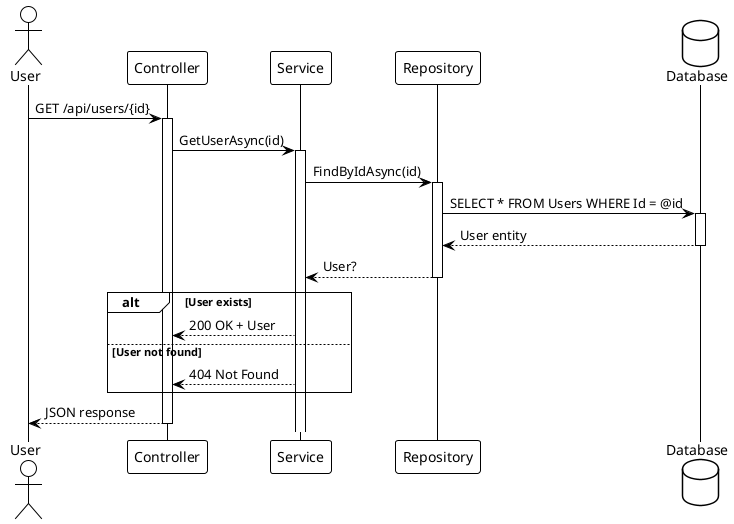
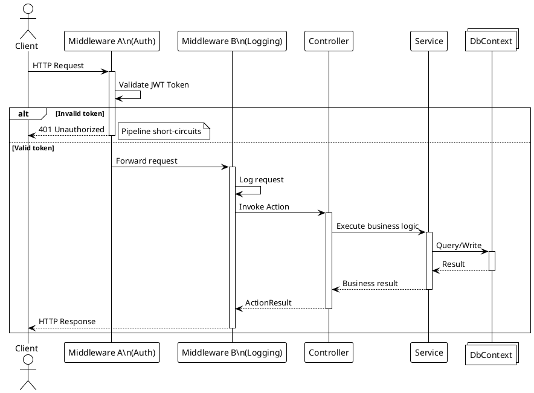
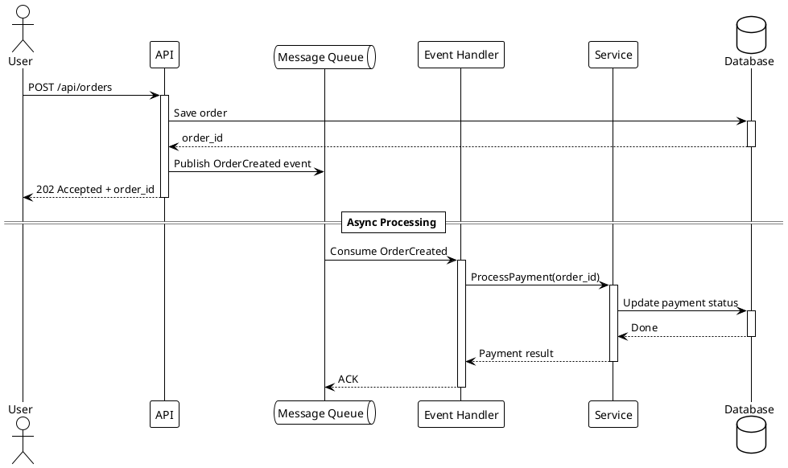
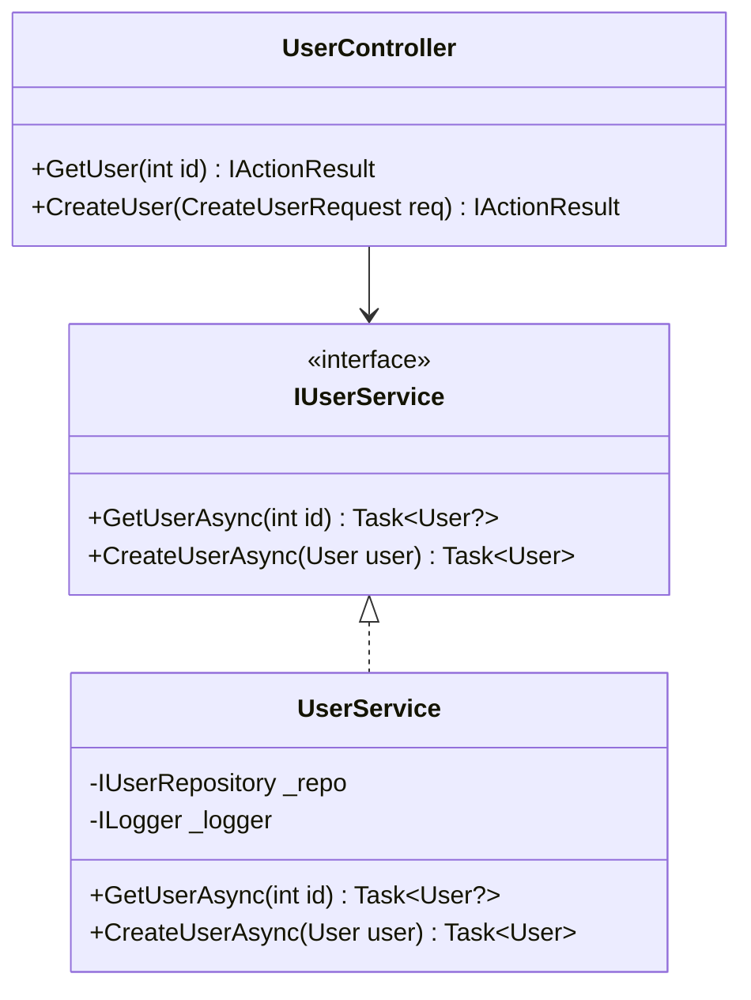
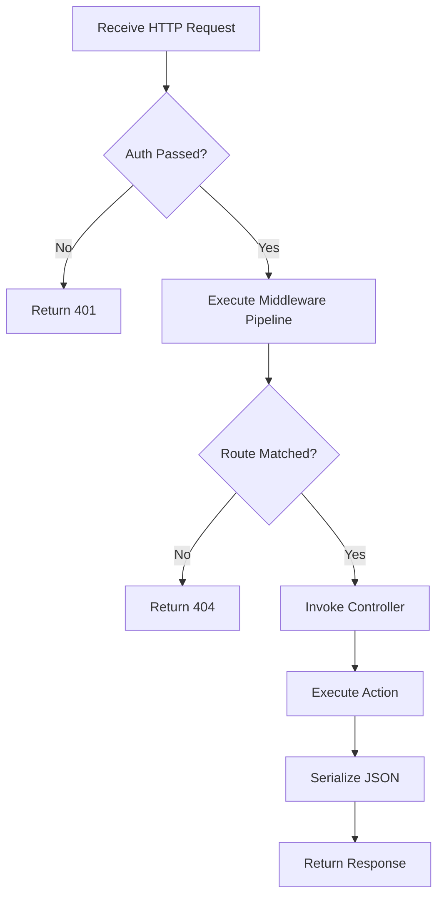

---
name: cloud-glyph-wiki-create
description: Analyze project source code and produce beautiful, well-structured Wiki documentation
---

## Responsibility

Strictly follow the workflow defined in this SKILL to produce Wiki documentation that meets specifications

## Variable Conventions

> CloudGlyph_Git:[https://github.com/Axvser/CloudGlyph][ReadOnly][Template Repository] - Cloud Glyph repository address

> CloudGlyph_Child_Git:[request] - Local Wiki repository root. This Wiki repository is an independent repo created from the Cloud Glyph:[Template Repository]. It is not counted in Wiki analysis or writing.

> Project_Root:[request] - Root directory of the project to be documented

> MainSKILL_Path:[CloudGlyph_Child_Git/skills/SKILL.md] - Path to the current skill

> Wiki_Root:[CloudGlyph_Child_Git/src/CloudGlyph/Assets/Docs/content/{languages}/] - Root directory for output documentation, dynamically divided by language.

> LanguageMap_List:[CloudGlyph_Child_Git/src/CloudGlyph/Assets/Docs/config/languages.json] - Range of languages supported by the Wiki

> LanguageTargets_List:[request] - Range of languages the user wants the Wiki to support

## Analysis Paradigm

⚙ **Wiki content is organized around「Features」, not the Project's directory structure.** The directory structure is an implementation detail that may evolve with architecture or team conventions — it must not be mapped directly onto the Wiki structure.

⚙ Definition of a Feature: a cohesive set of capabilities a project exposes, usually corresponding to a usage scenario that can be independently described, used, and verified. A single feature may span multiple directories/projects, and a single directory may host several features — feature is the deciding unit, directories are only lookup hints.

⚙ Feature/API discovery order and paths (priority from high to low):

1. **Entry-point understanding** — read the project's README, entry files, build scripts, etc., to form a candidate feature list
2. **Demo / Example first** — scan Examples/, samples/, demo, etc., and fully read all source files; Demos are the primary evidence source for features and APIs
3. **Test-driven** — for a feature lacking Demo, fully read the corresponding test files and extract feature boundaries and typical usage from test cases
4. **Source fallback** — only when the above are all absent, infer features from the source directory structure and interface signatures; such inferences MUST be explicitly marked as *inferred*

⚙ The order above applies to all project sizes: single-project, multi-project, and large frameworks/monorepos alike; for large projects it is especially forbidden to guess features from directory names alone.

⚙ Analysis artifact: a「Feature Inventory」listing per item: feature name / owning project / public API surface / evidence source (Demo / Test / inferred). It is the unified input for the subsequent Quick Start / API Reference / SE Analysis phases — the three phases work from the same inventory so every Wiki dimension stays consistent.

⚙ The「Feature Inventory」also carries a per-feature **Coverage Status** field (`TODO / QS ✓ / API ✓ / SE ✓`). Steps 3–5 update it as they finish each feature; step 8 (Review) reconciles it into a Coverage Reconciliation Matrix. The feature set is **frozen after discovery** — later steps only mark status, they never add, remove, or rename features; any correction must flow back into the inventory and be re-reconciled.

⚙ Sub-items under the five fixed dimensions (see Structure Conventions) are always organized by feature.

## Structure Conventions

⚙ {ID}_{PageName}/ - Folder naming convention when producing Markdown. The tree structure formed by folders is the directory structure the final App renders for the Wiki.

⚙ index.md - Each {ID}_{PageName}/ must have exactly one fixed-name index.md file, otherwise the directory structure will be incomplete. md files may be left blank. More subdirectories can be added to represent sub-items.

⚙ Every directory in the output path MUST contain an index.md — this includes intermediate/parent directories, not just leaf directories. After creating any new subdirectory, immediately verify an index.md exists in every ancestor directory of that path. A common mistake is to create e.g. `2_design_patterns/0_Workflow/index.md` while forgetting `2_design_patterns/index.md`.

Ultimately, the directory will present the following structure. These are five fixed dimensions, and /.../ means you may extend sub-items and add content based on specific functional divisions under the dimension, with no depth limit.

> Wiki_Root/0_Welcome/

> Wiki_Root/1_QuickStart/.../

> Wiki_Root/2_API/.../

> Wiki_Root/3_SE_Analysis/.../

> Wiki_Root/4_Copyright/.../

## Directory Grammar

⚙ Naming grammar by level:
- **Top-level — the five fixed dimensions (single-digit prefix):** `0_Welcome` / `1_QuickStart` / `2_API` / `3_SE_Analysis` / `4_Copyright`.
- **Every sub-level at any depth (two-digit prefix `NN_`, `00`–`99`):** lowercase kebab-case for English wikis, Chinese names for Chinese-language wikis, **no spaces**. E.g. `00_user-registration/`, `01_data-export/`.

⚙ **Granularity rule:** one directory = one "independently describable, usable, verifiable capability unit". Each dimension gives each feature exactly one directory; never merge multiple features into one directory, and never split one feature across sibling directories — nest instead. Feature names always come from the「Feature Inventory」; never invent a name while writing.

⚙ **Cross-dimension name consistency:** the SAME feature name must be used identically in the `1_QuickStart`, `2_API`, and `3_SE_Analysis` trees (within a language). A feature written `00_user-registration` in QuickStart must also be `00_user-registration` in API and in SE Analysis.

⚙ Complex features may nest further sub-capabilities (e.g. `00_user-registration/00_email-verification/`), obeying the same two-digit + kebab-case rule at every level.

⚙ **Page-focus limit (default-split):** a feature page is NOT a single monolithic document — splitting is the default, not the exception. Split a page when it would exceed **~300 lines** OR cover more than **3 distinct topics**, along capability/operation/endpoint boundaries (e.g. `00_{Feature}/00_{Operation}/index.md`). The parent `index.md` becomes a short overview that links its sub-pages. When in doubt, split earlier. Apply uniformly across QuickStart / API / SE Analysis.

**Illustrative example only — not a fixed requirement.** Fictional project "Acme Console" with three features (`user-registration`, `data-export`, `theme`). Every directory contains an `index.md`.

```
Wiki_Root/
├── 0_Welcome/
│   └── index.md
├── 1_QuickStart/
│   ├── index.md
│   ├── 00_user-registration/
│   │   └── index.md
│   ├── 01_data-export/
│   │   └── index.md
│   └── 02_theme/
│       └── index.md
├── 2_API/
│   ├── index.md
│   ├── 00_user-registration/
│   │   ├── index.md
│   │   └── 00_register-endpoint/
│   │       └── index.md
│   ├── 01_data-export/
│   │   └── index.md
│   └── 02_theme/
│       └── index.md
├── 3_SE_Analysis/
│   ├── index.md
│   ├── 00_file-structure/
│   │   └── index.md
│   ├── 01_functional-structure/
│   │   └── index.md
│   ├── 02_design-patterns/
│   │   ├── index.md
│   │   ├── 00_user-registration/
│   │   │   └── index.md
│   │   ├── 01_data-export/
│   │   │   └── index.md
│   │   └── 02_theme/
│   │       └── index.md
│   ├── 03_data-flow/
│   │   ├── index.md
│   │   └── 00_user-registration/
│   │       └── index.md
│   └── 04_complexity/
│       ├── index.md
│       └── 00_user-registration/
│           └── index.md
└── 4_Copyright/
    └── index.md
```

## Template Conventions

⚙ This SKILL ships with optional templates, collected in the “Template Index” table mapping `When | Template`.

⚙ Choose the template whose When matches the current scenario; the template body is stored escaped and must be restored before use.

## Code Style Conventions

⚙ **Indentation in code blocks MUST use actual space characters — tab characters (Tab / \t) are forbidden.** "Indentation" means a definite number of spaces, e.g. 4 spaces; a tab's rendered width is unpredictable across environments and must never appear in Wiki code blocks.

⚙ Before writing code blocks in Wiki output, scan source files under 【Project_Root】 to detect the project's dominant indentation width (2 spaces, 4 spaces, etc.). Generated code blocks MUST match that width. When detection is ambiguous, default to **4 spaces**.

⚙ When extracting code snippets from source files (Demo / Test / source), convert any tab characters to the detected space width (default 4 spaces) so every code block in the Wiki uses real space indentation.

## Accessibility Conventions

⚙ Respect content explicitly marked as non-public in the source code; avoid exposing such content in the Wiki

⚙ Avoid exposing sensitive information in the Wiki, such as passwords, keys, personal information, etc.

## Workflow

> 1.Variable Confirmation

## Context Setup

### Responsibility

Confirm all necessary context

### Flow

1. Derive CloudGlyph_Child_Git from MainSKILL_Path

2. Project_Root must be provided by the user

3. LanguageTargets_List must be provided by the user, and must be a subset of LanguageMap_List; if not, inform the user that LanguageMap_List needs to be edited to support the specified languages

4. Identify the project's tech stack (programming languages, frameworks, build tools, package managers, etc.) without presuming any specific technology

5. Optionally accept a SKILL path from the user; if provided, load the corresponding SKILL

6.**Scan existing Wiki_Root content** — Examine the current file structure under Wiki_Root for each target language, record the existing page tree, identify which dimensions already have content and which are empty. Pass this information to subsequent writing phases to avoid duplication or overwriting.

7. Present a summary table to the user; proceed with the workflow after user confirmation


> 2.Module Discovery

## Feature Inventory Discovery

### Responsibility

Execute the discovery flow defined in 【TEMPLATE · Analysis Paradigm】 and produce the「Feature Inventory」as the unified input for Quick Start, API Reference, and SE Analysis

### Workflow

#### 1. Follow the Analysis Paradigm

Strictly follow the discovery order defined in the Analysis Paradigm, regardless of project size; never infer features from directory structure alone:

1. **Entry-point understanding** — read README, entry files, build scripts, etc., to form a candidate feature list
2. **Demo / Example first** — fully read all source files under Examples/, samples/, demo, etc., and extract feature and API evidence
3. **Test-driven** — when a Demo is missing, fully read the corresponding test files and extract feature boundaries and typical usage
4. **Source fallback** — only when the above are absent, infer from source and explicitly mark as *inferred*

#### 2. Record Ownership and Dependencies

Read the dependency declarations from project definition files (build manifests, dependency manifests, etc.) and record each feature's owning project and dependencies; the exact file format and fields depend on the project's actual tech stack.

#### 3. Generate the Feature Inventory

| Feature | Owning Project | Public API Surface | Dependencies | Evidence | Coverage Status |
|---|---|---|---|---|---|
| User registration | auth service | register(credentials) | database driver | Demo | QS ✓ / API ✓ / SE ✓ |
| Data export | report module | export(format) | template engine | Test | QS ✓ / API — / SE — |
| Theme customization | renderer | setTheme(palette) | — | *inferred* | TODO |

#### 4. Coverage Status State Machine

Each feature carries a Coverage Status field tracking how far the three writing dimensions have covered it.

- `TODO` — discovered, not written yet.
- `QS ✓` — QuickStart page written (step 3). `API ✓` — API Reference page written (step 4). `SE ✓` — SE Analysis page written (step 5).
- Append a token each time a dimension completes; e.g. `QS ✓ / API ✓ / SE ✓`.

Rules:

- **Steps 3, 4, 5 MUST update this column immediately** after finishing a feature in their dimension. Do not leave it stale.
- **The feature set is frozen after this step.** Steps 3–5 may only mark status; they may NOT add, remove, or rename features. Any correction must flow back into the inventory and be re-reconciled.
- The inventory is a working artifact maintained **outside Wiki_Root** (e.g. `CloudGlyph_Child_Git/.workflow/feature-inventory.md`) and carried into step 8 Review for reconciliation. It is regenerated each run, so a future template sync removing it is expected.

### Output

- 「Feature Inventory」table (feature / owning project / public API surface / dependencies / evidence source / coverage status)
- The inventory is the single feature input for the subsequent Quick Start / API Reference / SE Analysis phases — they must not introduce a different feature breakdown, and they must keep the Coverage Status column up to date


> 3.Write【QuickStart】

## Quick Start

### Responsibility

Write a self-contained runnable tutorial for each feature module, using top-level APIs to build a real working example.

### Writing Principles

#### Runnable and Complete

The goal of Quick Start is not minimal code snippets, but guiding the reader from zero to a **truly runnable** project or feature. Each Quick Start should:

- **Have a clear start and end** — begin with project setup/dependency installation, end with verifying the feature works
- **Be replicable** — the reader can follow step by step and get a working program
- **Be practical** — solve a real business scenario or functional need

#### Top-Level API First

Use the module's highest-level API (attributes, extension methods, Fluent API, base classes) to show **what it looks like to use**, not **how it's implemented internally**. Low-level interface implementation and manual patterns belong in the API reference.

#### Material Source

Use the「Feature Inventory」produced by the 【Analysis Paradigm】 directly: each feature's evidence source (Demo / Test / inferred) is already recorded. Prioritize by evidence — fully read all Demo source files first, then tests; examples for features marked *inferred* must be noted as such in the page. Do not redo feature discovery.

#### Reproducibility Contract

Every Quick Start is a **contract that a human can reproduce end-to-end**. On top of the structure below, obey:

- **Prerequisites are mandatory and derived from build metadata, not from Demos** — read the project's declared `TargetFrameworks` / `TargetFramework` and dependency minimums (csproj/project files, package manifests) to state the actual supported targets, SDK/runtime and package versions. A Demo or test only proves one *tested* configuration — it is never the minimum supported version. State required services with how to obtain/start them.
- **Every numbered step states an observable "Expected result"** — what the reader sees/hears/verifies after completing it, not only at the end.
- **Complete Code is a single minimal runnable block** — no `...` / ellipses; symbol self-consistency: every identifier used is defined in the sample, in a prior step, or traced to a real file (with path).
- **Run Declaration is mandatory** — the page must end by honestly declaring whether the writer actually built and ran it (✅, with recorded output) or only statically verified it (⚠️).

#### Sub-pages (default-split)

A feature's Quick Start is normally **split into sub-pages** rather than one long page. Split when the page would exceed **~300 lines** or cover more than **3 distinct topics** — group by step or by operation:

```
00_{Feature}/                        ← overview + table of contents
├── index.md
├── 00_prerequisites/
├── 01_setup/
├── 02_{operation-a}/
├── 03_{operation-b}/
└── 09_verification/                 ← Verification + Complete Code + Run Declaration
```

- Each sub-page keeps its own **Expected result** assertions.
- The parent `index.md` is a short overview that links the sub-pages; do not duplicate their body there.
- The **Run Declaration** footer stays at the end of the last content page (the one holding the Complete Code).

#### Structure

```
## {Feature Name}

### Quick Start

#### 1. Prerequisites

- **Supported target(s) from the project's declared `TargetFrameworks`** (e.g. `netstandard2.0;net6.0`) — the Demo's runtime is only a *tested* configuration, never the requirement
- {SDK/runtime}: version required by the supported target (e.g. .NET SDK 6.0+ for `net6.0`)
- {Package manager}: version
- {Required services}: (e.g. a running database, API key) — and how to obtain/start them
- If any prerequisite cannot be verified locally, the Run Declaration below MUST be ⚠️.

#### 2. Install / Add Dependency

How to install / add dependencies (using the package manager appropriate to the project's tech stack)

**Expected result:** {observable outcome, e.g. package appears in the manifest / command exits 0}

#### 3. Basic Setup / Registration

Register services, create instances, configure settings, etc.

**Expected result:** {e.g. object constructs, service starts, config loads}

#### 4. Core Usage (Step by Step)

Combine top-level APIs step by step, from simple to complete, each with runnable code

**Expected result:** {e.g. output value, UI state, HTTP status}

#### 5. Verification

How to run and verify the feature works (expected output, UI effect, etc.)

#### 6. Complete Code

A single minimal complete runnable block. NO `...` / ellipses. Symbol self-consistency: every identifier used is defined in this sample, in a prior step, or traced to a real file (with path).

#### 7. Run Declaration

- ✅ Actually built and ran on {date}; recorded output: {paste actual output}
- OR ⚠️ Not actually run — statically verified only. Keep this declaration honest; it is the reproducibility contract.
```

#### Output Location

```
Wiki_Root/1_QuickStart/
├── index.md                    ← Overview
├── 00_{feature-a}/
│   └── index.md
├── 01_{feature-b}/
│   └── index.md
└── ...
```

> Directory names must come from the Feature Inventory and be identical across the `1_QuickStart`, `2_API`, and `3_SE_Analysis` trees (cross-dimension consistency).

### Post-Write Action

After writing Quick Start content:

- [ ] **Update the Feature Inventory** — set this feature's Coverage Status to `QS ✓` (see module-discovery)
- [ ] **Regenerate navigation index** — Run the tree generator script (e.g. `python gen_tree.py`) to rebuild tree.json
- [ ] **Build the project** — Run the project's build command to verify the new content embeds correctly


> 4.Write【API Reference】

## API Reference

### Responsibility

Fully enumerate all **interfaces, types, and functions** for each feature module, providing a complete API catalog with signatures.

### Writing Principles

#### Full Coverage

API Reference is not about depth or multiple styles — it's about **uncompromising completeness**:

- List all public types (classes, structs, interfaces, enums) in each module
- For each type, list all public members (methods, properties, events, fields)
- Include full signature, parameter descriptions, return value descriptions, and exception declarations

**Coverage is a hard gate.** Every feature in the Feature Inventory must have an API page. For features with Demo/Test evidence, the public surface must be **fully enumerated** — every public type and member, no truncation. For *inferred* features, mark the page as such; partial coverage is allowed only there. After finishing, re-scan the module's public surface and diff it against what is documented; any missed API becomes an explicit residual.

#### API Source

Use the「Feature Inventory」produced by the 【Analysis Paradigm】 as the source of truth: for features with Demo / Test evidence, extract the API surface from those Demos/tests; for features marked *inferred*, compile signatures from source and mark them accordingly.

**Update the inventory** — after finishing a feature, set its Coverage Status to `API ✓`.

#### Entry Template

Record each public member using the following structure:

```markdown
#### {TypeName}.{MemberName}

**Signature:**
`{ReturnType} {MemberName}({ParameterList})`

| Parameter | Type | Description |
|---|---|---|
| `{param}` | `{Type}` | {description} |

**Returns:** `{Type}` — {description}

**Exceptions:**
| Exception | Condition |
|---|---|
| `{ExceptionType}` | {condition} |

**Example:**
```text
// Source: [Demo/Test/Inferred]
result = instance.method(value);
```

Prefer a concrete call with **real input values and the resulting output**. If the sample needs environment setup (dependencies, service registration), reference the feature's Quick Start page instead of duplicating it.

**Notes:**
- {additional notes}
```

#### Organization

Group by type, and within each type sort by member kind (properties first, then methods):

```markdown
### {Namespace/Package}

#### Class: {ClassName}

##### Properties

| Name | Type | Description |
|---|---|---|
| `{Name}` | `{Type}` | {description} |

##### Methods

(Expand each using the entry template)

#### Interface: {InterfaceName}

...
```

#### Output Location

```
Wiki_Root/2_API/00_{feature}/
├── index.md                    ← Overview
├── 00_{namespace-package-a}/
│   └── index.md
├── 01_{namespace-package-b}/
│   └── index.md
└── ...
```

> Feature directory names must match the Feature Inventory and be identical across the `1_QuickStart`, `2_API`, and `3_SE_Analysis` trees.

> When a namespace or feature API page would exceed ~300 lines, split further by type: `2_API/00_{feature}/00_{namespace}/00_{Type}/index.md` (or directly `2_API/00_{feature}/00_{Type}/index.md` when the feature has few namespaces).

### Post-Write Action

After writing API documentation:

- [ ] **Regenerate navigation index** — Run the tree generator script (e.g. `python gen_tree.py`) to rebuild tree.json
- [ ] **Build the project** — Run the project's build command to verify the new content embeds correctly


> 5.Write【SE Analysis】

## Software Engineering Analysis

### Responsibility

Produce rigorous software engineering analysis documentation. Use **PlantUML** for API call sequence diagrams, **Mermaid** for class hierarchies and architecture flowcharts, and **KaTeX** for algorithm complexity.

### Mandatory Rules

- Every code snippet **must come from an actual file**, with file path and line range noted
- All diagrams must pass syntax validation (Mermaid/PlantUML/KaTeX)
- Do not fabricate method signatures, class names, or execution flows
- If code is inferred (no example available), it must be explicitly marked as such

### Page Plan

The Architecture section is organized into the following pages. Each page after `01_functional-structure` uses **sub-pages grouped by feature** (from the Feature Inventory), so each feature gets its own dedicated analysis.

| Page | Content | Rendering | Sub-page strategy |
|---|---|---|---|
| `00_file-structure/index.md` | Repository layout, directory tree, project-to-folder mapping | Mermaid flowchart + tree | Single overview page |
| `01_functional-structure/index.md` | Module responsibility boundaries, feature-to-project mapping, entry point identification | Mermaid flowchart + tables | Single overview page |
| `02_design-patterns/index.md` | **Design pattern analysis** — one sub-page per feature/module | Mermaid classDiagram + tables | `02_design-patterns/00_{Feature}/index.md`, may be further subdivided for complex features |
| `03_data-flow/index.md` | **Data flow analysis** — sequence diagrams for each feature's API call chain | **PlantUML** sequence diagrams | `03_data-flow/00_{Feature}/index.md`, may be further subdivided for complex features |
| `04_complexity/index.md` | **Complexity analysis** — time/space complexity for each feature's core operations | KaTeX + tables | `04_complexity/00_{Feature}/index.md`, may be further subdivided for complex features |

#### Sub-page Depth Rules

Under each `00_{Feature}/` directory, **further nesting is allowed and encouraged** when necessary to keep each page focused and readable.

**Recommended subdivision dimensions (each level uses `NN_` two-digit prefixes):**
- `02_design-patterns/00_{Feature}/` can split by: `00_{PatternName}/index.md` (e.g., `00_Singleton/index.md`, `01_Factory/index.md`)
- `03_data-flow/00_{Feature}/` can split by: `00_{APIEndpoint}/index.md` or `00_{OperationName}/index.md` (e.g., `00_UserRegistration/index.md`, `01_OrderQuery/index.md`)
- `04_complexity/00_{Feature}/` can split by: `00_{CoreOperation}/index.md` (e.g., `00_Search/index.md`, `01_Sort/index.md`)

> Guiding principle: when a single page exceeds **~300 lines** or covers **more than 3 distinct topics**, it should be split into sub-pages — splitting is the default for feature pages.
> The parent directory's `index.md` serves as the feature overview/table of contents, linking to each sub-page.

#### Page Detail

**00_file-structure** — Repository layout showing all source directories, test directories, example directories, and their relationships. One static tree view.

**01_functional-structure** — Which features exist and which projects own them. Tables mapping feature → owning project → dependencies.

**02_design-patterns/00_{Feature}/index.md** — For each feature module (e.g. MVVM, AOP, Workflow), analyze the design patterns employed. Mermaid class diagrams showing interfaces, base classes, and concrete implementations. Identify patterns such as: Command Pattern (VeloxCommand), Proxy Pattern (AOP), Observer Pattern (VeloxProperty), Strategy Pattern (Eases), Template Method (TransitionCore), etc.

**03_data-flow/00_{Feature}/index.md** — For each feature module, produce PlantUML sequence diagrams showing the complete call chain for core API operations. Cover: normal flow, error/exception paths, and async/event-driven scenarios where applicable.

**04_complexity/00_{Feature}/index.md** — For each feature module, analyze the time and space complexity of its core operations. Use KaTeX for formulas. Cover: construction, execution, look-up, serialization, and memory usage. Example: `O(n)` for linear operations, `O(log n)` for spatial hash lookups, `O(1)` for property access.

### API Call Sequence Diagrams (PlantUML)

This is the **core deliverable** of this skill. For each core API endpoint, produce a PlantUML sequence diagram showing the complete call chain.

#### Basic REST API Scenario



#### With Middleware Pipeline



#### Async/Event-Driven Scenario



#### PlantUML Syntax Validation Checklist

- [ ] `@startuml` / `@enduml` are paired
- [ ] All participants (`actor` / `participant` / `database` / `queue` / `collections`) are declared before use
- [ ] `activate` / `deactivate` are paired with no omissions
- [ ] `alt` / `else` / `end` block structure is correct
- [ ] `note right` / `note left` have clear scope
- [ ] `== Section Title ==` is used for phase separation

### Class Diagram (Mermaid)



> Source: `src/MyApp.Web/Services/UserService.cs` lines 15-45

### Flowchart (Mermaid)



### Output Location

Base page: `Wiki_Root/3_SE_Analysis/00_{page_group}/index.md`
Sub-pages: `Wiki_Root/3_SE_Analysis/00_{page_group}/00_{Feature}/index.md`

Page groups: `00_file-structure` / `01_functional-structure` / `02_design-patterns` / `03_data-flow` / `04_complexity`.

For **Multi project / Monorepo** wikis, insert the owning project as an extra `NN_` level: `Wiki_Root/3_SE_Analysis/00_{page_group}/00_{Project}/00_{Feature}/index.md`.

> Feature directory names must match the Feature Inventory and be identical across the `1_QuickStart`, `2_API`, and `3_SE_Analysis` trees.

### Post-Write Action

After writing SE Analysis content:

- [ ] **Update the Feature Inventory** — set each analyzed feature's Coverage Status to `SE ✓`
- [ ] **Regenerate navigation index** — Run the tree generator script (e.g. `python gen_tree.py`) to rebuild tree.json
- [ ] **Build the project** — Run the project's build command to verify the new content embeds correctly


> 6.Write【Copyright】

## Copyright

### Responsibility

`Discover` copyright/license/attribution files or information under 【Project_Root】, `organize` into the Wiki

### Discovery

Scan the following files and categorize the extracted information

| Category | Files to Scan | Content to Extract |
|---|---|---|
| **License Information** | `LICENSE` / `LICENSE.md` / `LICENSE.txt` | License type (MIT / Apache-2.0 / GPL-3.0 / BSD etc.), copyright holder, year |
| **Copyright Notice** | `COPYRIGHT` / `COPYRIGHT.md` | Full copyright notice text |
| **Contributors** | `AUTHORS` / `AUTHORS.md` / `CONTRIBUTORS` / `CONTRIBUTORS.md` | List of contributors |
| **Patent Grant** | `PATENTS` / `PATENTS.md` | Patent grant terms |
| **Third-party Notices** | `NOTICE` / `NOTICE.md` / `NOTICE.txt` | Third-party copyright notices, preserve all attributions by section |

### Organization

Organize categories in the following order by {type}:

```markdown
---
**License Information**

{Content from LICENSE}

---

**Copyright Notice**

{Content from COPYRIGHT}

---

**Contributors**

{List from AUTHORS / CONTRIBUTORS}

---

**Patent Grant**

{Content from PATENTS}

---

**Third-party Notices**

{Content from NOTICE}
```

> If no files found for a category, do not create a sub-page for it

> Use copy/paste to obtain original text, avoid LLM hallucination

### Output Location

Wiki_Root/4_Copyright/00_{type}/index.md


> 7.Write【Welcome】

## Welcome Page

### Responsibility

Create a welcome page from a template that fits the current project

### Constraints

❌ Do not modify the established layout, e.g. changing the page size or wrapping in a ScrollViewer

✔ As a rule, do not change colors or animations unless the user explicitly asks

✔ Text content may be modified

✔ Feature entries may be removed

### Output Location

Wiki_Root/0_Welcome/index.md

### Template Selection

Choose a template from the 【Template Index】 table by matching the When column; use the one for “When creating the Wiki welcome page” by default.

Steps:

1. After selecting a template, restore its content to the original HTML
2. Adjust the text content and feature entries for the current project, then write to 【Output Location】
3. Follow 【Constraints】 throughout: do not modify the established layout; as a rule, do not change colors or animations


> 8.Review

## Review

### Responsibility

Review and correct each deliverable one by one

### Checklist

#### Coverage Reconciliation Matrix (HARD GATE)

Build the matrix from the Feature Inventory's Coverage Status column. The matrix MUST be written into the Review output — it is a deliverable, not a thought exercise.

| Feature | Evidence | QuickStart | API | SE Analysis | Status |
|---|---|---|---|---|---|
| User registration | Demo | ✅ | ✅ | ✅ | PASS |
| Data export | Test | ✅ | ✅ | ❌ missing data-flow sub-page | FAIL |
| Theme customization | *inferred* | ✅ | ⚠️ partial: `setTheme` only | ✅ | PASS (residual) |

Rules:

- **Features with Demo/Test evidence MUST be ✅ across all three dimensions (QuickStart / API / SE Analysis). Any ❌ ⇒ the entire Review FAILS.** Fix immediately and re-run before continuing.
- **Only *inferred* features may carry residual ⚠️ items**, and each residual MUST state a one-line reason (e.g. "API surface not fully covered by evidence").
- After reconciliation, write the final status back into the Feature Inventory (`PASS` / `FAIL` / `RESIDUAL`).
- If the inventory carries `TODO` or a stale status that a completed page contradicts → FAIL; the status machine was not respected.

---

#### Usage Completeness Audit

- [ ] Each feature module's Quick Start covers its top-level API (attributes/fluent/extension methods)
- [ ] API reference covers all public types and members found during discovery
- [ ] Code examples demonstrate both **declarative** and **imperative** usage styles

---

#### Demo Read Verification (Pre-check)

Before starting the per-page audit, verify whether the writing phase fulfilled the mandatory full-read obligation:

- [ ] For every module with Demo code, confirm the documentation covers usage patterns from **all source files** in that module's Demo directory, not just a few snippets
- [ ] For every module with only tests, confirm the documentation covers key usages and edge cases from the test files
- [ ] If a Demo exists but the documentation clearly misses patterns → **mark as FAIL**, require the Agent to re-read the full Demo and rewrite

---

#### Code Authenticity Verification (CRITICAL — Full Per-Page Audit)

For **every page** in the Wiki, extract all code blocks containing API references. For each reference:

- [ ] **Discovery Priority compliance** — Verify that code samples came from Demo projects (Priority 1) or Tests (Priority 2) first. If only Priority 3 (inferred from source) was used, confirm it is explicitly marked as *inferred*.
- [ ] **Class/method names** — search the codebase to confirm each type and member exists **with the documented signature**
- [ ] **Namespace/module paths** — verify they match the actual project structure and source declarations; never invent paths
- [ ] **Method parameters and return types** — cross-check against the source declaration; document must match reality
- [ ] **Exception declarations** — if the doc lists thrown exceptions, confirm they exist in the method signature or doc comments
- [ ] **Property/field names** — every property or field referenced must be present on the declared type
- [ ] **Removed/deprecated APIs** — flag any doc references to deprecated or removed members for correction
- [ ] **No fabricated code** — every code block must trace back to a real source file

---

#### Reproducibility Spot-check

- [ ] Every QuickStart has a mandatory **Prerequisites** block (SDK/runtime/package-manager versions, target framework, required services)
- [ ] Prerequisites are derived from the project's declared `TargetFrameworks`/dependency minimums — **not** from a Demo's runtime (a Demo proves one tested config, never the minimum)
- [ ] Every numbered step states an observable **Expected result**
- [ ] The complete-code block contains **no `...` / ellipses**; every identifier is defined in the sample, a prior step, or traced to a real file
- [ ] The page ends with a **Run Declaration** footer: `✅ actually built/ran` (recorded output) or `⚠️ not actually run` (static verification only, marked)
- [ ] For any `✅` declaration, the recorded output matches the step's stated expected results

---

#### Diagram & Formula Validation (real-engine render + fallback pre-check)

Diagrams and math are validated by the **actual rendering engines** — ground truth, not by eye or heuristics. **One-time setup** in `<CloudGlyph_Child_Git>/src/CloudGlyph/Assets/Docs/scripts/`: run `npm install` (provides mermaid/katex/jsdom) and place `plantuml.jar` next to the script (or pass `--jar <path>`). Then run:

- [ ] **PlantUML (real engine)** — `python validate-plantuml.py <Wiki_Root> --engine java`; the actual `plantuml.jar -checkonly` must report no errors
- [ ] **Mermaid (real parser)** — `node validate-mermaid.js <Wiki_Root>`; the real `mermaid.parse` must not throw
- [ ] **KaTeX (real renderer)** — `node validate-katex.js <Wiki_Root>`; the real `katex.renderToString` must not throw on any `$...$` / `$$...$$`
- [ ] Fix every reported **ERROR** — a real-engine error means the diagram/math will not render, it is authoritative
- [ ] **If the engines are unavailable** (no node/java on the machine), fall back to the dependency-free structural pre-checks `validate-plantuml.py` / `validate-mermaid.py` / `validate-katex.py` (heuristic) and explicitly note that real-render validation was not run

---

#### Structural Consistency

- [ ] Numeric prefixes follow conventions (e.g. `01_`, `02_`)
- [ ] `index.md` exists in **every** page directory (root and sub-pages)
- [ ] Code block indentation uses real spaces, not tab characters, matching the Code Style Conventions
- [ ] No local Markdown links (`[text](local/path/)`) — use relative navigation via the tree instead
- [ ] Pages exceeding **~300 lines / 3 topics** are split into sub-pages, with the parent `index.md` acting as an overview/table of contents
- [ ] **Prune untracked entries** — Any document page or directory **not produced by the current workflow** must be deleted. If removing all affected files empties a parent directory and that does not break the current output structure, the empty directory must also be removed.

---

#### Cross-language Parity

- [ ] If multi-language is enabled, **every** page exists in **all** selected languages
- [ ] No missing or outdated pages across language versions

---

#### Navigation Index Verification

- [ ] **Run navigation script** — Execute `python gen_tree.py` (or the actual script for the project) to rebuild `tree.json`
- [ ] **Verify script output** — Confirm the generated `tree.json` includes **all** new pages with correct nesting
- [ ] **Build the project** — Run the project's build command to verify compilation

---

### Pre-Commit Verification Flow

1. Walk through the checklist item by item; **fix issues immediately** before moving to the next item
2. Code authenticity issues → search source to confirm signatures, then fix docs
3. Diagram/KaTeX issues → run the real-engine validators (`validate-plantuml.py --engine java`, `validate-mermaid.js`, `validate-katex.js`), fix every ERROR, re-run until clean
4. Reconcile the **Coverage Reconciliation Matrix**: if any Demo/Test feature has a ❌, or the matrix was not written, the quality gate FAILS
5. Run the **Reproducibility Spot-check** against the QuickStart pages
6. Run `python gen_tree.py`, confirm no pages are missing
7. Run the project's build command, confirm compilation succeeds
8. Only after all items are ✅, mark the quality gate as passed

## Template Index

> Template cells are single-line JSON-escaped strings: `\n` is a newline, `\|` is a literal `|`. Parse as a JSON string to restore the original text.

| When | Template |
|---|---|
| [welcome-page] When creating the Wiki welcome page | "<style>\n  @keyframes float {\n    0%, 100% { transform: translateY(0px); }\n    50% { transform: translateY(-9px); }\n  }\n  @keyframes shimmer {\n    0% { background-position: -200% center; }\n    100% { background-position: 200% center; }\n  }\n  @keyframes pop-in {\n    0% { opacity: 0; transform: scale(0.85); }\n    100% { opacity: 1; transform: scale(1); }\n  }\n  @keyframes glow-pulse {\n    0%, 100% { box-shadow: 0 0 0 0 color-mix(in srgb, var(--accent-color, #4a9eff) 0%, transparent); }\n    50% { box-shadow: 0 0 18px 2px color-mix(in srgb, var(--accent-color, #4a9eff) 25%, transparent); }\n  }\n\n  .cg-wrapper * {\n    will-change: transform, opacity;\n  }\n\n  .step-card {\n    transition: transform 0.35s cubic-bezier(0.34, 1.56, 0.64, 1),\n                opacity 0.35s cubic-bezier(0.34, 1.56, 0.64, 1),\n                box-shadow 0.35s ease;\n    animation: pop-in 0.55s cubic-bezier(0.34, 1.56, 0.64, 1) both;\n  }\n  .step-card:hover {\n    transform: translateY(-5px) scale(1.04);\n    opacity: 0.8 !important;\n    box-shadow: 0 0 18px 2px color-mix(in srgb, var(--accent-color, #4a9eff) 25%, transparent);\n  }\n\n  .step-icon {\n    display: inline-block;\n    animation: float 3.5s ease-in-out infinite;\n  }\n  .step-icon-delayed {\n    display: inline-block;\n    animation: float 3.5s ease-in-out 0.6s infinite;\n  }\n  .step-icon-slow {\n    display: inline-block;\n    animation: float 3.5s ease-in-out 1.2s infinite;\n  }\n\n  .feat-card {\n    transition: transform 0.3s cubic-bezier(0.34, 1.56, 0.64, 1),\n                opacity 0.3s cubic-bezier(0.34, 1.56, 0.64, 1),\n                border-color 0.3s ease,\n                box-shadow 0.3s ease;\n    animation: pop-in 0.45s cubic-bezier(0.34, 1.56, 0.64, 1) both;\n  }\n  .feat-card:hover {\n    transform: translateY(-4px) scale(1.03);\n    opacity: 0.7 !important;\n    border-color: var(--accent-color, #4a9eff) !important;\n    box-shadow: 0 0 14px 1px color-mix(in srgb, var(--accent-color, #4a9eff) 20%, transparent);\n  }\n\n  .feat-icon {\n    display: inline-block;\n    transition: transform 0.3s cubic-bezier(0.34, 1.56, 0.64, 1);\n  }\n  .feat-card:hover .feat-icon {\n    transform: scale(1.4) rotate(6deg);\n  }\n\n  .gradient-text {\n    background: linear-gradient(135deg, #4a9eff, #a78bfa, #f472b6, #4a9eff);\n    background-size: 300% 300%;\n    -webkit-background-clip: text;\n    -webkit-text-fill-color: transparent;\n    background-clip: text;\n    animation: shimmer 4s linear infinite;\n  }\n\n  .glow-dot {\n    display: inline-block;\n    width: 8px;\n    height: 8px;\n    border-radius: 50%;\n    margin: 0 4px;\n    vertical-align: middle;\n    animation: glow-pulse 1.8s ease-in-out infinite;\n  }\n  .gradient-rule {\n    width: clamp(36px, 8vw, 60px);\n    margin: 0 auto clamp(1em, 3vw, 2.2em);\n    border: none;\n    height: 2px;\n    background: linear-gradient(90deg, var(--accent-color, #4a9eff), #a78bfa, #f472b6);\n    border-radius: 2px;\n    opacity: 0.5;\n  }\n  .cg-wrapper {\n    text-align: center;\n    padding: clamp(24px, 5vw, 50px) clamp(12px, 3vw, 28px);\n    width: 100%;\n    max-width: 100%;\n    box-sizing: border-box;\n  }\n  .cg-title {\n    font-size: clamp(1.6em, 6vw, 2.8em);\n    margin-bottom: 0.1em;\n    font-weight: 700;\n    letter-spacing: -0.02em;\n  }\n  .cg-subtitle {\n    font-size: clamp(0.9em, 2.5vw, 1.15em);\n    opacity: 0.55;\n    margin-bottom: clamp(0.8em, 3vw, 2em);\n  }\n  .cg-steps {\n    display: flex;\n    gap: clamp(10px, 2vw, 20px);\n    justify-content: center;\n    flex-wrap: wrap;\n    margin-bottom: clamp(1.2em, 4vw, 2.5em);\n  }\n  .cg-step {\n    flex: 1 1 clamp(120px, 22vw, 200px);\n    padding: clamp(12px, 2vw, 18px) clamp(8px, 1.5vw, 12px);\n    border-radius: 14px;\n    border: 1px solid currentColor;\n    opacity: 0.55;\n  }\n  .cg-feats {\n    display: flex;\n    flex-wrap: wrap;\n    gap: clamp(8px, 1.5vw, 12px);\n    justify-content: center;\n    text-align: left;\n    margin-bottom: clamp(1em, 3vw, 2em);\n  }\n  .cg-feat {\n    flex: 1 1 clamp(120px, 20vw, 170px);\n    min-width: 100px;\n    padding: clamp(8px, 1.2vw, 12px) clamp(10px, 1.5vw, 14px);\n    border-radius: 10px;\n    border: 1px solid currentColor;\n    opacity: 0.45;\n    font-size: clamp(0.75em, 1.8vw, 0.85em);\n  }\n</style>\n\n<div class=\"cg-wrapper\">\n\n  <!-- Adjust the project name and description to the actual project -->\n  <h1 class=\"cg-title\">\n    <span class=\"gradient-text\">Cloud Glyph</span>\n  </h1>\n  <p class=\"cg-subtitle\">\n    AI-powered Markdown Wiki · Desktop + Browser\n  </p>\n\n  <hr class=\"gradient-rule\" />\n\n  <!-- Add or remove entries as appropriate -->\n  <!-- Three-step workflow -->\n  <div class=\"cg-steps\">\n    <div class=\"step-card cg-step\" style=\"animation-delay: 0s;\">\n      <div class=\"step-icon\" style=\"font-size: clamp(1.4em, 4vw, 2em); margin-bottom: 6px;\">✍️</div>\n      <div style=\"font-weight: 600; font-size: clamp(0.8em, 2vw, 0.95em);\">Write</div>\n      <div style=\"font-size: clamp(0.65em, 1.6vw, 0.78em); opacity: 0.7; margin-top: 4px;\"><code>content/{lang}/**/index.md</code></div>\n    </div>\n    <div class=\"step-card cg-step\" style=\"animation-delay: 0.12s;\">\n      <div class=\"step-icon-delayed\" style=\"font-size: clamp(1.4em, 4vw, 2em); margin-bottom: 6px;\">⚙️</div>\n      <div style=\"font-weight: 600; font-size: clamp(0.8em, 2vw, 0.95em);\">Build</div>\n      <div style=\"font-size: clamp(0.65em, 1.6vw, 0.78em); opacity: 0.7; margin-top: 4px;\">Auto-index → JSON</div>\n    </div>\n    <div class=\"step-card cg-step\" style=\"animation-delay: 0.24s;\">\n      <div class=\"step-icon-slow\" style=\"font-size: clamp(1.4em, 4vw, 2em); margin-bottom: 6px;\">🚀</div>\n      <div style=\"font-weight: 600; font-size: clamp(0.8em, 2vw, 0.95em);\">Browse</div>\n      <div style=\"font-size: clamp(0.65em, 1.6vw, 0.78em); opacity: 0.7; margin-top: 4px;\">Desktop + Browser</div>\n    </div>\n  </div>\n\n  <!-- Add or remove entries as appropriate -->\n  <!-- Feature grid -->\n  <div class=\"cg-feats\">\n    <div class=\"feat-card cg-feat\" style=\"animation-delay: 0s;\">\n      <span class=\"feat-icon\" style=\"font-size: 1.3em; margin-right: 6px;\">📝</span> Markdown<br><span style=\"opacity: 0.6;\">Footnotes · Tables · Task lists</span>\n    </div>\n    <div class=\"feat-card cg-feat\" style=\"animation-delay: 0.05s;\">\n      <span class=\"feat-icon\" style=\"font-size: 1.3em; margin-right: 6px;\">🧮</span> KaTeX<br><span style=\"opacity: 0.6;\">Inline $ $ · Display $$ $$</span>\n    </div>\n    <div class=\"feat-card cg-feat\" style=\"animation-delay: 0.1s;\">\n      <span class=\"feat-icon\" style=\"font-size: 1.3em; margin-right: 6px;\">🔍</span> Code Highlighting<br><span style=\"opacity: 0.6;\">highlight.js · VS Code theme</span>\n    </div>\n    <div class=\"feat-card cg-feat\" style=\"animation-delay: 0.15s;\">\n      <span class=\"feat-icon\" style=\"font-size: 1.3em; margin-right: 6px;\">📊</span> Mermaid<br><span style=\"opacity: 0.6;\">Flow · Sequence · Class · Git</span>\n    </div>\n    <div class=\"feat-card cg-feat\" style=\"animation-delay: 0.2s;\">\n      <span class=\"feat-icon\" style=\"font-size: 1.3em; margin-right: 6px;\">🌿</span> PlantUML<br><span style=\"opacity: 0.6;\">Auto dark/light SVG</span>\n    </div>\n    <div class=\"feat-card cg-feat\" style=\"animation-delay: 0.25s;\">\n      <span class=\"feat-icon\" style=\"font-size: 1.3em; margin-right: 6px;\">🎬</span> Video Embed<br><span style=\"opacity: 0.6;\">Bilibili · YouTube · Vimeo</span>\n    </div>\n    <div class=\"feat-card cg-feat\" style=\"animation-delay: 0.3s;\">\n      <span class=\"feat-icon\" style=\"font-size: 1.3em; margin-right: 6px;\">🌐</span> Multi-language<br><span style=\"opacity: 0.6;\">Independent directories per language</span>\n    </div>\n    <div class=\"feat-card cg-feat\" style=\"animation-delay: 0.35s;\">\n      <span class=\"feat-icon\" style=\"font-size: 1.3em; margin-right: 6px;\">🎨</span> Theme Editor<br><span style=\"opacity: 0.6;\">RGB sliders · Live preview</span>\n    </div>\n  </div>\n\n  <!-- Add or remove entries as appropriate -->\n  <p style=\"opacity: 0.4; font-size: 0.85em; margin-top: 1em;\">\n    <span class=\"glow-dot\" style=\"background: #4a9eff; animation-delay: 0s;\"></span>\n    Agent-friendly\n    <span class=\"glow-dot\" style=\"background: #a78bfa; animation-delay: 0.3s;\"></span>\n    No DB required\n    <span class=\"glow-dot\" style=\"background: #f472b6; animation-delay: 0.6s;\"></span>\n    Open Source · MIT\n  </p>\n</div>" |
