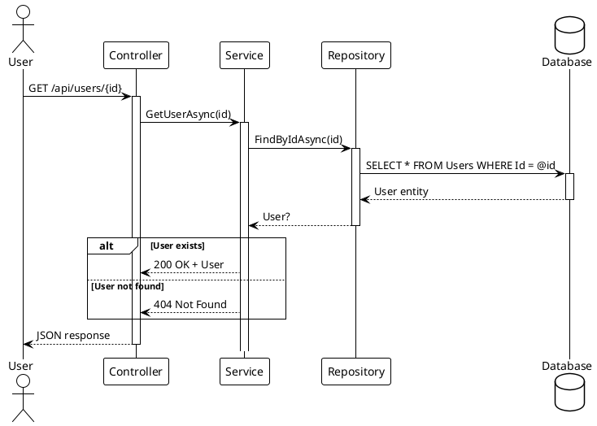
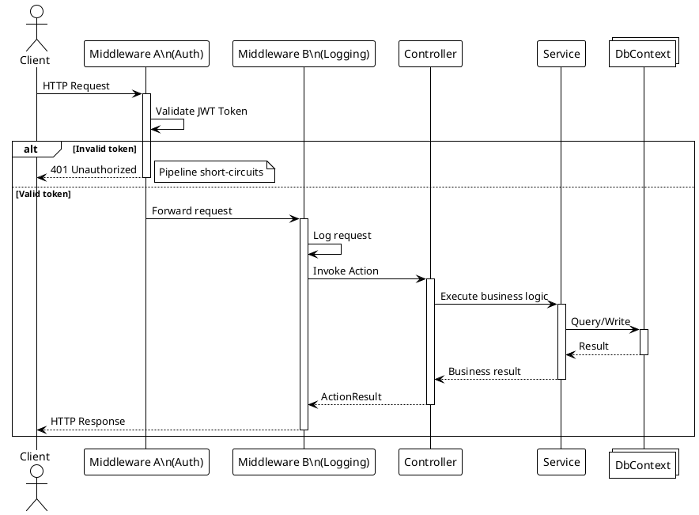
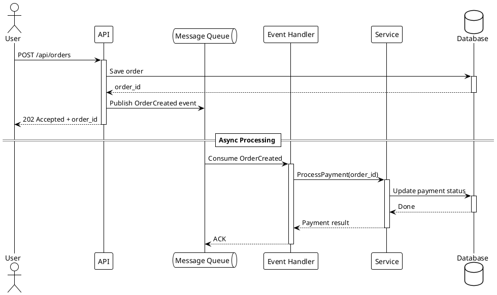
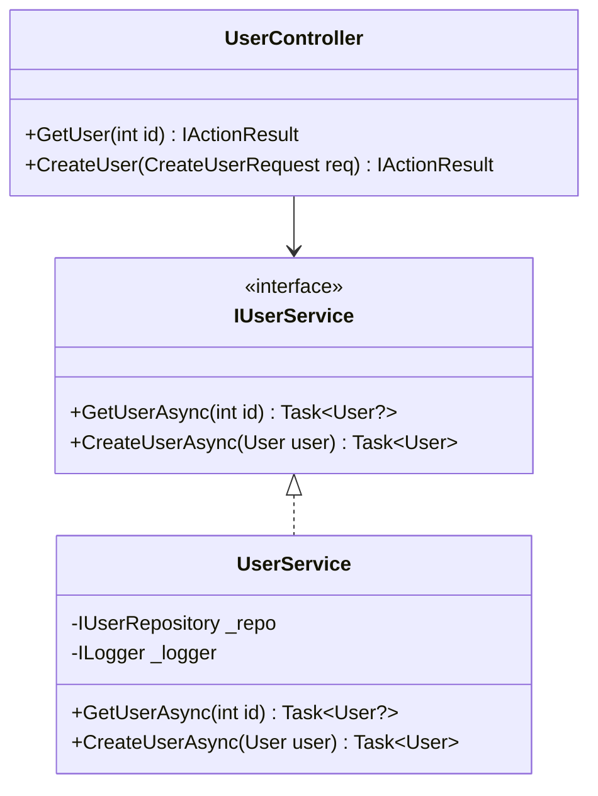
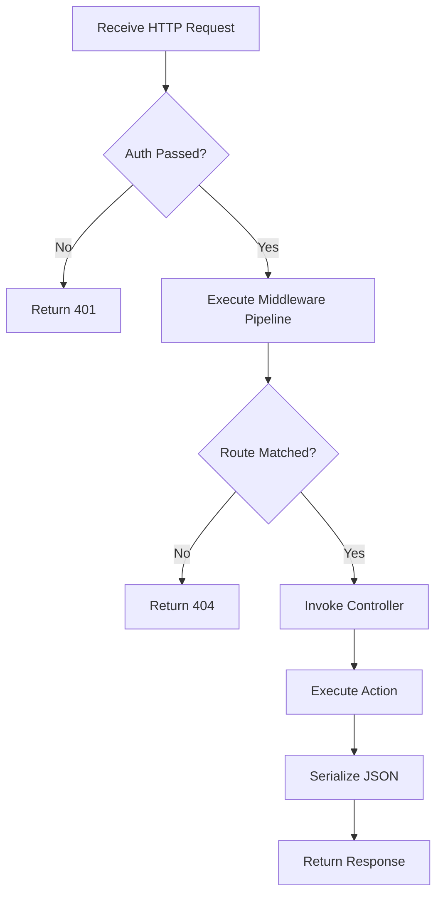

# Software Engineering Analysis

## Responsibility

Produce rigorous software engineering analysis documentation. Use **PlantUML** for API call sequence diagrams, **Mermaid** for class hierarchies and architecture flowcharts, **KaTeX** for algorithm complexity, and **`plot`** for any behaviour that is a curve rather than a number.

## Mandatory Rules

- Every code snippet **must come from an actual file**, with file path and line range noted
- All diagrams and plots must pass syntax validation (Mermaid/PlantUML/KaTeX/plot)
- Do not fabricate method signatures, class names, or execution flows
- If code is inferred (no example available), it must be explicitly marked as such

### KaTeX writing rules (must render in the CloudGlyph viewer)

The CloudGlyph viewer renders math with KaTeX through a Markdown parser whose
**display-math blocks are only recognized in standalone multi-line form**. Write
formulas so they always render:

- **Inline math** — single `$…$` within a sentence: `each insert is $O(1)$`.
- **Display math** — MUST be a standalone three-line block, never `$$x$$` on one line:

  ```markdown
  $$
  T(n) = O(n \log n)
  $$
  ```

  Forbidden (the viewer will NOT render it):
  `$$T(n) = O(n \log n)$$` — do not open and close `$$` on the same line.

- **Text inside a formula** must use `\text{...}`: `$O(\text{成员数})$`. Never put
  prose/CJK directly in math mode; KaTeX has no CJK glyphs and only warns — put
  annotation outside the formula or inside `\text{...}`.
- Prefer ASCII identifiers and math operators; keep Chinese descriptions in prose or
  `\text{...}`.
- After writing, run `python validate-katex.py` **and** `node validate-katex.js` on the
  wiki root; both flag single-line display math as an ERROR and bare CJK-in-math as a WARN.

### Function plot rules (draw the curve, don't describe it)

**When the subject of a paragraph is a function, its shape is the information** — a
formula or a table of values makes the reader reconstruct what a single curve would
show at a glance. Use a ```plot fence whenever the source defines a mathematical
behaviour that varies over a domain:

- an **easing family** (`EaseInOutCubic`, `EaseOutBack`, `EaseOutElastic`, …) — plot
  the family together so In / Out / InOut are comparable, and mark the linear ramp
  `y = x` as a baseline;
- **growth or decay** — complexity curves (`n`, `n*log(n)`, `n^2` on one axis),
  exponential decay, half-life;
- **damping and response** — oscillation envelopes, spring settling;
- **distributions and coverage curves** used by an algorithm.

Rules that bite (all verified against the renderer):

- The body is **JSON**, so numbers are JSON numbers — `2*PI` is invalid JSON, write
  `6.283185307179586`.
- Constants are **upper-case**: `PI`, `E`. Lower-case `pi` is undefined and the curve
  vanishes with no error anywhere.
- `"data"` is an array of objects; a plain curve is `{ "fn": "sin(x)" }`.
- Piecewise curves use the ternary operator, which is allowed:
  `"fn": "x < 0.5 ? 2*x^2 : 1 - (-2*x + 2)^2/2"`.
- A non-`y = f(x)` graph type (`fnType` `parametric` / `polar` / `points` / `vector`,
  or `graphType` `scatter`) additionally needs `"sampler": "builtIn"`; the parameter
  is `t` for parametric and **`theta`** for polar.
- **Set the domain to the interesting region.** `"xAxis": { "domain": [0, 1] }` and
  `"yAxis": { "domain": [-0.2, 1.2] }` for an easing curve; a default axis scale
  usually shows a flat line and one spike.
- Give each series a `"color"` when it must be distinguishable, and add
  `"title"` naming the function.

Example — an easing family, the case a formula table gets wrong:

````markdown
```plot
{
  "title": "EaseOut* family",
  "grid": true,
  "xAxis": { "domain": [0, 1] },
  "yAxis": { "domain": [0, 1.2] },
  "data": [
    { "fn": "x", "color": "#888888", "skipTip": true },
    { "fn": "sin(x*PI/2)", "color": "#4a9eff" },
    { "fn": "1 - (1-x)^3", "color": "#a78bfa" },
    { "fn": "1 - 2^(-10*x)", "color": "#f472b6" },
    { "fn": "1 + 2.70158*(x-1)^3 + 1.70158*(x-1)^2", "color": "#e5c07b" }
  ]
}
```
````

A `plot` never replaces the prose: state what the curve shows and why it matters in
the sentence above it. Validate with `python validate-plot.py <Wiki_Root>` — it
catches invalid JSON, a non-array `data`, and expressions containing characters the
renderer's whitelist rejects (quotes, semicolons, braces, brackets, backslashes).

## Page Plan

The Architecture section is organized into the following pages. Each page after `01_functional-structure` uses **sub-pages grouped by feature** (from the Feature Inventory), so each feature gets its own dedicated analysis.

| Page | Content | Rendering | Sub-page strategy |
|---|---|---|---|
| `00_file-structure/index.md` | Repository layout, directory tree, project-to-folder mapping | Mermaid flowchart + tree | Single overview page |
| `01_functional-structure/index.md` | Module responsibility boundaries, feature-to-project mapping, entry point identification | Mermaid flowchart + tables | Single overview page |
| `02_design-patterns/index.md` | **Design pattern analysis** — one sub-page per feature/module | Mermaid classDiagram + tables | `02_design-patterns/00_{Feature}/index.md`, may be further subdivided for complex features |
| `03_data-flow/index.md` | **Data flow analysis** — sequence diagrams for each feature's API call chain | **PlantUML** sequence diagrams | `03_data-flow/00_{Feature}/index.md`, may be further subdivided for complex features |
| `04_complexity/index.md` | **Complexity analysis** — time/space complexity for each feature's core operations | KaTeX + tables | `04_complexity/00_{Feature}/index.md`, may be further subdivided for complex features |

### Sub-page Depth Rules

Under each `00_{Feature}/` directory, **further nesting is allowed and encouraged** when necessary to keep each page focused and readable.

**Recommended subdivision dimensions (each level uses `NN_` two-digit prefixes):**
- `02_design-patterns/00_{Feature}/` can split by: `00_{PatternName}/index.md` (e.g., `00_Singleton/index.md`, `01_Factory/index.md`)
- `03_data-flow/00_{Feature}/` can split by: `00_{APIEndpoint}/index.md` or `00_{OperationName}/index.md` (e.g., `00_UserRegistration/index.md`, `01_OrderQuery/index.md`)
- `04_complexity/00_{Feature}/` can split by: `00_{CoreOperation}/index.md` (e.g., `00_Search/index.md`, `01_Sort/index.md`)

> Guiding principle: when a single page exceeds **~300 lines** or covers **more than 3 distinct topics**, it should be split into sub-pages — splitting is the default for feature pages.
> The parent directory's `index.md` serves as the feature overview/table of contents, linking to each sub-page with the cross-page link syntax in 【Links & Navigation】.

### Page Detail

**00_file-structure** — Repository layout showing all source directories, test directories, example directories, and their relationships. One static tree view.

**01_functional-structure** — Which features exist and which projects own them. Tables mapping feature → owning project → dependencies.

**02_design-patterns/00_{Feature}/index.md** — For each feature module (e.g. MVVM, AOP, Workflow), analyze the design patterns employed. Mermaid class diagrams showing interfaces, base classes, and concrete implementations. Identify patterns such as: Command Pattern (VeloxCommand), Proxy Pattern (AOP), Observer Pattern (VeloxProperty), Strategy Pattern (Eases), Template Method (TransitionCore), etc.

**03_data-flow/00_{Feature}/index.md** — For each feature module, produce PlantUML sequence diagrams showing the complete call chain for core API operations. Cover: normal flow, error/exception paths, and async/event-driven scenarios where applicable.

**04_complexity/00_{Feature}/index.md** — For each feature module, analyze the time and space complexity of its core operations. Use KaTeX for formulas. Cover: construction, execution, look-up, serialization, and memory usage. Example: `O(n)` for linear operations, `O(log n)` for spatial hash lookups, `O(1)` for property access.

## API Call Sequence Diagrams (PlantUML)

This is the **core deliverable** of this skill. For each core API endpoint, produce a PlantUML sequence diagram showing the complete call chain.

### Basic REST API Scenario



### With Middleware Pipeline



### Async/Event-Driven Scenario



### PlantUML Syntax Validation Checklist

- [ ] `@startuml` / `@enduml` are paired
- [ ] All participants (`actor` / `participant` / `database` / `queue` / `collections`) are declared before use
- [ ] `activate` / `deactivate` are paired with no omissions
- [ ] `alt` / `else` / `end` block structure is correct
- [ ] `note right` / `note left` have clear scope
- [ ] `== Section Title ==` is used for phase separation

## Class Diagram (Mermaid)



> Source: `src/MyApp.Web/Services/UserService.cs` lines 15-45

## Flowchart (Mermaid)



## Output Location

Base page: `Wiki_Root/3_SE_Analysis/00_{page_group}/index.md`
Sub-pages: `Wiki_Root/3_SE_Analysis/00_{page_group}/00_{Feature}/index.md`

Page groups: `00_file-structure` / `01_functional-structure` / `02_design-patterns` / `03_data-flow` / `04_complexity`.

For **Multi project / Monorepo** wikis, insert the owning project as an extra `NN_` level: `Wiki_Root/3_SE_Analysis/00_{page_group}/00_{Project}/00_{Feature}/index.md`.

> Feature directory names must match the Feature Inventory and be identical across the `1_QuickStart`, `2_API`, and `3_SE_Analysis` trees.

## Post-Write Action

After writing SE Analysis content:

- [ ] **Update the Feature Inventory** — set each analyzed feature's Coverage Status to `SE ✓`
- [ ] **Regenerate navigation index** — Run the tree generator script (e.g. `python gen_tree.py`) to rebuild tree.json
- [ ] **Build the project** — Run the project's build command to verify the new content embeds correctly
