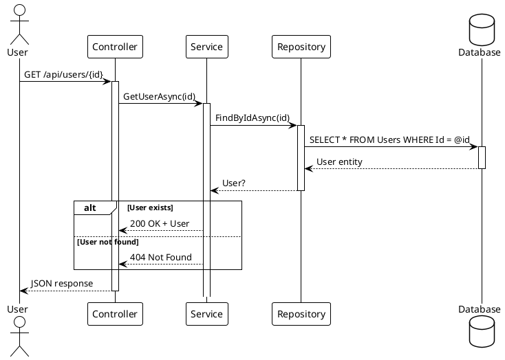
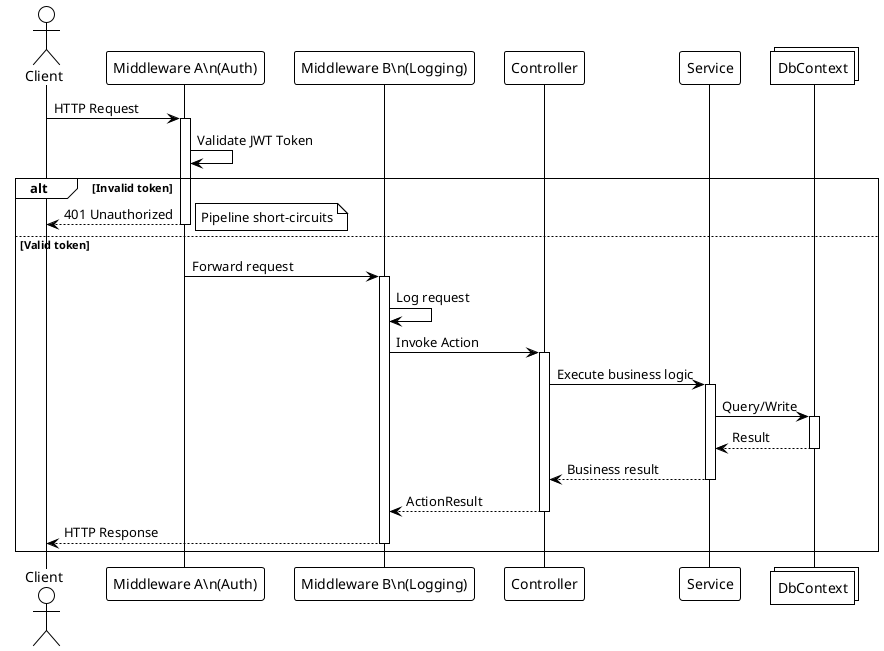
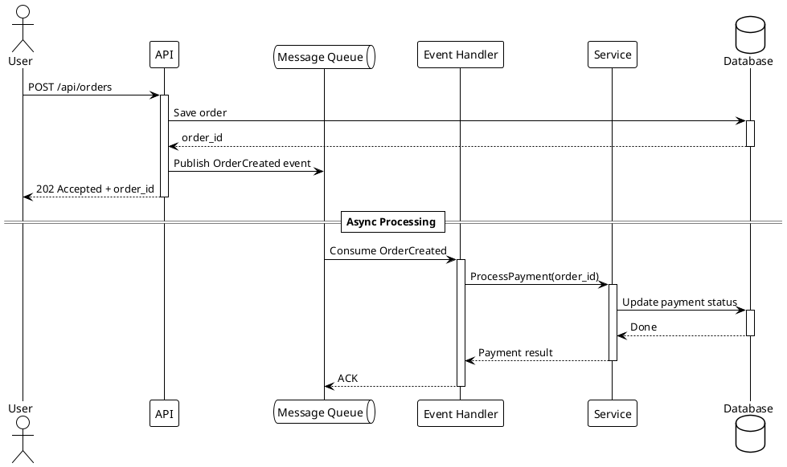
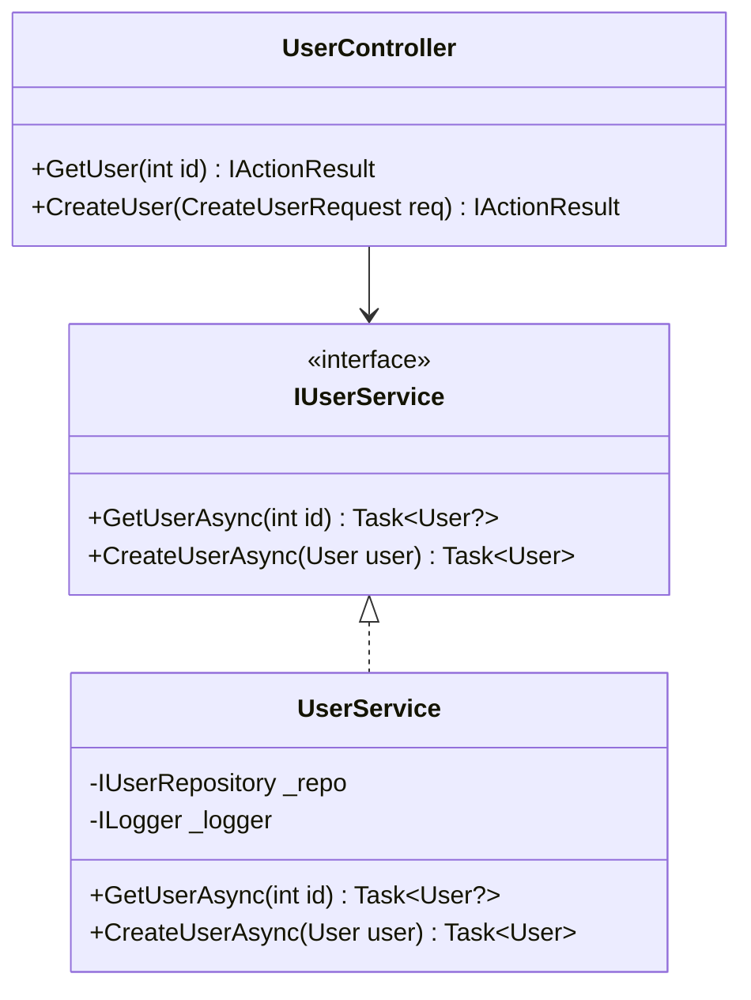
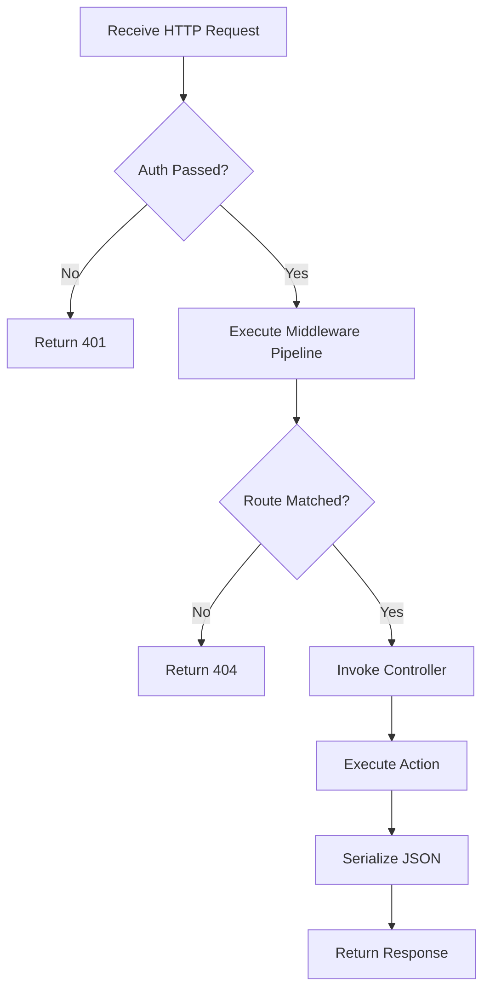

# Software Engineering Analysis

## Responsibility

Produce rigorous software engineering analysis documentation. Use **PlantUML** for API call sequence diagrams, **Mermaid** for class hierarchies and architecture flowcharts, and **KaTeX** for algorithm complexity.

## Mandatory Rules

- Every code snippet **must come from an actual file**, with file path and line range noted
- All diagrams must pass syntax validation (Mermaid/PlantUML/KaTeX)
- Do not fabricate method signatures, class names, or execution flows
- If code is inferred (no example available), it must be explicitly marked as such

## Page Plan

The Architecture section is organized into the following pages. Each page after 3-2 uses **sub-pages grouped by functional module/feature** (discovered in the Module Discovery phase), so each feature gets its own dedicated analysis.

| Page | Content | Rendering | Sub-page strategy |
|---|---|---|---|
| `0_file_structure/index.md` | Repository layout, directory tree, project-to-folder mapping | Mermaid flowchart + tree | Single overview page |
| `1_functional_structure/index.md` | Module responsibility boundaries, feature-to-project mapping, entry point identification | Mermaid flowchart + tables | Single overview page |
| `2_design_patterns/index.md` | **Design pattern analysis** — one sub-page per feature/module | Mermaid classDiagram + tables | `2_design_patterns/{Feature}/index.md` — one sub-page per feature |
| `3_data_flow/index.md` | **Data flow analysis** — sequence diagrams for each feature's API call chain | **PlantUML** sequence diagrams | `3_data_flow/{Feature}/index.md` — one sub-page per feature |
| `4_complexity/index.md` | **Complexity analysis** — time/space complexity for each feature's core operations | KaTeX + tables | `4_complexity/{Feature}/index.md` — one sub-page per feature |

### Page Detail

**0_file_structure** — Repository layout showing all source directories, test directories, example directories, and their relationships. One static tree view.

**1_functional_structure** — Which features exist and which projects own them. Tables mapping feature → owning project → dependencies.

**2_design_patterns/{Feature}/index.md** — For each feature module (e.g. MVVM, AOP, Workflow), analyze the design patterns employed. Mermaid class diagrams showing interfaces, base classes, and concrete implementations. Identify patterns such as: Command Pattern (VeloxCommand), Proxy Pattern (AOP), Observer Pattern (VeloxProperty), Strategy Pattern (Eases), Template Method (TransitionCore), etc.

**3_data_flow/{Feature}/index.md** — For each feature module, produce PlantUML sequence diagrams showing the complete call chain for core API operations. Cover: normal flow, error/exception paths, and async/event-driven scenarios where applicable.

**4_complexity/{Feature}/index.md** — For each feature module, analyze the time and space complexity of its core operations. Use KaTeX for formulas. Cover: construction, execution, look-up, serialization, and memory usage. Example: `O(n)` for linear operations, `O(log n)` for spatial hash lookups, `O(1)` for property access.

## API Call Sequence Diagrams (PlantUML)

This is the **core deliverable** of this skill. For each core API endpoint, produce a PlantUML sequence diagram showing the complete call chain.

### Basic REST API Scenario

### With Middleware Pipeline

### Async/Event-Driven Scenario

### PlantUML Syntax Validation Checklist

- [ ] `@startuml` / `@enduml` are paired
- [ ] All participants (`actor` / `participant` / `database` / `queue` / `collections`) are declared before use
- [ ] `activate` / `deactivate` are paired with no omissions
- [ ] `alt` / `else` / `end` block structure is correct
- [ ] `note right` / `note left` have clear scope
- [ ] `== Section Title ==` is used for phase separation

## Class Diagram (Mermaid)

> Source: `src/MyApp.Web/Services/UserService.cs` lines 15-45

## Flowchart (Mermaid)

## Output Location

Base page: `content/{lang}/{category}/architecture/index.md`
Sub-pages: `content/{lang}/{category}/architecture/{page_group}/{Feature}/index.md`

For **Single project** tier: `content/{lang}/architecture/{page_group}/{Feature}/index.md`
For **Multi project** tier: `content/{lang}/{project}/architecture/{page_group}/{Feature}/index.md`
For **Framework/Monorepo** tier: `content/{lang}/{category}/architecture/{page_group}/{Feature}/index.md`

## Post-Write Action

After writing SE Analysis content:

- [ ] **Regenerate navigation index** — Run the tree generator script (e.g. `python gen_tree.py`) to rebuild tree.json
- [ ] **Build the project** — Run `dotnet build` to verify the new content embeds correctly
