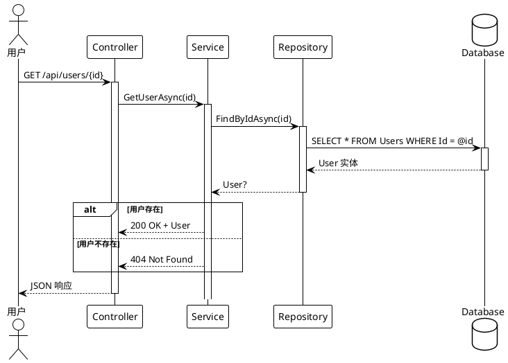
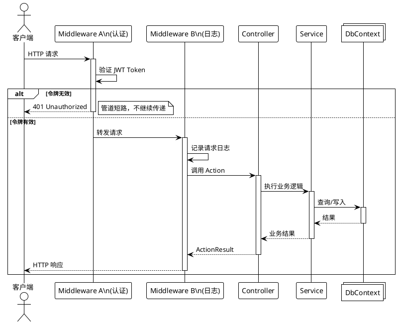
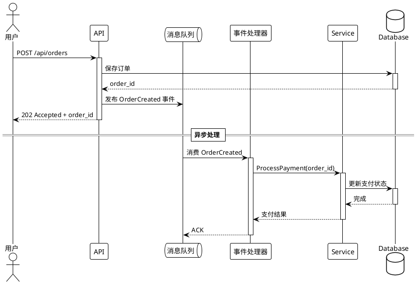
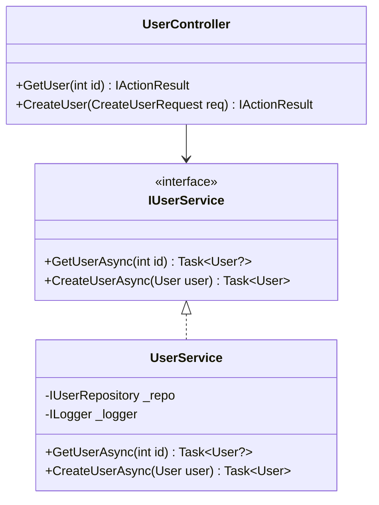
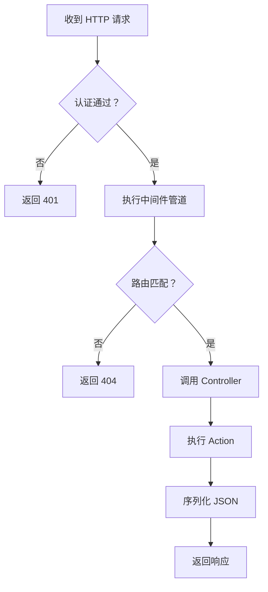

# 软件工程分析

## 职责

产出严谨的软件工程分析文档。使用 **PlantUML** 描绘 API 调用时序图，用 **Mermaid** 展示类层次、架构流程图，用 **KaTeX** 表达算法复杂度。

## 强制性规则

- 每一个代码片段**必须来自实际文件**，并注明文件路径和行范围
- 所有图必须通过语法验证（Mermaid/PlantUML/KaTeX）
- 禁止编造方法签名、类名或执行流
- 如果代码是推断的（无示例可用），必须用标注明确注明

## 页面规划

架构分析章节按以下页面组织。3-2 之后的每个页面使用按功能/特性分组的**子页面**（由【分析范式】产出的功能清单识别），每个特性获得各自的分析页面。

| 页面 | 内容 | 渲染方式 | 子页面策略 |
|---|---|---|---|
| `0_文件结构/index.md` | 仓库布局、目录树、项目到文件夹映射 | Mermaid flowchart + 树 | 单概览页面 |
| `1_功能结构/index.md` | 模块职责边界、功能到项目映射、入口点识别 | Mermaid flowchart + 表格 | 单概览页面 |
| `2_设计模式分析/index.md` | **设计模式分析** — 每个功能/模块一个子页面 | Mermaid classDiagram + 表格 | `2_设计模式分析/{Feature}/index.md`，复杂功能可继续细分 |
| `3_数据流分析/index.md` | **数据流分析** — 每个功能的 API 调用链时序图 | **PlantUML** 时序图 | `3_数据流分析/{Feature}/index.md`，复杂功能可继续细分 |
| `4_复杂度分析/index.md` | **复杂度分析** — 每个功能核心操作的时间/空间复杂度 | KaTeX + 表格 | `4_复杂度分析/{Feature}/index.md`，复杂功能可继续细分 |

### 子页面深度扩展规则

每个 `{Feature}/` 目录下，**允许且鼓励**在必要时进一步创建更深层的子页面，以保持每个页面的内容聚焦、可读。

**推荐的细分维度：**
- `2_设计模式分析/{Feature}/` 下可按：`0_{模式名}/index.md` 展开（如 `0_单例模式/index.md`、`1_工厂模式/index.md`）
- `3_数据流分析/{Feature}/` 下可按：`0_{API端点名}/index.md` 或 `0_{操作名}/index.md` 展开（如 `0_用户注册/index.md`、`1_订单查询/index.md`）
- `4_复杂度分析/{Feature}/` 下可按：`0_{核心操作名}/index.md` 展开（如 `0_查找/index.md`、`1_排序/index.md`）

> 细分的原则：当单个页面内容超过 **500 行**或包含 **3 个以上不同主题**时，应拆分为子页面。
> 父目录的 `index.md` 可作为该功能的概览/目录页，链接到各子页面。

### 页面详情

**0_文件结构** — 仓库布局展示所有源目录、测试目录、示例目录及其关系。一张静态树图。

**1_功能结构** — 哪些功能存在以及哪些项目拥有它们。表格映射 功能 → 拥有的项目 → 依赖。

**2_设计模式分析/{Feature}/index.md** — 对每个功能模块（如 MVVM、AOP、Workflow），分析其使用的设计模式。Mermaid 类图展示接口、基类和具体实现。识别模式如：命令模式（VeloxCommand）、代理模式（AOP）、观察者模式（VeloxProperty）、策略模式（Eases）、模板方法模式（TransitionCore）等。

**3_数据流分析/{Feature}/index.md** — 对每个功能模块，生成 PlantUML 时序图展示核心 API 操作的完整调用链。涵盖：正常流程、错误/异常路径以及异步/事件驱动场景。

**4_复杂度分析/{Feature}/index.md** — 对每个功能模块，分析其核心操作的时间和空间复杂度。使用 KaTeX 表达公式。涵盖：构造、执行、查找、序列化和内存使用。示例：`O(n)` 线性操作、`O(log n)` 空间哈希查找、`O(1)` 属性访问。

## API 调用时序图（PlantUML）

这是本技能的**核心交付物**。对于每个核心 API 端点，产出一张 PlantUML 时序图，展示完整的调用链路。

### 基本 REST API 场景

### 含中间件管道

### 异步/事件驱动场景

### PlantUML 语法验证清单

- [ ] `@startuml` / `@enduml` 成对出现
- [ ] 所有参与者（`actor` / `participant` / `database` / `queue` / `collections`）在使用前声明
- [ ] `activate` / `deactivate` 成对匹配，无遗漏
- [ ] `alt` / `else` / `end` 块结构正确
- [ ] `note right` / `note left` 有明确作用域
- [ ] `== 分隔标题 ==` 用于阶段分隔

## 类图（Mermaid）

> 来源: `src/MyApp.Web/Services/UserService.cs` 第 15-45 行

## 流程图（Mermaid）

## 输出位置

基础页面：`content/{lang}/{category}/架构分析/index.md`
子页面：`content/{lang}/{category}/架构分析/{page_group}/{Feature}/index.md`

对于**单项目**层级：`content/{lang}/架构分析/{page_group}/{Feature}/index.md`
对于**多项目**层级：`content/{lang}/{project}/架构分析/{page_group}/{Feature}/index.md`
对于**框架/单体仓库**层级：`content/{lang}/{category}/架构分析/{page_group}/{Feature}/index.md`

## 写入后操作

编写软件工程分析内容后：

- [ ] **重新生成导航索引** — 运行树生成脚本（如 `python gen_tree.py`）重建 tree.json
- [ ] **构建项目** — 运行项目的构建命令验证新内容正确嵌入

