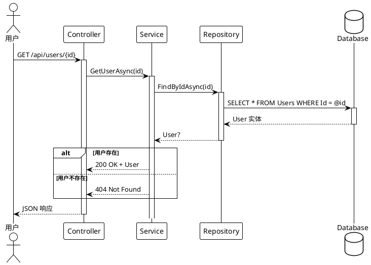
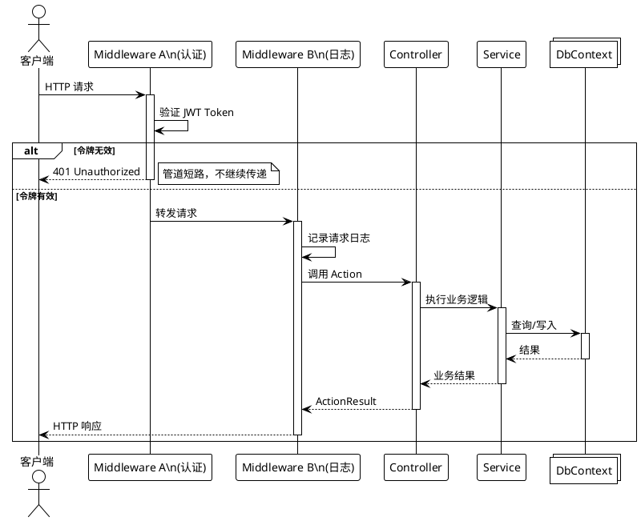
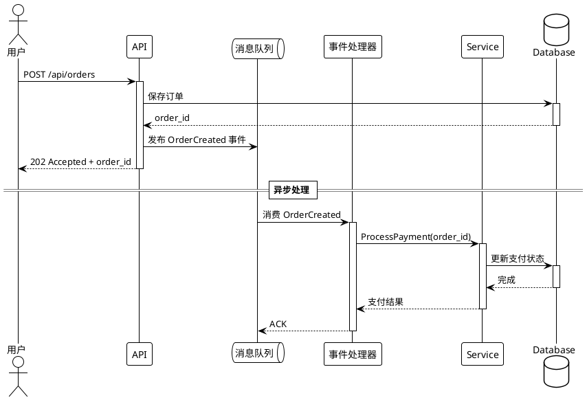
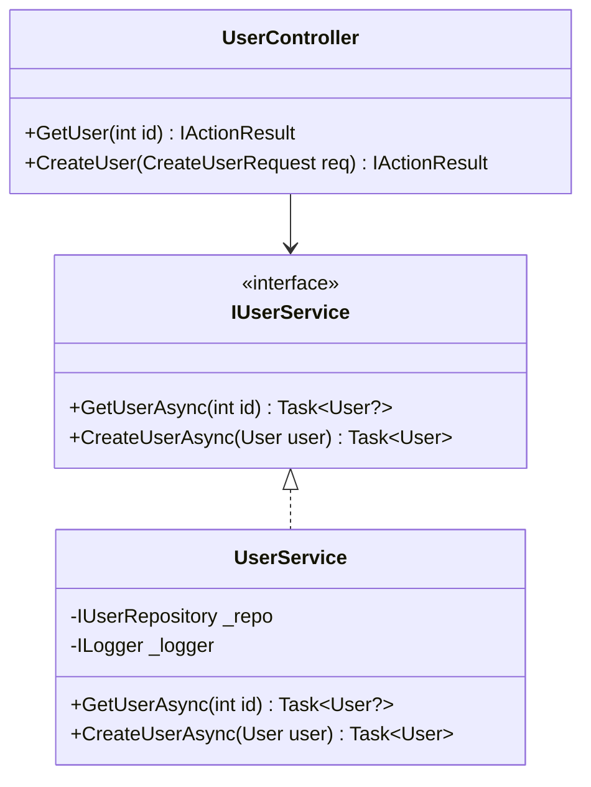
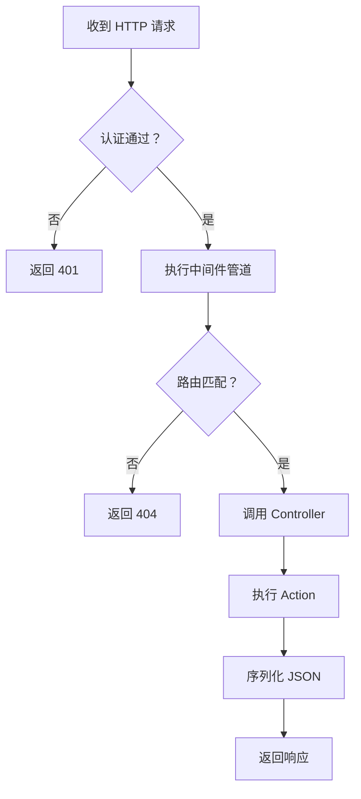

# 软件工程分析

## 职责

产出严谨的软件工程分析文档。使用 **PlantUML** 描绘 API 调用时序图，用 **Mermaid** 展示类层次、架构流程图，用 **KaTeX** 表达算法复杂度，用 **`plot`** 表达任何「是一条曲线而非一个数」的行为。

## 强制性规则

- 每一个代码片段**必须来自实际文件**，并注明文件路径和行范围
- 所有图与图像必须通过语法验证（Mermaid/PlantUML/KaTeX/plot）
- 禁止编造方法签名、类名或执行流
- 如果代码是推断的（无示例可用），必须用标注明确注明

### KaTeX 公式书写规范（必须在 CloudGlyph 查看器中能渲染）

CloudGlyph 查看器用 KaTeX + Markdown 解析器渲染公式，其**显示公式只认独立多行块**。请按以下方式书写，保证一定能渲染：

- **行内公式**——句子内用单个 `$…$`：`每次插入为 $O(1)$`。
- **显示公式**——必须是独立的**三行块**，禁止在同一行 `$$x$$` 开闭：

  ```markdown
  $$
  T(n) = O(n \log n)
  $$
  ```

  禁止写法(查看器不会渲染)：`$$T(n) = O(n \log n)$$`——不要在同一行开闭 `$$`。

- 公式内的文字一律用 `\text{…}` 包裹：`$O(\text{成员数})$`。不要把中文/说明直接写进
  math 模式——KaTeX 无中文字形、只告警；把说明放到公式外或 `\text{…}` 内。
- 公式尽量用 ASCII 标识符与运算符；中文说明放正文或 `\text{…}`。
- 写完后对 Wiki 根运行 `python validate-katex.py` **和** `node validate-katex.js`：
  两者会把"同行 `$$…$$` 显示公式"报为 ERROR、把"math 内裸中文"报为 WARN。

### 函数图像书写规范（该画曲线就别用文字描述）

**当一段文字的主题是一条函数时，它的形状本身就是信息**——一个公式或一张数值表，是在逼读者自己重建一张曲线一眼就能给出的形状。只要源码定义了某个在定义域上变化的数学行为，就应当使用 ```plot 围栏：

- **缓动函数族**（`EaseInOutCubic`、`EaseOutBack`、`EaseOutElastic` …）——把同一族画在一起，In / Out / InOut 之间可直观比较，并把线性基线 `y = x` 一并画出；
- **增长与衰减**——复杂度曲线（同一坐标系里的 `n`、`n*log(n)`、`n^2`）、指数衰减、半衰期；
- **阻尼与响应**——振荡包络、弹簧收敛；
- **算法用到的分布与覆盖率曲线**。

**图的单位是「族」，不是「单个函数」。** 当一页要记录一组相关的函数时——缓动目录、一组采样
器核、一族复杂度类别——给**每一族一张图**，把该族的各个变体画在一起（`In` / `Out` / `InOut`
同轴，各一条曲线，另加线性斜坡作参照）。不要一个成员一张图（这会藏掉读者正是为此而来的对比），
也不要所有函数挤一张图（超过几条曲线就不可读了）。十个族的目录就是十张图；若因此超出叶子页预算，
把它们放到子页面，父页留一张示意性插图来引出概念即可。每张图的坐标域要按该族自己的曲线拟合——
振荡型的族比单调型需要更宽的 `y` 域，用一刀切的公共域会把它裁掉。

容易踩的规则（均已对照渲染器核实）：

- 正文是 **JSON**，所以数字必须是 JSON 数字——`2*PI` 不是合法 JSON，要写 `6.283185307179586`。
- 常量是**大写**的：`PI`、`E`。小写 `pi` 未定义，曲线会无声消失，任何地方都不报错。
- `"data"` 是对象数组；普通曲线为 `{ "fn": "sin(x)" }`。
- 分段曲线用三元运算符，这是允许的：`"fn": "x < 0.5 ? 2*x^2 : 1 - (-2*x + 2)^2/2"`。
- 非 `y = f(x)` 的图类型（`fnType` 为 `parametric` / `polar` / `points` / `vector`，或 `graphType` 为 `scatter`）还须加 `"sampler": "builtIn"`；参数名在参数方程中是 `t`，在极坐标中是 **`theta`**。
- **幂的指数只能是字面整数。** 默认的区间采样器只接受「恰好一个整数」的指数，其余一律回空区间——`<path>` 照常生成，但路径是空的，于是曲线什么都不画，也不报任何错。`2^x`、`2^(10*x - 10)`、`x^0.5` 都画不出来，`x^2`、`(x-1)^3` 没问题。指数含变量时改写为 `exp(u*ln底)`：`2^(10*x - 10)` 写成 `exp((10*x - 10)*0.6931471805599453)`（`ln 2` 的值）。
- **定义域要收在真正有信息量的区间。** 缓动曲线用 `"xAxis": { "domain": [0, 1] }`、`"yAxis": { "domain": [-0.2, 1.2] }`；默认坐标尺度通常只会显示一条平线加一处尖峰。
- 需要区分多条曲线时，为每条指定 `"color"`，并用 `"title"` 说明画的是什么。

示例——一个缓动函数族，也就是公式表最讲不清楚的那个场景：

````markdown
```plot
{
  "title": "EaseOut* 函数族",
  "grid": true,
  "xAxis": { "domain": [0, 1] },
  "yAxis": { "domain": [0, 1.2] },
  "data": [
    { "fn": "x", "color": "#888888", "skipTip": true },
    { "fn": "sin(x*PI/2)", "color": "#4a9eff" },
    { "fn": "1 - (1-x)^3", "color": "#a78bfa" },
    { "fn": "1 - exp((-10*x)*0.6931471805599453)", "color": "#f472b6" },
    { "fn": "1 + 2.70158*(x-1)^3 + 1.70158*(x-1)^2", "color": "#e5c07b" }
  ]
}
```
````

`plot` 从不取代文字：要在图上方的一句里说明这张图显示了什么、为什么重要。校验用 `python validate-plot.py <Wiki_Root>`——它能揪出非法 JSON、非数组的 `data`，以及含渲染器白名单拒绝字符（引号、分号、花括号、方括号、反斜杠）的表达式。

## 页面规划

架构分析章节按以下页面组织。`01_功能结构` 之后的每个页面使用按功能分组的**子页面**（由功能清单识别），每个功能获得各自的分析页面。

| 页面 | 内容 | 渲染方式 | 子页面策略 |
|---|---|---|---|
| `00_文件结构/index.md` | 仓库布局、目录树、项目到文件夹映射 | Mermaid flowchart + 树 | 单概览页面 |
| `01_功能结构/index.md` | 模块职责边界、功能到项目映射、入口点识别 | Mermaid flowchart + 表格 | 单概览页面 |
| `02_设计模式分析/index.md` | **设计模式分析** — 每个功能/模块一个子页面 | Mermaid classDiagram + 表格 | `02_设计模式分析/00_{功能}/index.md`，复杂功能可继续细分 |
| `03_数据流分析/index.md` | **数据流分析** — 每个功能的 API 调用链时序图 | **PlantUML** 时序图 | `03_数据流分析/00_{功能}/index.md`，复杂功能可继续细分 |
| `04_复杂度分析/index.md` | **复杂度分析** — 每个功能核心操作的时间/空间复杂度 | KaTeX + 表格 | `04_复杂度分析/00_{功能}/index.md`，复杂功能可继续细分 |

### 子页面深度扩展规则

每个 `00_{功能}/` 目录下，**允许且鼓励**在必要时进一步创建更深层的子页面，以保持每个页面的内容聚焦、可读。

**推荐的细分维度（每一级都使用 `NN_` 两位数字前缀）：**
- `02_设计模式分析/00_{功能}/` 下可按：`00_{模式名}/index.md` 展开（如 `00_单例模式/index.md`、`01_工厂模式/index.md`）
- `03_数据流分析/00_{功能}/` 下可按：`00_{API端点名}/index.md` 或 `00_{操作名}/index.md` 展开（如 `00_用户注册/index.md`、`01_订单查询/index.md`）
- `04_复杂度分析/00_{功能}/` 下可按：`00_{核心操作名}/index.md` 展开（如 `00_查找/index.md`、`01_排序/index.md`）

> 细分的原则：当单个页面内容超过 **约 300 行**或包含 **3 个以上不同主题**时，应拆分为子页面——功能页默认拆分。
> 父目录的 `index.md` 可作为该功能的概览/目录页，用【链接与导航】的跨页链接语法链接到各子页面。

### 页面详情

**00_文件结构** — 仓库布局展示所有源目录、测试目录、示例目录及其关系。一张静态树图。

**01_功能结构** — 哪些功能存在以及哪些项目拥有它们。表格映射 功能 → 拥有的项目 → 依赖。

**02_设计模式分析/00_{功能}/index.md** — 对每个功能模块（如 MVVM、AOP、Workflow），分析其使用的设计模式。Mermaid 类图展示接口、基类和具体实现。识别模式如：命令模式（VeloxCommand）、代理模式（AOP）、观察者模式（VeloxProperty）、策略模式（Eases）、模板方法模式（TransitionCore）等。

**03_数据流分析/00_{功能}/index.md** — 对每个功能模块，生成 PlantUML 时序图展示核心 API 操作的完整调用链。涵盖：正常流程、错误/异常路径以及异步/事件驱动场景。

**04_复杂度分析/00_{功能}/index.md** — 对每个功能模块，分析其核心操作的时间和空间复杂度。使用 KaTeX 表达公式。涵盖：构造、执行、查找、序列化和内存使用。示例：`O(n)` 线性操作、`O(log n)` 空间哈希查找、`O(1)` 属性访问。

## API 调用时序图（PlantUML）

这是本技能的**核心交付物**。对于每个核心 API 端点，产出一张 PlantUML 时序图，展示完整的调用链路。

### 基本 REST API 场景



### 含中间件管道



### 异步/事件驱动场景



### PlantUML 语法验证清单

- [ ] `@startuml` / `@enduml` 成对出现
- [ ] 所有参与者（`actor` / `participant` / `database` / `queue` / `collections`）在使用前声明
- [ ] `activate` / `deactivate` 成对匹配，无遗漏
- [ ] `alt` / `else` / `end` 块结构正确
- [ ] `note right` / `note left` 有明确作用域
- [ ] `== 分隔标题 ==` 用于阶段分隔

## 类图（Mermaid）



> 来源: `src/MyApp.Web/Services/UserService.cs` 第 15-45 行

## 流程图（Mermaid）



## 输出位置

基础页面：`Wiki_Root/3_SE分析/00_{页面分组}/index.md`
子页面：`Wiki_Root/3_SE分析/00_{页面分组}/00_{功能}/index.md`

页面分组：`00_文件结构` / `01_功能结构` / `02_设计模式分析` / `03_数据流分析` / `04_复杂度分析`。

对于**多项目/单体仓库** Wiki，插入归属工程作为额外的 `NN_` 层：`Wiki_Root/3_SE分析/00_{页面分组}/00_{工程}/00_{功能}/index.md`。

> 功能目录名必须取自功能清单，且在 `1_快速开始`、`2_API`、`3_SE分析` 三棵树中完全一致。

## 写入后操作

编写软件工程分析内容后：

- [ ] **更新功能清单** — 将每个已分析功能的覆盖率状态置为 `SE ✓`
- [ ] **重新生成导航索引** — 运行树生成脚本（如 `python gen_tree.py`）重建 tree.json
- [ ] **构建项目** — 运行项目的构建命令验证新内容正确嵌入


