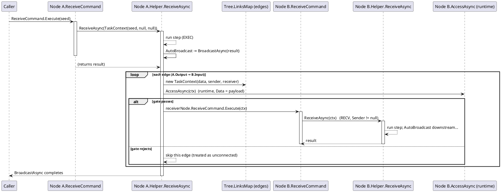

# Workflow System — Execution Mechanism (Compiler vs non-Compiler)

Two execution mechanisms drive the **same** single entry point. The **Compiler** is engine-driven: it pre-compiles the reachable sub-graph, then the `CompilerEngine` walks it and drives each node in order. The **non-Compiler** path is node-driven: each node runs, then *auto-broadcasts* its result downstream, and the delivery itself triggers the next node. Both land in the identical method — a node tells them apart only by the **context type** it receives.

> This page is the "how does data actually move" guide. For the CompilerEx type reference see [compilerex](../02_compilerex); for the core interface tables see [workflowsystem](../00_workflowsystem); for the full sequence diagrams see [data-flow](../../../3_SE_Analysis/03_data-flow/00_workflow-system).

---

## 0. The one true entry: `ReceiveAsync`

Every path — compiled drive, broadcast delivery, manual EXEC — funnels into a single method:

```csharp
Task<object?> IWorkflowNodeViewModelHelper.ReceiveAsync(ITaskContext context, CancellationToken ct)
```

`ReceiveCommand` is only the *human/Agent* trigger. Its generated handler wraps the parameter and calls `ReceiveAsync` (`NodeDefaultViewModel.Receive`, lines 67-72):

```csharp
var ctx = parameter as ITaskContext ?? new TaskContext(parameter);
return await Helper.ReceiveAsync(ctx, ct);
```

The **Compiler** bypasses `ReceiveCommand` entirely — `CompilerEngine.DriveAsync` calls `Helper.ReceiveAsync(context, ct)` directly with the `IRuntimeContext` session. So there are **three** ways to reach `ReceiveAsync`:

| Path | Who triggers | How it arrives | `context` received |
|---|---|---|---|
| **Compiled drive** | `CompilerEngine.DriveAsync` | calls `Helper.ReceiveAsync(context, ct)` **directly** (no command) | `IRuntimeContext` — the run session (an `ITaskContext`) |
| **Broadcast RECV** | `StandardBroadcastAsync` | per edge: `new TaskContext(data, sender, receiver)` → `receiverNode.ReceiveCommand.Execute(ctx)` → `ReceiveAsync` | `TaskContext` with `Sender`/`Receiver` set |
| **Manual EXEC** | `ReceiveCommand.Execute(data)` | raw parameter wrapped as `new TaskContext(data)` | `TaskContext` with `Sender`/`Receiver` = `null` |

A node detects which path it is on from the context — this is exactly what the demo `HttpHelper` does:

```csharp
if (context is IRuntimeContext)     { /* compiled step */ }
else if (context.Sender is not null) { /* RECV — delivered along a link */ }
else                                 { /* EXEC — manual / AI start */ }
```

---

## 1. The two mechanisms at a glance

| | **Compiler** (engine-driven) | **non-Compiler** (node-driven, stateless) |
|---|---|---|
| **Who decides the next node** | The engine walks a pre-compiled `CompiledGraph` (`ExecuteEntry` / `BranchEntry` / `ParallelEntry`) | Each node's own `BroadcastAsync` walks its live output edges (`LinksMap`) |
| **Pre-compiled?** | Yes — `CompileAsync(start)` decomposes the reachable sub-graph once | No — the current `LinksMap` topology at call time |
| **Node auto-broadcast** | **Disabled** — the node does *not* auto-forward; the engine owns downstream dispatch | **Enabled** — after `ReceiveAsync` returns the node calls `BroadcastAsync(flow, ct)` (`AutoBroadcast`) |
| **Context per node** | The shared `IRuntimeContext` session; the engine writes `Data` after each node to chain | A fresh `TaskContext` per delivery edge |
| **`AccessAsync` gate** | Compile-time static only (`ICompileContext`, `Data = null`) prunes invalid edges *out of the graph* | Runtime gate per edge (`TaskContext`, `Data = payload`) before each delivery |
| **Error / redirect** | `IRedirectable` → engine re-runs the whole graph from a target `Order` (possibly cross-chain) | No re-run; an error just ends the step |
| **Fan-out / merge** | `ParallelEntry` + `GroupData` join injection at multi-input nodes | Pure breadth-first fan-out; no join aggregation |
| **When to use** | Multi-input joins, routing, fan-out, deterministic whole-chain runs (the demo's Run) | Manual single-step EXEC, simple linear feeds, GUI-driven stepping |

Both paths share the **same** runtime `AccessAsync` semantics on the wire, but the Compiler moves the gate to compile time so the graph itself already excludes rejected edges.

---

## 2. Parameters — what each path carries

### 2.1 The context hierarchy

All contexts derive from one root carrying the payload:

```
IContext                       object? Data { get; }        // real at runtime, null for a compile identity
└─ IAccessContext              + bool IsCompilePhase, IWorkflowSlotViewModel? Sender, Receiver
   ├─ ITaskContext             // ReceiveCommand → ReceiveAsync contract (data/sender/receiver, all nullable)
   │   └─ IRuntimeContext      // + Uid/Sequence/Logs/CurrentOrder/BranchKey/Attempt/... ; new Data { set } — writable chain result
   └─ ICompileContext          // + Order/ChainIndex/Offset (compile identity; Order = -1 = absolute stop)
```

### 2.2 `Data` forms under the Compiler

What a node reads from `context.Data` in a compiled run:

| Form | When | Notes |
|---|---|---|
| `null` | no seed, or an upstream returned `null` | `RunCompiledWorkflow` seed is optional |
| **arbitrary chain value** | every non-join node | the engine writes `context.Data = result` after each `ReceiveAsync` — whatever the upstream returned |
| **`IGroupData`** | multi-input join (`CompileContext.InputNodes.Count > 1`) | a read-only `IReadOnlyDictionary<IWorkflowNodeViewModel, object?>` keyed by source-node reference; un-run sources are absent (`TryGetValue` → false) |
| **fan-out source restore** | `ParallelEntry` | the engine sets `Data = sourceData` before each branch so every branch reads the *same* source output |
| *pass-through* | routing-only nodes (routers) | must `return ctx.Data` unchanged, or the selected branch sees `null` |

### 2.3 `Data` / `Sender` / `Receiver` per path

| Path | `Data` | `Sender` / `Receiver` |
|---|---|---|
| Compiled drive | seed / chain value / `IGroupData` / restored fan-out source | **always `null`** (the engine drives the graph, not edges) |
| Broadcast RECV | the payload the sender broadcast (a `NetworkFlowContext` in the demo) | the two slots of the delivery edge |
| Manual EXEC | the raw parameter passed to `ReceiveCommand` | `null` |

> A compiled-run node that checks `context.Sender`/`context.Receiver` will always see `null` — only `Data` is meaningful there. The runtime `AccessAsync` gate (with Sender/Receiver) never fires inside a compiled run; it only fires on the non-Compiler broadcast wire.

---

## 3. Timing — who drives whom

### 3.1 Compiler path (engine owns the chain)

```
CompileAsync(start)
  └─ walk reachable sub-graph → ExecuteEntry / BranchEntry / ParallelEntry (+ per-edge AccessAsync static gate)
RunAsync(graph, context, ct)
  └─ for each entry:
       ExecuteEntry  → for each node:  inject IRuntimeContext → ReceiveAsync(context, ct)
                        engine writes context.Data = result (chain)
                        join point?   context.Data = new GroupData(collect upstream outputs) BEFORE driving
       BranchEntry   → pick key (CompileKey static | ResolveRouteKey dynamic) → drive chosen sub-graph
       ParallelEntry → restore Data = sourceData, then drive each branch graph in order
```

Sequence (graphic): see [data-flow §2 — Compile + Run](../../../3_SE_Analysis/03_data-flow/00_workflow-system).

- The node does **not** broadcast; the engine takes the return value and drives the next node.
- A node calling `Error()`/`Warn()` or throwing requests a redirect → `IRedirectable` re-runs the graph from a target Order (see [strategy-runtime](../../../3_SE_Analysis/02_design-patterns/00_workflow-system/10_strategy-runtime)).

### 3.2 non-Compiler path (node-driven broadcast chain reaction)

```
ReceiveCommand.Execute(seed)
  └─ TaskContext(seed, null, null)  →  node.ReceiveAsync  (EXEC)
        └─ run the node's step (reads context.Data)
        └─ AutoBroadcast → BroadcastAsync(result)
             └─ for each output edge: new TaskContext(data, sender, receiver)
                  └─ AccessAsync(ctx) runtime gate — false → skip that edge
                  └─ receiverNode.ReceiveCommand.Execute(ctx)
                        └─ receiver.ReceiveAsync  (RECV, Sender != null)
                              └─ run step → AutoBroadcast → ... (chain reaction)
```



Timing is a **node-driven depth-first chain**: the run starts at one node, and every node fans out to all connected downstream nodes, each of which fans out in turn. There is no central scheduler and no `GroupData` aggregation — a multi-input node simply runs once per incoming edge (once per `ReceiveCommand`).

---

## 4. Which mechanism to use

- **Compiler** — any run that needs a deterministic whole-chain sequence: multi-input joins (`IGroupData`), routing (`ICompileTimeRouter`), fan-out with a shared source payload, redirects, and the demo's Run path (`ControllerViewModel` → `Compiler.CompileAsync(this)` → `RunAsync`).
- **non-Compiler** — manual single-step execution (`ReceiveCommand.Execute(data)`), simple linear feeds where each node auto-forwards, and GUI/AI step-by-step driving. It has no join or redirect model.

They are **not mutually exclusive**: a workflow can be built and stepped manually (non-Compiler), then the same graph compiled and run as a chain (Compiler) — both go through the same `ReceiveAsync`, which is why a node can implement one `ReceiveAsync` and work under both.

---

*Sources: `Src/Core/VeloxDev.Core/WorkflowSystem/CompilerEx/CompilerEngine.cs`, `CompilerViewModel.cs`, `RuntimeContext.cs`, `GroupData.cs`; `Src/Core/VeloxDev.Core/Interfaces/WorkflowSystem/IContext.cs`, `IAccessContext.cs`, `ITaskContext.cs`; `Src/Core/VeloxDev.Core/WorkflowSystem/Templates/ViewModels/NodeDefaultViewModel.cs`; `Examples/Workflow/Common/Lib/ViewModels/Workflow/Helper/HttpHelper.cs` (unified entry), `Helper/BoolSelectorHelper.cs` (router pass-through), `NetworkFlowContext.cs`.*
