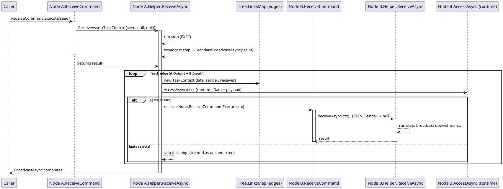

# Workflow System — Execution Mechanism (Compiler vs non-Compiler)

Two execution mechanisms drive the **same** single entry point. The **Compiler** is engine-driven: `CompilerViewModel.CompileAsync` pre-compiles the reachable sub-graph (forward from a `CompileRole.Root` starter, or reverse from a `CompileRole.Terminal` result), then `RuntimeEngine.RunAsync` walks it and drives each node in order. The **non-Compiler** path is node-driven and stateless: a run starts at a node and the node (or its helper) forwards the result over its output edges, each delivery triggering the next node. Both land in the identical method — a node tells them apart only by the **context type** it receives.

> This page is the "how does data actually move" guide. For the CompilerEx type reference see [compilerex](../02_compilerex); for the core interface tables see [workflowsystem](../00_workflowsystem); for the full sequence diagrams see [data-flow](../../../3_SE_Analysis/03_data-flow/00_workflow-system).

---

## 1. The one true entry: `ReceiveAsync`

Every path — compiled drive, broadcast delivery, manual EXEC — funnels into one method declared by `IWorkflowNodeViewModelHelper` (`Interfaces/WorkflowSystem/IWorkflowNodeViewModel.cs`):

```csharp
Task<object?> ReceiveAsync(ITaskContext context, CancellationToken ct);
```

`ReceiveCommand` is only the *human/Agent* trigger. Its generated handler wraps the parameter and calls `ReceiveAsync` (`Templates/ViewModels/NodeDefaultViewModel.cs`, lines 115-120):

```csharp
private async Task<object?> Receive(object? parameter, CancellationToken ct)
{
    var ctx = parameter as ITaskContext ?? new TaskContext(parameter);
    return await Helper.ReceiveAsync(ctx, ct);
}
```

The **Compiler** bypasses `ReceiveCommand` entirely — `RuntimeEngine` calls `Helper.ReceiveAsync(context, ct)` directly with the `IRuntimeContext` session. So there are **three** ways to reach `ReceiveAsync`:

| Path | Who triggers | How it arrives | `context` received |
|---|---|---|---|
| **Compiled drive** | `RuntimeEngine.RunAsync` (per-segment drive) | calls `Helper.ReceiveAsync(context, ct)` **directly** (no command) | `IRuntimeContext` — the run session (an `ITaskContext`) |
| **Broadcast RECV** | `WorkflowNodeEx.StandardBroadcastAsync` | per edge: `new TaskContext(data, sender, receiver)` → `receiverNode.ReceiveCommand.Execute(ctx)` → `ReceiveAsync` | `TaskContext` with `Sender`/`Receiver` set |
| **Manual EXEC** | `ReceiveCommand.Execute(data)` | raw parameter wrapped as `new TaskContext(data)` | `TaskContext` with `Sender`/`Receiver` = `null` |

A node detects which path it is on from the context. The demo `EnumSelectorHelper.ReceiveAsync` does this (`Helper/EnumSelectorHelper.cs`): when `ctx is IRuntimeContext` it is a compiled step (routing-only: `return ctx.Data`); otherwise it rebuilds a `NetworkFlowContext` from `ctx.Data` — the stateless broadcast path. `PythonHelper` and `TimerHelper` do the same `ctx is IRuntimeContext` branch to write `Log`/`Warn` only on compiled runs.

---

## 2. The two mechanisms at a glance

| | **Compiler** (engine-driven) | **non-Compiler** (node-driven, stateless) |
|---|---|---|
| **Who decides the next node** | `RuntimeEngine` walks a pre-compiled `CompiledGraph` (`ChainSegment` / `BranchSegment` / `ParallelSegment`) | Each node's own `BroadcastCommand → BroadcastAsync` walks its live output edges |
| **Pre-compiled?** | Yes — `CompileAsync(start, role)` decomposes the reachable sub-graph once (forward `Root` / reverse `Terminal`) | No — the current `LinksMap` topology at call time |
| **Node broadcast** | **Disabled** — the node does *not* forward on its own; the engine owns downstream dispatch | **Explicit per node** — the node/helper forwards the result over its output edges (`BroadcastCommand` → `StandardBroadcastAsync`); e.g. the demo selector helper broadcasts only along the currently selected value when its `AutoBroadcast` flag is on |
| **Context per node** | The shared `IRuntimeContext` session; the engine writes `Data` after each node to chain | A fresh `TaskContext` per delivery edge |
| **`AccessAsync` gate** | Compile-time static only (`ICompileContext`, `Data = null`) prunes invalid edges *out of the graph* | Runtime gate per edge (`TaskContext`, `Data = payload`) before each delivery |
| **Error / redirect** | `IRedirectable` → `RuntimeEngine` re-runs the whole graph from a target `CompileContext.Order` (possibly cross-chain) | No re-run; an error just ends the step |
| **Fan-out / join** | `ParallelSegment` (sequential fan-out, source payload restored) + `IGroupData` join injection at multi-input nodes | Pure per-edge fan-out; no join aggregation |
| **Result reachability** | `IRuntimeContext.Target` / `TargetReached` track whether a result node was actually driven (Terminal runs) | Not tracked |
| **When to use** | Multi-input joins, routing, fan-out, reverse/result-driven runs, deterministic whole-chain runs (the demo's Run) | Manual single-step EXEC, simple linear feeds, GUI-driven stepping |

Both paths share the **same** `AccessAsync` semantics on the wire, but the Compiler moves the gate to compile time so the graph itself already excludes rejected edges.

---

## 3. Parameters — what each path carries

### 3.1 The context hierarchy

All contexts derive from one root carrying the payload:

```
IContext                       object? Data { get; }        // real at runtime, null for a compile identity
└─ IAccessContext              + bool IsCompilePhase, IWorkflowSlotViewModel? Sender, Receiver
   ├─ ITaskContext             // ReceiveCommand → ReceiveAsync contract (data/sender/receiver, all nullable)
   │   └─ IRuntimeContext      // + Uid/Sequence/Logs/.../Data { set }/Target/TargetReached/Output registry
   └─ ICompileContext          // + Order/ChainIndex/Offset/InputNodes (compile identity; Order = -1 = absolute stop)
```

`IAccessContext`/`ITaskContext` live in `VeloxDev.WorkflowSystem`; `IRuntimeContext`/`ICompileContext` in `VeloxDev.Core.WorkflowSystem.CompilerEx`.

### 3.2 `Data` forms under the Compiler

What a node reads from `context.Data` in a compiled run:

| Form | When | Notes |
|---|---|---|
| `null` | no seed, or an upstream returned `null` | a run without a seed starts with `Data = null` |
| **arbitrary chain value** | every non-join node | the engine writes `context.Data = result` after each `ReceiveAsync` — whatever the upstream returned |
| **`IGroupData`** | multi-input join (`CompileContext.InputNodes.Count > 1`) | a read-only `IReadOnlyDictionary<IWorkflowNodeViewModel, object?>` keyed by source-node reference; un-run sources are absent (`TryGetValue` → false) |
| **fan-out source restore** | `ParallelSegment` | the engine sets `Data = sourceData` before each branch so every branch reads the *same* source output |
| *pass-through* | routing-only nodes (routers) | must `return ctx.Data` unchanged, or the selected branch sees `null` |

### 3.3 `Data` / `Sender` / `Receiver` per path

| Path | `Data` | `Sender` / `Receiver` |
|---|---|---|
| Compiled drive | seed / chain value / `IGroupData` / restored fan-out source | **always `null`** (the engine drives the graph, not edges) |
| Broadcast RECV | the payload the sender broadcast (a `NetworkFlowContext` in the demo) | the two slots of the delivery edge |
| Manual EXEC | the raw parameter passed to `ReceiveCommand` | `null` |

> A compiled-run node that checks `context.Sender`/`context.Receiver` will always see `null` — only `Data` is meaningful there. The runtime `AccessAsync` gate (with `Sender`/`Receiver`) never fires inside a compiled run; it only fires on the non-Compiler broadcast wire.

---

## 4. Timing — who drives whom

### 4.1 Compiler path (engine owns the chain)

```
CompileAsync(component, role, ct)           // role: Root (forward) or Terminal (reverse)
  └─ Root:    walk reachable sub-graph downstream → Chain/Branch/Parallel segments
              (+ per-edge AccessAsync static gate prunes rejected edges)
  └─ Terminal: reverse-BFS the target's ancestor cone over Sources (AccessAsync-gated),
               derive the cone's entry frontier, compile the cone only
RunAsync(graph, context, ct)
  └─ for each entry:
       ChainSegment    → for each node: inject IRuntimeContext → ReceiveAsync(context, ct)
                         engine writes context.Data = result (chain)
                         join point?   context.Data = new GroupData(CollectGroupedInputs(inputs)) BEFORE driving
       BranchSegment   → drive router; pick key (locked CompileKey static | ResolveRouteKey dynamic);
                         terminal branch or no match → run ends; else drive the chosen sub-graph
       ParallelSegment → restore Data = sourceData, then drive each branch graph in order
  └─ on a node Error()/Warn()/exception:
       IRedirectable → re-run the whole graph toward ResolveRedirectAsync's Order (skip prefix; re-route-only at a router)
       else          → Status "Stopped", CurrentOrder = -1, EndedWithError = true
```

- The node does **not** broadcast; the engine takes the return value and drives the next node.
- The engine sets `TargetReached = true` when the node it drives matches `context.Target` — the reachability signal a result/terminal run reads after `RunAsync` returns.

Sequence (graphic): see [data-flow — Compile + Run](../../../3_SE_Analysis/03_data-flow/00_workflow-system).

### 4.2 non-Compiler path (node-driven broadcast chain reaction)

```
ReceiveCommand.Execute(seed)
  └─ TaskContext(seed, null, null)  →  node.ReceiveAsync  (EXEC)
        └─ run the node's step (reads context.Data)
        └─ broadcast step (node/helper) → BroadcastCommand / StandardBroadcastAsync(result)
             └─ for each output edge: new TaskContext(data, sender, receiver)
                  └─ AccessAsync(ctx) runtime gate — false → skip that edge
                  └─ receiverNode.ReceiveCommand.Execute(ctx)
                        └─ receiver.ReceiveAsync  (RECV, Sender != null)
                              └─ run step → downstream broadcast → ... (chain reaction)
```



Timing is a **node-driven depth-first chain**: the run starts at one node, and every node fans out to all connected downstream nodes, each of which fans out in turn. There is no central scheduler and no `IGroupData` aggregation — a multi-input node simply runs once per incoming edge (once per `ReceiveCommand`).

---

## 5. Which mechanism to use

- **Compiler** — any run that needs a deterministic whole-chain sequence: multi-input joins (`IGroupData`), routing (`ICompileTimeRouter`), fan-out with a shared source payload, redirects (`IRedirectable`), result-driven reverse runs (`CompileRole.Terminal` + `Target`/`TargetReached`), and the demo's Run path (`ControllerViewModel` → `Compiler.CompileAsync(this, CompileRole.Root)` → `RuntimeEngine.RunAsync`).
- **non-Compiler** — manual single-step execution (`ReceiveCommand.Execute(data)`), simple linear feeds where each node auto-forwards, and GUI/AI step-by-step driving. It has no join, redirect, or reachability model.

They are **not mutually exclusive**: a workflow can be built and stepped manually (non-Compiler), then the same graph compiled and run as a chain (Compiler) — both go through the same `ReceiveAsync`, which is why a node can implement one `ReceiveAsync` and work under both.

---

*Sources: `Src/Core/VeloxDev.Core/WorkflowSystem/CompilerEx/CompilerViewModel.cs`, `CompilerViewModel.Reverse.cs`, `Runtime/RuntimeEngine.cs`, `Runtime/Model/RuntimeContext.cs`, `Runtime/Model/GroupData.cs`; `Src/Core/VeloxDev.Core/Interfaces/WorkflowSystem/IContext.cs`, `IAccessContext.cs`, `ITaskContext.cs`, `IWorkflowNodeViewModel.cs`; `Src/Core/VeloxDev.Core/WorkflowSystem/Templates/ViewModels/NodeDefaultViewModel.cs`, `StandardEx/WorkflowNodeEx.cs`; `Examples/Workflow/Common/Lib/ViewModels/Workflow/ControllerViewModel.cs`, `EnumSelectorNodeViewModel.cs`, `Helper/EnumSelectorHelper.cs`, `Helper/PythonHelper.cs`, `Helper/TimerHelper.cs`, `NetworkFlowContext.cs`.*
