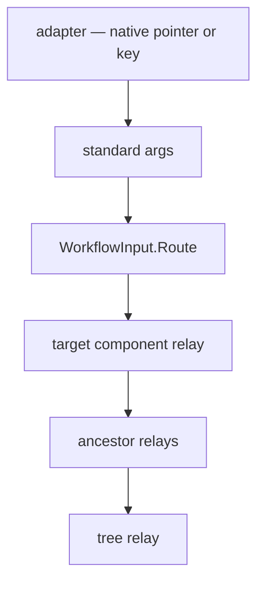

# Workflow System — GUI Input: the routed input surface

One standard pointer-and-keyboard surface, so a host writes an interaction once instead of once per GUI. The adapter decides **what** was hit (its gesture logic already knows) and hands the event to `WorkflowInput`; Core decides **who hears about it** — the target first, then its ancestors, every one of them seeing the same argument instance.

Core performs **no action of its own** on the route. Deleting a link, highlighting it, opening a menu are the host's, written where they can be seen and changed.

Sources: `Src/Core/VeloxDev.Core/WorkflowSystem/GUI/Events/Input/*.cs` (the 15 types), `GUI/Events/WorkflowInput.cs` (the route).



## `WorkflowInput` — the entry

**Signature:** `public sealed class WorkflowInput` (`GUI/Events/WorkflowInput.cs:31`). One instance per tree, created on first use and kept as long as the tree lives.

| Member | Signature | Notes |
|---|---|---|
| `For` | `static WorkflowInput For(IWorkflowTreeViewModel tree)` | The one way to get the tree's instance (`:49`) |
| constructor | `WorkflowInput(IWorkflowTreeViewModel tree)` | `null` throws `ArgumentNullException` (`:42`) |
| `Tree` | `IWorkflowTreeViewModel` | (`:56`) |
| `Route` | `void Route(PointerEventArgs e)` / `void Route(KeyEventArgs e)` | Expands the target's ancestor chain and dispatches down it (`:90,104`) |
| `PointerTarget` | `IWorkflowViewModel?` | Which component the pointer is on — the route's only state (`:62`) |
| `HoveredLink` | `IWorkflowLinkViewModel?` | `PointerTarget as IWorkflowLinkViewModel` (`:65`) |
| `HitRadius` | `double` | Hit-test radius for curves; defaults to `LinkHitTestEx.DefaultHitRadius` (`:71`) |
| `IsSuspended` | `bool` | Set while a host menu is open; pointer tracking stops (`:78`) |

**Route order.** The target is dispatched first, then each ancestor up to the tree. Every element on the way sees the same argument instance — so one action has one `WorkflowEventHandle`, and an ancestor can read what a handler closer to the target decided.

## `IInputEvents` / `InputRelay`

**Signature:** `public interface IInputEvents { InputRelay Input { get; } }` (`Input/IInputEvents.cs`). The four helpers (`TreeHelper<T>`, `NodeHelper<T>`, `SlotHelper<T>`, `LinkHelper<T>`) implement it, so a host subscribes like this:

```csharp
((IInputEvents)link.GetHelper()).Input.PointerEntered += OnLinkEntered;
```

The capability is deliberately **not** a member of `IWorkflow…ViewModelHelper`: adding members there would break every existing implementer, and a helper with no interest in input should not have to answer for it.

| `InputRelay` event | Argument |
|---|---|
| `PointerEntered` / `PointerExited` / `PointerMoved` / `PointerPressed` / `PointerReleased` | `PointerEnteredEventArgs` and its siblings |
| `PointerWheelChanged` | `PointerWheelEventArgs` |
| `KeyDown` / `KeyUp` | `KeyDownEventArgs` / `KeyUpEventArgs` |

The `sender` is the relay, which is how a subscriber tells which element of the route it is hearing from.

## The fifteen types

| Group | Types |
|---|---|
| Capability / relay | `IInputEvents`, `InputRelay` |
| Pointer | `PointerEventArgs` + `PointerEntered` / `PointerExited` / `PointerMoved` / `PointerPressed` / `PointerReleased` / `PointerWheel` args |
| Keyboard | `KeyEventArgs`, `KeyDownEventArgs`, `KeyUpEventArgs`, `InputKey` |
| Value types | `MouseButton`, `InputModifiers` |

### `PointerEventArgs` (abstract)

| Member | Type | Notes |
|---|---|---|
| `Position` | `Anchor` | Surface coordinates; its `Layer` is the **source view's** layer — a pointer has no layer of its own |
| `Modifiers` | `InputModifiers` | |
| `Source` | `object?` | The view the input came from; what used to be the event's `sender` |
| `Target` | `IWorkflowViewModel?` | What the adapter resolved the pointer onto; `null` over empty canvas. **Every** element on the route sees this same value — an ancestor sees the original target, not itself |
| `Handle` | `WorkflowEventHandle` | |

Subclasses add: `PointerPressedEventArgs` and `PointerReleasedEventArgs` → `Button` (`MouseButton`), `ClickCount` (`int`); `PointerWheelEventArgs` → `DeltaX`, `DeltaY` (`double`). `PointerEntered` / `Exited` / `Moved` add nothing.

### `KeyEventArgs` (abstract)

| Member | Type | Notes |
|---|---|---|
| `Key` | `InputKey` | `Unknown` when this enum does not name the key |
| `RawKeyCode` | `int` | The platform's own code — **not comparable across adapters** |
| `Modifiers` | `InputModifiers` | Precise even when `Key` is `Unknown`, so Ctrl + an unmapped key stays distinguishable |
| `IsRepeat` | `bool` | The platform reports an auto-repeat rather than a fresh press |
| `Source` / `Target` / `Handle` | | `Target` is whatever the adapter decided the key applies to — for `Delete`, the component the pointer is on |

A down and an up are **two separate events**, not two phases of one.

### `MouseButton` / `InputModifiers` / `InputKey`

| Type | Members |
|---|---|
| `MouseButton` | `None`, `Left`, `Right`, `Middle`, `XButton1`, `XButton2`. The wheel is deliberately **not** a button — it has its own event |
| `InputModifiers` | `[Flags]`: `None`, `Alt`, `Control`, `Shift`, `Meta` |
| `InputKey` | A curated subset (~66 members) mirroring `Avalonia.Input.Key` — editing and navigation keys, the function row, letters and digits. Anything else is `Unknown`, and `RawKeyCode` still carries the platform's code |

## The handle

`WorkflowEventHandle` is shared by the whole route — one per action:

| Flag | Effect |
|---|---|
| `PreventDefault` | The framework's own reaction does not happen. For `Delete` that means *this one press does not delete*. |
| `StopPropagation` | The event stops here; no ancestor hears it. |

Neither flag set behaves exactly as if they did not exist.

## The alias discipline (platform layer)

In `Src/Adapters/`, `Src/Templates/` and `Examples/`, these fifteen names are **always written through an alias**, never bare:

```csharp
using Wf = VeloxDev.WorkflowSystem;          // Core side   → Wf.PointerPressedEventArgs
using PlatformInput = <platform input ns>;   // platform    → PlatformInput.PointerEventArgs
```

**Why:** an adapter's namespace is `VeloxDev.WorkflowSystem.AttachedBehaviors` — a *child* of Core's namespace. C# resolves a name by walking outward from the innermost namespace and only then trying `using`s, so a same-named type declared in the **outer** namespace silently wins. There is no CS0104 ambiguity error; the failure surfaces far away as `CS1061` ("does not contain `GetPosition`"), `CS0019` ("operator `!=` cannot be applied to `MouseButton` and `MouseButton`") or `CS0115` ("no suitable method found to override"). The prefix-less rename produced **134 errors in 11 files** on the first full build, none of them pointing at the cause.

Both aliases are declared in every file that touches one of the fifteen — **even when an alias goes unused there**. The test is not "does this name collide here" but "this layer leaves no bare name, so a reader need not resolve the rules first".

Names outside the fifteen (`WorkflowInput`, `WorkflowEventHandle`, `Anchor`, the `IWorkflow…ViewModel` family, and the per-component event families `IWorkflowNodeEvents` / `IWorkflowSlotEvents` / `IWorkflowTreeEvents`) stay **bare**.
