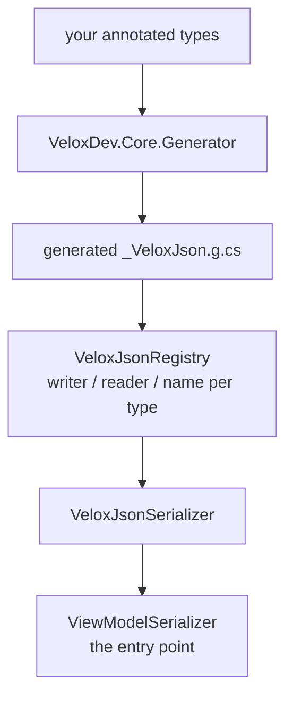

# Serialization — API Reference

`VeloxDev.Serialization` is its own module, not a workflow sub-topic: it archives **any** view model, and the workflow case is one of its callers. The engine ships in **`VeloxDev.Core`**; only two documents live in `VeloxDev.Core.Extension`, under the same namespace — a compiled graph and a run's checkpoint.

Sources: `Src/Core/VeloxDev.Core/Serialization/*.cs` (engine, annotations, `ViewModelSerializer`), `Src/Core/VeloxDev.Core.Extension/CompiledGraphEx.cs`, `CheckpointEx.cs`.

**The design in one line:** closed world, zero reflection. A type is written only if the source generator emitted a reader and a writer for it (`Src/Core/VeloxDev.Core/Serialization/VeloxJsonSerializer.cs:21`). An unseen type fails with an explanation rather than serializing an empty shell, and that is what makes the engine trim- and AOT-friendly.



---

## Authoring: what a type must satisfy

Four routes into the closed world; any one is enough (`Src/Generators/VeloxDev.Core.Generator/Base/VeloxJsonModel.cs:588-614`):

| Route | For |
|---|---|
| Implement `IWorkflowTreeViewModel` / `IWorkflowNodeViewModel` / `IWorkflowSlotViewModel` / `IWorkflowLinkViewModel` | the four workflow components |
| Carry a `[WorkflowBuilder.*]` attribute | a component written from a template |
| Have a `[VeloxProperty]` **field** | your own view models — the class must then be `partial` |
| Carry `[Archivable]` | a plain document — `partial` is not needed |

```csharp
// View model route. Source: Src/Core/VeloxDev.Core.Extension.Test/Serialization/ViewModelSerializerContractTests.cs:23-26
internal sealed partial class ContractModel
{
    [VeloxProperty] private int count;
}

// Document route. Source: Src/Core/VeloxDev.Core/WorkflowSystem/CompilerEx/Runtime/Model/ExecutionCheckpoints.cs:27-28
[Archivable]
public sealed class ExecutionCheckpoint
```

**Member collection** — public properties with a public setter, in declaration order; `[VeloxProperty]`-promoted fields next; inherited members last (`Base/VeloxJsonModel.cs:912-1025`). The order is a byte-level contract of the format.

The generator only runs when the consuming assembly references `VeloxDev.MVVM` (`Base/VeloxJsonModel.cs:333`), and the MSBuild property `VeloxJsonSerialization=false` turns it off entirely (`Src/Generators/VeloxDev.Core.Generator/VeloxJson.cs:34`).

---

## `ViewModelSerializer` — the entry point

**Signature:** `public static class ViewModelSerializer` (`Serialization/ViewModelSerializer.cs:55`). Every method is constrained `where T : INotifyPropertyChanged`.

| Member | Signature | Notes |
|---|---|---|
| `Serialize` | `string Serialize<T>(this T workflow)` / `(this T workflow, SerializationOptions options)` | `ViewModelSerializer.cs:109,114` |
| `Deserialize` | `T Deserialize<T>(this string json)` / `(this string json, SerializationOptions options)` | Blank text throws `ArgumentException`; a `null` result throws `InvalidOperationException` (`:151,161`) |
| `TryDeserialize` | `bool TryDeserialize<T>(this string json, out T? workflow)` / `(…, SerializationOptions, out T?)` | The non-throwing form — `false` on null, blank or malformed text (`:122,138`) |
| `DeserializeToType` | `object? DeserializeToType(this VeloxJsonValue value, Type targetType)` | `IsNull` yields `null` (`:97`) |
| Async | `SerializeAsync<T>(…)` / `DeserializeAsync<T>(…)` | Each takes `CancellationToken = default` and checks it on entry (`:173-208`) |
| Text/stream | `SerializeToTextWriter`, `SerializeToStream`, `DeserializeFromTextReader`, `DeserializeFromStream` | `T?` returns; sync `DeserializeFromTextReader` returns `null` for a null document (`:222-274`) |
| UTF-8 bytes | `SerializeToUtf8Bytes`, `DeserializeFromUtf8Bytes` (+ async) | (`:286-311`) |
| Async text/stream | `SerializeToTextWriterAsync`, `DeserializeFromTextReaderAsync`, `SerializeToStreamAsync`, `DeserializeFromStreamAsync` | ⚠️ The async readers **throw** `InvalidOperationException` on a null document, where the sync ones return `null` — pinned by `ViewModelSerializerContractTests.cs:159-170` |

---

## `SerializationOptions`

**Signature:** `public sealed class SerializationOptions` (`ViewModelSerializer.cs:19`). It mutates itself and returns `this`.

| Member | Signature | Notes |
|---|---|---|
| `Create()` | `static SerializationOptions Create()` | `:25` |
| `WithIndented()` | `SerializationOptions` | `VeloxJsonFormat.Indented` (`:28`) |
| `WithCompact()` | `SerializationOptions` | `VeloxJsonFormat.Compact` (`:31`) |
| `WithExcludedPropertyTypes(params Type[])` | `SerializationOptions` | Drops members whose **declared** type matches exactly — how `CompiledGraphEx` stops the writer following references out of a graph (`:44`) |

The three Newtonsoft-era switches (`WithTypeNameHandling`, `WithNullValueHandling`, `WithDefaultValueHandling`) **no longer exist**. Type information is now written whenever the runtime type differs from the declared type, and null/default handling moved to the per-member `[JsonIgnore(Condition = …)]`.

---

## Annotations

| Attribute | Targets | Signature | Effect |
|---|---|---|---|
| `ArchivableAttribute` | class, struct | `ArchivableAttribute(params Type[] additionalRoots)` | Opens a type the generator would otherwise not see. Named roots must be in the **same assembly**, or the generator reports `VELOX_JSON_ARCH001`. `AdditionalRoots` is exposed as `IReadOnlyList<Type>` (`Annotations/ArchivableAttribute.cs:32-41`) |
| `ArchiveAttribute` | property, field | `ArchiveAttribute(ArchiveOptions options, object? argument = null)` | Changes **this one member** — how it is taken, dropped or named. It never reorders the rest (`Annotations/ArchiveAttribute.cs:22-41`) |

`ArchiveOptions` is a `[Flags]` enum (`Annotations/ArchiveOptions.cs:13`):

| Flag | Value | Meaning |
|---|---|---|
| `None` | 0 | No change |
| `KeepProperty` | 1 | Admits a computed property with no public setter — it is written but **not read back** |
| `KeepField` | 2 | Admits a field that has no matching property |
| `IgnoreField` | 4 | Drops the member entirely |
| `ReName` | 8 | Writes it under the name in `ArchiveAttribute.Argument` (must be a non-null `string`) |
| `EnumName` | 16 | Writes **this enum member** by value name instead of its underlying integer |

`[JsonIgnore]` (System.Text.Json's) is honoured in full, `Condition` included, and the four BCL lifecycle callbacks (`[OnSerializing]`, `[OnSerialized]`, `[OnDeserializing]`, `[OnDeserialized]`) are called — they must be at least `internal`, and `public` across assemblies (`Base/VeloxJsonModel.cs:897`).

---

## `CompiledGraphEx` — a compiled graph as a document

**Signature:** `public static class CompiledGraphEx` (`Src/Core/VeloxDev.Core.Extension/CompiledGraphEx.cs:44`)

| Member | Signature | Notes |
|---|---|---|
| `SerializeCompiledGraph` | `string SerializeCompiledGraph(this CompiledGraph graph, bool includeTree = false, SerializationOptions? options = null)` | `graph` null throws `ArgumentNullException` (`:68`) |
| `DeserializeCompiledGraph` | `CompiledGraph? DeserializeCompiledGraph(this string json)` | (`:84`) |

| Mode | `includeTree` | Keeps | Cost |
|---|---|---|---|
| **Snapshot** (default) | `false` | The segment structure plus each node's own state. Drops `IWorkflowTreeViewModel` and `ObservableCollection<IWorkflowSlotViewModel>` properties. | Not re-mountable: restored nodes have no `Parent`, so nothing re-collapses their geometry. |
| **With the tree** | `true` | Everything, so the restored graph can go back on a canvas. | The tree plus the whole connected component — and the nodes' `Parent` is a *second*, freshly built tree. |

A restored node always gets a **fresh `RuntimeId`** and carries **no compile identity**; a router's enum branch key is the exception, restored on load through `CompileKeyNormalizer`.

---

## `CheckpointEx` — a run's place as JSON

**Signature:** `public static class CheckpointEx` (`Src/Core/VeloxDev.Core.Extension/CheckpointEx.cs:42`)

| Member | Signature | Notes |
|---|---|---|
| `SerializeCheckpoint` | `string SerializeCheckpoint(this ExecutionCheckpoint checkpoint)` | Always indented — it is a file a person may open (`:48`) |
| `DeserializeCheckpoint` | `ExecutionCheckpoint? DeserializeCheckpoint(this string json)` | `null` when the text is blank or is not a checkpoint (`:57`) |

## `FileCheckpointStore`

**Signature:** `public sealed class FileCheckpointStore : IExecutionCheckpointStore` (`CheckpointEx.cs:86`)

| Member | Signature | Notes |
|---|---|---|
| constructor | `FileCheckpointStore(string path)` | Blank throws `ArgumentNullException` (`:93`) |
| `Path` | `string` | The file this store reads and writes (`:100`) |
| `SaveAsync` | `Task SaveAsync(ExecutionCheckpoint checkpoint, CancellationToken ct)` | Replaces the contents; creates the directory on first save (`:103`) |
| `LoadAsync` | `Task<ExecutionCheckpoint?> LoadAsync(CancellationToken ct)` | `null` when the file is absent or does not parse (`:129`) |

Writes are serialised behind a `SemaphoreSlim` — two fan-out branches can interleave their awaits, and two writers on one file would otherwise interleave their bytes. On `net8.0` and up it writes asynchronously; older targets write synchronously.

---

## The engine types

These are public so generated code can call them, but they are that code's contract rather than a hand-call surface.

| Type | Role |
|---|---|
| `VeloxJsonSerializer` | The façade: `Serialize`, `WriteTo(TextWriter/Stream)`, `Deserialize<T>` / `Deserialize(json, Type)`, `ReadValue`, `ReadArray`, `ReadMap`, `WriteMap`, plus async twins (`Serialization/VeloxJsonSerializer.cs:21` and `.Async.cs:13`) |
| `VeloxJsonReader` | A cursor over one document — the object protocol (`BeginObject`/`NextMember`/`FinishObject`), array cursors, `$ref` resolution and typed reads (`Serialization/VeloxJsonReader.cs:27`) |
| `VeloxJsonWriter` | Writes the format byte-for-byte: reference ids, type tags, indentation, separators, number spelling (`Serialization/VeloxJsonWriter.cs:32`) |
| `VeloxJsonRegistry` | The compile-time fact table — writer, reader, name↔type, container factories. Populated by generated `[ModuleInitializer]`s; lookups are lock-free (`Serialization/VeloxJsonRegistry.cs:98`) |
| `VeloxJsonValue` | An in-memory JSON tree (scalar / array / object) for callers that build results rather than documents — the Agent tools render their output through it (`Serialization/VeloxJsonValue.cs:37`) |
| `VeloxJsonText` | **internal** — the single authority for string escaping and `double` spelling (`Serialization/VeloxJsonText.cs:13`) |

**Registry ownership:** the declaring assembly can always register; a consumer assembly can only fill a gap, never replace an entry (`VeloxJsonRegistry.cs:195,215`). The generator states which case a registration is via `declaresType`, rather than the registry guessing.

---

## What this format is not

It is **not** interchangeable with `System.Text.Json` or Newtonsoft. Three structural differences: the type discriminator's value is the registry key (a generic name carries its type arguments, nested levels joined with `+`), collection shapes are decided by declared type, and the member set comes from the generator rather than from reflection. A foreign type tag does not resolve, and the reader silently falls back to the declared type — which loses polymorphism for concrete classes and throws `MissingReader` for an interface or abstract type.

Two more measured behaviours worth knowing:

- **Numbers do not keep their type through an `object` member.** JSON has one integer type: an `int` that went in comes back `long`, a `float` comes back `double`. The engine's own fields are exact; a node that pattern-matches a payload on `int` will not match after a resume.
- **Untyped members degrade rather than fail.** An `object`-declared member is read back as a JSON dictionary, not the original type.
