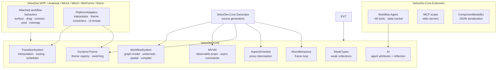

# 01 · Functional Structure

## Feature → Project → Dependencies

The wiki is organized around **features**, not directories. A feature is a cohesive set of capabilities the project exposes — independently describable, usable, and verifiable. This table is the canonical mapping used across the QuickStart, API, and SE Analysis dimensions.

| Feature | Owning project(s) | Public API surface (summary) | Dependencies | Evidence |
|---|---|---|---|---|
| **workflow-system** | `VeloxDev.Core` (+ `VeloxDev.Core.Extension` for serialization) | `[WorkflowBuilder.*]`, `IWorkflowTreeViewModel` family, `CompilerEx`, `SelectorEx`, `StandardEx`, `SpatialGridHashMap` | Roslyn generator | Demo + Test |
| **workflow-agent** | `VeloxDev.Core.Extension` | `WorkflowAgentScope`, `WorkflowAgentToolkit` (~60 tools), `McpScope`, `VeloxDev.AI` | `Microsoft.Extensions.AI`, `ModelContextProtocol` | Test + README + Demo |
| **mvvm** | `VeloxDev.Core` | `VeloxPropertyAttribute`, `VeloxCommandAttribute`, `VeloxCommand`, `IVeloxCommand` | Roslyn generator | Demo + Test |
| **transition** | `VeloxDev.Core` + adapters | `Eases`, `Transition<T>`, `InterpolatorCore`, `TransitionSchedulerCore`, native interpolators | `System.Numerics`, `System.Drawing` | Demo + Test |
| **dynamic-theme** | `VeloxDev.Core` + adapters | `ThemeManager`, `ThemeConfigAttribute`, `IThemeObject`, converters | Transition engine | Demo + Test |
| **aop** | `VeloxDev.Core` (`#if NET`) | `ProxyEx`, `ProxyInstance`, `AopCache`, `IAspectOriented` | `DispatchProxy`, generator | Demo + Test |
| **monobehaviour** | `VeloxDev.Core` | `MonoBehaviourManager`, `MonoBehaviourAttribute`, `IMonoBehaviour` | Roslyn generator | Demo + Test |
| **weak-types** | `VeloxDev.Core` | `WeakDelegate`, `WeakQueue`, `WeakStack`, `WeakCache` | — | Test |
| **platform-adapters** | 6 adapters + `Src/Templates` | Attached workflow behaviors, per-platform Transition/Theme wiring, `dotnet new` templates | per-framework SDK | README + Demo + Source |

## Module Responsibility Boundaries

## Entry Points

| Scenario | Entry type | Where |
|---|---|---|
| Build a workflow editor | `tree.AsAgentScope()` / `[WorkflowBuilder.Tree<T>]` | `Examples/Workflow/Common/Lib` |
| Animate a property | `target.Snapshot(...)` / `Transition.Execute(...)` | `Examples/Transition/*` |
| Switch a theme | `ThemeManager.Transition<Light>(...)` | `Examples/Theme/*` |
| Run an async command | `[VeloxCommand]` on a partial method | `Examples/MVVM/*` |
| Intercept node execution | `ProxyEx.CreateProxy(...)` + `SetProxy(...)` | `Examples/AOP/*` |
| Tick-based simulation | `[MonoBehaviour]` + `MonoBehaviourManager.Start()` | `Examples/MonoBehaviour/*` |
| Install prebuilt views | `dotnet new wpf-v-node -n NodeView ...` | `Src/Templates` |
