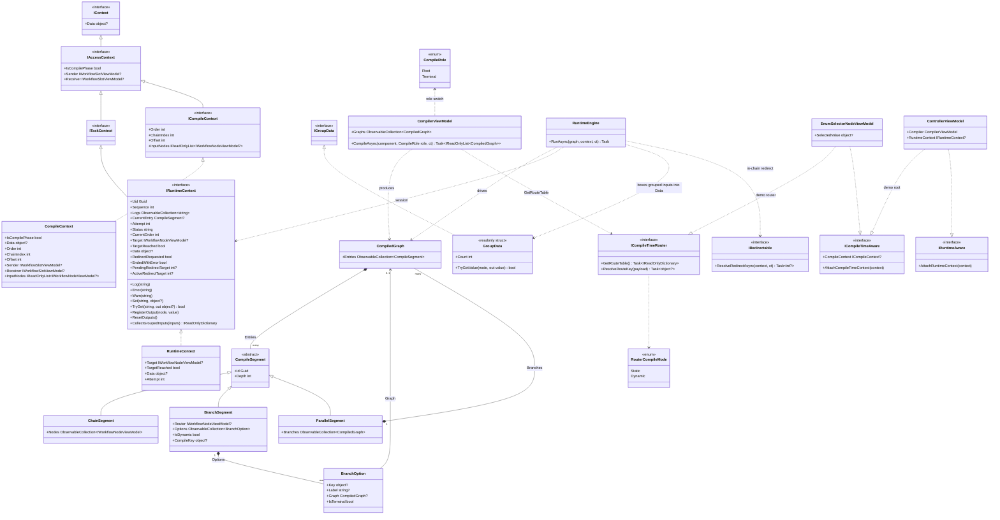

# Workflow System — Class Diagram: Core / Execution Model

## A. Core / Execution Model (CompilerEx)

Every type below exists in `Src/Core/VeloxDev.Core/WorkflowSystem/CompilerEx/**` (Compile + Runtime folders). The model is two-phase: `CompilerViewModel.CompileAsync` fixes each node's identity (Order) and statically validates edges via `AccessAsync`; `RuntimeEngine.RunAsync` then drives the immutable segments against a runtime session.

Sources: `CompilerEx/Compile/CompilerViewModel.cs` (lines 26-57 entry, 59-249 forward decomposition), `CompilerEx/Compile/CompilerViewModel.Reverse.cs` (ancestor-cone compilation), `CompilerEx/Runtime/RuntimeEngine.cs` (lines 52-128 `RunAsync`, 205-214 the error / `IRedirectable` termination block; fan-out restore lives in `RunParallelAsync`, 329-383), `CompilerEx/Compile/Model/*.cs` + `Runtime/Model/*.cs`, `Interfaces/WorkflowSystem/IContext.cs`, `IAccessContext.cs`, `ITaskContext.cs`.
