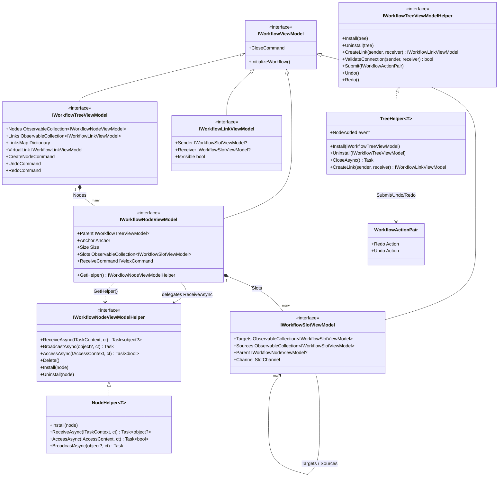

# Workflow System — Design Patterns — Component Model

The component model: the four VM interfaces, their helpers, and the topology the compiler consumes (`Slots` → `Targets`/`Sources` edges).

## B. Component Model (VM interfaces + helpers)

The editor tree is built from four VM interfaces; each is paired with a *Helper* that owns behavior (Template Method / Command patterns). Nodes expose the topology the compiler consumes: `Slots` → `Targets`/`Sources` edges.

Sources: `Interfaces/WorkflowSystem/IWorkflow*.cs`, `Templates/Helpers/TreeHelper.cs` (lines 109-265), `Templates/Helpers/NodeHelper.cs` (lines 28-112), `Templates/WorkflowBuilder.cs`.
