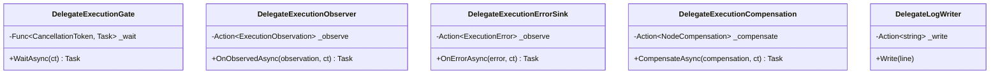

# Workflow System — Class Diagram of the Runtime Capability Layer

The 2026-09-27 layer, as a class diagram. Seven host seams hang off the concrete `RuntimeContext` (not off `IRuntimeContext`), each with a shipped implementation; the engine reads them through a private `Session()` helper that also unwraps a fan-out's `BranchRuntimeContext`.

Two things this diagram shows that a member table cannot:

- **Nothing on the left depends on anything on the right except through the small contracts.** `RuntimeContext` never mentions `TextWriterLogWriter` or `ExponentialBackoffRetry`; `RuntimeEngine` mentions only the interfaces.
- **`BranchRuntimeContext` implements `IRuntimeContext` but not the capability properties.** It is a facade for a fan-out branch, and it deliberately exposes only `Session` so the engine can reach the host's real session through it.

```mermaid
classDiagram
    class IRuntimeContext {
        <<interface>>
        +Uid Guid
        +Logs ObservableCollection~string~
        +Attempt int
        +Status string
        +Target IWorkflowNodeViewModel?
        +TargetReached bool
        +Data object?
        +RedirectRequested bool
        +EndedWithError bool
        +PendingRedirectTarget int?
        +ActiveRedirectTarget int?
        +RegisterOutput(node, value)
        +ResetOutputs()
        +CollectGroupedInputs(inputs) IReadOnlyDictionary
    }
    class RuntimeContext {
        +IsCompilePhase bool
        +ExecutionGate IExecutionGate?
        +Observer IExecutionObserver?
        +RetryPolicy INodeRetryPolicy?
        +ErrorSink IExecutionErrorSink?
        +Compensation IExecutionCompensation?
        +CheckpointStore IExecutionCheckpointStore?
        +LogWriter ILogWriter?
        +MaxRetainedLogs int?
        +MaxParallelBranches int?
        +Outcome RunOutcome
        +Next() int
        +LogWriteFailed event
        +SnapshotLogs() string[]
        +Snapshot() ExecutionCheckpoint
    }
    class BranchRuntimeContext {
        <<internal>>
        +IsCompilePhase bool
        +Data object?
        +RedirectRequested bool
        +PendingRedirectTarget int?
        +Session IRuntimeContext
    }
    class RuntimeEngine {
        +RunAsync(graph, context, ct, resumeFrom) Task
    }
    class IExecutionGate {
        <<interface>>
        +WaitAsync(ct) Task
    }
    class IExecutionObserver {
        <<interface>>
        +OnObservedAsync(observation, ct) Task
    }
    class INodeRetryPolicy {
        <<interface>>
        +NextRetryAsync(failure, ct) Task~TimeSpan?~
    }
    class IExecutionErrorSink {
        <<interface>>
        +OnErrorAsync(error, ct) Task
    }
    class IExecutionCompensation {
        <<interface>>
        +CompensateAsync(compensation, ct) Task
    }
    class IExecutionCheckpointStore {
        <<interface>>
        +SaveAsync(checkpoint, ct) Task
        +LoadAsync(ct) Task~ExecutionCheckpoint?~
    }
    class ILogWriter {
        <<interface>>
        +Write(line)
    }
    class ManualExecutionGate {
        +IsPaused bool
        +Pause()
        +Resume()
    }
    class DelegateExecutionGate
    class DelegateExecutionObserver
    class DelegateExecutionErrorSink
    class DelegateExecutionCompensation
    class DelegateLogWriter
    class TextWriterLogWriter {
        +Path string?
        +For(path) TextWriterLogWriter
    }
    class ExponentialBackoffRetry {
        +MaxAttempts int
    }
    class InMemoryCheckpointStore {
        +HasCheckpoint bool
        +Clear()
    }
    class ExecutionCheckpoint {
        +Attempt int
        +ActiveRedirectTarget int?
        +Data object?
        +Outputs Dictionary~string, object?~
        +Shape List~string~
        +Types List~string~
        +Rekey(checkpoint, target) ExecutionCheckpoint
    }
    class RunOutcome {
        <<enum>>
        Unknown
        Completed
        Cancelled
        Failed
    }
    class ExecutionObservation {
        <<record struct>>
        +Kind ExecutionObservationKind
        +Node IWorkflowNodeViewModel?
        +Detail string?
        +Attempt int
        +Elapsed TimeSpan
    }
    class ExecutionError {
        <<record struct>>
        +Phase ExecutionFailurePhase
        +Node IWorkflowNodeViewModel?
        +Message string
        +Error Exception?
        +Level ExecutionReportLevel
    }
    class NodeFailure {
        <<record struct>>
        +Node IWorkflowNodeViewModel
        +Error Exception
        +RetryNumber int
        +Elapsed TimeSpan
    }
    class NodeCompensation {
        <<record struct>>
        +Node IWorkflowNodeViewModel
        +Output object?
        +Order int
    }

    IRuntimeContext <|.. RuntimeContext
    IRuntimeContext <|.. BranchRuntimeContext
    RuntimeContext ..> IExecutionGate : ExecutionGate
    RuntimeContext ..> IExecutionObserver : Observer
    RuntimeContext ..> INodeRetryPolicy : RetryPolicy
    RuntimeContext ..> IExecutionErrorSink : ErrorSink
    RuntimeContext ..> IExecutionCompensation : Compensation
    RuntimeContext ..> IExecutionCheckpointStore : CheckpointStore
    RuntimeContext ..> ILogWriter : LogWriter
    RuntimeContext ..> ExecutionCheckpoint : Snapshot
    RuntimeContext ..> RunOutcome : Outcome
    BranchRuntimeContext ..> IRuntimeContext : Session
    RuntimeEngine ..> RuntimeContext : "cast via Session()"
    RuntimeEngine ..> IRuntimeContext : drives
    RuntimeEngine ..> ExecutionCheckpoint : resumeFrom
    IExecutionGate <|.. ManualExecutionGate
    IExecutionGate <|.. DelegateExecutionGate
    IExecutionObserver <|.. DelegateExecutionObserver
    IExecutionErrorSink <|.. DelegateExecutionErrorSink
    IExecutionCompensation <|.. DelegateExecutionCompensation
    ILogWriter <|.. DelegateLogWriter
    ILogWriter <|.. TextWriterLogWriter
    INodeRetryPolicy <|.. ExponentialBackoffRetry
    IExecutionCheckpointStore <|.. InMemoryCheckpointStore
    ExecutionObservation ..> IExecutionObserver : parameter of
    ExecutionError ..> IExecutionErrorSink : parameter of
    NodeFailure ..> INodeRetryPolicy : parameter of
    NodeCompensation ..> IExecutionCompensation : parameter of
```

## The delegation adapters

Five of the seven contracts also ship a `Delegate*` adapter whose whole body is one call. They exist because a host usually already has the logic (a lambda over an `ObservableCollection.Add`, a counter, a log line):

Each constructor throws `ArgumentNullException` on a `null` delegate, and each `Task`-returning method is `Task.CompletedTask` — the delegate is synchronous, so the await is a formality that keeps the contract uniform.

*Sources: `Src/Core/VeloxDev.Core/WorkflowSystem/CompilerEx/Runtime/Contracts/*.cs`, `Runtime/Model/*.cs`, `Runtime/RuntimeEngine.cs`. Seam behavior is pinned by `Src/Core/VeloxDev.Core.Test/WorkflowSystem/CompilerEx/Execution{Gate,Observer,Retry,ErrorSink,Compensation,Checkpoint}Tests.cs`, `ParallelExecutionTests.cs`, `CompilerLogWriterTests.cs`.*
