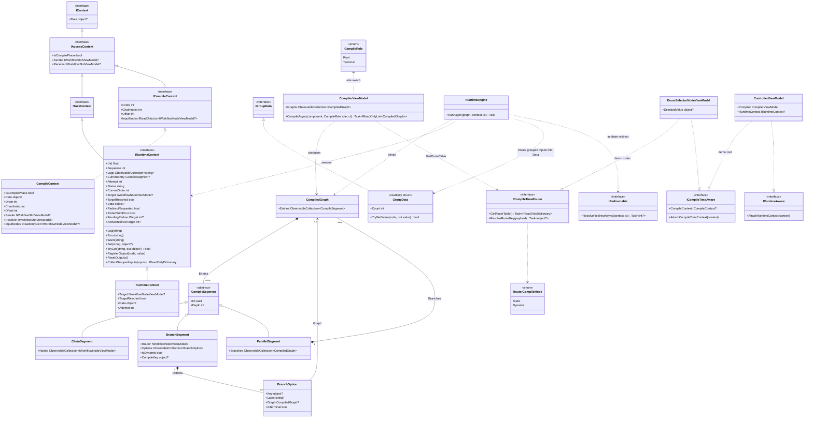
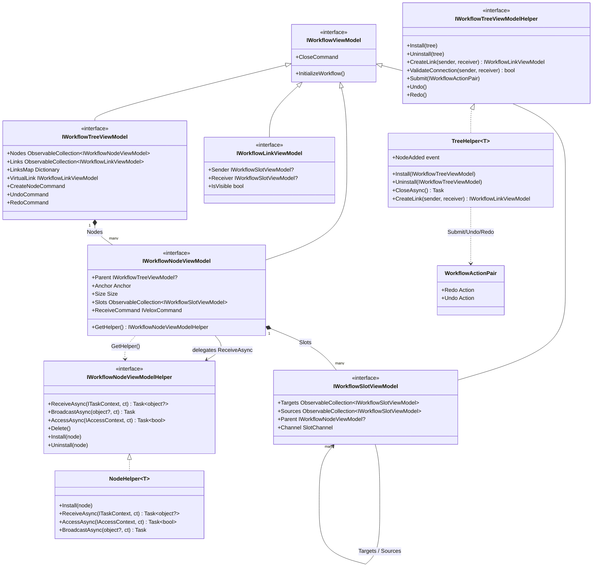

# Workflow System — Design Patterns — Class Diagram

Two Mermaid class diagrams capture the current architecture. Diagram A is the core/execution model — the CompilerEx compile→run machinery and the context hierarchy that flows through every node. Diagram B is the component model — the VM interfaces, their helpers, and the topology they expose. For the adapter/attached-behaviors side (per-platform surfaces that host this VM tree: drag, connect, view-pool virtualization, minimap) see [Platform Adapters — class diagram](../../08_platform-adapters/index.md).

## A. Core / Execution Model (CompilerEx)

Every type below exists in `Src/Core/VeloxDev.Core/WorkflowSystem/CompilerEx/**` (Compile + Runtime folders). The model is two-phase: `CompilerViewModel.CompileAsync` fixes each node's identity (Order) and statically validates edges via `AccessAsync`; `RuntimeEngine.RunAsync` then drives the immutable segments against a runtime session.

Sources: `CompilerEx/Compile/CompilerViewModel.cs` (lines 26-57 entry, 59-232 forward decomposition), `CompilerEx/Compile/CompilerViewModel.Reverse.cs` (ancestor-cone compilation), `CompilerEx/Runtime/RuntimeEngine.cs` (lines 19-68 `RunAsync`, 205-214 fan-out restore), `CompilerEx/Compile/Model/*.cs` + `Runtime/Model/*.cs`, `Interfaces/WorkflowSystem/IContext.cs`, `IAccessContext.cs`, `ITaskContext.cs`.

## B. Component Model (VM interfaces + helpers)

The editor tree is built from four VM interfaces; each is paired with a *Helper* that owns behavior (Template Method / Command patterns). Nodes expose the topology the compiler consumes: `Slots` → `Targets`/`Sources` edges.

Sources: `Interfaces/WorkflowSystem/IWorkflow*.cs`, `Templates/Helpers/TreeHelper.cs` (lines 109-265), `Templates/Helpers/NodeHelper.cs` (lines 28-112), `Templates/WorkflowBuilder.cs`.
