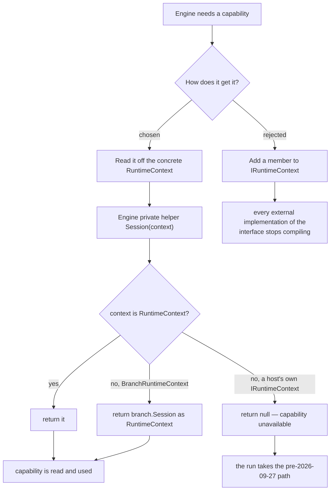

# Workflow System — Design Patterns — Strategy Family (Host Capabilities)

The 2026-09-27 layer is **Strategy** applied seven times, plus **Null Object** as the default for every one of them. There is no new mechanism: the compile-time router (`ICompileTimeRouter`) and the runtime redirect (`IRedirectable`) were already Strategy, and this layer extends the same idea to the parts of a run a host might want to control.

## The family

| Role in the run | Strategy interface | Shipped strategies | Configured on |
|---|---|---|---|
| Hold a run at a node boundary | `IExecutionGate` | `ManualExecutionGate`, `DelegateExecutionGate` | `RuntimeContext.ExecutionGate` |
| Watch the timeline | `IExecutionObserver` | `DelegateExecutionObserver` | `.Observer` |
| Decide whether a throw gets another go | `INodeRetryPolicy` | `ExponentialBackoffRetry` | `.RetryPolicy` |
| Record failures as data | `IExecutionErrorSink` | `DelegateExecutionErrorSink` | `.ErrorSink` |
| Undo a bad run's successes | `IExecutionCompensation` | `DelegateExecutionCompensation` | `.Compensation` |
| Persist the run's place | `IExecutionCheckpointStore` | `InMemoryCheckpointStore` (Core), `FileCheckpointStore` (extension) | `.CheckpointStore` |
| Divert the log | `ILogWriter` | `TextWriterLogWriter`, `DelegateLogWriter` | `.LogWriter` |

Every one is **one method** (two for the store, which must be able to read back what it wrote), and every implementation is swappable at run time by setting a property on the session before `RunAsync`.

## Why they hang off the concrete class, not the contract

This is the design decision worth reading as a decision rather than an omission.



Three reasons, in the order the source gives them:

1. **Adding a member to a published interface is a breaking change.** `IRuntimeContext` is a contract a host may implement. Nine new members would break every such implementation, for a feature that is optional by definition.
2. **They are host *policy*, not session state.** `MaxParallelBranches` and `MaxRetainedLogs` say what the host would rather do, not where the run currently is. `IRuntimeContext` describes the latter.
3. **The cost is explicit and bounded.** A host that brings its own `IRuntimeContext` gets the uncapped, unobserved, pre-2026-09-27 behavior — `Session()` returns `null` and every read short-circuits. That is a documented trade-off, not a surprise.

`Session()` also **unwraps a fan-out branch**, which is what makes the seams work where they matter most:

```csharp
private static RuntimeContext? Session(IRuntimeContext context)
    => context switch
    {
        RuntimeContext session => session,
        BranchRuntimeContext branch => branch.Session as RuntimeContext,
        _ => null,
    };
```

Without that unwrap, a gate or an observer configured on the session would silently die inside a `ParallelSegment` — exactly the place a wide graph spends its time (`ExecutionGateTests.AClosedGate_AlsoHoldsTheBranchesOfAFanOut` pins it).

## Null Object as the default

**Every seam's default is `null`, and `null` means "behave as if the feature did not exist" — not "do something sensible".** The engine checks `session?.X is not { } x` and returns early; there is no default observer, no default retry, no default writer.

That matters because it makes the compatibility claim testable rather than aspirational: with every seam unset the run produces the *same log lines* and the *same number of drives* as it did before the layer existed. The claim is written into the source (`Session`-based reads, no default instances) and asserted by the whole pre-existing test suite continuing to pass unchanged.

Two consequences fall out of Null Object here, and both are deliberate:

- **A `null` capability is not an error.** No diagnostic, no `[Warning]`, no metadata in the result. The session simply has no opinion.
- **A broken capability is not fatal either.** A throwing observer, sink, store, compensator or writer is logged and dropped (`[Observer]`, `[ErrorSink]`, `[Checkpoint]`, `[Compensation]`, `LogWriteFailed`). The one exception is `AttachRuntimeContext`, which is injected *inside* the failure discipline so a throw ends the run instead of silently skipping the node — the difference being that a skipped node changes what the graph *did*, while a lost observation only changes what you *know*.

## Facade over the family

`RuntimeContext` is the facade: the host sets nine properties on one object and the engine reads them all from one place. The demo does exactly that in a single method (`WorkflowDemoSession.ConfigureRun`), which is the shape the facade is designed for — one place where the host's policy for "how a run should behave here" is stated.

*Sources: `Src/Core/VeloxDev.Core/WorkflowSystem/CompilerEx/Runtime/RuntimeEngine.cs` (`Session` lines 672-678, and each seam's read site), `Runtime/Model/RuntimeContext.cs`, `Runtime/Model/*.cs`. Demo: `Examples/Workflow/Common/Lib/ViewModels/Workflow/WorkflowDemoSession.cs`. Tests: `CompilerEx/Execution*Tests.cs`.*
