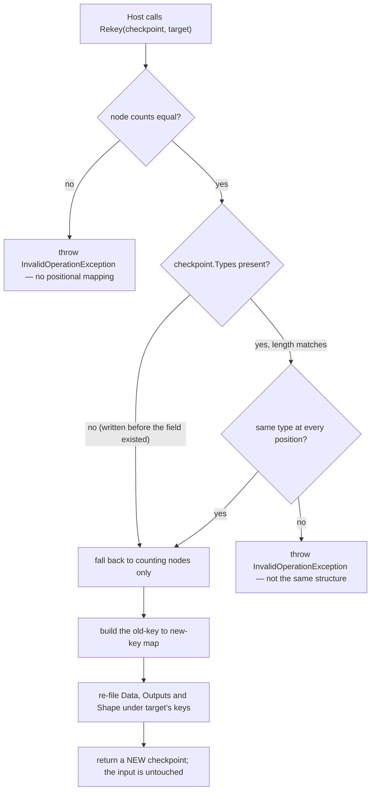

# Workflow System — Design Patterns — Memento (Checkpoints)

`ExecutionCheckpoint` is the **Memento** pattern: a snapshot of a run's internal state, opaque enough that the host can hold and persist it, and a restore path that the originator (`RuntimeContext`) owns.

The pattern's usual three roles map cleanly:

| Role | Here |
|---|---|
| **Originator** | `RuntimeContext` — it produces the memento and knows how to restore itself from one |
| **Memento** | `ExecutionCheckpoint` — a plain, serialisable document |
| **Caretaker** | `IExecutionCheckpointStore` — it keeps the memento and never inspects it; the host decides when to save and when to ask for it back |

## The snapshot boundary

The memento captures exactly what a resume needs, and the boundary is drawn where it is for two reasons:

```csharp
return new ExecutionCheckpoint
{
    Attempt = Attempt,
    ActiveRedirectTarget = ActiveRedirectTarget,
    Data = Normalize(Data, nodes),
    Outputs = outputs,
    Shape = nodes is null ? [] : [.. nodes.Select(entry => entry.Key)],
    Types = nodes is null ? [] : [.. nodes.Select(entry => entry.Node.GetType().Name)],
};
```

| Field | Why it is in the memento |
|---|---|
| `Attempt` | It is also the output registry's pass stamp. A restore must keep it **unchanged** — incrementing would demote the restored outputs to stale ones and a join would immediately stop seeing them. |
| `ActiveRedirectTarget` | Tells the output collector which "skipped" nodes are the contract-preserved prefix rather than stale branches. |
| `Data` | The chained payload at the moment of the snapshot — what the next node would have received. |
| `Outputs` | The registry itself, so a join point downstream can still aggregate restored upstreams. |
| `Shape` | The graph's node keys in drive order — the fingerprint that makes a resume safe. |
| `Types` | Node types behind `Shape`, so `Rekey` has something structural to check when the original graph object is gone. |

Everything else in the session is deliberately **not** in the memento: `Uid` and `Logs` are session identity (a resumed run is a new run, its log a new log), `IsRunning`/`Status`/`CurrentOrder`/`NodeIndex`/`BranchKey` are transient position the engine rewrites, and the capability objects are host policy that the new session configures for itself.

## Narrow interface, and the one thing it is not

`ExecutionCheckpoint` exposes **properties, not behaviour** — with exactly one static method. That is the Memento discipline: the caretaker can store it and hand it back, but it cannot make the originator do anything with it.

`Rekey` is the one deliberate exception, and it is a **guard**, not an operation:



It exists because a checkpoint is filed by `RuntimeId`, and a graph that came back from serialization has fresh ones — so resuming onto it is refused. The refusal is right (those really are different node objects); `Rekey` is the host's opt-in that says *I know, and here is the mapping*. It checks **structure, not identity** — node count and node types in drive order — which catches a different graph but cannot catch a same-shaped graph whose parts were renamed into other types that happen to line up. A migration between two *versions* of a graph is the host's to write.

## The refusal is the pattern working

The most important behavior here is a failure, and it is worth stating as a design choice rather than a limitation:

> **A checkpoint is refused rather than guessed at.** `RunAsync` compares `Shape` against the graph's own node keys **before touching the session**, and throws if they differ. On mismatch `Status` is still `"Idle"` and `IsRunning` is `false` — the session never claims to have run.

A Memento that can be applied to the wrong originator is worse than no Memento: it would drive the wrong nodes with someone else's payloads and produce a plausible, wrong result. So the pattern here buys safety by making the memento **self-describing** (`Shape` + `Types`) and putting the check on the restore path.

## Space and time

The memento is $O(V + R)$ — the shape, the types, and one entry per registered output. That is why it is written **after each node** rather than recomputed per pass, and why the shipped file store serialises behind a semaphore: a fan-out's branches interleave, so two saves can be in flight at once even though nothing runs on a second thread.

*Sources: `Src/Core/VeloxDev.Core/WorkflowSystem/CompilerEx/Runtime/Model/ExecutionCheckpoints.cs` (`ExecutionCheckpoint` lines 26-185, `InMemoryCheckpointStore` 195-224); `Runtime/Model/RuntimeContext.cs` (`Snapshot` 183-207, `Normalize` 224-234); `Runtime/RuntimeEngine.cs` (`RequireSameShape` 613-628, `Restore` 632-649). Extension: `Src/Core/VeloxDev.Core.Extension/CheckpointEx.cs`. Tests: `CompilerEx/ExecutionCheckpointTests.cs`, `VeloxDev.Core.Extension.Test/Serialization/ExecutionCheckpointSerializationTests.cs`.*
