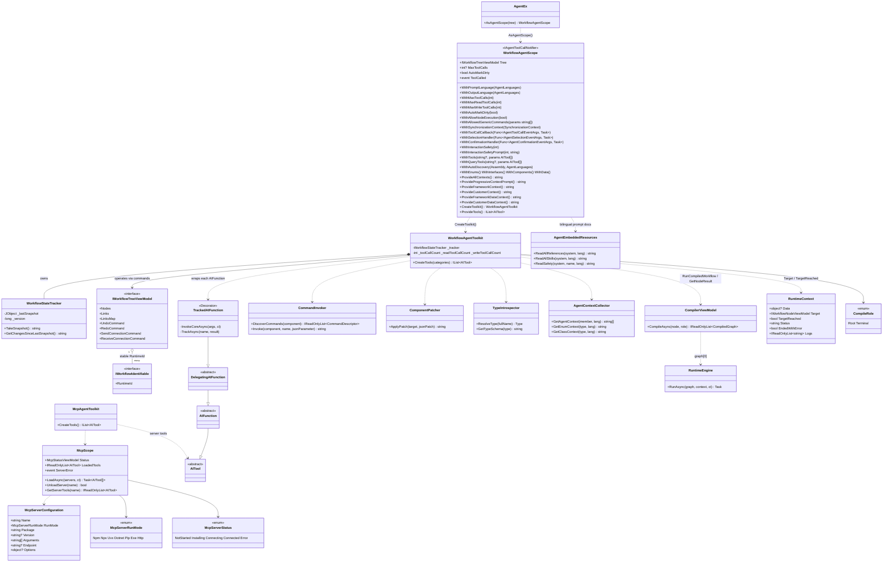

# Workflow Agent — Design Patterns — Class Diagram

The class diagram below shows the real participant set of the agent control layer. The left column is the workflow-control core (`WorkflowAgentScope` → `WorkflowAgentToolkit` → tracked tools + state tracker + introspection helpers), the right column is the MCP adapter surface, and the bottom row is the `CompilerEx` execution model that the run/result tools reuse.

Key structural facts:

- **One scope owns one toolkit.** `WorkflowAgentScope` is the fluent builder; `CreateToolkit()` returns a `WorkflowAgentToolkit` bound to the same tree (`WorkflowAgentToolkit.cs`, lines 24-31). The toolkit owns a single `WorkflowStateTracker` (`_tracker`, line 27).
- **Every `AIFunction` is decorated.** `CreateTools` wraps each built-in and developer-registered `AIFunction` in the nested `TrackedAIFunction : DelegatingAIFunction` (`WorkflowAgentToolkit.cs`, lines 178-242). Non-`AIFunction` tools (raw MCP client tools) are added as-is.
- **The undo/redo stack stays in Core.** Mutation tools do not fabricate undo entries — they dispatch `IWorkflow*ViewModel` component commands (`SetAnchorCommand`, `CreateNodeCommand`, `DeleteCommand`, `SendConnectionCommand`, …). `ComponentPatcher` rejects any property that has a backing command.
- **Run/result reuse the compiler.** `RunCompiledWorkflow` and `GetNodeResult` both funnel through `RunCompiledRoleAsync`, which calls `new CompilerViewModel().CompileAsync(node, role)` and then `new RuntimeEngine().RunAsync(graph, context, ct)` (`WorkflowAgentToolkit.cs`, lines 1804-1861). `CompileRole.Root` = whole chain from the start node; `CompileRole.Terminal` = a single node's ancestor cone with `RuntimeContext.Target`/`TargetReached` set.
- **Security is code-enforced.** `WithAllowNodeExecution` and `WithAllowedGenericCommands` are property-backed gates read by the tools; disabled means a structured `error` result, not a prompt hint.

> Source files: `Src/Core/VeloxDev.Core.Extension/Agent/Workflow/WorkflowAgentScope.cs`, `.../Workflow/WorkflowStateTracker.cs`, `.../Workflow/Functions/WorkflowAgentToolkit.cs`, `.../Workflow/Functions/CommandInvoker.cs`, `.../Workflow/Functions/ComponentPatcher.cs`, `.../Workflow/Functions/TypeIntrospector.cs`, `.../Agent/MCP/McpScope.cs`, `.../Agent/MCP/McpAgentToolkit.cs`; compile types under `VeloxDev.Core.WorkflowSystem.CompilerEx` in `Src/Core/VeloxDev.Core`.
