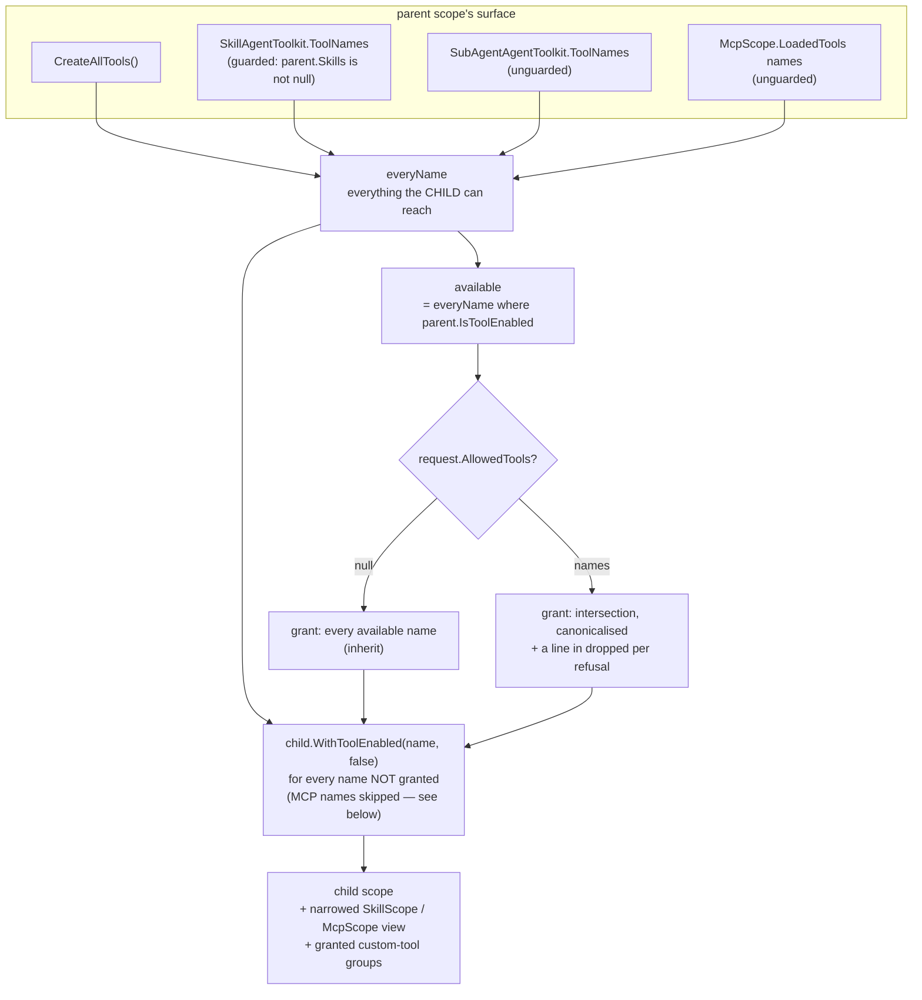

# Design Patterns — Workflow Agent — Sub-Agent Capability Narrowing

A spawn hands a child a slice of its dispatcher's capabilities, and the whole invariant is one sentence: **a child's abilities are its parent's own, or fewer — never more**. The interesting design question is not the rule but its *carrier*. Two of the three axes cannot be expressed as a list of tool names, and the third only became expressible once tool registration was regrouped. This page is about why each axis is carried the way it is.

> Source: `Src/Core/VeloxDev.Core.Extension/Agent/SubAgents/SubAgentScope.cs` (`TrySpawn`, lines 387-606); `Agent/Workflow/WorkflowAgentScope.cs` (lines 251-296); `Agent/Skills/SkillScope.cs` (lines 353-378); `Agent/MCP/McpScope.cs` (lines 429-500). Tests: `SubAgentNarrowingTests`, `SubAgentCapabilityGrantTests` under `Src/Core/VeloxDev.Core.Extension.Test/Agent/SubAgents/`.

## Why a name list is not enough

Skills and MCP servers are contributed by **their own context providers**, out of their own data layers — neither set is in `WorkflowAgentToolkit.CreateAllTools()`. So a tool-name list can only answer "is this tool present?", while `load_skill` being present is a different question from *which skills it can read*. Turning a skill off for a child by name would be meaningless, and turning the loader off would remove the whole axis rather than narrow it. The answer is a **view**: the parent wraps its own source — as it stands, or narrowed to the request — and hands the child that.

| Axis | Carrier | Implementation | What makes it a boundary |
|---|---|---|---|
| Tools | two name lists | `available` (grantable) and `everyName` (reachable), inside `TrySpawn` | `child.WithToolEnabled(name, false)` for every reachable name the grant left out |
| Skills | a narrowed source | `SkillScope.CreateNarrowed(allowed)` | the filter sits at the **top of `Apply`**, so a later `Refresh()` cannot grow the restriction back |
| MCP servers | a granted view | `McpScope.CreateGrantedView(parent, granted, grantedTools)` | `IsGrantedView = true`; `_loadedClients` / `_loadedConfigs` are deliberately left empty |
| Custom tools | registration **groups** | `WorkflowAgentScope.GrantCustomToolsTo(child, granted)` | groups whose tools were all left out contribute nothing, guidance included |

The boundary is **executable, not declared**: the child's own `ListSkills` enumerates only what it was granted, and `load_skill` on a name outside the grant fails *inside the child* — `SubAgentCapabilityGrantTests.AGrantedSkill_ReachesTheChild_AndADeniedOneDoesNot` asserts the tool's own output rather than the view's own bookkeeping. A view that reported itself as narrowed while still offering everything would pass a weaker assertion and fail this one.

> One claim inside that table is *inferred* from source rather than test-pinned: that `CreateNarrowed` filters at the **top of `Apply`** and therefore survives a later `Refresh()`. No test refreshes a narrowed skill source — what is pinned is that the view holds exactly the granted set at spawn time (`AGrantedSkill_IsAView_NotAFilterOnTheParent`, `ASkillTheParentSwitchedOff_IsNotGrantable`).

## The view must be one-way

Two children with different grants are served by the same parent scope, so a filter applied to the shared source would leave the second child with the first's list. `AGrantedSkill_IsAView_NotAFilterOnTheParent` asserts all three sets at once.

For MCP the reason is harder. Handing the child the parent's scope would hand it `LoadMcpServers` and `UnloadMcpServer` too — power over the very processes the parent's own turn is suspended behind — and `WithMcps` unconditionally overrides whatever confirmation handler the host set on a shared `McpScope`, so N children attaching the same scope would each overwrite it. The view therefore **owns no client**: disposing it cannot disconnect the parent. `AGrantedView_OwesNothingToItsParentThatClosingItCouldTakeAway` disposes the view and asserts the parent still holds both servers.

A granted server is *usable and nothing more*: its surface is the server's own tools plus `ListMcpServers` and `DescribeMcpServer`, with `LoadMcpServers` / `UnloadMcpServer` / `AddMcpServer` structurally absent.

## Two lists, and why they must be two

The two sets are not redundant, and which one a name belongs to decides which side of the rule it enforces:

- `available` is what the model is **told** it gets: the parent's currently enabled tools. A name here must really be callable on the child, or the model plans around an ability it does not have.
- `everyName` is what the child could otherwise **reach**, *regardless of the parent's own switches*. The switch-off loop runs over this set, which is what stops a tool the parent itself turned off from reaching the child through the inherit path — a child holding a capability its parent does not have would be a **widening**, which is exactly what this subsystem exists to prevent. `SubAgentNarrowingTests.AToolTheParentHasSwitchedOff_IsNotInherited` is the sharp form of the rule, because nobody named that tool.

Because `everyName` is "what the child can reach" rather than "what the parent currently contributes", each of its four sources carries its own guard — and the guards differ for a reason. The skill names are guarded on `parent.Skills is not null`, because the parent's own skill source contributes them. The five sub-agent names are **unguarded**, because `child.WithSubAgents(grand)` is unconditional: every child reaches them whether or not its parent had a subsystem attached. Copying the skill line's guard here is the mistake that reintroduces the defect.

That defect is worth recording, because its symptom was the exact inverse of the rule. With the five names missing from `everyName`, a spawn that omitted `allowedTools` left them switched on, while a spawn that **named** its tools switched all five off — so the model could delegate only when it had not stopped to think about what it was granting, and asking was answered with "not available to this agent", which was also false. `SubAgentNarrowingTests.TheSubAgentTools_CanBeNamed_InAWhitelist` now pins both halves. MCP names were missing for the same structural reason and failed the other way: naming one returned exactly that refusal, for a tool the parent plainly held. `SubAgentCapabilityGrantTests.NamingAnMcpTool_IsNotARefusal` pins the fix at its point.

The general rule this leaves behind: **one source missing from `everyName` can only ever produce a source that is kept when the argument is omitted and declared non-existent when it is named.** Adding a fourth capability axis means checking all four sources, not three.

## One removal point per switch

MCP names are the one source the switch-off loop **skips**, and the reason is that a name is not where an MCP tool is switched. Its switch is keyed `server/tool` on the `McpScope`, so passing its bare name to `WorkflowAgentScope.WithToolEnabled` would look like a removal and remove nothing. That axis is therefore narrowed where its key lives — the third parameter of `CreateGrantedView` — and `AWhitelistThatOmitsAnMcpTool_TakesItOffTheChildsSurface` asserts the tool really left the child's surface rather than only the grant list.

## The report is half the design

`dropped` is not diagnostics; it is the other half of the promise. A model that asked for a tool, believed it had it, and planned around it will not notice the absence until the run is already wasted — so every refusal is reported with **which wall it hit**: not available to this agent / the parent is not on that server / the parent's read or write cap is lower / the parent does not allow node execution / the parent is not allowlisted for that command / no skills were granted so the skill tools went with them. `ARequestTheParentCannotHonour_IsDroppedAndReported` requires a switched-off tool and a non-existent tool to be reported **distinguishably**, because the model cannot otherwise tell them apart.

Two consequences follow from "the grant list and the child's real surface must be the same set":

- the child is given a **narrowed view** rather than a list for skills and MCP, precisely so that the two cannot drift;
- a child granted **zero** skills loses the skill tools (`ListSkills`, `load_skill`, `UnloadSkill`, `read_skill_resource`) — they arrive through the inherit branch, since they are part of the parent's surface, and a `load_skill` with nothing behind it is a tool that can only fail. `AnEmptySkillList_GrantsNone_AndTakesTheSkillToolsWithThem` asserts the tools are gone **and** that a `dropped` line explains why.

The subtlest instance of the same principle is interaction: `RequestSelection` and `RequestConfirmation` are offered only when the safety level is above zero **and** a handler is registered on that very scope, and a child scope is a fresh object. Naming them in a grant list without copying the host's interaction configuration would put two names in the list that the child does not have and can never call — a permission the model can see and never use, which is worse than no permission, because it plans around it. `WorkflowAgentScope.GrantInteractionTo` therefore travels the level, its per-level prompt overrides and both handlers down with the tools (`SubAgentBudgetTests.AChild_InheritsTheHostsInteractionConfiguration`). **Adding a sentence about a child's abilities to the standing prompt means checking what `GrantInteractionTo` transfers first** — the prose half of this trap outlived the code half by a release.

## Knowledge is not power

All three axes share one default now: **omitting the argument inherits the parent's currently switched-on set**; an empty list grants none, which is a different request from omitting it. That symmetry is deliberate — the earlier design had three different defaults (the read-only half of the tools, all skills, no MCP servers), each with its own local argument, and the divergence is what made "what does an omitted argument mean?" unanswerable without reading the source. `Overriding a named list is the only subtraction` is now the single sentence that describes all three.

> Cross-references: [Builder](../02_builder/index.md) for the fluent `With*` surface this narrows against; [Facade](../03_facade/index.md) for the toolkit the grant list is written against; [Sub-Agent Tree & Consumption Metering](../11_sub-agent-tree-and-consumption/index.md) for what the roster does with the result.
