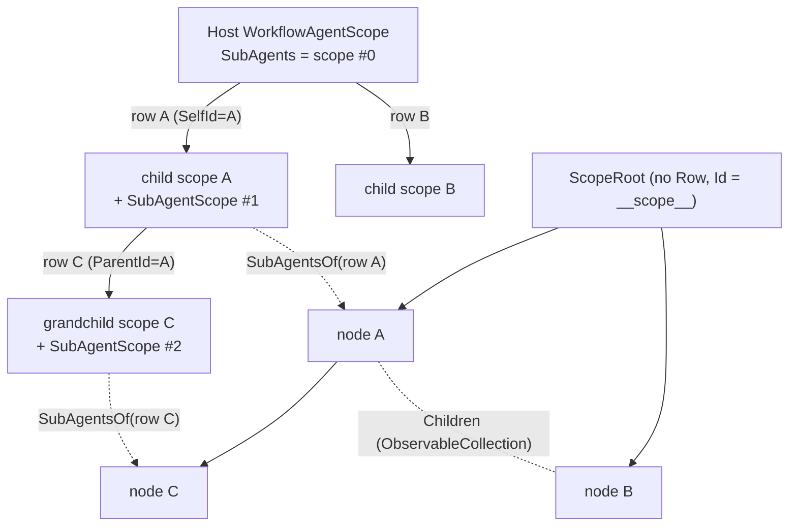
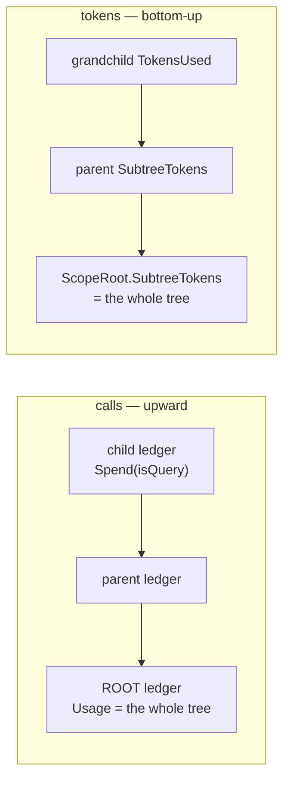

# Design Patterns — Workflow Agent — Sub-Agent Tree & Consumption Metering

Two things have to be derived rather than stored once a tree of agents exists: **who is whose parent**, and **what the tree spent**. The first is a projection of data that is deliberately kept flat; the second runs in two directions at once — calls aggregate *upward* along the ledger chain, tokens aggregate *bottom-up* through the tree view-model. This page is about why each is shaped the way it is, and about the one concurrency assumption the tree panel makes and the one place it does not hold.

> Source: `Agent/SubAgents/SubAgentScope.cs`, `.../SubAgentTreeViewModel.cs`, `Agent/Workflow/Functions/ToolCallLedger.cs`. Tests: `SubAgentHierarchyTests`, `SubAgentMetricsTests`, `SubAgentTreeViewModelTests` under `Src/Core/VeloxDev.Core.Extension.Test/Agent/SubAgents/`.

## A tree of scopes, projected from flat rosters

Every spawned child gets **its own** `WorkflowAgentScope` (built as `parent.Tree.AsAgentScope()`), **its own** `SubAgentScope`, and its own transcript. The subsystem is attached to the child unconditionally — including at the depth limit — so the only thing that stops a grandchild is the `CanSpawn` gate, never a missing attachment. That is what lets the child's briefing say *why* it cannot dispatch instead of leaving a hole it cannot see.

The rosters are **flat and per scope**, and that is a deliberate isolation mechanism rather than an implementation shortcut: a scope holds only what it issued, so a sibling's handle does not resolve from here — it simply does not exist. `SubAgentDispatchTests.AChildSeesItsOwnChildren_AndNobodyElses` asserts a peek at a sibling's child comes back refused.

A flat roster cannot name its parent by lookup, so the link is written down at spawn time: the spawn records its own row's id as the child scope's `SelfId`, and every child of that scope reports it as `ParentId`. The tree is therefore buildable **from rows alone**, and `SubAgentTreeViewModel` is a projection of several rosters rather than a second source of truth — it is never mutated in place by anything but the rebuild.

Two identity rules fall out of this and are easy to get wrong:

- **Depth is absolute**, measured from the host's scope and never reset per level: a child of the root is depth 1, a grandchild depth 2.
- **Session-state keys are per subsystem instance** (a `Guid`), never the workflow scope's `StateDiscriminator`. The discriminator is derived from the tree, and a parent and its child sit on the same tree — so it would collide on exactly the pair that must not. `SubAgentHierarchyTests.TwoScopes_NeverShareAStateKey` and `TwoProvidersOverOneScope_DoShareAKey` pin both directions: two subsystems must not share, and two providers over **one** subsystem must.

## Metering runs in two directions

**Calls aggregate upward, and that is what makes the tree safe.** `ToolCallLedger.Spend` increments this level and then calls `Outer?.Spend(isQuery)`, so any level's `Usage` is *its subtree's* total, and `Root` is the topmost ledger. A child's scope is given the parent's ledger as its outer ledger, which is what turns "arbitrary depth" into "bounded by the root's allowance": the root's cap is the only counter that has to run out. Two independent pots would leave a parent able to hand each child its own full remainder and the tree's spend unbounded. The zero-regression case is load-bearing too — a root scope's ledger has no `Outer`, and then every member reduces exactly to the three counters it replaced, so a host that never attached a subsystem cannot observe the change (`SubAgentBudgetTests.WithoutAnySubAgents_TheAccountingIsTheScopesOwn`).

The reset is deliberately **asymmetric**. `ResetChain` zeroes this level and every level *above* it, so a child's successful reset reopens the whole session, while a parent's reset cannot reach down into a child's own grant. That is not an oversight: a grant is a fact about the spawn, and the answer to "carry on" is a new child, not a sub-limit silently widened behind the model's back. `SubAgentBudgetTests.TheParentsReset_ReopensTheTree_WithoutRewritingAGrantAlreadyMade` and `ASpentChild_ReportsUpward_RatherThanWaitingToBeUnstuck` pin the two halves together.

**Tokens aggregate bottom-up, and only the tree can do it.** The seam is a single line in `SubAgentScope.RunAsync`, where `AgentResponse.Usage` is the only place a token count exists at all — the five management tools, the transcript and the pipeline events have no token concept whatsoever (`CallUsage` is *call counts*; the two must not be conflated). Each row stores **its own** spend; the sum over the tree is computed by `RecomputeAggregates`, called after a node's children have been filled, so the recursion is bottom-up by construction.

The two figures are kept apart on purpose: `SubAgentTreeNodeViewModel.TokensUsed` is the node's own spend and `SubtreeTokens` is the total, with `ShowSubtreeTokens` true only when a node has both a measured spend of its own and descendants that spent more. A parent that reported only its own number would hide the work beneath it; a parent that reported the sum would make the column impossible to total.

Three smaller decisions belong to the same "do not fabricate a number" principle:

- A provider that reports no usage leaves the row `null`, not `0`; `HasTokens` is what keeps "not measured" and "spent nothing" apart in the UI.
- A cancelled or faulting child leaves the token fields `null` — the response those paths would have read no longer exists, so a number there would be invented.
- The scope's own spend is **not, and cannot be, measured by the library**: the host's conversation is what produces it. `SubAgentTreeNodeViewModel.ScopeTokens` is a field the host fills, and the scope root falls back to displaying the subtree total when it is unset — an honest number rather than a guess about the host. Because a host typically sets it after the tree is built, its change hook **recomputes** the aggregates rather than merely notifying.

Duration is computed rather than stored (`FinishedAt ?? Now - StartedAt`), and the library **owns no timer**: a ticking panel and a hosting process have different lifetimes, and a timer started in the library would belong to neither. `TickElapsed()` is what a host calls from whatever clock it already has.

## The rebuild gate: one assumption, one place it does not hold

`SubAgentTreeViewModel` assumes that rebuilds happen on **one** thread — the thread it was created on — and the coalescing queue only *delivers* there. With a `SynchronizationContext` that holds: each scope's `Changed` handler posts a drain.

It does **not** hold when there is no context to post to — a headless host, and every test in the suite. The rebuild then runs **inline, on whichever scope raised the change**, and two children finishing in the same instant are two threads inside `Fill` mutating one `ObservableCollection`. That is not a rare interleaving; it is what a fan-out does by construction — and the corruption it causes surfaces as an exception inside an unrelated child's run rather than here. Hence the internal `_rebuildGate`, taken by the coalescing flag check, by `Rebuild` and by `Dispose` (the only third place that mutates the roots, the flat list and the watch set at once).

The mirror image of the same problem sits in the library rather than the panel. A child runs on a thread-pool thread while its parent's turn is suspended on the UI thread, and the **only** serialization between the two scopes' graph edits is that both pass through the same context. The design's answer is to hand the host's `SynchronizationContext` down to the child (`child.WithSynchronizationContext(parent.UIContext)`, set *before* `WithSubAgents`, which forwards it further down) rather than to withdraw the mutation permission: the child is still serialized onto the same pump, and that fact is expressed as inheritance instead of as a refusal. The documented cost is a host that has no context at all: its children may now edit the graph with nothing serializing them. `SubAgentNarrowingTests.WithNoUIContext_TheSurfaceIsStillTheParentsOwn` and `TheUIContext_ChangesNothingAboutWhatIsGranted` pin the invariant that survived — **with or without a context, what is granted comes out identical**; the context decides *where* a call runs, never *whether* the child may make it.

Two more consequences of "the panel is a view":

- `Dispose` detaches and **cancels nothing** — closing a panel is not a decision about the work the panel was showing. Cancelling is `SubAgentScope.Cancel`'s or the scope's own disposal's to make.
- The counts go with the nodes, because `Rebuild` returns early once disposed and a total left standing could never be refreshed into agreement.

## The execution model the whole design rests on

Everything above assumes the host's UI thread stays free while a child runs. A spawn happens inside a tool body that the composing host marshalled onto that thread, so a synchronous child would hold it for the child's whole conversation — which is why `SpawnSubAgent` returns a handle and the run is handed to the thread pool, and why the tool's shape (asynchronous even where the work is immediate) is a contract the model reads in the schema rather than an implementation detail. `SubAgentDispatchTests.ASpawnReturns_BeforeTheChildHasAnswered` and `SeveralChildren_AreInFlightAtOnce` assert the property; the *freedom* of the UI thread itself is still only theoretically argued, since no double in the suite can prove it.

> Cross-references: [Sub-Agent Capability Narrowing](../10_sub-agent-narrowing/index.md) for what the child was handed; [Data Flow — Sub-Agent Dispatch](../../../03_data-flow/01_workflow-agent/06_sub-agent-dispatch/index.md) for the sequence that produces one of these rows.
