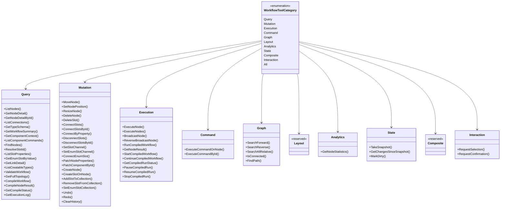

# Workflow Agent — Design Patterns — Tool-Category Hierarchy

`WorkflowToolCategory` is a `[Flags]` enum; each flag selects one group of tools built by `WorkflowAgentToolkit.CreateAllTools`. Two groups are **reserved and empty**. The class diagram below shows the enum and the ten groups it selects.

> Source: `Src/Core/VeloxDev.Core.Extension/Agent/Workflow/Functions/WorkflowToolCategory.cs` (the enum) and `WorkflowAgentToolkit.CreateAllTools` (the groups).

## Counts

| Flag | Value | Tools |
|---|---|---|
| `Query` | `1 << 0` | 20 |
| `Mutation` | `1 << 1` | 23 |
| `Execution` | `1 << 2` | 12 |
| `Command` | `1 << 3` | 2 |
| `Graph` | `1 << 4` | 5 |
| `Layout` | `1 << 5` | **0 (reserved)** |
| `Analytics` | `1 << 6` | 1 |
| `State` | `1 << 7` | 3 |
| `Composite` | `1 << 8` | **0 (reserved)** |
| `Interaction` | `1 << 9` | up to 2 |

**68 built-in tools** (20 + 23 + 12 + 2 + 5 + 0 + 1 + 3 + 0 + 2) when both interaction handlers are configured. `ResetToolCallLimit` is added unconditionally; developer-registered tools and subsystem tools join whatever flags were asked for.

## Why two groups are empty

- **`Layout` is reserved.** Multi-node alignment is performed node-by-node through `MoveNode` / `SetNodePosition` (each one `SetAnchorCommand`), so a bundled layout tool would sit beside the command pipeline rather than inside it.
- **`Composite` is reserved.** Every operation is a single component-command step, so the framework's undo/redo stack is never bypassed or double-submitted by a bundled multi-step gesture.

The flags still exist so a host can pass them without error and so the enum documents the decision.

## Why `Interaction` is conditional

`Interaction` is populated only when `WithInteractionSafety(level)` is > 0 **and** the matching handler (`WithSelectionHandler` / `WithConfirmationHandler`) is registered — so the same `All` value yields a different tool count depending on the host's configuration. `CreateTools(categories)` is the single point that decides what reaches the model: it applies the per-tool switches on top of the category flags, and `CreateAllTools` (internal) returns the unfiltered surface a host UI enumerates.

**Expected result:** `scope.ProvideTools(WorkflowToolCategory.Query)` returns exactly the 20 Query tools (plus any custom/subsystem tools and `ResetToolCallLimit`); adding `Layout` or `Composite` to the mask changes nothing.
