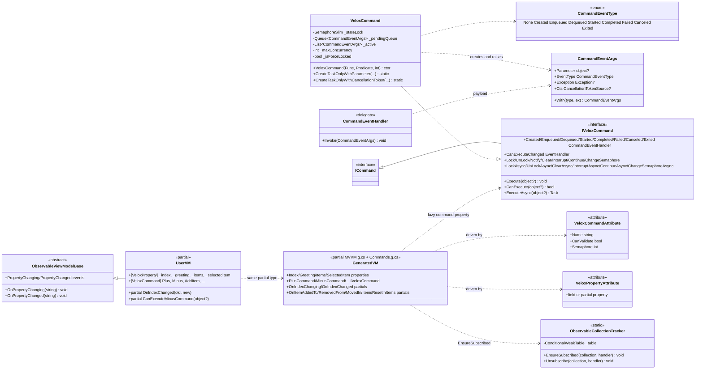
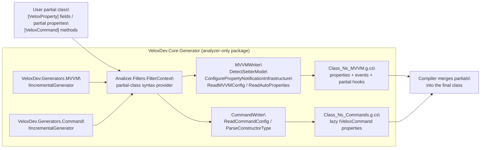

# Design Patterns — MVVM

The `mvvm` feature is a **generator + command runtime** pair. The runtime lives under `Src/Core/VeloxDev.Core/MVVM/**` in namespace `VeloxDev.MVVM` and supplies `IVeloxCommand`, `VeloxCommand`, `CommandEventArgs`/`CommandEventType`/`CommandEventHandler`, and `ObservableCollectionTracker`. The Roslyn source generator under `Src/Generators/VeloxDev.Core.Generator/**` (classes `VeloxDev.Generators.MVVM` and `VeloxDev.Generators.Command`, shipped as the analyzer-only NuGet package `VeloxDev.Core.Generator`) turns `[VeloxProperty]`-annotated fields / partial properties and `[VeloxCommand]`-annotated methods into observable properties and lazily created command properties.

## Model class diagram



## Source-generation pipeline

Both generators are `IIncrementalGenerator`s (`MVVM.cs` lines 12-13, `Command.cs` lines 12-13) that register one source output per annotated `partial` class. The shared pipeline is:



Each writer implements `ICodeWriter` and emits one `.g.cs` file per class only when it `CanWrite()`: `MVVMWriter` for classes carrying `[VeloxProperty]` (plus workflow default view-models), `CommandWriter` for classes carrying `[VeloxCommand]`. The output filename is derived from the class and namespace, e.g. `MainWindowViewModel_Demo_MVVM.g.cs` and `MainWindowViewModel_Demo_Commands.g.cs` for the WPF demo.

## Pattern map

| # | Pattern | Participants | Where |
|---|---|---|---|
| 1 | Source generation (codegen) | `VeloxDev.Generators.MVVM`, `VeloxDev.Generators.Command`, `Analizer.Filters`, `MVVMWriter`, `CommandWriter`, `MVVMPropertyFactory` | `Src/Generators/VeloxDev.Core.Generator/{MVVM.cs, Command.cs, Base/Analizer.cs, Writers/MVVMWriter.cs, Writers/CommandWriter.cs}` |
| 2 | Command | `IVeloxCommand : ICommand`, `VeloxCommand` (semaphore + queue + lifecycle events) | `Src/Core/VeloxDev.Core/Interfaces/MVVM/IVeloxCommand.cs`, `Src/Core/VeloxDev.Core/MVVM/VeloxCommand.cs` |
| 3 | Observer (INPC + lifecycle events) | generated properties, `OnPropertyChanging/OnPropertyChanged`, `ObservableViewModelBase`, 8 command lifecycle events | `MVVMWriter.cs`, `VeloxCommand.cs`, `Examples/MVVM/WPF/Demo/ObservableViewModelBase.cs` |
| 4 | Template Method (partial hooks) | generated `OnXxxChanging/OnXxxChanged`, collection partials, `CanExecuteXxxCommand` | `Base/Analizer.cs` (`MVVMPropertyFactory.GenerateViewModel`, `GenerateCollectionMembers`), `CommandWriter.cs` |
| 5 | Adapter (host-framework coexistence) | `MVVMWriter.DetectSetterMode` and `ConfigurePropertyNotificationInfrastructure` | `MVVMWriter.cs` lines 42-89, 198-258 |
| 6 | Weak-reference registry | `ObservableCollectionTracker` with `ConditionalWeakTable` | `Src/Core/VeloxDev.Core/MVVM/ObservableCollectionTracker.cs` |

## Patterns identified

### 1. Source Generation (Roslyn incremental generators)

`Analizer.Filters.FilterContext` (Base/Analizer.cs lines 15-23) registers a syntax provider whose predicate selects every `partial class` declaration; both generators consume the same provider. For each class, `MVVMWriter` (Writers/MVVMWriter.cs) analyzes `[VeloxProperty]` **fields** (`ReadMVVMConfig`, lines 91-115) and **partial properties** (`ReadAutoProperties`, lines 117-141) and produces one observable property each through `MVVMPropertyFactory`. `CommandWriter` (Writers/CommandWriter.cs) reads `[VeloxCommand]` methods (`ReadCommandConfig`, lines 19-77), resolves `name`/`canValidate`/`semaphore` from positional then named arguments, strips an `Async` suffix on the auto name, and selects the constructor/factory by signature (`ParseConstructorType`, lines 78-116).

The default setter shape (no host framework, plain field property) is produced by `MVVMPropertyFactory.GetSetterBodyLines` (Base/Analizer.cs lines 287-307), with `OnPropertyChanging`/`OnPropertyChanged` injected from `MVVMWriter`'s `SetteringBody`/`SetteredBody` (lines 108-109, 134-135):

```csharp
if(global::System.Object.Equals(_index, value)) return;
var old = _index;
OnPropertyChanging(nameof(Index));
OnIndexChanging(old, value);
_index = value;
OnIndexChanged(old, value);
OnPropertyChanged(nameof(Index));
```

The generator also decides whether the type itself must expose the notification surface. `ConfigurePropertyNotificationInfrastructure` (MVVMWriter.cs lines 198-258) walks the class and its bases: if no `PropertyChanging`/`PropertyChanged` event and no `OnPropertyChanging`/`OnPropertyChanged(string)` method exists anywhere in the hierarchy, it generates the events, the two methods, and adds `INotifyPropertyChanging`/`INotifyPropertyChanged` to the type (lines 856-864). If a base already provides them, the generated setters simply call the inherited methods — this is why the demos reuse a local `ObservableViewModelBase` unchanged.

### 2. Command Pattern (IVeloxCommand)

`IVeloxCommand : ICommand` (`Src/Core/VeloxDev.Core/Interfaces/MVVM/IVeloxCommand.cs`) extends `ICommand` with async execution, lifecycle events, and concurrency control — `ExecuteAsync`, `CanExecute`, `Notify`, plus synchronous and `Async` pairs for `Lock`, `UnLock`, `Clear`, `Interrupt`, `Continue`, and `ChangeSemaphore`. `VeloxCommand` (`Src/Core/VeloxDev.Core/MVVM/VeloxCommand.cs`) is the concrete engine: a `SemaphoreSlim _stateLock` guards the queue state, `_active` is the running set, `_pendingQueue` holds waiting invocations, and `_maxConcurrency` (from the `semaphore` attribute value, default 1) caps parallel runs. `CanExecute` combines the user predicate with the force lock: `(_canExecute?.Invoke(parameter) ?? true) && !_isForceLocked` (line 126). `ExecuteAsync` (lines 139-174) either starts immediately, enqueues and raises `Enqueued`, or — when force-locked — cancels the incoming item and raises `Canceled`. Each generated `XxxCommand` property builds the `VeloxCommand` lazily and binds `command:` to the annotated method and `canExecute:` to the partial `CanExecuteXxxCommand` when `canValidate` is set (CommandWriter.cs lines 152-186).

### 3. Observer Pattern (INPC + command lifecycle events)

`VeloxCommand` exposes eight lifecycle events — `Created`/`Enqueued`/`Dequeued`/`Started`/`Completed`/`Failed`/`Canceled`/`Exited` — plus `CanExecuteChanged` (VeloxCommand.cs lines 92-101). `ExecuteCoreAsync` raises `Started` before invoking the user method, then `Completed`/`Canceled`/`Failed` per outcome, and `Exited` is raised from `OnExecutionCompletedAsync` (lines 176-222). Handlers receive a `CommandEventArgs` whose `EventType` carries the stage. The generated observable properties follow the classic `INotifyPropertyChanging`/`INotifyPropertyChanged` observer contract: the setter calls `OnPropertyChanging`/`OnPropertyChanged`, which the demo base implements as event invocations (`Examples/MVVM/WPF/Demo/ObservableViewModelBase.cs`, lines 11-19). Collection properties additionally subscribe to `CollectionChanged` through `ObservableCollectionTracker` so that field initializers (`= []`) never leak unsubscribed events.

### 4. Template Method Pattern (partial hooks)

The generator emits `partial void` declarations and calls them at fixed points of the generated skeleton. For each property it emits `OnXxxChanging(oldValue, newValue)` before the assignment and `OnXxxChanged(oldValue, newValue)` after (`MVVMPropertyFactory.GenerateViewModel`, Base/Analizer.cs lines 397-442); the user implements the partial bodies in the hand-written part of the class. For `INotifyCollectionChanged` properties, `GenerateCollectionMembers` (lines 575-700) also emits `OnItemAddedToXxx`/`OnItemRemovedFromXxx`/`OnItemMovedInXxx`/`OnItemsResetInXxx`, dispatched from the generated `OnXxxCollectionChanged` switch on `NotifyCollectionChangedAction`. Command executability uses the same trick: `canValidate: true` generates `partial bool CanExecuteXxxCommand(object? parameter)` that the user must implement (CommandWriter.cs line 167). The demo fills these hooks in `MainWindowViewModel.cs` (OnIndexChanged at lines 34-38; the collection partials at lines 181-212).

### 5. Adapter Pattern (host-framework coexistence)

Rather than forcing a base class, the generator adapts to whatever notification infrastructure the annotated type already inherits. `MVVMWriter.DetectSetterMode` (lines 42-89) recognizes CommunityToolkit.Mvvm (`[ObservableObject]`), Prism (`SetProperty(ref T, T, string)` on `BindableBase`), ReactiveUI (`IReactiveObject`), and Caliburn.Micro (`NotifyOfPropertyChange(string)`), and switches the generated setter to call the host framework's `SetProperty` / `RaiseAndSetIfChanged` / `NotifyOfPropertyChange` instead of raising its own events (`GetSetterBodyLines` `SetterMode` branches, Base/Analizer.cs lines 308-365). `ConfigurePropertyNotificationInfrastructure` likewise forwards to existing base-class methods or generates the events only when nothing supplies them. The same writer also powers WorkflowSystem's default view-models (e.g. `TreeDefaultViewModel`), where it detects workflow interfaces/slot types and injects the appropriate slot lifecycle calls.

### 6. Weak-Reference Registry (ObservableCollectionTracker)

`ObservableCollectionTracker` (Src/Core/VeloxDev.Core/MVVM/ObservableCollectionTracker.cs) keeps `CollectionChanged` subscriptions alive even when the backing field is assigned directly with `= []`, bypassing the generated setter. A `ConditionalWeakTable<object, Entry>` keys tracking entries by collection identity, so an entry is collected together with its collection — no leak. `Entry` dedupes handlers by `(Method, Target)` identity (`MethodTargetEqualityComparer`, lines 96-114), making repeated getter accesses idempotent even though every getter access constructs a fresh delegate instance for the generated method group.

> Source references: `Src/Generators/VeloxDev.Core.Generator/{MVVM.cs, Command.cs, Base/Analizer.cs, Writers/MVVMWriter.cs, Writers/CommandWriter.cs}`, `Src/Core/VeloxDev.Core/MVVM/{VeloxCommand.cs, ObservableCollectionTracker.cs}`, `Src/Core/VeloxDev.Core/Interfaces/MVVM/IVeloxCommand.cs`, `Src/Core/VeloxDev.Core/WorkflowSystem/Templates/ViewModels/TreeDefaultViewModel.cs`, `Examples/MVVM/WPF/Demo/{MainWindowViewModel.cs, ObservableViewModelBase.cs}`.
