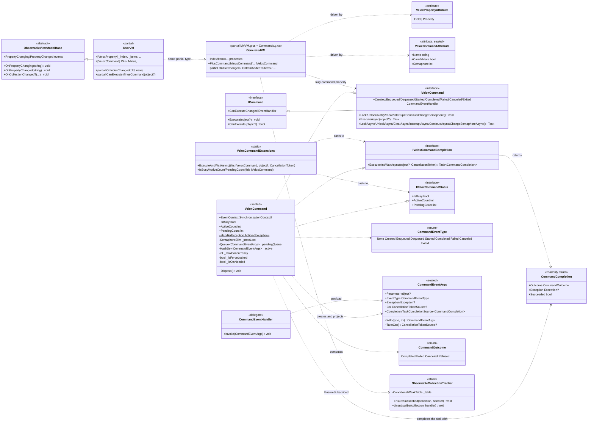
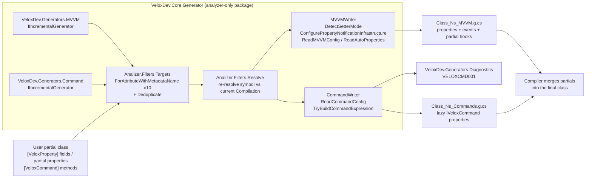

# Design Patterns — MVVM

The `mvvm` feature is a **generator + command runtime** pair. The runtime lives under `Src/Core/VeloxDev.Core/MVVM/**` and `Src/Core/VeloxDev.Core/Interfaces/MVVM/**`, in namespace `VeloxDev.MVVM`, and supplies `VeloxPropertyAttribute`, `VeloxCommandAttribute`, `IVeloxCommand`, `IVeloxCommandCompletion`, `IVeloxCommandStatus`, `VeloxCommand`, `VeloxCommandExtensions`, `CommandEventArgs` / `CommandEventType` / `CommandEventHandler` / `CommandOutcome` / `CommandCompletion`, and `ObservableCollectionTracker`. The Roslyn source generator under `Src/Generators/VeloxDev.Core.Generator/**` (classes `VeloxDev.Generators.MVVM` and `VeloxDev.Generators.Command`, shipped as the analyzer-only package `VeloxDev.Core.Generator`) turns `[VeloxProperty]` fields / partial properties and `[VeloxCommand]` methods into observable properties and lazily created command properties.

## Model class diagram


```mermaid
classDiagram
    direction LR
    class VeloxPropertyAttribute {
        <<attribute>>
        Field | Property
    }
    class VeloxCommandAttribute {
        <<attribute, sealed>>
        +Name string
        +CanValidate bool
        +Semaphore int
    }
    class ICommand {
        <<interface>>
        +Execute(object?) void
        +CanExecute(object?) bool
        +CanExecuteChanged EventHandler
    }
    class IVeloxCommand {
        <<interface>>
        +Created/Enqueued/Dequeued/Started/Completed/Failed/Canceled/Exited CommandEventHandler
        +Lock/Unlock/Notify/Clear/Interrupt/Continue/ChangeSemaphore() void
        +ExecuteAsync(object?) Task
        +LockAsync/UnlockAsync/ClearAsync/InterruptAsync/ContinueAsync/ChangeSemaphoreAsync() Task
    }
    class IVeloxCommandCompletion {
        <<interface>>
        +ExecuteAndWaitAsync(object?, CancellationToken) Task~CommandCompletion~
    }
    class IVeloxCommandStatus {
        <<interface>>
        +IsBusy bool
        +ActiveCount int
        +PendingCount int
    }
    class VeloxCommand {
        <<sealed>>
        +EventContext SynchronizationContext?
        +IsBusy bool
        +ActiveCount int
        +PendingCount int
        +HandlerException Action~Exception~$
        +Dispose() void
        -SemaphoreSlim _stateLock
        -Queue~CommandEventArgs~ _pendingQueue
        -HashSet~CommandEventArgs~ _active
        -int _maxConcurrency
        -bool _isForceLocked
        -bool _isCtsNeeded
    }
    class VeloxCommandExtensions {
        <<static>>
        +ExecuteAndWaitAsync(this IVeloxCommand, object?, CancellationToken)
        +IsBusy/ActiveCount/PendingCount(this IVeloxCommand)
    }
    class CommandEventType {
        <<enum>>
        None Created Enqueued Dequeued Started Completed Failed Canceled Exited
    }
    class CommandEventArgs {
        <<sealed>>
        +Parameter object?
        +EventType CommandEventType
        +Exception Exception?
        +With(type, ex) CommandEventArgs
        ~Cts CancellationTokenSource?
        ~TakeCts() CancellationTokenSource?
        ~Completion TaskCompletionSource~CommandCompletion~
    }
    class CommandEventHandler {
        <<delegate>>
        +Invoke(CommandEventArgs) void
    }
    class CommandOutcome {
        <<enum>>
        Completed Failed Canceled Refused
    }
    class CommandCompletion {
        <<readonly struct>>
        +Outcome CommandOutcome
        +Exception Exception?
        +Succeeded bool
    }
    class ObservableCollectionTracker {
        <<static>>
        +EnsureSubscribed(collection, handler) void
        +Unsubscribe(collection, handler) void
        -ConditionalWeakTable _table
    }
    class ObservableViewModelBase {
        <<abstract>>
        +PropertyChanging/PropertyChanged events
        +OnPropertyChanging(string) void
        +OnPropertyChanged(string) void
        +OnCollectionChangedT(...) void
    }
    class UserVM {
        <<partial>>
        +[VeloxProperty] _index, _items, ...
        +[VeloxCommand] Plus, Minus, ...
        +partial OnIndexChanged(old, new)
        +partial CanExecuteMinusCommand(object?)
    }
    class GeneratedVM {
        <<partial MVVM.g.cs + Commands.g.cs>>
        +Index/Items/... properties
        +PlusCommand/MinusCommand/... IVeloxCommand
        +partial OnXxxChanged / OnItemAddedToItems / ...
    }

    ICommand <|-- IVeloxCommand
    VeloxCommand ..|> IVeloxCommand
    VeloxCommand ..|> IVeloxCommandCompletion
    VeloxCommand ..|> IVeloxCommandStatus
    VeloxCommand ..> CommandEventType
    VeloxCommand ..> CommandEventArgs : creates and projects
    VeloxCommand ..> CommandOutcome : computes
    VeloxCommand ..> CommandCompletion : completes the sink with
    CommandEventHandler ..> CommandEventArgs : payload
    IVeloxCommandCompletion ..> CommandCompletion : returns
    VeloxCommandExtensions ..> IVeloxCommandCompletion : casts to
    VeloxCommandExtensions ..> IVeloxCommandStatus : casts to
    GeneratedVM ..> IVeloxCommand : lazy command property
    GeneratedVM ..> ObservableCollectionTracker : EnsureSubscribed
    GeneratedVM ..> VeloxPropertyAttribute : driven by
    GeneratedVM ..> VeloxCommandAttribute : driven by
    UserVM ..> GeneratedVM : same partial type
    ObservableViewModelBase <|-- UserVM
```

> Source: `Src/Core/VeloxDev.Core/MVVM/VeloxCommand.cs` lines 20-31 (enum), 56-58 (class head), 223-283 (events/properties), 855-917 (`CommandEventArgs`); `Src/Core/VeloxDev.Core/MVVM/CommandCompletion.cs` lines 6-29 (`CommandOutcome`), 45-59 (`CommandCompletion`); `Src/Core/VeloxDev.Core/Interfaces/MVVM/*.cs`; `Src/Core/VeloxDev.Core/MVVM/VeloxCommandExtensions.cs` lines 34-72.

## Source-generation pipeline

Both generators are `IIncrementalGenerator`s that share one syntax provider. From `Src/Generators/VeloxDev.Core.Generator/Base/Analizer.cs`:

- line 82 — `TriggerAttributes` lists the ten attributes that can pull a class into a writer — the four `WorkflowBuilder` attributes, `DefaultAnchor`, `DefaultSize`, `Tickable`, `AspectOriented` and the two MVVM ones, `VeloxDev.MVVM.VeloxPropertyAttribute` and `VeloxDev.MVVM.VeloxCommandAttribute`;
- line 35 — `GeneratorTarget`, a readonly struct holding the partial declaration plus a type key, deliberately **without** an `ISymbol`;
- line 107 — `Targets` registers one `ForAttributeWithMetadataName` provider per trigger attribute and concatenates them;
- line 142 — `Resolve` re-resolves each target's symbol against the current compilation.


```mermaid
flowchart LR
    P1["User partial class\n[VeloxProperty] fields / partial properties\n[VeloxCommand] methods"] --> F
    subgraph GEN["VeloxDev.Core.Generator (analyzer-only package)"]
        direction TB
        G1["VeloxDev.Generators.MVVM\nIIncrementalGenerator"] --> F
        G2["VeloxDev.Generators.Command\nIIncrementalGenerator"] --> F
        F["Analizer.Filters.Targets\nForAttributeWithMetadataName x10\n+ Deduplicate"] --> R["Analizer.Filters.Resolve\nre-resolve symbol vs current Compilation"]
        R --> W1["MVVMWriter\nDetectSetterMode\nConfigurePropertyNotificationInfrastructure\nReadMVVMConfig / ReadAutoProperties"]
        R --> W2["CommandWriter\nReadCommandConfig\nTryBuildCommandExpression"]
    end
    W2 --> D["VeloxDev.Generators.Diagnostics\nVELOXCMD001"]
    W1 --> O1["Class_Ns_MVVM.g.cs\nproperties + events + partial hooks"]
    W2 --> O2["Class_Ns_Commands.g.cs\nlazy IVeloxCommand properties"]
    O1 --> P2["Compiler merges partials\ninto the final class"]
    O2 --> P2
```

Each writer implements `ICodeWriter` (`Src/Generators/VeloxDev.Core.Generator/Base/ICodeWriter.cs`, lines 6-11: `Initialize`, `CanWrite`, `Write`, `GetFileName`) via `Writers/WriterBase.cs`, and emits one `.g.cs` file per class only when it `CanWrite()` — `MVVMWriter.CanWrite` (line 845) for classes carrying `[VeloxProperty]` (or workflow components), `CommandWriter.CanWrite` (line 243) for classes carrying `[VeloxCommand]`.

## Pattern map

| # | Pattern | Participants | Where |
|---|---|---|---|
| 1 | Source generation (codegen) | `VeloxDev.Generators.MVVM`, `VeloxDev.Generators.Command`, `Analizer.Filters` (`Targets`/`Resolve`), `MVVMWriter`, `CommandWriter`, `MVVMPropertyFactory` | `Src/Generators/VeloxDev.Core.Generator/{MVVM.cs, Command.cs, Base/Analizer.cs, Writers/MVVMWriter.cs, Writers/CommandWriter.cs}` |
| 2 | Command | `IVeloxCommand : ICommand`, `VeloxCommand` (capacity + queue + lifecycle events) | `Src/Core/VeloxDev.Core/Interfaces/MVVM/IVeloxCommand.cs`, `Src/Core/VeloxDev.Core/MVVM/VeloxCommand.cs` |
| 3 | Observer (INPC + lifecycle events) | generated properties, `OnPropertyChanging` / `OnPropertyChanged`, `ObservableViewModelBase`, 8 command lifecycle events | `Writers/MVVMWriter.cs`, `VeloxCommand.cs` lines 228-242, `Examples/MVVM/WPF/Demo/ObservableViewModelBase.cs` |
| 4 | Template Method (partial hooks) | generated `OnXxxChanging` / `OnXxxChanged`, collection partials, `CanExecuteXxxCommand` | `Base/Analizer.cs` (`MVVMPropertyFactory`), `CommandWriter.cs` line 292 |
| 5 | Adapter (host-framework coexistence) | `MVVMWriter.DetectSetterMode` | `Writers/MVVMWriter.cs` line 42 |
| 6 | Weak-reference registry | `ObservableCollectionTracker` with `ConditionalWeakTable` | `Src/Core/VeloxDev.Core/MVVM/ObservableCollectionTracker.cs` |
| 7 | Interface segregation + opt-in extension | `IVeloxCommandCompletion`, `IVeloxCommandStatus`, `VeloxCommandExtensions` | `Src/Core/VeloxDev.Core/Interfaces/MVVM/IVeloxCommand{Completion,Status}.cs`, `VeloxCommandExtensions.cs` |
| 8 | Promise / awaitable result (Future) | `ExecuteAndWaitAsync`, `CommandCompletion`, the internal `Completion` sink | `VeloxCommand.cs` lines 452-471, 891, 899-900 |
| 9 | Sentinel with no event counterpart | `CommandOutcome.Refused` | `CommandCompletion.cs` lines 22-28 |

## Patterns identified

### 1. Source Generation (Roslyn incremental generators)

`Analizer.Filters.Targets` (line 107) registers `ForAttributeWithMetadataName` providers — one per `TriggerAttributes` entry — and deduplicates the results by type key. Attributes are resolved as symbols rather than matched by name, so fully qualified and aliased forms are recognized too, and a class carrying none of them never reaches a writer. `Resolve` (line 142) then re-resolves each symbol against the current compilation, because a symbol captured inside a cached transform would go stale after an edit to another file.

`MVVMWriter` reads `[VeloxProperty]` **fields** (`ReadMVVMConfig`, line 91) and **partial properties** (`ReadAutoProperties`, line 117) and produces one observable property each through `MVVMPropertyFactory`. `CommandWriter.ReadCommandConfig` (line 43) reads `[VeloxCommand]` methods, resolves `name` / `canValidate` / `semaphore` from positional then named arguments, and selects the construction by signature (`TryBuildCommandExpression`, line 133).

The default setter shape (plain field, no host framework) is produced by `MVVMPropertyFactory.GetSetterBodyLines` in `Base/Analizer.cs`, with `OnPropertyChanging` / `OnPropertyChanged` injected by `MVVMWriter`:

```csharp
// Source: Generated — CounterViewModel_QuickStart_Mvvm_MVVM.g.cs, the Count property
if(global::System.Object.Equals(this._count, value)) return;
var old = this._count;
OnPropertyChanging(nameof(Count));
OnCountChanging(old, value);
this._count = value;
OnCountChanged(old, value);
OnPropertyChanged(nameof(Count));
```

The generator also decides whether the type itself must expose the notification surface. `ConfigurePropertyNotificationInfrastructure` (`MVVMWriter.cs`, line 198) walks the class and its bases: if no `PropertyChanging` / `PropertyChanged` event and no `OnPropertyChanging` / `OnPropertyChanged(string)` method exists anywhere in the hierarchy, it generates the events, the two methods, and adds the two interfaces to the type. If a base already provides them, the generated setters simply call the inherited methods — which is why the demos reuse a local `ObservableViewModelBase` unchanged.

### 2. Command Pattern (`IVeloxCommand`)

`IVeloxCommand : ICommand` extends `ICommand` with async execution, lifecycle events and concurrency control. `VeloxCommand` (`VeloxCommand.cs` lines 56-833) is the concrete engine: `_stateLock` (a `SemaphoreSlim(1,1)`, line 195) guards `_pendingQueue` (line 196) and `_active` (line 198), and `_maxConcurrency` (line 200) caps parallel runs. `CanExecute` combines the user predicate with the force lock:

```csharp
// Source: Src/Core/VeloxDev.Core/MVVM/VeloxCommand.cs, lines 407-408
public bool CanExecute(object? parameter)
    => (_canExecute?.Invoke(parameter) ?? true) && !_isForceLocked;
```

`ExecuteCore` (line 474) either adds to `_active` and starts, enqueues and raises `Enqueued`, or — when force-locked — cancels the item's source and raises `Canceled`, then calls `item.Complete(CommandOutcome.Refused, null)` (line 519). The invariant the whole design turns on is stated in the source's own comment at lines 192-194: **no user code may run while `_stateLock` is held**, because that lock is not reentrant.

### 3. Observer Pattern (INPC + command lifecycle events)

`VeloxCommand` exposes eight lifecycle events plus `CanExecuteChanged` (lines 225-242). `ExecuteCoreAsync` (line 533) raises `Started` before invoking the body, then `Completed` / `Canceled` / `Failed` per outcome, and `Exited` is raised from `OnExecutionCompletedAsync` (line 594). Handlers receive a `CommandEventArgs` whose `EventType` carries the stage. The generated observable properties follow the classic `INotifyPropertyChanging` / `INotifyPropertyChanged` observer contract. Collection properties additionally subscribe to `CollectionChanged` through `ObservableCollectionTracker` so that field initializers (`= []`) never leave an event unsubscribed.

A subscriber that throws is isolated rather than allowed to disturb the pipeline:

```csharp
// Source: Src/Core/VeloxDev.Core/MVVM/VeloxCommand.cs, lines 316-326
private void Invoke(CommandEventHandler handler, CommandEventArgs args)
{
    try
    {
        handler(args);
    }
    catch (Exception ex)
    {
        ReportHandlerException(ex);
    }
}
```

### 4. Template Method Pattern (partial hooks)

The generator emits `partial void` declarations and calls them at fixed points of the generated skeleton. For each property it emits `OnXxxChanging(oldValue, newValue)` before the assignment and `OnXxxChanged(oldValue, newValue)` after; the user implements the partial bodies in the hand-written part of the class. For `INotifyCollectionChanged` properties, `GenerateCollectionMembers` (line 754) also emits `OnItemAddedToXxx` / `OnItemRemovedFromXxx` / `OnItemMovedInXxx` / `OnItemsResetInXxx`, dispatched from the generated `OnXxxCollectionChanged` switch on `NotifyCollectionChangedAction`. Command executability uses the same trick: `canValidate: true` generates a `partial bool CanExecuteXxxCommand(object? parameter)` that the user must implement.

### 5. Adapter Pattern (host-framework coexistence)

Rather than forcing a base class, the generator adapts to whatever notification infrastructure the annotated type already inherits. `MVVMWriter.DetectSetterMode` (line 42) recognizes CommunityToolkit.Mvvm, Prism, ReactiveUI and Caliburn.Micro, and switches the generated setter to call the host framework's `SetProperty` / `RaiseAndSetIfChanged` / `NotifyOfPropertyChange` instead of raising its own events. `ConfigurePropertyNotificationInfrastructure` likewise forwards to existing base-class methods or generates the events only when nothing supplies them. The same writer also powers WorkflowSystem's default view-models.

### 6. Weak-Reference Registry (`ObservableCollectionTracker`)

`ObservableCollectionTracker` keeps `CollectionChanged` subscriptions alive even when the backing field is assigned directly with `= []`. A `ConditionalWeakTable<object, Entry>` (line 17) keys tracking entries by collection identity, so an entry is collected together with its collection — no leak. `Entry` dedupes handlers by `(Method, Target)` identity (`MethodTargetEqualityComparer`, line 100):

```csharp
// Source: Src/Core/VeloxDev.Core/MVVM/ObservableCollectionTracker.cs, lines 104-109
public bool Equals(Delegate? x, Delegate? y)
{
    if (ReferenceEquals(x, y)) return true;
    if (x is null || y is null) return false;
    return x.Method == y.Method && ReferenceEquals(x.Target, y.Target);
}
```

Without it, every getter access would re-subscribe the fresh delegate a method group produces.

### 7. Interface Segregation with opt-in extension

The two capabilities that were added after the interface shipped — an awaitable result and a busy read model — live on their own interfaces rather than on `IVeloxCommand`, precisely so that no existing hand-written implementer breaks. `VeloxCommandExtensions` is the adapter that reaches them from the `IVeloxCommand` type that generated properties are declared with, and it fails loudly rather than guessing when an implementation did not opt in:

```csharp
// Source: Src/Core/VeloxDev.Core/MVVM/VeloxCommandExtensions.cs, lines 74-88
private static IVeloxCommandStatus Status(IVeloxCommand command)
{
    if (command is null)
    {
        throw new ArgumentNullException(nameof(command));
    }

    return command as IVeloxCommandStatus
        ?? throw new NotSupportedException(Unsupported(nameof(IVeloxCommandStatus)));
}
```

### 8. Promise / awaitable result

`ExecuteAndWaitAsync` (line 452) hands each execution a `TaskCompletionSource<CommandCompletion>` sink, parked on the item's internal `Completion` slot (`VeloxCommand.cs` line 891). The outcome is computed inside `ExecuteCoreAsync` rather than inferred from the events — the comment at line 537 says why: *"the sink must not depend on someone having subscribed to `Failed`"* — and `Complete` (line 899) finishes the sink exactly once, from the `finally` that every execution passes through:

```csharp
// Source: Src/Core/VeloxDev.Core/MVVM/VeloxCommand.cs, lines 895-900
// exactly once; a no-op when nobody is waiting
internal bool TryMarkCancelReported() => Interlocked.Exchange(ref _cancelReported, 1) == 0;

internal void Complete(CommandOutcome outcome, Exception? exception)
    => Completion?.TrySetResult(new CommandCompletion(outcome, exception));
```

Also note line 890: the copies produced by `CommandEventArgs.With` deliberately do **not** carry the sink, so a projection cannot complete someone else's wait.

### 9. A sentinel that deliberately has no event counterpart

`CommandOutcome.Refused` is the one outcome the event model cannot express, and the source says so at its declaration:

```csharp
// Source: Src/Core/VeloxDev.Core/MVVM/CommandCompletion.cs, lines 22-28
/// <summary>
/// The call never ran because the command was locked. This one has no matching
/// <see cref="CommandEventType"/> member: a refused call raises
/// <see cref="CommandEventType.Canceled"/> and never reaches <see cref="CommandEventType.Exited"/>, so
/// <see cref="CommandEventType"/> alone cannot tell a refusal apart from a cancellation.
/// </summary>
Refused,
```

This is the design decision behind pattern 8 existing at all: the event stream is a broadcast, and a broadcast cannot answer a per-caller question.

## Pattern-to-source index

| Pattern | Primary source |
|---|---|
| Source generation | `Src/Generators/VeloxDev.Core.Generator/{Base/Analizer.cs, Writers/MVVMWriter.cs, Writers/CommandWriter.cs}` |
| Command | `Src/Core/VeloxDev.Core/MVVM/VeloxCommand.cs` lines 56-833, `Interfaces/MVVM/IVeloxCommand.cs` |
| Observer | `VeloxCommand.cs` lines 225-242, 316-326, `Examples/MVVM/WPF/Demo/{MainWindowViewModel.cs, ObservableViewModelBase.cs}` |
| Template Method | `Base/Analizer.cs` (`MVVMPropertyFactory`, lines 394-780), `Writers/CommandWriter.cs` line 292 |
| Adapter | `Writers/MVVMWriter.cs` lines 42-89, 198-258 |
| Weak registry | `Src/Core/VeloxDev.Core/MVVM/ObservableCollectionTracker.cs` |
| Interface segregation | `Interfaces/MVVM/IVeloxCommandCompletion.cs`, `Interfaces/MVVM/IVeloxCommandStatus.cs`, `VeloxCommandExtensions.cs` |
| Promise / awaitable | `VeloxCommand.cs` lines 452-471, 890-900 |
| Refusal sentinel | `CommandCompletion.cs` lines 22-28 |
