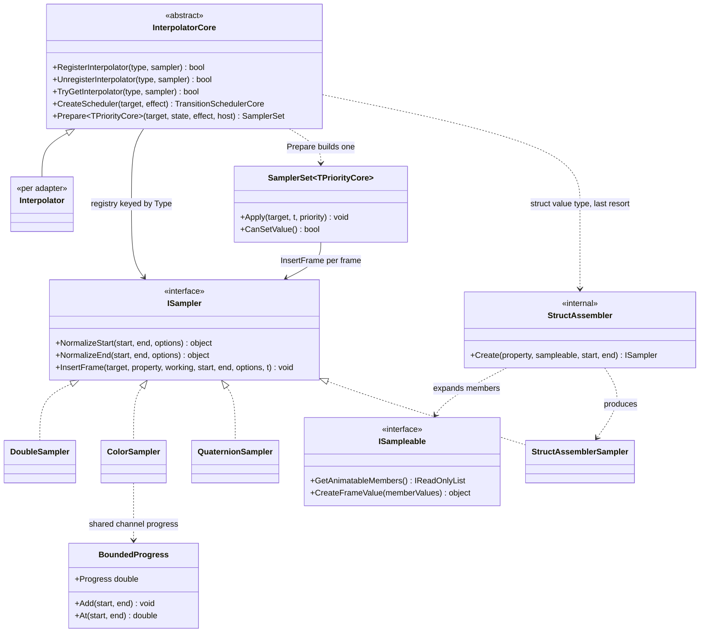

# Design Patterns — Transition: Sampler Strategy

The value-interpolation side of the engine: how one property's type is mapped to the thing that knows how to interpolate it, and how a value type with no sampler of its own is animated anyway.

## Class diagram

> Source: `Src/Core/VeloxDev.Core/TransitionSystem/Interpolator.cs`, `SamplerSet.cs`, `StructAssembler.cs`, `BoundedProgress.cs`, `NativeSamplers/*.cs`, `Interfaces/TransitionSystem/ISampler.cs`, `ISampleable.cs`.

## Pattern: Strategy (`ISampler`)

`ISampler` is the value-interpolation strategy. The core calls `NormalizeStart` / `NormalizeEnd` **once at prepare time** to fix the exact endpoint values, then `InsertFrame(target, property, ref working, start, end, options, t)` to compute a middle frame. `t` arrives already eased and unclamped, so implementations treat `t <= 0` / `t >= 1` as endpoint writes (or, for the numeric ones, as a lerp that happens to reproduce the endpoint exactly).

Three implementation rules the contract carries, each with a reason:

- **Stateless singletons, never mutating `start` / `end`** — the endpoints are shared with the transition declaration that recorded them, so mutation pollutes the declaration. Reference-type samplers use the per-animation `working` scratch (lazily created via `ref` on the first middle frame, then reused) so the common fast paths allocate nothing per sample.
- **Endpoints are the interpolator's business, not the loop's** — the loop only guarantees the *last* frame of a pass is exactly `t = 1` (forward) or `t = 0` (reverse), so a sampler never has to rely on `Ease(1)` being exactly `1`.
- **`options` is the one per-property channel** — the angular samplers (`DoubleSampler`, `QuaternionSampler`) read a `RotationDirection` from it; everything else ignores it.

## Pattern: Registry + resolution walk (`InterpolatorCore`)

The registry is a private `ConcurrentDictionary<Type, ISampler>`, reached only through `RegisterInterpolator` / `UnregisterInterpolator` / `TryGetInterpolator`. Holding it privately is deliberate: a caller that could reach the dictionary could replace it wholesale — dropping every default seeded by the static constructor — or clear it.

`RegisterInterpolator` is atomic last-writer-wins (`AddOrUpdate`). `TryGetInterpolator` is **not** an exact match; it resolves in three legs:

1. the exact type;
2. its base classes, nearest first;
3. its interfaces, and when several match, the one whose full name sorts first (ordinal).

The walk exists because a framework property is very often declared as a subclass of what the adapter registered — a `LinearGradientBrush` property against WPF's registered `Brush` — so an exact match alone would leave it unanimated and report it unsampleable. Interfaces come last and their tie-break is explicit because reflection's own order is not specified: *which* of two matching interfaces wins is arbitrary, but that the same one wins every time is not.

The walk runs **once per property per animation**, inside `Prepare` — never per frame. That is the whole design: `SamplerSet` holds the resolved sampler, and the frame path does no type resolution at all.

## Pattern: Null Object, at three points

- WPF registers the **abstract base** `Effect` rather than the concrete `DropShadowEffect`. Registering the concrete type would leave every path declared as `Effect` (WPF's own `UIElement.Effect` dependency property is declared that way) unresolvable and silently unsampled — the same mistake the walk above exists to absorb, one level up.
- A property whose type resolves to nothing is **skipped and reported through `Warn`**, not interpolated as `null`. Skipping keeps the other properties correct; the `Warn` keeps the skip observable.
- `StructAssembler.Create` answers `null` when it cannot assemble (an unresolvable member sampler, a missing member value, an access failure). `null` stays a skip — the assembler never throws into `Prepare`.

## Pattern: Composite strategy for value types (`ISampleable` + `StructAssembler`)

`ISampleable` is **not** a sampler, and it is a **value-type-only** contract: a struct declares which of its members are animatable (`GetAnimatableMembers`) and how to rebuild the value from interpolated members (`CreateFrameValue`). A property of such a type with no registered sampler is animated as a whole: `StructAssembler.Create` resolves each member's sampler and current value, and produces a `StructAssemblerSampler` that interpolates each member with its own sampler and calls `CreateFrameValue` — a compile-time constructor call, zero reflection at runtime.

The mechanism behind the capture is worth naming: `StructAssemblerSampler` does **not** write members onto the target (which, for a struct, would hit a boxed copy). It passes each member sampler a private `CaptureProperty : ITransitionProperty` whose `SetValue` just records the value, then assembles the struct from the recorded array. That is the Composite pattern — an `ISampler` that is itself composed of `ISampler`s, with a private `ITransitionProperty` as the seam that keeps member writes off the real target.

Reference types are **not** expanded: `Prepare` reaches for `ISampleable` only when `PropertyType.IsValueType`, and a reference-type leaf that resolves to nothing is rejected up front by `Execute` (`TransitionPathUnsampleableException`) rather than animated as nothing.

## Pattern: A group strategy for range-bound channels (`BoundedProgress`)

`BoundedProgress` is a small value-type helper, but it encodes a design decision: a group of channels that share one bound move **by one progress**, so an overshoot cannot distort the value. `ColorSampler` gives R/G/B one `[0, 255]` progress and lets alpha keep the full eased time; `SizeSampler` / `SizeFSampler` / `RectangleSampler` / `RectangleFSampler` give width/height one `[0, +∞)` progress. `Add` only ever *tightens*, so the order channels are added in does not matter, and the remaining overshoot is dropped for the group rather than letting one channel leave its range.

Sources: `Src/Core/VeloxDev.Core/TransitionSystem/Interpolator.cs`, `SamplerSet.cs`, `StructAssembler.cs`, `BoundedProgress.cs`, `NativeSamplers/{ColorSampler,SizeSampler,RectangleSampler,SizeFSampler,RectangleFSampler}.cs`, `Src/Adapters/VeloxDev.WPF/PlatformAdapters/Interpolator.cs`, `Src/Core/VeloxDev.Core.Test/TransitionSystem/{InterpolatorCoreTests,EaseOvershootTests,SamplerConformanceTests}.cs`, `Examples/Transition/AUTO TEST/Conformance/ClosedForm.cs`.
