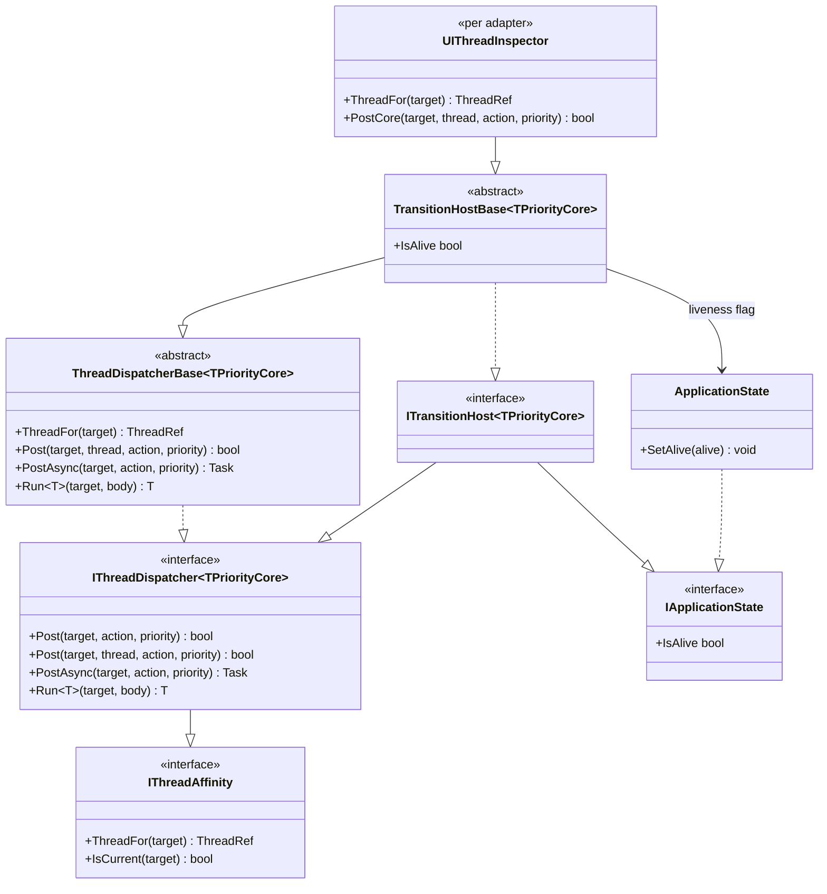

# Design Patterns — Transition: Host & Timeline

The two seams that make the engine platform-agnostic at the edges: what it asks a **host**, and what it asks a **clock**.

## Host seam — class diagram

> Source: `Src/Core/VeloxDev.Core/Interfaces/TransitionSystem/ITransitionHost.cs`, `Src/Core/VeloxDev.Core/Threading/{IThreadDispatcher,ThreadDispatcherBase,ThreadRef,NonPriority}.cs`, `Src/Core/VeloxDev.Core/Lifetime/IApplicationState.cs`, `Src/Core/VeloxDev.Core/TransitionSystem/TransitionHostBase.cs`, `Src/Adapters/*/PlatformAdapters/UIThreadInspector.cs`.

### Pattern: Composition over a fat interface; Template Method over the derivation

`ITransitionHost<TPriorityCore>` **adds no member**. It composes `IThreadDispatcher<TPriorityCore>` (which itself composes `IThreadAffinity`) with `IApplicationState`, so an adapter declares one interface while the two subsystems underneath stay independently replaceable — and so a non-animation consumer can take just the clock or just the liveness flag.

Underneath, `ThreadDispatcherBase<TPriorityCore>` is the **Template Method**: a host supplies only `ThreadFor`, `IsCurrentThread` and `PostCore`, and the base implements `Post`, `PostAsync` and `Run<T>` once, so no host can derive them differently from another. Three parts of that skeleton are load-bearing:

- **`Post` runs inline when the caller is already on the target's thread.** `Post(target, thread, action, priority)` is `IsCurrentFor(target, thread) ? RunInline(action) : PostCore(target, thread, action, priority)` — so the common case (a UI-thread `Execute`) costs no dispatch at all.
- **`PostAsync` waits only when the action was accepted.** The completion is a `TaskCompletionSource`; a host that silently drops an action would never complete it, so the base returns `false` instead of waiting forever. This is the one `await` per animation — `Awake` — and it must complete before `Prepare` reads the target.
- **`InternalPriority` is defaulted, not required, and a priority-carrying host must override it.** `default(NonPriority)` is the whole story for a host with no priority, but `default(DispatcherPriority)` is `Inactive`, which would park a blocking `Run<T>` behind every normal message.

### Pattern: Null Object for "no thread" (`ThreadRef.None`)

`ThreadRef` wraps whatever the host uses to identify a thread (a `Dispatcher`, `DispatcherQueue`, `IDispatcher`, `SynchronizationContext`) and gives "no thread owns this" a **name** instead of a `null` every caller has to cast. `ThreadFor` never throws — a host that cannot answer returns `None`, which merely costs that target its UI-thread frame pacer. Reaching the write path from a host that *does* throw would be indistinguishable per frame from the animation failing, which is why the interface states that nothing there may throw.

## Pacing seam — `FramePacerCore`

`FramePacerCore` is the **Template Method** that decides *when* the next frame happens, while the sampling loop decides *how far along* the frame is. The split is the point: the timeline is the timing authority, and a wake-up is only a reminder, so waking late draws a frame further along rather than a wrong one.

| Skeleton member | Fixed behavior the base owns |
|---|---|
| `Schedule(continuation, interval, token)` | Publishes the continuation (`Volatile.Write`) and then arms — in that order, so an already-expired timer cannot tick before the continuation is attached. A pending continuation is **replaced**, not queued (one loop owns one pacer). |
| `Arm(interval)` | Subclass hook: start or re-arm the host's wait. |
| `Disarm()` | Subclass hook: end it. Must tolerate nothing being armed and must not allocate — it is called once per frame. |
| `Fire()` | Disarms **first**, then invokes the pending continuation exactly once (`Interlocked.Exchange`). The order matters: a repeating wait must not complete again before the loop has armed the next frame. |
| `Dispose()` | Disarms and then **releases** (invokes) any pending continuation. A loop waiting on a continuation that is never invoked would be stranded for good, with no exception and no frame. |

Two failure modes the base exists to make impossible: a pacer that invokes its continuation twice double-samples; one that never invokes it parks the loop forever. Neither is visible from the host side, and neither is worth re-deriving per platform. Hosts override the pair rather than implementing an interface: WPF/Avalonia/Jalium wait on a `DispatcherTimer`, WinUI on a non-repeating `DispatcherQueueTimer`, MAUI on a repeating `IDispatcherTimer`, WinForms by posting each frame to the target's control, and Razor keeps the default. Each override returns `null` when it has no answer — no nameable thread, or, for WinForms, a target that is not on the current thread.

The default wait is `Abstractions.ReusableTimerWait` — one `Timer` for the whole loop and one cancellation registration for the animation, replacing `await Task.Delay(interval, token)`'s per-wait `DelayPromise` plus per-wait registration callback.

## Clock seam — `VeloxDev.Timing`

The engine reads time from `ITimeSource`, never from a framework clock, and that is a design decision with three consequences:

- **A pause is excluded rather than skipped.** A source that simply does not advance while paused makes the exclusion constructive. The previous design measured against a wall clock while a separate flag said "don't count", which produced the post-resume delta spike; here the two clocks are the same one.
- **A run can park.** `IsAdvancing` is stated as an **invariant** (`true` implies the position is moving), not as a formula over `IsPaused` and `Rate`, because a host that stops feeding freezes the position without pausing anything. The park signal is bound to that predicate, so a stalled consumer costs no wake-ups and cannot spin on `while (!IsAdvancing)`.
- **Time is shared.** Several consumers anchor into one absolute timeline; a per-consumer pass is an *anchor* into it (`TransitionRun.PassAnchor`), not a reset, so starting a pass on one consumer cannot move any other.

`TimerCore` (the registry) and `InterpolatorCore` (the sampler registry) are deliberately shaped the same way: a private dictionary, a public register/unregister/try-get triple, atomic last-writer-wins, and keys the caller never sees. Both exist so a platform substitutes an implementation **under the contract**, and neither hands out its dictionary.

Sources: `Src/Core/VeloxDev.Core/Interfaces/TransitionSystem/ITransitionHost.cs`, `Src/Core/VeloxDev.Core/Threading/*.cs`, `Src/Core/VeloxDev.Core/Lifetime/IApplicationState.cs`, `Src/Core/VeloxDev.Core/TransitionSystem/{TransitionHostBase,FramePacerCore,ReusableTimerWait,TransitionInterpreter,TransitionRun}.cs`, `Src/Core/VeloxDev.Core/Timing/*.cs`, `Src/Core/VeloxDev.Core/Interfaces/Timing/*.cs`, `Src/Adapters/*/PlatformAdapters/{UIThreadInspector,TransitionInterpreter}.cs`.
