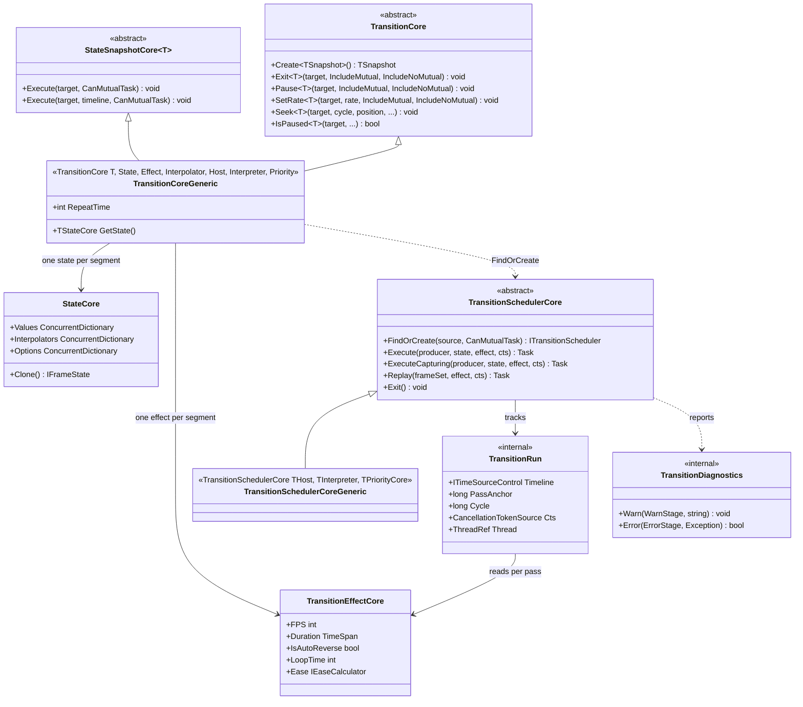

# Design Patterns — Transition: Builder & Scheduler

The declaration side (one builder that is also a segment chain) and the execution side (one scheduler per target, with the registries that make a run reachable by a later control call).

## Class diagram — builder, chain, scheduler

> Source: `Src/Core/VeloxDev.Core/TransitionSystem/{Effects/Transition,Effects/TransitionEffect,Runtime/TransitionDiagnostics,Runtime/TransitionRun,Runtime/TransitionScheduler,State/State,State/StateSnapshot}.cs`.

## Pattern: Fluent Builder that is also a Composite

`Transition<T>.Create()` returns one object that is the static entry point, the builder and the executor at once. `.Property(expr, value, options)` and `.Effect(...)` each return the same builder, so a single fluent expression *reads* as configuration.

What it actually builds is a **list of segments**: `.Await(span)`, `.Then()` and `.AwaitThen(span)` (the `TransitionCoreEx` extensions on `StateSnapshotCore`) allocate the **next** segment and link it through the `next` field, so one builder expression describes an ordered chain — each link carrying its own `State`, `Effect`, `Interpolator` and pre-delay. `Execute` then walks that chain. This is the Composite pattern: the chain and a single segment are consumed by the same code path, because the "container" is just a link to the next one.

Two properties fall out of making segments data rather than behavior:

- **A built chain is reusable and thread-safe-ish by construction** — `CoreExecute` clones each segment's effect (`effect.Clone()`) before running it, so one static `Animation0` can be executed on any number of targets, repeatedly, and the demos do exactly that.
- **`RepeatTime` is a per-segment integer, not a wrapper object.** `Repeat(count)` writes `RepeatTime` on the segment it is called on, and `CoreExecute` expands the loops by walking `repeats[]` — so a loop needs no new type, and "which segments does this loop wrap" is answered by the chain order alone (a segment's loop wraps the chain from its first segment *through that one*).

## Pattern: registry tables keyed weakly by target

`TransitionSchedulerCore` keeps two static tables and one private lock table:

| Table | Type | Why this shape |
|---|---|---|
| `MutualSchedulers` | `ConditionalWeakTable<object, ITransitionSchedulerCore>` | One **mutual** scheduler per target, collected with the target. `GetValue` installs it atomically — a `TryGetValue`-then-`Add` pair races, and the loser's `Add` throws. |
| `NoMutualSchedulers` | `ConditionalWeakTable<object, ConcurrentDictionary<ITransitionSchedulerCore, byte>>` | The **concurrent** schedulers *currently* on a target, as a set. Animations register and unregister themselves from several threads at once (a background `Task.Run`, a UI-thread click), and a plain `List` mutated without synchronization loses entries — which would make `Exit` miss schedulers and leave animations running. |
| `TargetLocks` (private) | `ConditionalWeakTable<object, SemaphoreSlim>` | Serializes the **control plane** of one target — entering (create the token, register the animation) against leaving (cancel everything alive). Held only across synchronous bookkeeping, never across the animation body, so it cannot deadlock against the UI thread the frames go to, and non-mutual animations on one target still run concurrently. |

The distinction between the two scheduler tables is a design statement, not an implementation detail: the mutual table is a *cache for the target's lifetime* (so `TryGetMutualScheduler` answers "has this target ever run a mutual animation"), while the non-mutual table is *live state* (an entry is removed when the run ends) — which is why the `AUTO TEST` harness reads the **array length** from `TryGetNoMutualScheduler`, not the boolean.

## Pattern: two-phase run, so a repeat replays instead of re-reading

`Execute` and `ExecuteCapturing` share a body; `ExecuteCapturing` just hands back the `SamplerSet` it prepared, and `Replay(frameSet, effect)` runs a segment *again against that same set*. `Repeat` is the only caller of the pair, and the reason is a correctness argument rather than an optimization:

- preparing a segment reads the **target's current value** as its start, so re-preparing a repeated segment would start it from where the last iteration stopped — a chain whose endpoint differs from its start would walk backwards;
- a segment writing a property no earlier segment touched would drift a little per iteration.

Replaying keeps every iteration identical and pins the endpoints. What it deliberately does **not** re-raise is `Awake`: `Awake` is the hook that puts the target into the state the segment starts from, and a replay is *defined* by not depending on the target's state at all. `Start`, `Update`, `LateUpdate`, `Completed` and the diagnostics do fire, so a replay is observable exactly like any other pass.

## Pattern: Observer for lifecycle, a separate channel for diagnostics

`TransitionEffectCore` exposes nine `WeakDelegate`-backed events. Seven are lifecycle (`Awaked`, `Start`, `Update`, `LateUpdate`, `Canceled`, `Completed`, `Finally`); two are **diagnostics** (`Warn`, `Error`) and exist because the engine's failure mode is silence: an exception escaping a sampler on the UI thread has no caller to catch it, and a callback that throws must not take the host process down.

`TransitionDiagnostics` is the internal mediator:

- it is a **run-scoped** object (created per `Prepare` / per loop), so "each stage reports at most once" is per run — a per-frame condition reports once and is then quiet;
- it routes `Warn` / `Error` through the effect's events *and* a `Debug.WriteLine`, so a run reports even with no handler;
- it builds a typed argument per report (`TransitionEventArgs<WarnStage, string>` for `Warn`, `TransitionEventArgs<ErrorStage, Exception>` for `Error`) and copies the run's `Loop` / `Cycle` onto it before raising, so a diagnostic handler sees the run's position;
- it honours `TransitionEventArgs.Handled`: a handler that sets it asks the run to terminate, and `TransitionDiagnostics` flips the run's own `Handled` flag.

That is also why the sampling loop wraps every callback and every `apply` in `Report` / `ReportMarshaling`: the point is not to swallow the exception but to convert it into a report plus the run's **normal** cancellation path, so `Canceled` and `Finally` still fire and the loop's own resources are still released. `InvokeError` deliberately does not call `Debug.Fail` — that would terminate the process in a non-interactive host, which is precisely what this channel exists to prevent.

Sources: `Src/Core/VeloxDev.Core/TransitionSystem/{Effects/Transition,Effects/TransitionEffect,Runtime/TransitionDiagnostics,Runtime/TransitionRun,Runtime/TransitionScheduler,State/State,State/StateSnapshot}.cs`, `Src/Core/VeloxDev.Core/TransitionSystem/Effects/TransitionEx.cs`, `Src/Core/VeloxDev.Core.Test/TransitionSystem/{ChainRepeatTests,TransitionSchedulerExitTests,NoMutualSchedulerRegistryTests,TransitionDiagnosticsTests}.cs`, `Examples/Transition/WPF/Demo/MainWindow.xaml.cs`.
