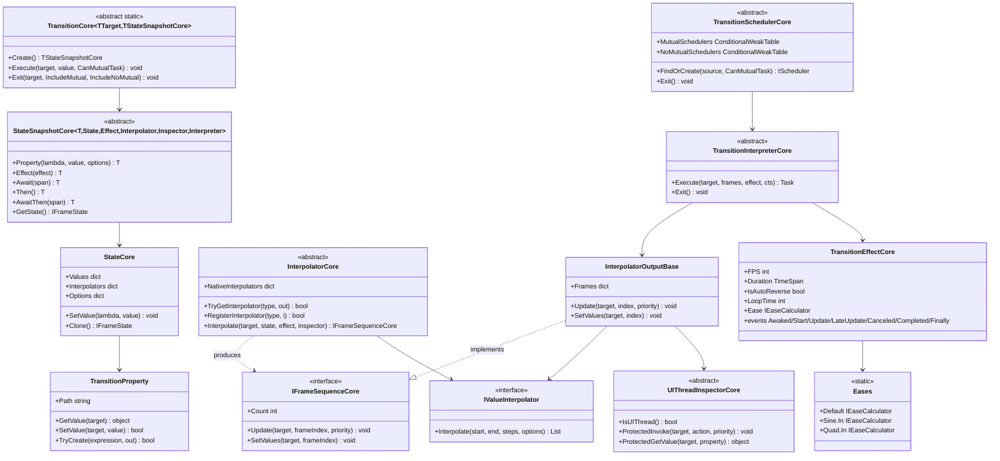

# Design Patterns — Transition



## Patterns Identified

### 1. Fluent Builder Pattern (`StateSnapshot`)

`Transition<T>.Create()` returns the `StateSnapshot` fluent builder. `.Property(lambda, value)`, `.Effect(...)`, `.Await(...)`, `.AwaitThen(...)`, `.Then()` each return the same snapshot for chaining; `.Execute(target, CanMutualTask)` consumes it. Segments are linked into a list (`next` pointer), so a single "builder" actually describes a **sequence** of segments.

```csharp
// Examples/Transition/WPF/Demo/MainWindow.xaml.cs
private static readonly Transition<Rectangle>.StateSnapshot Animation0 =
    Transition<Rectangle>.Create()
        .Property(r => r.Opacity, 0)
        .Property(r => ((TranslateTransform)r.RenderTransform).X, 800)
        .Property(r => r.Fill, new SolidColorBrush(Colors.Orange))
        .Effect(new TransitionEffect()
        {
            Duration = TimeSpan.FromSeconds(2),
            IsAutoReverse = true,
            LoopTime = 2,
        });
```

### 2. Registry Pattern (`InterpolatorCore`)

A global `ConcurrentDictionary<Type, IValueInterpolator>` (`NativeInterpolators`) plus `RegisterInterpolator`/`TryGetInterpolator`/`UnregisterInterpolator`. Resolution order in `Interpolate`: per-property custom interpolator → registry → `IInterpolable` on the current/new value. `RegisterInterpolator` uses atomic `AddOrUpdate` (last-writer-wins, no lost updates).

### 3. Strategy Pattern (easing + interpolators)

`IEaseCalculator.Ease(double t)` strategies come from `Eases.*` (`Sine`, `Quad`, `Bounce`, ...). `IValueInterpolator.Interpolate(...)` strategies map a value type to a frame list (e.g. `ColorInterpolator`, `QuaternionInterpolator`). Easing is applied by **re-indexing** the pre-computed frame array (`GetEaseIndex` maps eased `t` → frame index), not re-evaluating values per frame.

### 4. Template Method Pattern (core engine)

The core classes (`StateSnapshotCore` 6/7-generic arities, `InterpolatorCore<TOutputCore[, TPriorityCore]>`, `TransitionSchedulerCore<TUIThreadInspector, TTransitionInterpreter[, TPriorityCore]>`, `TransitionInterpreterCore<TOutputCore, TEffectCore[, TPriorityCore]>`, `InterpolatorOutputCore<TUIThreadInspector[, TPriorityCore]>`, `UIThreadInspectorCore<TPriorityCore>`) define the algorithm skeleton; each **adapter** provides concrete subclasses for its platform (`TransitionEffect` priority, `Interpolator` registrations, `UIThreadInspector` marshalling).

### 5. Proxy / Adapter Pattern (platform adapters)

`UIThreadInspector` wraps each platform's dispatcher (`Application.Current.Dispatcher`, `Dispatcher.UIThread`, `DispatcherQueue.TryEnqueue`, `SynchronizationContext.Post`, `Control.Invoke/BeginInvoke`) so the engine can start animations on any thread and marshal frame writes back to the UI thread.

### 6. Scheduler + `ConditionalWeakTable` caching

`TransitionSchedulerCore.MutualSchedulers` is a `ConditionalWeakTable<object, ITransitionSchedulerCore>` — one shared **mutual** scheduler per target, garbage-collected with the target (no leaks). `FindOrCreate(source, CanMutualTask)` returns it, or a one-off **non-mutual** scheduler (registered in `NoMutualSchedulers`) for parallel animations. A `SemaphoreSlim` gate serializes executions on a mutual scheduler.

### 7. Composite (state segments)

`.AwaitThen(...)` links snapshots into a **linked list of segments**, each with its own `State` + `Effect`; the interpreter plays them in order, honoring each segment's delay, easing, and loop settings.

### 8. Observer Pattern (effect lifecycle events)

`TransitionEffectCore` exposes `Awaked/Start/Update/LateUpdate/Canceled/Completed/Finally` events backed by `WeakDelegate` (leak-free); `TransitionInterpreterCore` invokes them around each frame and at completion/cancellation.

## Pattern Summary

| Pattern | Where it appears | Role |
|---|---|---|
| Fluent Builder | `StateSnapshotCore` chain | Describe a target state + timing without mutable config objects |
| Registry | `InterpolatorCore.NativeInterpolators` | Map a type to an `IValueInterpolator` at runtime |
| Strategy | `IEaseCalculator`/`Eases`, `IValueInterpolator` | Swap easing curves and value interpolation without changing the engine |
| Template Method | `InterpolatorCore`, `TransitionSchedulerCore`, `TransitionInterpreterCore`, `UIThreadInspectorCore` | Fix the algorithm skeleton; let adapters fill in platform specifics |
| Adapter / Proxy | `UIThreadInspector` per platform | Hide dispatcher differences behind one interface |
| Scheduler + CWT cache | `TransitionSchedulerCore` mutual/non-mutual tables | One serialized animation per target; no leaks |
| Composite | `StateSnapshotCore.next` chain | Compose multi-segment timelines |
| Observer | `TransitionEffectCore` events | Observe lifecycle without polling |

> Source references: `Src/Core/VeloxDev.Core/TransitionSystem/*.cs`, `Src/Core/VeloxDev.Core/Interfaces/TransitionSystem/*.cs`, `Src/Adapters/VeloxDev.{WPF,...}/PlatformAdapters/*.cs`, `Examples/Transition/WPF/Demo/MainWindow.xaml.cs`.
