# Design Patterns — Transition

The Transition feature is a framework-agnostic animation engine. Its core lives in `Src/Core/VeloxDev.Core/TransitionSystem/**` (abstract/generic "core" types in the `VeloxDev.TransitionSystem.Abstractions` namespace, engine contracts in `Src/Core/VeloxDev.Core/Interfaces/TransitionSystem/**`, native samplers under `TransitionSystem/NativeSamplers/**`). It is UI-thread aware but has no reference to any concrete UI stack. Every UI framework is reached through a per-platform adapter package under `Src/Adapters/VeloxDev.*/PlatformAdapters` (WPF, Avalonia, WinUI, MAUI, WinForms, Razor, Jalium), and each platform is exercised by a demo under `Examples/Transition/**`.

The core is a **single generic family**: the host's dispatcher priority travels as a type parameter (`DispatcherPriority`, `DispatcherQueuePriority`, …), and a host that has none fills it with the marker struct `NonPriority`. WPF/Avalonia/Jalium/WinUI pass their priority type; MAUI/WinForms/Razor pass `NonPriority`. The former priority-free copy of the whole family is gone.

## Core class diagram

```mermaid
classDiagram
    class TransitionCore~T,TStateCore,TEffectCore,TInterpolatorCore,TInspector,TInterpreter,TPriorityCore~ {
        <<fluent builder + executor>>
        +GetState() TStateCore
        +Create~TSnapshot~()
        +Execute(target, values, CanMutualTask) void
    }
    class TransitionCore {
        <<abstract>>
        +Exit(target, IncludeMutual, IncludeNoMutual) void
    }
    class StateSnapshotCore~T~ {
        <<builder root>>
        +Execute(target, CanMutualTask) void
        +Exit(target, IncludeMutual, IncludeNoMutual) void
    }
    class IFrameState {
        <<interface>>
        +Values / Interpolators / Options ConcurrentDictionary
        +Clone() IFrameState
    }
    class StateCore {
        +Clone() IFrameState
    }
    class TransitionProperty {
        +Path string
        +Segments IReadOnlyList~PropertyInfo~
        +GetValue(target) object?
        +SetValue(target, value) bool
    }
    class InterpolatorCore {
        <<abstract>>
        +NativeInterpolators ConcurrentDictionary~Type, ISampler~
        +TryGetInterpolator(type) bool
        +RegisterInterpolator(type, sampler) bool
        +Prepare~TPriorityCore~(target, state, effect, inspector) SamplerSet~TPriorityCore~
    }
    class ISampler {
        <<interface>>
        +NormalizeStart(start, end, options) object?
        +NormalizeEnd(start, end, options) object?
        +InsertFrame(target, property, ref working, start, end, options, t) void
    }
    class ISampleable {
        <<interface>>
        +GetAnimatableMembers() IReadOnlyList~ITransitionProperty~
        +CreateFrameValue(memberValues) object?
    }
    class StructAssembler {
        <<internal static>>
        +Create(property, sampleable, start, end) ISampler?
    }
    class SamplerSet~TPriorityCore~ {
        +Apply(target, t, priority) void
        +CanSetValue() bool
    }
    class TransitionSchedulerCore {
        <<abstract>>
        +MutualSchedulers / NoMutualSchedulers ConditionalWeakTable
        +FindOrCreate(source, CanMutualTask) scheduler
        +Execute(producer, state, effect, cts) Task
        +Exit() void
    }
    class TransitionInterpreterCore {
        <<abstract>>
        +Args TransitionEventArgs
        +Execute(target, samplerSet, effect, cts) Task
        +Exit() / Dispose()
    }
    class ITransitionSchedulerCore {
        <<interface>>
    }
    class ITransitionInterpreter~TPriorityCore~ {
        <<interface>>
        +Args TransitionEventArgs
    }
    class TransitionEffectCore {
        +FPS / Duration / IsAutoReverse / LoopTime
        +Ease IEaseCalculator
        +events Awaked Start Update LateUpdate Canceled Completed Finally
    }
    class IEaseCalculator {
        <<interface>>
        +Ease(t) double
    }
    class Eases {
        <<static>>
        +Default IEaseCalculator
        +Sine / Quad / Cubic / Quart / Quint
        +Expo / Circ / Back / Elastic / Bounce
    }
    class UIThreadInspectorCore {
        <<abstract>>
        +IsAppAlive() bool
        +IsUIThread() bool
        +ProtectedGetValue(target, property) object?
    }
    class IUIThreadInspectorCore {
        <<interface>>
    }
    class IUIThreadInspector~TPriorityCore~ {
        <<interface>>
        +ProtectedInvoke(target, action, priority) bool
        +ProtectedInvokeAsync(target, action, priority) Task~bool~
    }

    TransitionCore~T,...,TPriorityCore~ --|> StateSnapshotCore~T~
    TransitionCore~T,...,TPriorityCore~ ..|> StateSnapshotCore : Exit
    StateSnapshotCore~T~ --> IFrameState : holds declared values
    StateCore ..|> IFrameState
    StateCore --> TransitionProperty : dictionary keys
    InterpolatorCore ..> ISampler : registry & per-property override
    InterpolatorCore ..> SamplerSet : Prepare builds
    InterpolatorCore ..> StructAssembler : value-type ISampleable
    StructAssembler ..> ISampleable : expands members
    StructAssembler ..> ISampler : produces StructAssemblerSampler
    SamplerSet~TPriorityCore~ --> ISampler : drives InsertFrame per frame
    SamplerSet~TPriorityCore~ --> IUIThreadInspector~TPriorityCore~ : marshals writes
    UIThreadInspectorCore ..|> IUIThreadInspectorCore
    UIThreadInspectorCore ..|> IUIThreadInspector~TPriorityCore~
    TransitionSchedulerCore ..|> ITransitionSchedulerCore
    TransitionInterpreterCore ..|> ITransitionInterpreter~TPriorityCore~
    TransitionSchedulerCore --> TransitionInterpreterCore : instantiates one per Execute
    TransitionInterpreterCore --> SamplerSet~TPriorityCore~ : samples eased time
    TransitionInterpreterCore --> TransitionEffectCore : lifecycle events + Ease
    TransitionEffectCore --> IEaseCalculator : strategy
    Eases ..> IEaseCalculator : produces (Sine/Quad/... )
```



Native samplers implement `ISampler` and live under `TransitionSystem/NativeSamplers/*`: `DoubleSampler`, `FloatSampler`, `IntSampler`, `LongSampler`, `PointSampler`, `PointFSampler`, `SizeSampler`, `SizeFSampler`, `ColorSampler`, `RectangleSampler`, `RectangleFSampler`, and (outside `netstandard2.0`) `Vector2Sampler`, `Vector3Sampler`, `Vector4Sampler`, `QuaternionSampler`.

## Adapter side class diagram (WPF as example)

Every adapter fills the generic parameters of the core with framework-bound subclasses. WPF demonstrates the priority arity; the same shape is repeated in every adapter package.

```mermaid
classDiagram
    class Transition {
        <<empty core subclass>>
    }
    class Transition~T~ {
        <<entry + builder + executor>>
        +Create() Transition~T~
        +Property(lambda, value, options) Transition~T~
        +Effect(effect) / Effect(Action~TransitionEffect~) Transition~T~
    }
    class State {
        <<StateCore subclass>>
    }
    class Interpolator {
        <<InterpolatorCore subclass>>
    }
    class TransitionEffect {
        <<TransitionEffectCore~DispatcherPriority~>>
        +Priority DispatcherPriority = Render
    }
    class UIThreadInspector {
        <<UIThreadInspectorCore~DispatcherPriority~>>
        +ProtectedInvoke(target, action, DispatcherPriority)
    }
    class TransitionScheduler {
        <<TransitionSchedulerCore~UIThreadInspector,TransitionInterpreter,DispatcherPriority~>>
    }
    class TransitionInterpreter {
        <<TransitionInterpreterCore~TransitionEffect,DispatcherPriority~>>
    }

    Transition~T~ --|> TransitionCore~T,State,TransitionEffect,Interpolator,UIThreadInspector,TransitionInterpreter,DispatcherPriority~
    State --|> StateCore
    Interpolator --|> InterpolatorCore
    TransitionEffect --|> TransitionEffectCore~DispatcherPriority~
    UIThreadInspector --|> UIThreadInspectorCore~DispatcherPriority~
    TransitionScheduler --|> TransitionSchedulerCore
    TransitionInterpreter --|> TransitionInterpreterCore
    Transition --|> TransitionCore
```



Sources: `Src/Core/VeloxDev.Core/TransitionSystem/Transition.cs`, `StateSnapshot.cs`, `State.cs`, `SamplerSet.cs`, `Interpolator.cs`, `TransitionScheduler.cs`, `TransitionInterpreter.cs`, `TransitionEffect.cs`, `UIThreadInspector.cs`, `StructAssembler.cs`, `TransitionProperty.cs`, `NonPriority.cs`, `Src/Core/VeloxDev.Core/Interfaces/TransitionSystem/*.cs`, `Src/Adapters/VeloxDev.WPF/PlatformAdapters/*.cs` (plus the sibling `VeloxDev.{Avalonia,WinUI,MAUI,WinForms,Razor,Jalium}/PlatformAdapters` folders).

## Patterns Identified

### 1. Fluent Builder + chain-of-segments (`Transition<T>`)

`Transition<T>.Create()` returns the adapter's `Transition<T>` — one type that is the static entry point, the builder and the executor at once (there is no nested `StateSnapshot` class). Its typed `.Property(expr, value, options)` overloads and `.Effect(...)` methods each return the same builder. `.Await(span)`, `.Then()` and `.AwaitThen(span)` (the `TransitionCoreEx` extensions on `StateSnapshotCore`) create the **next** segment and link it through the `next` pointer, so one builder expression actually describes an ordered **list of segments** — each carrying its own `State`, `Effect`, `Interpolator` and pre-delay. `Execute(target, CanMutualTask)` (inherited from `StateSnapshotCore<T>`) consumes the whole chain. Nothing is captured from the target: the declared values *are* the state.

```csharp
// Examples/Transition/WPF/Demo/MainWindow.xaml.cs (Animation0)
private static readonly Transition<Rectangle> Animation0 =
    Transition<Rectangle>.Create()
        .Property(r => r.Opacity, 0)
        .Property(r => ((TranslateTransform)r.RenderTransform).X, 800)
        .Property(r => r.Fill, new SolidColorBrush(Colors.Orange))
        .Effect(new TransitionEffect()
        {
            Duration = TimeSpan.FromSeconds(2),
            IsAutoReverse = true,
            LoopTime = 2,
        });
```

### 2. Registry (`InterpolatorCore.NativeInterpolators`)

`NativeInterpolators` is a static `ConcurrentDictionary<Type, ISampler>` — samplers, not "sampleables", are registered **by property type**. `InterpolatorCore`'s static constructor seeds cross-platform types (numeric, `System.Drawing` geometry, `System.Numerics`), and each adapter's `Interpolator` static constructor adds framework types (e.g. WPF `Brush`, `Thickness`, `Transform`, `Color`, `Point3D`, `DropShadowEffect`). `RegisterInterpolator` uses atomic `AddOrUpdate` (last-writer-wins, no lost updates).

`Prepare<TPriorityCore>` resolves each declared property in this order: per-property override in `state.Interpolators` → registry lookup by `PropertyType` → for **value-type** properties only, `currentValue is ISampleable` → `StructAssembler.Create`. Properties that resolve to nothing are skipped, so one bad path never distorts the others — except that a **reference-type** path resolving to nothing is rejected before the run starts (`TransitionPathUnsampleableException`).

### 3. Struct assembly (`ISampleable` + `StructAssembler`)

`ISampleable` is *not* a sampler, and it is now a **value-type-only** contract. A struct implements it to declare which of its members are animatable (`GetAnimatableMembers`) and how to rebuild the value from interpolated members (`CreateFrameValue`). Such a property — with no registered sampler — is animated as a whole by `StructAssembler` (an internal type that interpolates each member with its own `ISampler` and reconstructs the struct through its constructor — zero reflection at runtime). Reference types no longer implement `ISampleable` at all (`Offset` / `Anchor` / `Size` / `Scale` in WorkflowSystem dropped it; only `Viewport` remains): a reference-type value is expressed as explicit member paths or handled by a dedicated `ISampler`.

### 4. Strategy (easing + sampling)

`IEaseCalculator.Ease(double t)` is the easing strategy selected by `effect.Ease`; `Eases` is the strategy set (Sine/Quad/Cubic/… each In/Out/InOut, plus `Default` = identity). `ISampler` is the value-interpolation strategy: the core calls `NormalizeStart`/`NormalizeEnd` once at prepare time to fix the exact endpoint values, then `InsertFrame(target, property, ref working, start, end, options, t)` to compute a middle frame. `t` is already eased and clamped by the interpreter; each sampler treats `t <= 0`/`t >= 1` as exact endpoint writes (it never relies on `Ease(1)` being exactly `1`). Reference-type samplers reuse a per-animation `working` scratch (never mutate the shared `start`/`end`, which would pollute the transition declaration).

### 5. Template Method / generic policy pipeline

The core classes fix the algorithm skeleton and leave the framework-specific choices to subclasses supplied through generic parameters:

| Core skeleton | What the adapter fills |
|---|---|
| `TransitionCore<T, TStateCore, TEffectCore, TInterpolatorCore, TInspector, TInterpreter, TPriorityCore>` | `State`, `TransitionEffect`, `Interpolator`, `UIThreadInspector`, `TransitionInterpreter`, and the host's priority type (`NonPriority` when it has none) |
| `TransitionSchedulerCore<TInspector,TInterpreter,TPriorityCore>` | concrete inspector/interpreter (via `new()`) used per `Execute` |
| `TransitionInterpreterCore<TEffect[,TPriorityCore]>` | the sampling loop's `apply` callback (frame writes with/without a dispatcher priority); the priority-free arity implements `ITransitionInterpreter<NonPriority>` |
| `UIThreadInspectorCore[<TPriorityCore>]` | dispatcher marshaling, `IsAppAlive`/`IsUIThread` (the parameterless arity implements `IUIThreadInspector<NonPriority>`) |
| `TransitionEffectCore[<TPriorityCore>]` | default `Priority` value, default `FPS` (the plain base itself implements `ITransitionEffect<NonPriority>`) |

### 6. Adapter (per-platform packages)

`Transition<T>` / `State` / `Interpolator` / `TransitionEffect` / `TransitionScheduler` / `TransitionInterpreter` / `UIThreadInspector` in each adapter adapt the engine to one UI stack: platform `Property` overloads (typed to framework value types such as WPF `Brush`, `Transform`, `CornerRadius`, `Point3D`), framework sampler registrations, dispatcher-priority-typed effects, and thread marshaling. `Transition<T>` plays every role the framework needs from the outside: static entry (`Create`), builder (`Property`/`Effect`) and executor (`Execute`).

### 7. Scheduler + `ConditionalWeakTable` cache (`TransitionSchedulerCore`)

`MutualSchedulers` is a `ConditionalWeakTable<object, ITransitionSchedulerCore>` — one shared **mutual** scheduler per target, collected with the target (no leak). `FindOrCreate(target, CanMutualTask)` returns it, or a fresh **non-mutual** scheduler that is tracked in `NoMutualSchedulers` — a `ConcurrentDictionary` **set** per target, so concurrent registration from several threads cannot lose an entry — for the **whole animation** (not per segment) and removed when the run ends. A `SemaphoreSlim` gate serializes `Execute` calls on a scheduler; each scheduler holds a `WeakReference` to its target so finished animations do not keep the target alive, and tracks its live `CancellationTokenSource`s so an `Exit` can cancel a run even while it sits in an `Await` gap.

### 8. Composite (multi-segment timeline)

Each segment is a small object holding `State + Effect + Interpolator + delay`; segments are linked by `next`. `CoreExecute` walks the chain once to queue every segment, then plays them in order (honoring each segment's `Await` delay), giving a composite timeline (see Data Flow).

### 9. Observer (effect lifecycle events)

`TransitionEffectCore` exposes `Awaked/Start/Update/LateUpdate/Canceled/Completed/Finally` events backed by `WeakDelegate` (leak-free). Handlers can set `TransitionEventArgs.Handled = true` to kill the timeline; the interpreter raises `Update`/`LateUpdate` around each sample and `Completed`/`Canceled`/`Finally` around the run's end.

## Pattern Summary

| Pattern | Where it appears | Role |
|---|---|---|
| Fluent Builder + chain | `Transition<T>` / `StateSnapshotCore.next` | Describe a target state + segment timing without mutable config objects |
| Registry | `InterpolatorCore.NativeInterpolators` | Map a property type to an `ISampler` at runtime |
| Struct assembly | `ISampleable` + `StructAssembler` | Animate a value type the registry has no sampler for |
| Strategy | `IEaseCalculator`/`Eases`, `ISampler` | Swap easing curves and per-type interpolation without changing the engine |
| Template Method / policy | `StateSnapshotCore`, `InterpolatorCore`, scheduler/interpreter/inspector/effect cores | Fix the skeleton; adapters supply platform specifics via generics |
| Adapter | per-platform `PlatformAdapters/*` | Bridge the engine to one UI framework's types and dispatcher |
| Scheduler + CWT cache | `TransitionSchedulerCore` mutual/non-mutual tables | One serialized animation per target; no leaks |
| Composite | `StateSnapshotCore.next` chain | Compose multi-segment timelines |
| Observer | `TransitionEffectCore` events + `WeakDelegate` | Observe lifecycle without polling |

Sources: `Src/Core/VeloxDev.Core/TransitionSystem/*.cs`, `Src/Core/VeloxDev.Core/Interfaces/TransitionSystem/*.cs`, `Src/Core/VeloxDev.Core/TransitionSystem/NativeSamplers/*.cs`, `Src/Adapters/VeloxDev.{WPF,Avalonia,WinUI,MAUI,WinForms,Razor,Jalium}/PlatformAdapters/*.cs`, `Examples/Transition/WPF/Demo/MainWindow.xaml.cs`.

Related analysis: [Data flow — Transition](../../03_data-flow/03_transition/index.md) · [Complexity — Transition](../../04_complexity/03_transition/index.md)
