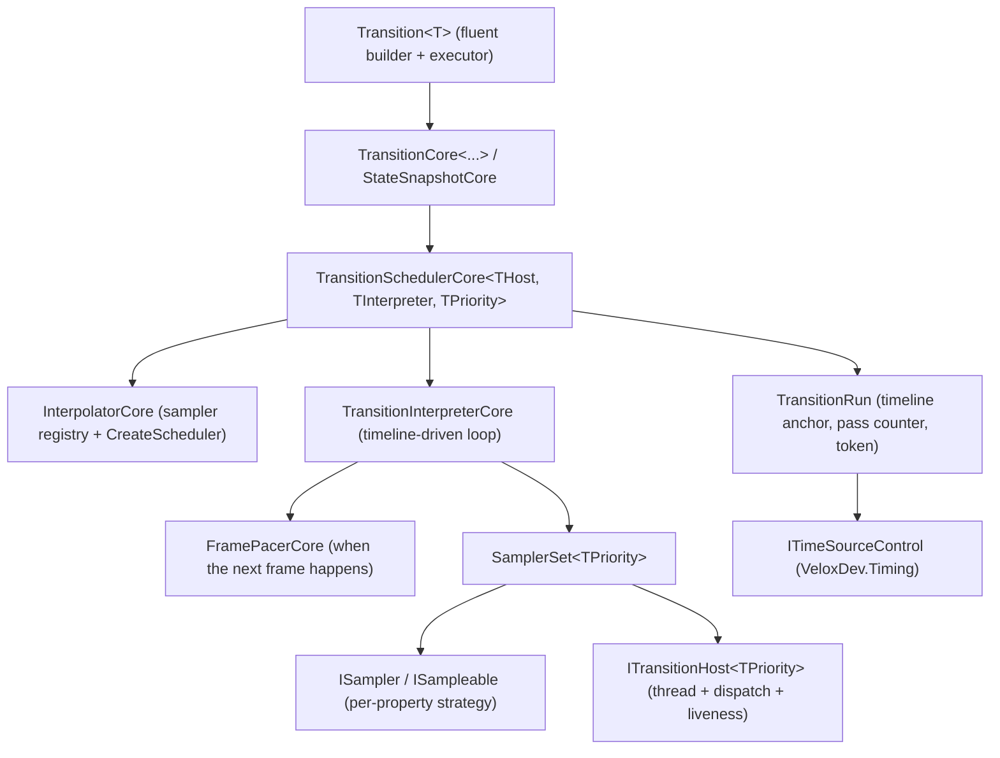

# Design Patterns — Transition

The Transition feature is a framework-agnostic animation engine. Its core lives in `Src/Core/VeloxDev.Core/TransitionSystem/**` (abstract/generic "core" types in the `VeloxDev.TransitionSystem.Abstractions` namespace, engine contracts in `Src/Core/VeloxDev.Core/Interfaces/TransitionSystem/**`, native samplers under `TransitionSystem/NativeSamplers/**`), plus two Core subsystems it stands on: the clock (`VeloxDev.Timing`) and the host seam (`VeloxDev.Threading` / `VeloxDev.Lifetime`). It is UI-thread aware but has no reference to any concrete UI stack. Every UI framework is reached through a per-platform adapter package under `Src/Adapters/VeloxDev.*/PlatformAdapters` (WPF, Avalonia, WinUI, MAUI, WinForms, Razor, Jalium), and each platform is exercised by a demo under `Examples/Transition/**`.

The core is a **single generic family**: the host's dispatcher priority travels as a type parameter (`DispatcherPriority`, `DispatcherQueuePriority`, …), and a host that has none fills it with the marker struct `NonPriority`. WPF/Avalonia/Jalium/WinUI pass their priority type; MAUI/WinForms/Razor pass `NonPriority`.

## Top-level shape

```mermaid
flowchart TD
    Builder["Transition&lt;T&gt; (fluent builder + executor)"] --> Core["TransitionCore&lt;...&gt; / StateSnapshotCore"]
    Core --> Scheduler["TransitionSchedulerCore&lt;THost, TInterpreter, TPriority&gt;"]
    Scheduler --> Registry["InterpolatorCore (sampler registry + CreateScheduler)"]
    Scheduler --> Interp["TransitionInterpreterCore (timeline-driven loop)"]
    Interp --> Pacer["FramePacerCore (when the next frame happens)"]
    Interp --> Set["SamplerSet&lt;TPriority&gt;"]
    Set --> Sampler["ISampler / ISampleable (per-property strategy)"]
    Set --> Host["ITransitionHost&lt;TPriority&gt; (thread + dispatch + liveness)"]
    Scheduler --> Run["TransitionRun (timeline anchor, pass counter, token)"]
    Run --> Timeline["ITimeSourceControl (VeloxDev.Timing)"]
```

## Sub-pages

- [sampler-strategy](00_sampler-strategy/index.md) — the value-interpolation strategy set: `ISampler`, the `InterpolatorCore` registry (and its resolution order), `ISampleable` + `StructAssembler`, and `BoundedProgress`.
- [host-and-timeline](01_host-and-timeline/index.md) — the host seam (`ITransitionHost` / `IThreadDispatcher` / `TransitionHostBase`), the `FramePacerCore` Template Method, and the `VeloxDev.Timing` clock behind it.
- [builder-and-scheduler](02_builder-and-scheduler/index.md) — the fluent builder + segment chain, the Composite timeline, the scheduler's registry tables, and `Repeat`'s `ExecuteCapturing` / `Replay` pair.

## Pattern summary

| Pattern | Where it appears | Role |
|---|---|---|
| Fluent Builder + chain | `Transition<T>` / `TransitionCore<…>.next` | Describe a target state + segment timing without mutable config objects |
| Composite | the `next` chain; `Repeat` | Compose a multi-segment timeline, with nested loops |
| Registry | `InterpolatorCore` `RegisterInterpolator` / `TryGetInterpolator` | Map a property type to an `ISampler` at runtime; nearest base class then name-ordered interfaces |
| Strategy | `IEaseCalculator`/`Eases`, `ISampler`, `ISampleable` | Swap easing, per-type interpolation and struct assembly without changing the engine |
| Template Method / policy | `TransitionCore<…>`, `TransitionSchedulerCore<…>`, `TransitionInterpreterCore<…>`, `ThreadDispatcherBase<…>` | Fix the skeleton; adapters and hosts supply platform specifics via generics |
| Adapter | per-platform `PlatformAdapters/*`; `TransitionHostBase<…>` | Bridge the engine to one UI framework's types, dispatcher and timers |
| Abstract factory with an honest `null` | `InterpolatorCore.CreateScheduler` | Hand a caller that holds only `object` the platform's scheduler composition |
| Registry of schedulers + weak cache | `TransitionSchedulerCore.MutualSchedulers` / `NoMutualSchedulers` | One serialized animation per target; no leaks |
| Observer | `TransitionEffectCore` events + `WeakDelegate` | Observe lifecycle (and diagnostics) without polling |
| Park/wake (monitor without a monitor) | `ITimeSource.WaitWhileStalledAsync` + `ITimeSourceControl.Wake` | A stalled consumer costs no wake-ups; a seek or a stop still reaches it |
| Null Object | `ThreadRef.None`, `NonPriority`, a `null` `FramePacerCore` | "No thread", "no priority", "no host pacer" are values, not failures |

Sources: `Src/Core/VeloxDev.Core/TransitionSystem/*.cs`, `Src/Core/VeloxDev.Core/Timing/*.cs`, `Src/Core/VeloxDev.Core/Threading/*.cs`, `Src/Core/VeloxDev.Core/Interfaces/TransitionSystem/*.cs`, `Src/Core/VeloxDev.Core.Test/TransitionSystem/*.cs`, `Src/Adapters/VeloxDev.{WPF,Avalonia,WinUI,MAUI,WinForms,Razor,Jalium}/PlatformAdapters/*.cs`, `Examples/Transition/WPF/Demo/MainWindow.xaml.cs`, `Examples/Transition/AUTO TEST/**`.

Related analysis: [Data flow — Transition](../../03_data-flow/03_transition/index.md) · [Complexity — Transition](../../04_complexity/03_transition/index.md)
