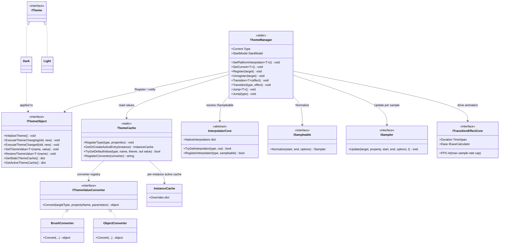

# Design Patterns — Dynamic Theme

The Dynamic Theme feature combines declaration-driven configuration (source-generated), a runtime registry, and a strategy-based interpolation engine from the TransitionSystem.

## Class Diagram



## Patterns Identified

| Pattern | Where | Role |
|---|---|---|
| Facade | `ThemeManager` | Static façade over `ThemeCache` (storage), `InterpolatorCore` (animation), and the `IThemeObject` registry. Callers only see `Transition<T>` / `Jump<T>` / `SetPlatformInterpolator`. |
| Observer | `IThemeObject` (generated) | `ThemeManager.Transition(Type, effect)` iterates registered `IThemeObject`s, calling `ExecuteThemeChanging(old, new)` before the animation and `ExecuteThemeChanged(old, new)` after. The generated implementation forwards to the user's `partial void OnThemeChanging` / `partial void OnThemeChanged`. |
| Template Method | source-generated `IThemeObject` | `InitializeTheme()` is a fixed algorithm (register type in `ThemeCache` → `ThemeManager.Register(this)` → apply current theme values); the user plugs in only per-property values via `[ThemeConfig]`. The generator emits `virtual`/`partial` hooks (`OnThemeChanging`, `OnThemeChanged`) so base classes can extend it. |
| Strategy | `StartModel` | `ThemeManager.StartModel` (`Reflect` vs `Cache`) selects how each property's animation **start value** is resolved — reflection over the live property vs. the cached value for the current theme. |
| Strategy / Converter | `IThemeValueConverter` | `Convert(Type, string, object?[])` adapts raw string/numeric parameters to platform types (`Brush`, `Thickness`, ...). Samplers follow the `ISampleable` / `ISampler` strategy: `PrepareSamplers` resolves each property's `ISampleable` and calls `Normalize` once; `ExecuteTransition` drives `ISampler.Update` per sample. `Eases.*` returns `IEaseCalculator` strategies used to ease the normalized time during sampling. |
| Registry (weak) | `ThemeManager` + `ThemeCache` | `ThemeManager` keeps live instances in `ConditionalWeakTable` + a `List<WeakReference<IThemeObject>>` (pruned on each transition); `ThemeCache` uses a `ConditionalWeakTable<IThemeObject, InstanceCache>` for per-instance overrides — no strong refs, so registration never leaks. |
| Adapter | platform adapters | `Interpolator`, `TransitionEffect`, and the value converters implement core contracts (`InterpolatorCore`, `ITransitionEffectCore`, `IThemeValueConverter`), keeping the core engine GUI-agnostic. |
| Cache | `ThemeCache` | Single global store keyed by declaring type eliminates per-class generated static dictionaries; inheritance chains are walked on lookup. |

## Pattern Evidence

### Observer (theme change notification)

```csharp
// Src/Core/VeloxDev.Core/DynamicTheme/ThemeManager.cs (Transition)
foreach (var themeObject in actives)
    themeObject?.ExecuteThemeChanging(current, themeType);
await ExecuteTransition(PrepareSamplers(actives, themeType), effect.Ease, effect.Duration.TotalMilliseconds, themeType);
foreach (var themeObject in actives)
    themeObject?.ExecuteThemeChanged(current, themeType);
```

### Registry (WeakReference tracking)

```csharp
// Src/Core/VeloxDev.Core/DynamicTheme/ThemeManager.cs (Register / Transition)
_activeCache.Add(target, cache);
activeThemes.Add(new WeakReference<IThemeObject>(target));
// ...
CancleTransition();
activeThemes.RemoveAll(x => !x.TryGetTarget(out _));
var actives = activeThemes.Select(x => x.TryGetTarget(out var obj) ? obj : null).Where(x => x != null).ToArray();
```

### Strategy (StartModel start value)

```csharp
// Src/Core/VeloxDev.Core/DynamicTheme/ThemeManager.cs (PrepareSamplers)
switch (StartModel)
{
    case StartModel.Reflect:
        currentValue = propertyInfo.GetValue(target);
        hasCurrentValue = true;
        break;
    case StartModel.Cache:
        // active cache first, then static values for Current
        if (activeTypeCache.TryGetValue(Current, out currentValue)) hasCurrentValue = true;
        else if (typeValues.TryGetValue(Current, out currentValue)) hasCurrentValue = true;
        break;
}
```

After resolving the `ISampleable`, `PrepareSamplers` calls `Normalize(current, targetValue, options)` once per property to obtain the stateless `ISampler`; `ExecuteTransition` then calls `sampler.Update(target, property, current, targetValue, options, easedT)` on each Stopwatch-driven sample.

> Source references: `Src/Core/VeloxDev.Core/DynamicTheme/ThemeManager.cs`, `Src/Core/VeloxDev.Core/DynamicTheme/ThemeCache.cs`, `Src/Core/VeloxDev.Core/Interfaces/DynamicTheme/*`, `Src/Adapters/VeloxDev.WPF/PlatformAdapters/ThemeValueConverters.cs`, `Examples/Theme/WPF/Demo/MainWindow.xaml.cs`.
