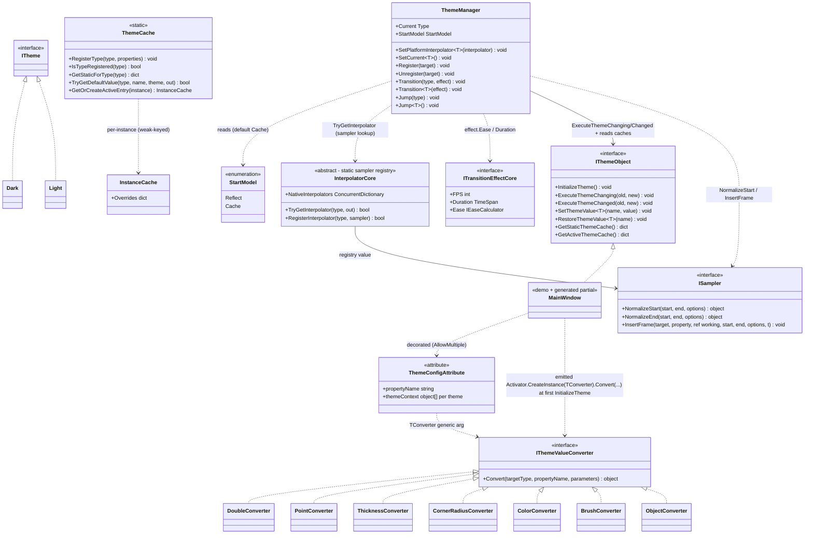

# Design Patterns — Dynamic Theme

Dynamic Theme switches theme-aware property values between theme definitions (`Dark` / `Light`) with an optional animated transition. It couples a declaration-driven source generator (`VeloxDev.Generators.Theme`, driven by `ThemeConfigAttribute<TConverter, TTheme...>`), a registry + cache pair (`ThemeManager` + `ThemeCache`), and delegates per-property interpolation to the TransitionSystem sampler registry (`InterpolatorCore` + `ISampler`), eased by the effect's `IEaseCalculator`. The attribute family ships six generic variants — one converter type plus two to seven `ITheme` marker types (`Src/Core/VeloxDev.Core/DynamicTheme/ThemeConfigAttribute.cs`); the demos and tests exercise the two-theme form (`TConverter, Light, Dark`).

## Class Diagram



> `ThemeManager` is a plain class whose API is used through static members; `ThemeCache` is a static class. `InterpolatorCore` is an abstract base whose platform subclass (e.g. WPF's `Interpolator`) registers native samplers, and which DynamicTheme reads via the static `TryGetInterpolator`. A generated `partial` class (e.g. the demo `MainWindow`) implements `IThemeObject` and wires them together. Source: `Src/Core/VeloxDev.Core/DynamicTheme/ThemeManager.cs`, `Src/Core/VeloxDev.Core/DynamicTheme/ThemeCache.cs`, `Src/Core/VeloxDev.Core/TransitionSystem/Interpolator.cs`, `Src/Core/VeloxDev.Core/Interfaces/TransitionSystem/ISampler.cs`.

**Converter sets are platform-supplied.** The seven `IThemeValueConverter` classes above are the WPF set (`Src/Adapters/VeloxDev.WPF/PlatformAdapters/ThemeValueConverters.cs`). Avalonia, MAUI and WinUI ship the same seven (`Double`, `Point`, `Thickness`, `CornerRadius`, `Color`, `Brush`, `Object`). `VeloxDev.WinForms` ships a `System.Drawing`-oriented set — `Double`, `Int`, `Float`, `Point`, `PointF`, `Size`, `SizeF`, `Rectangle`, `RectangleF`, `Padding`, `Color`, `Font`, `Object` — and `VeloxDev.Razor` a minimal set (`Double`, `String`, `Int`, `Bool`). `VeloxDev.Jalium` ships **no** DynamicTheme layer (no value converters, no theme wiring). Every converter implements the core `IThemeValueConverter`, and each `[ThemeConfig]` declaration selects its set through the `TConverter` type argument, so the core stays GUI-agnostic. `ThemeCache` additionally keeps an optional shared-converter registry (`RegisterConverter` / `GetConverter`, keys like `__velox_global_converter_N__`), but the current generator does not consult it — it instantiates the converter inline via `Activator.CreateInstance` inside the emitted `InitializeTheme` (see below).

## Patterns Identified

| Pattern | Where | Role |
|---|---|---|
| Facade | `ThemeManager` | Static façade over value storage (`ThemeCache`), the sampler registry (`InterpolatorCore.NativeInterpolators`), and the registered-object list. Callers only see `Transition<T>` / `Jump<T>` / `Register` / `SetPlatformInterpolator`. |
| Template Method | source-generated `IThemeObject` impl | `InitializeTheme()` is a fixed algorithm (lazy `ThemeCache.RegisterType` → `ThemeManager.Register(this)` → apply current theme values). Subclasses add `[ThemeConfig]` properties and the generator chains `base.InitializeTheme()`; methods are emitted `virtual`, `override` (when an ancestor carries `[ThemeConfig]`), or non-virtual (when the class is `sealed`). |
| Hook / partial callback | generated `ExecuteThemeChanging/Changed` | `ThemeManager` calls `ExecuteThemeChanging(old, new)` before animating and `ExecuteThemeChanged(old, new)` after; the generated implementation forwards to the user's `partial void OnThemeChanging` / `partial void OnThemeChanged`. |
| Registry (weak) | `ThemeManager` | Live theme-aware instances live in a `ConditionalWeakTable` (dedupe) plus a `List<WeakReference<IThemeObject>>` pruned at each transition — registration never leaks. |
| Cache | `ThemeCache` | One global static store keyed by declaring type replaces per-class generated dictionaries; inheritance chains are walked on lookup. Runtime overrides use a separate `ConditionalWeakTable<IThemeObject, InstanceCache>`. |
| Strategy | `StartModel` | `Reflect` vs `Cache` selects how each property's animation start value is resolved (live reflection read vs cached value for the current theme). |
| Strategy (sampler) | `ISampler` | `PrepareSamplers` resolves one `ISampler` per property type from the registry (`TryGetInterpolator`); the sampler normalizes endpoints (`NormalizeStart`/`NormalizeEnd`) and `ExecuteTransition` drives `InsertFrame` per sample. `effect.Ease` (`IEaseCalculator`) eases the normalized time. |
| Adapter / Bridge | platform adapters | `Interpolator` subclasses `InterpolatorCore` and registers platform samplers (Brush, Thickness, ...); `TransitionEffect` implements `ITransitionEffectCore`; value converters implement `IThemeValueConverter`. The core stays GUI-agnostic — it depends only on TransitionSystem abstractions. |

## Pattern Evidence

### Weak registry — `Register` / transition pruning

```csharp
// Src/Core/VeloxDev.Core/DynamicTheme/ThemeManager.cs, lines 58-66 and 91-93
public static void Register(IThemeObject target)
{
    if (!_act_cache.TryGetValue(target, out _))
    {
        Dictionary<string, Dictionary<PropertyInfo, Dictionary<Type, object?>>>? cache = [];
        _act_cache.Add(target, cache);
        activeThemes.Add(new WeakReference<IThemeObject>(target));
    }
}
// ...
CancleTransition();
activeThemes.RemoveAll(x => !x.TryGetTarget(out _));
```

The instance is stored only in a `ConditionalWeakTable` (no strong reference) plus a `WeakReference` list. Dead entries are removed at the start of every transition, so an unreachable window is collected without manual `Unregister`.

### Hook ordering — notifications around the animation pass

```csharp
// Src/Core/VeloxDev.Core/DynamicTheme/ThemeManager.cs, lines 94-102
foreach (var themeObject in actives)
{
    themeObject?.ExecuteThemeChanging(current, themeType);
}
await ExecuteTransition(PrepareSamplers(actives, themeType), effect.Ease, effect.Duration.TotalMilliseconds, themeType);
foreach (var themeObject in actives)
{
    themeObject?.ExecuteThemeChanged(current, themeType);
}
```

The generator emits the interface methods so they call the user hooks first (`base` chain, then `OnThemeChanging/Changed` — `Src/Generators/VeloxDev.Core.Generator/Theme.cs`, lines 279-298). The demo supplies the user side:

```csharp
// Examples/Theme/WPF/Demo/MainWindow.xaml.cs, lines 60-63
partial void OnThemeChanged(Type? oldValue, Type? newValue)
{
    MessageBox.Show($"Theme changed from {oldValue?.Name} to {newValue?.Name}");
}
```

### Strategy — `StartModel.Cache` start value resolution

```csharp
// Src/Core/VeloxDev.Core/DynamicTheme/ThemeManager.cs, lines 215-228
case StartModel.Cache:
    // Cache mode
    if (activeCache.TryGetValue(propEntry.Key, out var activePropCache) &&
        activePropCache.TryGetValue(propertyInfo, out var activeTypeCache) &&
        activeTypeCache.TryGetValue(Current, out currentValue))
    {
        hasCurrentValue = true;
    }
    else if (typeValues.TryGetValue(Current, out currentValue))
    {
        hasCurrentValue = true;
    }
    break;
```

The `Reflect` branch (lines 201-213) instead reads the live value via `propertyInfo.GetValue(target)`. Both branches run inside `PrepareSamplers`; the target value is then looked up the same way but for the destination theme.

### Sampler strategy — registry lookup, then normalized endpoints

```csharp
// Src/Core/VeloxDev.Core/DynamicTheme/ThemeManager.cs, lines 269-294
ISampler? resolved = null;
try
{
    if (InterpolatorCore.TryGetInterpolator(propertyInfo.PropertyType, out var registered))
    {
        resolved = registered;
    }
}
catch (Exception ex)
{
    Debug.WriteLine($"[ThemeManager] Error resolving sampler for {propEntry.Key}: {ex.Message}");
}

var transitionProperty = TransitionProperty.FromProperty(propertyInfo);
object? normStart = currentValue;
object? normEnd = targetValue;
if (resolved != null)
{
    normStart = resolved.NormalizeStart(currentValue, targetValue, null);
    normEnd = resolved.NormalizeEnd(currentValue, targetValue, null);
}
entries.Add(new TransitionEntry(target, transitionProperty, resolved, normStart, normEnd));
```

With no registered sampler for the property type the transition degrades to a simple hold-then-switch: the current value is kept for the whole pass and the target value is written on the final sample. The per-frame writes happen through `ISampler.InsertFrame`, which routes them through a compiled `TransitionProperty.SetValue` (`Src/Core/VeloxDev.Core/TransitionSystem/TransitionProperty.cs`, lines 60-68).

> Source references: `Src/Core/VeloxDev.Core/DynamicTheme/ThemeManager.cs`, `Src/Core/VeloxDev.Core/DynamicTheme/ThemeCache.cs`, `Src/Core/VeloxDev.Core/Interfaces/DynamicTheme/*`, `Src/Generators/VeloxDev.Core.Generator/Theme.cs`, `Src/Adapters/VeloxDev.WPF/PlatformAdapters/ThemeValueConverters.cs`, `Examples/Theme/WPF/Demo/MainWindow.xaml.cs`.
