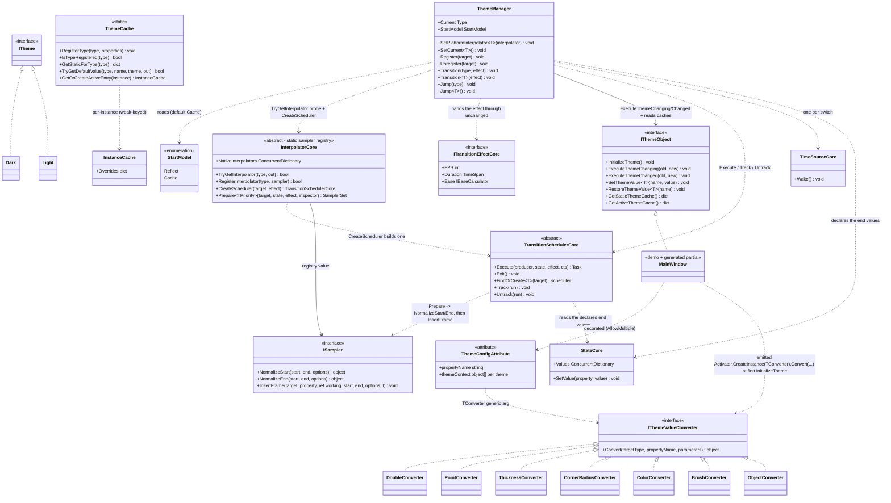

# Design Patterns — Dynamic Theme

Dynamic Theme switches theme-aware property values between theme definitions (`Dark` / `Light`) with an optional animated transition. It couples a declaration-driven source generator (`VeloxDev.Generators.Theme`, driven by `ThemeConfigAttribute<TConverter, TTheme...>`), a registry + cache pair (`ThemeManager` + `ThemeCache`), and the TransitionSystem itself: an animated switch is handed to a `TransitionSchedulerCore` the platform supplies through the `InterpolatorCore.CreateScheduler` virtual seam, and each property is interpolated by an `ISampler` from the shared sampler registry. The attribute family ships six generic variants — one converter type plus two to seven `ITheme` marker types (`Src/Core/VeloxDev.Core/DynamicTheme/ThemeConfigAttribute.cs`); the demos and tests exercise the two-theme form (`TConverter, Light, Dark`).

## Class Diagram



> `ThemeManager` is a plain class whose API is used through static members; `ThemeCache` is a static class. `InterpolatorCore` is an abstract base whose platform subclass (e.g. WPF's `Interpolator`) registers native samplers, and which DynamicTheme reads via the static `TryGetInterpolator`. The generic `TransitionSchedulerCore<TInspector, TInterpreter, TPriority>` is the closed form the platform actually builds; the diagram shows the non-generic base because that is the type `CreateScheduler` returns. A generated `partial` class (e.g. the demo `MainWindow`) implements `IThemeObject` and wires them together. Source: `Src/Core/VeloxDev.Core/DynamicTheme/ThemeManager.cs`, `Src/Core/VeloxDev.Core/DynamicTheme/ThemeCache.cs`, `Src/Core/VeloxDev.Core/TransitionSystem/Interpolator.cs`, `Src/Core/VeloxDev.Core/Interfaces/TransitionSystem/ISampler.cs`.

**Converter sets are platform-supplied.** The seven `IThemeValueConverter` classes above are the WPF set (`Src/Adapters/VeloxDev.WPF/PlatformAdapters/ThemeValueConverters.cs`). Avalonia, MAUI and WinUI ship the same seven (`Double`, `Point`, `Thickness`, `CornerRadius`, `Color`, `Brush`, `Object`). `VeloxDev.WinForms` ships a `System.Drawing`-oriented set — `Double`, `Int`, `Float`, `Point`, `PointF`, `Size`, `SizeF`, `Rectangle`, `RectangleF`, `Padding`, `Color`, `Font`, `Object` — and `VeloxDev.Razor` a minimal set (`Double`, `String`, `Int`, `Bool`). `VeloxDev.Jalium` ships **no** DynamicTheme layer (no value converters, no theme wiring). Every converter implements the core `IThemeValueConverter`, and each `[ThemeConfig]` declaration selects its set through the `TConverter` type argument, so the core stays GUI-agnostic. `ThemeCache` additionally keeps an optional shared-converter registry (`RegisterConverter` / `GetConverter`, keys like `__velox_global_converter_N__`), but the current generator does not consult it — it instantiates the converter inline via `Activator.CreateInstance` inside the emitted `InitializeTheme` (see below).

## Patterns Identified

| Pattern | Where | Role |
|---|---|---|
| Facade | `ThemeManager` | Static façade over value storage (`ThemeCache`), the sampler registry (`InterpolatorCore.NativeInterpolators`), the registered-object list, and the transition system's schedulers. Callers only see `Transition<T>` / `Jump<T>` / `Register` / `SetPlatformInterpolator`. |
| Virtual seam / Strategy | `InterpolatorCore.CreateScheduler` | One switch spans targets of many runtime types, so Core cannot name the type argument of a `Transition<T>` scheduler; the platform answers with the composition of inspector + interpreter + priority, and answers `null` for "not mine". |
| Shared transport | one `ITimeSourceControl` per switch | Every target of one switch is anchored to the same `ITimeSourceControl`; that is what lets the existing `TransitionCore.Pause` / `Seek` / `SetRate` / `Exit` surface reach a theme switch unchanged. |
| Template Method | source-generated `IThemeObject` impl | `InitializeTheme()` is a fixed algorithm (lazy `ThemeCache.RegisterType` → `ThemeManager.Register(this)` → apply current theme values). Subclasses add `[ThemeConfig]` properties and the generator chains `base.InitializeTheme()`; methods are emitted `virtual`, `override` (when an ancestor carries `[ThemeConfig]`), or non-virtual (when the class is `sealed`). |
| Hook / partial callback | generated `ExecuteThemeChanging/Changed` | `ThemeManager` calls `ExecuteThemeChanging(old, new)` before animating and `ExecuteThemeChanged(old, new)` **only when the switch reached its end**; the generated implementation forwards to the user's `partial void OnThemeChanging` / `partial void OnThemeChanged`. |
| Registry (weak) | `ThemeManager` | Live theme-aware instances live in a `ConditionalWeakTable` (dedupe) plus a `List<WeakReference<IThemeObject>>` pruned at each switch — registration never leaks. |
| Cache | `ThemeCache` | One global static store keyed by declaring type replaces per-class generated dictionaries; inheritance chains are walked on lookup. Runtime overrides use a separate `ConditionalWeakTable<IThemeObject, InstanceCache>`. |
| Strategy | `StartModel` | `Reflect` vs `Cache` selects how each property's animation start value is resolved (live reflection read vs cached value for the current theme). |
| Strategy (sampler) | `ISampler` | `PrepareSamplers` probes the registry once per property type to learn whether a sampler exists; the scheduler's `InterpolatorCore.Prepare` then resolves the actual `ISampler`, normalizes endpoints (`NormalizeStart`/`NormalizeEnd`) and drives `InsertFrame` per frame. `effect.Ease` (`IEaseCalculator`) eases the normalized time. |
| Memoized factory | `TransitionProperty.FromProperty` | The reflection-driven path factory returns a shared instance per `PropertyInfo`, so a switch over $N$ elements does not recompile $N$ expression trees. |
| Adapter / Bridge | platform adapters | `Interpolator` subclasses `InterpolatorCore` and registers platform samplers (Brush, Thickness, ...) and answers `CreateScheduler`; `TransitionEffect` implements `ITransitionEffectCore`; value converters implement `IThemeValueConverter`. The core stays GUI-agnostic — it depends only on TransitionSystem abstractions. |

## Pattern Evidence

### Weak registry — `Register` / `Unregister` / per-switch pruning

```csharp
// Src/Core/VeloxDev.Core/DynamicTheme/ThemeManager.cs — Register
public static void Register(IThemeObject target)
{
    if (!_act_cache.TryGetValue(target, out _))
    {
        Dictionary<string, Dictionary<PropertyInfo, Dictionary<Type, object?>>>? cache = [];
        _act_cache.Add(target, cache);
        activeThemes.Add(new WeakReference<IThemeObject>(target));
    }
}
```

```csharp
// Src/Core/VeloxDev.Core/DynamicTheme/ThemeManager.cs — Unregister
public static void Unregister(IThemeObject target)
{
    _act_cache.Remove(target);
    activeThemes.RemoveAll(x => x.TryGetTarget(out var obj) && obj == target);
}
```

The instance is stored only in a `ConditionalWeakTable` (no strong reference) plus a `WeakReference` list. Each switch prunes dead entries up front — `activeThemes.RemoveAll(x => !x.TryGetTarget(out _))` is the first thing both `Transition` and `Jump` do after `CancelActiveSwitch()` — so an unreachable window is collected without manual `Unregister`.

### Hook ordering — notifications around the switch, gated on landing

```csharp
// Src/Core/VeloxDev.Core/DynamicTheme/ThemeManager.cs — Transition
foreach (var themeObject in actives)
{
    themeObject?.ExecuteThemeChanging(current, themeType);
}

bool landed;
try
{
    landed = await RunSwitch(actives, themeType, effect);
}
catch (Exception ex)
{
    // async void 的调用方接不住异常，而 RunSwitch 里跑的是适配器的 scheduler —— 不能让它把进程带走。
    Debug.WriteLine($"[ThemeManager] Error during theme transition: {ex.Message}");
    return;
}

if (!landed)
{
    return;
}

foreach (var themeObject in actives)
{
    themeObject?.ExecuteThemeChanged(current, themeType);
}
```

`ExecuteThemeChanging` fires for the whole batch before any frame; `ExecuteThemeChanged` fires only when `RunSwitch` reports `true` — a switch that was cancelled or superseded announces nothing, because it did not land. The generator emits the interface methods so they call the user hooks first (`base` chain, then `OnThemeChanging/Changed` — `Src/Generators/VeloxDev.Core.Generator/Theme.cs`, lines 279-298). The minimal demo supplies the user side:

```csharp
// Examples/Theme/WPF Trimmed/Demo/MainWindow.xaml.cs, lines 60-63
partial void OnThemeChanged(Type? oldValue, Type? newValue)
{
    MessageBox.Show($"Theme changed from {oldValue?.Name} to {newValue?.Name}");
}
```

### Virtual seam — `CreateScheduler` answers `null`, not an exception

```csharp
// Src/Adapters/VeloxDev.WPF/PlatformAdapters/Interpolator.cs, lines 28-31
public override TransitionSchedulerCore? CreateScheduler(object target, ITransitionEffectCore effect)
    => effect is ITransitionEffect<DispatcherPriority>
        ? (TransitionSchedulerCore)TransitionSchedulerCore<UIThreadInspector, TransitionInterpreter, DispatcherPriority>.FindOrCreate(target)
        : null;
```

The default on `InterpolatorCore` returns `null` too (`CreateScheduler` is `public virtual`). Core cannot name the type argument the platform's scheduler is built from, because one switch covers targets of many runtime types; the platform is the only party that knows which inspector, interpreter and dispatcher priority make up the composition. `null` is the honest answer both for "this platform has not opted in" and for "this effect does not belong to this platform", and the caller applies the switch at once rather than animating half of it. The remarks on the base member require implementations to go through `FindOrCreate` rather than constructing a scheduler, because only that path files it under the target — which is what a later `Transition.Pause` / `Seek` / `Exit` looks up.

### Strategy — `StartModel.Cache` start value resolution

```csharp
// Src/Core/VeloxDev.Core/DynamicTheme/ThemeManager.cs — PrepareSamplers, StartModel.Cache branch
case StartModel.Cache:
    // Cache mode
    if (activeCache.TryGetValue(propEntry.Key, out var activePropCache) &&
        activePropCache.TryGetValue(propertyInfo, out var activeTypeCache) &&
        activeTypeCache.TryGetValue(Current, out currentValue))
    {
        hasCurrentValue = true;
    }
    else if (typeValues.TryGetValue(Current, out currentValue))
    {
        hasCurrentValue = true;
    }
    break;
```

The `StartModel.Reflect` branch instead reads the live value via `propertyInfo.GetValue(target)`. Both branches run inside `PrepareSamplers`; the target value is looked up the same way but for the destination theme. Note that the value prepared here is the **raw** start, not a normalized endpoint: the scheduler re-reads the start off the target in `InterpolatorCore.Prepare`, so normalizing it here would normalize it twice. `RunSwitch` calls `WriteStartValues` to put the prepared start back on the target before scheduling, which is what keeps the default `Cache` mode meaning "start from the current theme's value" rather than "start from whatever the target happens to hold".

### Sampler strategy — one probe at prepare, resolution at `Prepare`

```csharp
// Src/Core/VeloxDev.Core/DynamicTheme/ThemeManager.cs — PrepareSamplers
// 有没有采样器只在这里判一次，用途是决定收尾时要不要替 Prepare 补写终值 —— 采样器的解析
// 本身由 Prepare 在启动时重做，这里不预先归一化端点，否则就是归一化两次。
var hasSampler = InterpolatorCore.TryGetInterpolator(propertyInfo.PropertyType, out _);

group ??= new TargetEntries(target);
group.Entries.Add(new TransitionEntry(
    target,
    propertyInfo,
    TransitionProperty.FromProperty(propertyInfo),
    currentValue,
    targetValue,
    hasSampler));
```

`TransitionEntry` (private, nested in `ThemeManager`) carries `Target` / `PropertyInfo` / `TransitionProperty` / `StartValue` / `EndValue` / `HasSampler`; entries are grouped into `TargetEntries`, one group per target. No endpoint normalization happens at this level — the scheduler's `InterpolatorCore.Prepare` resolves the sampler and calls `NormalizeStart` / `NormalizeEnd` once the target exists. A property with no sampler is held for the whole pass and written on the final sample by `ApplyHeldValues`; a property whose end value is null is skipped by `BuildState`, so a theme that leaves a property alone does not drag a whole switch down. Per-frame writes go through a compiled `TransitionProperty.SetValue` (`Src/Core/VeloxDev.Core/TransitionSystem/TransitionProperty.cs`).

### Memoized factory — `TransitionProperty.FromProperty`

```csharp
// Src/Core/VeloxDev.Core/TransitionSystem/TransitionProperty.cs, lines 601-611
public static TransitionProperty FromProperty(PropertyInfo propertyInfo)
{
    if (propertyInfo is null)
    {
        throw new ArgumentNullException(nameof(propertyInfo));
    }

    return FromPropertyCache.GetOrAdd(propertyInfo, static info => new TransitionProperty([info]));
}

private static readonly ConcurrentDictionary<PropertyInfo, TransitionProperty> FromPropertyCache = new();
```

The theme system rebuilds a path for every themed property of every registered target on every switch, and a fresh `TransitionProperty` compiles its own getter and setter on first use. Measured in commit `58ae23b3 perf(theme): memoize TransitionProperty.FromProperty`: ~1.6 s of UI-thread stall and 29 MB allocated before the first frame for a thousand two-property elements, against ~10 ms and 6 MB after the memoization. Sharing is safe because a path is immutable and `BindTo` returns the instance itself when there are no index arguments to freeze.

> Source references: `Src/Core/VeloxDev.Core/DynamicTheme/ThemeManager.cs`, `Src/Core/VeloxDev.Core/DynamicTheme/ThemeCache.cs`, `Src/Core/VeloxDev.Core/Interfaces/DynamicTheme/*`, `Src/Core/VeloxDev.Core/TransitionSystem/Interpolator.cs`, `Src/Core/VeloxDev.Core/TransitionSystem/TransitionProperty.cs`, `Src/Generators/VeloxDev.Core.Generator/Theme.cs`, `Src/Adapters/VeloxDev.WPF/PlatformAdapters/ThemeValueConverters.cs`, `Examples/Theme/WPF Trimmed/Demo/MainWindow.xaml.cs`, `Examples/Theme/WPF/Demo/MainWindow.xaml.cs`.
