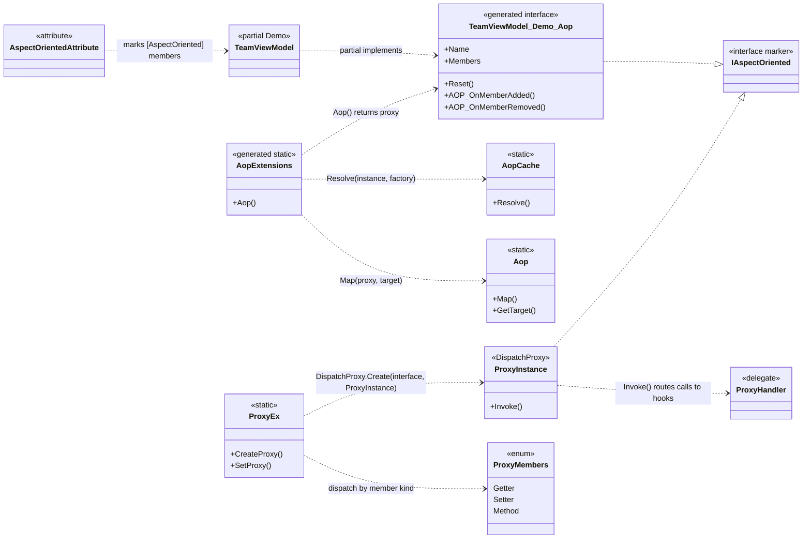

# Design Patterns — AOP

VELOXDEV AOP attaches cross-cutting behavior (interception, logging, validation) to plain classes **without rewriting their business methods**. It is built in two layers:

- **Compile time** — the `VeloxDev.Core.Generator` source generator reads `[AspectOriented]`-marked members and emits a typed *proxy interface* plus an `Aop()` factory extension.
- **Run time** — `ProxyInstance : DispatchProxy` intercepts every call routed through that interface and forwards it to registered handlers.

On top of these layers the feature composes five classic patterns: **Proxy**, **Decorator / Interceptor**, **Factory**, **Registry / Flyweight**, and **Marker Interface**.

> All runtime types below are in the `VeloxDev.AspectOriented` namespace of project `Src/Core/VeloxDev.Core`; the interface and factory extension are generated by the project `Src/Generators/VeloxDev.Core.Generator`.

## Class diagram

Attribute → generated proxy interface → `DispatchProxy` → handler:



> Types shown are those of the WPF demo (`Examples/AOP/WPF/Demo`), where `Demo.TeamViewModel` is the AOP class and `TeamViewModel_Demo_Aop` is the generated proxy interface.

## 1. Proxy pattern — `DispatchProxy` interception

`ProxyEx.CreateProxy<T>` hands the generated interface `T` to `DispatchProxy.Create<T, ProxyInstance>()`, then records the real target and the interface type on the returned proxy instance:

```csharp
// Src/Core/VeloxDev.Core/AspectOriented/ProxyEx.cs (lines 17-25)
public static T CreateProxy<T>(this T target) where T : IAspectOriented
{
    var type = typeof(T);
    dynamic proxy = DispatchProxy.Create<T, ProxyInstance>() ?? throw new InvalidOperationException();
    proxy._target = target;
    proxy._targetType = type;
    ProxyInstance.ProxyIDs.Add(proxy, proxy._localid);
    return proxy;
}
```

`DispatchProxy.Create<T, ProxyInstance>()` returns a stand-in object that the caller programs against as `T` (the generated interface). Every member call on that stand-in funnels into the single `ProxyInstance.Invoke` interception point, giving the caller a proxy that controls access to the real object (`ProxyInstance.cs` lines 23-53).

## 2. Decorator / Interceptor — `start` / `coverage` / `end` hooks

`SetProxy` classifies the target member with the `ProxyMembers` enum and writes a `(start, coverage, end)` handler triple into one of three per-instance dictionaries (`GetterActions` / `SetterActions` / `MethodActions`), keyed by the accessor name:

```csharp
// Src/Core/VeloxDev.Core/AspectOriented/ProxyEx.cs (lines 26-41)
public static void SetProxy<T>(this T target, ProxyMembers memberType, string memberName, ProxyHandler? start, ProxyHandler? coverage, ProxyHandler? end)
   where T : class, IAspectOriented
{
    switch (memberType)
    {
        case ProxyMembers.Getter:
            SetPropertyGetter(target, memberName, start, coverage, end);
            break;
        case ProxyMembers.Setter:
            SetPropertySetter(target, memberName, start, coverage, end);
            break;
        case ProxyMembers.Method:
            SetMethod(target, memberName, start, coverage, end);
            break;
    }
}
```

`ProxyInstance.Invoke` then decorates the member by running `start` → (`coverage`, or a reflection fallback to the real target) → `end`, chaining each result through the handler's `previous` parameter:

```csharp
// Src/Core/VeloxDev.Core/AspectOriented/ProxyInstance.cs (Invoke, method branch, lines 47-51)
MethodActions.TryGetValue(Name, out var actions);
var R0 = actions?.Item1?.Invoke(args, null);
var R1 = actions?.Item2 == null ? _targetType?.GetMethod(Name)?.Invoke(_target, args) : actions.Item2.Invoke(args, R0);
actions?.Item3?.Invoke(args, R1);
return R1;
```

- `Item1` (`start`) is **before advice** — it sees the call arguments but not the result.
- `Item2` (`coverage`) is the **decorator**: when non-null it receives `R0` and its own return value becomes the member's result, *replacing* the original logic.
- `Item3` (`end`) is **after advice** — it sees the final result `R1`.
- When `coverage == null` the proxy falls back to reflection over the real target — the same call shape, different strategy.

The WPF demo (`Examples/AOP/WPF/Demo/MainWindow.xaml.cs`, lines 45-95) registers exactly these roles on a `TeamViewModel`: a `start` hook logs each `Name` read, an `end` hook observes each `Name` write, and a `coverage` hook cancels the built-in `Reset()`.

## 3. Factory — `AopCache` + generated `Aop()` extension

One shared `ConditionalWeakTable<TClass, TInterface>` per `(TClass, TInterface)` pair is realized by CLR generic specialization (`AopCache.cs`, `Entry<TClass,TInterface>`), so no per-class cache code is generated. `AopCache.Resolve` is a get-or-create:

```csharp
// Src/Core/VeloxDev.Core/AspectOriented/AopCache.cs (lines 24-32)
public static TInterface Resolve<TClass, TInterface>(
    TClass instance,
    Func<TClass, TInterface> factory)
    where TInterface : class, IAspectOriented
    where TClass : class
{
    return Entry<TClass, TInterface>.Instances
        .GetValue(instance, k => factory(k));
}
```

The generated extension is the *factory object*: it calls `AopCache.Resolve`, creates the proxy via `ProxyEx.CreateProxy`, and registers the reverse mapping via `Aop.Map`. For the WPF demo class `Demo.TeamViewModel`, `AopWriter.WriteExtension` (`Src/Generators/VeloxDev.Core.Generator/Writers/AopWriter.cs`, lines 53-88) expands the template to:

```csharp
// Generated from AopWriter.cs lines 75-85, expanded for Demo.TeamViewModel
public static global::VeloxDev.AopInterfaces.TeamViewModel_Demo_Aop Aop(this global::Demo.TeamViewModel instance)
    => global::VeloxDev.AspectOriented.AopCache.Resolve<
        global::Demo.TeamViewModel,
        global::VeloxDev.AopInterfaces.TeamViewModel_Demo_Aop>(
        instance,
        static x =>
        {
            var p = global::VeloxDev.AspectOriented.ProxyEx.CreateProxy<global::VeloxDev.AopInterfaces.TeamViewModel_Demo_Aop>(x);
            global::VeloxDev.AspectOriented.Aop.Map(p, x);
            return p;
        });
```

The demo uses it with no business change — hook registration lives entirely in `MainWindow.ConfigureAOP` (`MainWindow.xaml.cs` lines 45-95):

```csharp
// Examples/AOP/WPF/Demo/MainWindow.xaml.cs (lines 45-68)
private static void ConfigureAOP(TeamViewModel data)
{
    var p = data.Aop();

    /* Before hook: before Name is read */
    p.SetProxy(ProxyMembers.Getter,
        nameof(TeamViewModel.Name),
        (_, _) => { MessageBox.Show($"a read operation happened at [{DateTime.Now}]"); return null; },
        null,
        null);

    /* Override original logic: when Reset() is called */
    p.SetProxy(ProxyMembers.Method,
        nameof(TeamViewModel.Reset),
        null,
        (_, _) => { MessageBox.Show($"the default Reset() has been cancelled"); return null; },
        null);
}
```

## 4. Registry / Flyweight — weak identity maps

`AopCache.Entry<TClass,TInterface>.Instances` doubles as a **flyweight/identity map**: `AopCache.Resolve` returns the same proxy instance for the same target, so each target gets exactly one proxy. `Aop` maintains the reverse **registry** (proxy → target) used by `GetTarget`:

```csharp
// Src/Core/VeloxDev.Core/AspectOriented/Aop.cs (lines 19-26)
public static void Map(object proxy, object target)
    => _proxyToTarget.Add(proxy, target);

public static TTarget? GetTarget<TTarget>(IAspectOriented proxy) where TTarget : class
    => _proxyToTarget.TryGetValue(proxy, out var t) ? (TTarget)t : null;
```

Both tables are `ConditionalWeakTable`s. (The keys are weak; see the [complexity analysis](../../04_complexity/05_aop/index.md) for how the static `ProxyInstance.ProxyInstances` / `ProxyIDs` registries interact with that design.)

## 5. Marker Interface & classification

`IAspectOriented` is an empty marker interface that doubles as the generic constraint for `CreateProxy` / `SetProxy` / `AopCache.Resolve`. The generated proxy interface, `ProxyInstance`, and any object handed to `GetTarget` all derive from it:

```csharp
// Src/Core/VeloxDev.Core/Interfaces/AspectOriented/IAspectOriented.cs (lines 5-8)
public interface IAspectOriented
{
}
```

The `[AspectOriented]` attribute (`AspectOrientedAttribute.cs`, usable on methods, properties and fields) selects which members the generator exposes, and the `ProxyMembers` enum classifies them as getter / setter / method at hook-registration time.

## Pattern summary

| Pattern | Participant(s) | Role |
|---|---|---|
| Proxy | `ProxyInstance : DispatchProxy`, generated `{Class}_{Ns}_Aop` interface | Stand-in object intercepting every member call on behalf of the real target |
| Decorator / Interceptor | `ProxyHandler` (`start` / `coverage` / `end`) | Wraps a member with before / replace / after behavior; a non-null `coverage` replaces the logic entirely |
| Factory | `AopCache.Resolve` + generated `Aop()` extension | Creates and caches exactly one proxy per target instance |
| Registry / Flyweight | `AopCache.Entry<TClass,TInterface>` (per-pair CWT), `Aop` (proxy → target CWT) | Shares proxy instances and supports reverse lookup |
| Marker Interface | `IAspectOriented`, `[AspectOriented]` attribute | Type-level flag + generic constraint; member-level selection for the generator |

> Source references: `Src/Core/VeloxDev.Core/AspectOriented/{ProxyEx,ProxyInstance,AopCache,Aop,AspectOrientedAttribute}.cs`, `Src/Core/VeloxDev.Core/Interfaces/AspectOriented/IAspectOriented.cs`, `Src/Generators/VeloxDev.Core.Generator/{AopInterface,AopProxy}.cs`, `Src/Generators/VeloxDev.Core.Generator/Writers/AopWriter.cs`, `Examples/AOP/WPF/Demo/MainWindow.xaml.cs`.
