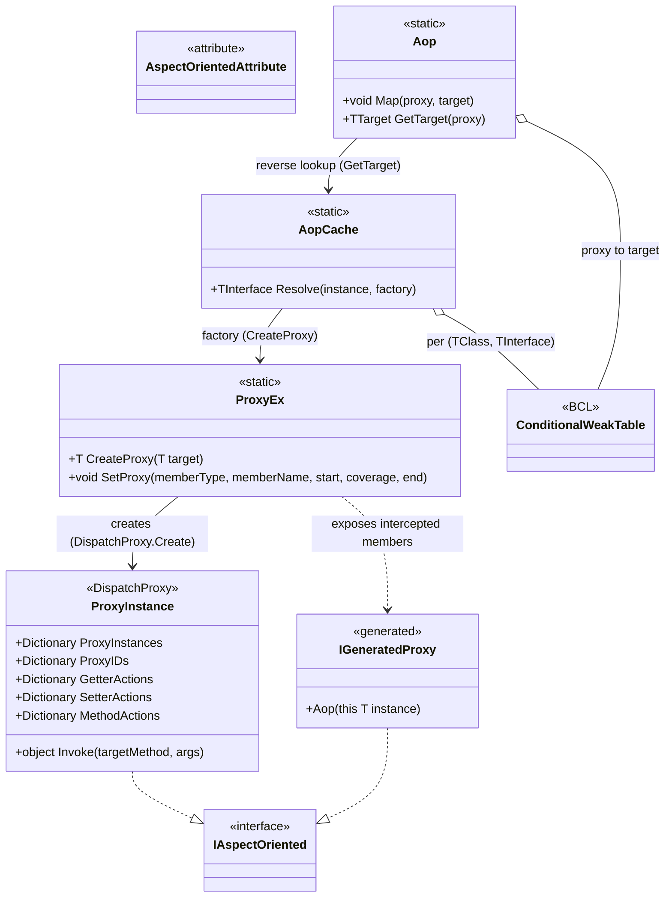

# Design Patterns — AOP

The AOP subsystem composes four classic patterns around a compile-time-generated proxy: **Proxy**, **Decorator/Interceptor**, **Factory/Registry** (via a per-pair weak table), and the **Marker Interface**.



## 1. Proxy Pattern — `DispatchProxy` interception

`ProxyEx.CreateProxy<T>` hands the generated interface `T` to `DispatchProxy.Create<T, ProxyInstance>()`, then records the real target and its interface type on the proxy instance:

```csharp
// Src/Core/VeloxDev.Core/AspectOriented/ProxyEx.cs (lines 16-25)
public static T CreateProxy<T>(this T target) where T : IAspectOriented
{
    var type = typeof(T);
    dynamic proxy = DispatchProxy.Create<T, ProxyInstance>() ?? throw new InvalidOperationException();
    proxy._target = target;
    proxy._targetType = type;
    ProxyInstance.ProxyIDs.Add(proxy, proxy._localid);
    return proxy;
}
```

Every call on the proxy funnels into the single `ProxyInstance.Invoke` interception point, giving the client a stand-in that controls access to the real object.

## 2. Decorator / Interceptor — start / coverage / end hooks

`SetProxy` writes a `(start, coverage, end)` triple into one of the three hook tables (`GetterActions` / `SetterActions` / `MethodActions`). `ProxyInstance.Invoke` decorates the member by running `start` → (`coverage`, or reflection fallback) → `end`, chaining the return value through the `previous` parameter:

```csharp
// Src/Core/VeloxDev.Core/AspectOriented/ProxyInstance.cs (lines 29-35, getter branch)
var R0 = actions?.Item1?.Invoke(args, null);
var R1 = actions?.Item2 == null ? _targetType?.GetMethod(Name)?.Invoke(_target, args) : actions.Item2.Invoke(args, R0);
actions?.Item3?.Invoke(args, R1);
return R1;
```

A non-null `coverage` handler is a **decorator**: it receives the `start` result `R0` and its own return value `R1` becomes the member's result, bypassing the original logic. When `coverage == null`, the proxy falls back to reflection over the real target — the same call shape, different strategy.

## 3. Factory / Registry / Flyweight — `AopCache` with `ConditionalWeakTable`

One shared `ConditionalWeakTable<TClass, TInterface>` per `(TClass, TInterface)` pair is realized by CLR generic specialization — no per-class generated cache code is needed. The proxy is created once per target and garbage-collected with it:

```csharp
// Src/Core/VeloxDev.Core/AspectOriented/AopCache.cs (lines 14-32)
private static class Entry<TClass, TInterface>
    where TClass : class
    where TInterface : class, IAspectOriented
{
    public static readonly ConditionalWeakTable<TClass, TInterface> Instances = [];
}
// ...
return Entry<TClass, TInterface>.Instances.GetValue(instance, k => factory(k));
```

The generated `Aop()` extension acts as the factory that feeds `AopCache.Resolve`; `Aop.Map` maintains the reverse proxy-to-target registry:

```csharp
// Src/Generators/VeloxDev.Core.Generator/Writers/AopWriter.cs (lines 75-87, excerpt)
public static Counter_AopDemo_Aop Aop(this global::AopDemo.Counter instance)
    => global::VeloxDev.AspectOriented.AopCache.Resolve<
        global::AopDemo.Counter,
        global::VeloxDev.AopInterfaces.Counter_AopDemo_Aop>(
        instance,
        static x =>
        {
            var p = global::VeloxDev.AspectOriented.ProxyEx.CreateProxy<global::VeloxDev.AopInterfaces.Counter_AopDemo_Aop>(x);
            global::VeloxDev.AspectOriented.Aop.Map(p, x);
            return p;
        });
```

## 4. Marker Interface — `IAspectOriented`

`IAspectOriented` is an empty interface that marks a type as proxy-capable and serves as the generic constraint for `CreateProxy` / `SetProxy` / `GetTarget`. Both the generated proxy interface and `ProxyInstance` derive from it, so the hook-registration helpers can accept either side.

## Pattern summary

| Pattern | Participant(s) | Role |
|---|---|---|
| Proxy | `ProxyInstance : DispatchProxy`, generated `{Class}_{Ns}_Aop` interface | Stand-in object intercepting every member call on behalf of the real target |
| Decorator / Interceptor | `ProxyHandler` (start / coverage / end) | Wraps a member with before / replace / after behavior; `coverage` can replace the logic entirely |
| Factory | `AopCache.Resolve` + generated `Aop()` extension | Creates and caches exactly one proxy per target instance |
| Registry / Flyweight | `AopCache.Entry<TClass,TInterface>` (per-pair CWT), `Aop` (proxy→target CWT) | Shares proxy instances and supports reverse lookup |
| Marker Interface | `IAspectOriented` | Type-level flag + generic constraint |

> Source references: `Src/Core/VeloxDev.Core/AspectOriented/{ProxyEx,ProxyInstance,AopCache,Aop}.cs`, `Src/Core/VeloxDev.Core/Interfaces/AspectOriented/IAspectOriented.cs`, `Src/Generators/VeloxDev.Core.Generator/Writers/AopWriter.cs`, `Examples/AOP/WPF/Demo/MainWindow.xaml.cs`.
