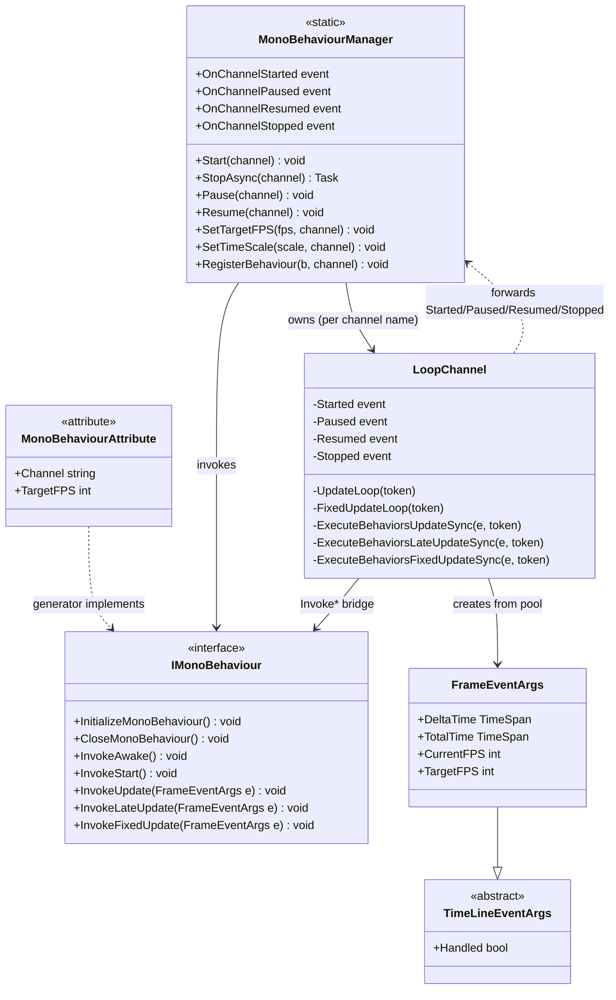

# Design Patterns — MonoBehaviour

The `VeloxDev.TimeLine` frame loop combines a Template Method skeleton (the loop lives in the manager, the variable steps in user partial methods), a Publisher-Subscriber event surface, a pooled event-argument type, and the weak-interaction contract defined by `IMonoBehaviour`.



## 1. Template Method — frame-loop lifecycle

The frame loop's skeleton is fixed in `LoopChannel.UpdateLoop` / `FixedUpdateLoop`; the variable steps are the user's partial hooks `Awake` / `Start` / `Update` / `LateUpdate` / `FixedUpdate`.

```csharp
// Src/Generators/VeloxDev.Core.Generator/Writers/MonoWriter.cs (lines 80-121)
public void InitializeMonoBehaviour()
{
    VeloxDev.TimeLine.MonoBehaviourManager.RegisterBehaviour(this, "default");
}

public void InvokeUpdate(VeloxDev.TimeLine.FrameEventArgs e)
{
    Update(e);
}
// ...
partial void Awake();
partial void Start();
partial void Update(VeloxDev.TimeLine.FrameEventArgs e);
partial void LateUpdate(VeloxDev.TimeLine.FrameEventArgs e);
partial void FixedUpdate(VeloxDev.TimeLine.FrameEventArgs e);
```

| Role | Element |
|---|---|
| Skeleton (invariant algorithm) | `LoopChannel.UpdateLoop` / `FixedUpdateLoop` — pacing, config processing, error isolation |
| Hook methods | `partial void Awake/Start/Update/LateUpdate/FixedUpdate` |
| Bridge | Generated `Invoke*` methods on the `[MonoBehaviour]` class |
| Registration | Generated `InitializeMonoBehaviour()` / `CloseMonoBehaviour()` |

Source: `MonoBehaviourManager.cs` lines 443-488 (UpdateLoop), 394-441 (FixedUpdateLoop), 610-656 (execution loops).

## 2. Lifecycle Hook — Awake / Start / Update / LateUpdate / FixedUpdate

The manager invokes `InvokeAwake()` then `InvokeStart()` when a behaviour is added (`ProcessAddedBehaviors`, lines 710-726), and then per frame `InvokeUpdate` → `InvokeLateUpdate` on the update thread and `InvokeFixedUpdate` on the fixed thread.

```csharp
// Src/Core/VeloxDev.Core/TimeLine/MonoBehaviourManager.cs (lines 710-726)
wrapper.Reset(behavior, Interlocked.Increment(ref _instanceCounter));
_behaviors[RuntimeHelpers.GetHashCode(behavior)] = wrapper;
SafeExecute(behavior.InvokeAwake);
SafeExecute(behavior.InvokeStart);
added = true;
```

| Hook | Thread | Frequency |
|---|---|---|
| `Awake` | update thread | Once, on registration |
| `Start` | update thread | Once, immediately after `Awake` |
| `Update` | update thread | Every frame |
| `LateUpdate` | update thread | Every frame, after all `Update` |
| `FixedUpdate` | fixed thread | Every `SetFixedUpdateInterval` ms (default 16) |

## 3. Publisher-Subscriber — channel lifecycle events

`LoopChannel` exposes `Started` / `Paused` / `Resumed` / `Stopped`; the static `MonoBehaviourManager` forwards them as `OnChannelStarted` / `OnChannelPaused` / `OnChannelResumed` / `OnChannelStopped`, carrying a `MonoBehaviourChannelEventArgs` with the channel name.

```csharp
// Src/Core/VeloxDev.Core/TimeLine/MonoBehaviourManager.cs (lines 987-991)
ch.Started += (s, e) => OnChannelStarted?.Invoke(s, new MonoBehaviourChannelEventArgs(n));
ch.Paused  += (s, e) => OnChannelPaused?.Invoke(s, new MonoBehaviourChannelEventArgs(n));
ch.Resumed += (s, e) => OnChannelResumed?.Invoke(s, new MonoBehaviourChannelEventArgs(n));
ch.Stopped += (s, e) => OnChannelStopped?.Invoke(s, new MonoBehaviourChannelEventArgs(n));
```

Subscribers observe the whole manager (all channels), filtering by `ChannelName` if needed.

## 4. Object Pool — pooled `FrameEventArgs`

`FrameEventArgs` instances are drawn from a per-channel `ObjectPool<FrameEventArgs>` (default size 50) and returned after each frame, avoiding per-frame allocation in the hot loop.

```csharp
// Src/Core/VeloxDev.Core/TimeLine/MonoBehaviourManager.cs (lines 744-754)
private FrameEventArgs CreateFrameEventArgs(long deltaTime)
{
    var frameArgs = _frameEventArgsPool.Get();
    frameArgs.DeltaTime = ScaleDuration(ConvertStopwatchTicksToTimeSpan(deltaTime), ts);
    frameArgs.Handled = false;
    return frameArgs;
}
```

> Source references: `Src/Core/VeloxDev.Core/TimeLine/MonoBehaviourManager.cs`, `Src/Generators/VeloxDev.Core.Generator/Writers/MonoWriter.cs`, `Examples/MonoBehaviour/WPF/Demo/MainWindow.xaml.cs`.
