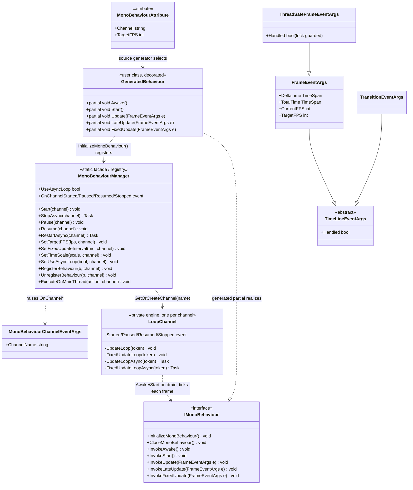

# Design Patterns — MonoBehaviour

`VeloxDev.TimeLine` runs a Unity-like, frame-driven lifecycle for classes decorated with `[MonoBehaviour]`. The static `MonoBehaviourManager` is a facade and channel registry / observable: it owns one named `LoopChannel` engine per channel and publishes channel state transitions. A Roslyn source generator turns the attribute into an `IMonoBehaviour` implementation whose entry points forward to the user's `partial void` hooks — the manager fixes the loop skeleton, the user supplies the variable steps (Template Method). The event-argument hierarchy is shared with the Transition system, and the hot-path argument type is pooled.



> Source: `Src/Core/VeloxDev.Core/TimeLine/MonoBehaviourManager.cs`, `.../Interfaces/MonoBehaviour/IMonoBehaviour.cs`, `Src/Generators/VeloxDev.Core.Generator/Writers/MonoWriter.cs`, `Examples/MonoBehaviour/WPF/Demo/MainWindow.xaml.cs`.

## 1. Template Method — frame-loop lifecycle

The loop skeleton is fixed in `LoopChannel`: `UpdateLoop` (lines 510-556) and `FixedUpdateLoop` (lines 447-508) drive the per-frame pacing, queue draining and error isolation; `UpdateLoopAsync` (623-688) / `FixedUpdateLoopAsync` (558-621) are async/`Task.Delay` twins used when async-loop mode is enabled. The variable steps are the user's `partial void Awake` / `Start` / `Update` / `LateUpdate` / `FixedUpdate` hooks. The source generator emits the bridge: each `Invoke*` method on the generated partial forwards the event args into the matching partial hook, and `InitializeMonoBehaviour()` / `CloseMonoBehaviour()` provide the registration / unregistration entry points. The generated code never calls them itself — the user invokes `InitializeMonoBehaviour()` from the constructor (as the demo does) and `CloseMonoBehaviour()` when the instance must leave the channel.

```csharp
// Src/Generators/VeloxDev.Core.Generator/Writers/MonoWriter.cs — MonoWriter.GenerateBody (lines 80-121)
public void InitializeMonoBehaviour()
{
    VeloxDev.TimeLine.MonoBehaviourManager.RegisterBehaviour(this, "default");
}

public void InvokeUpdate(VeloxDev.TimeLine.FrameEventArgs e)
{
    Update(e);
}
// ... InvokeAwake/InvokeStart/InvokeLateUpdate/InvokeFixedUpdate forward the same way,
//     and the generator declares the partial hooks:
partial void Awake();
partial void Start();
partial void Update(VeloxDev.TimeLine.FrameEventArgs e);
partial void LateUpdate(VeloxDev.TimeLine.FrameEventArgs e);
partial void FixedUpdate(VeloxDev.TimeLine.FrameEventArgs e);
```

When the attribute supplies a `fps >= 1` (positional second argument or named `TargetFPS`), `InitializeMonoBehaviour()` first calls `SetTargetFPS(fps, channel)` and only then `RegisterBehaviour(this, channel)`; `CloseMonoBehaviour()` calls `UnregisterBehaviour(this, channel)`.

| Role | Element |
|---|---|
| Skeleton (invariant algorithm) | `LoopChannel.UpdateLoop` / `FixedUpdateLoop` (thread) or `*Async` twins — pacing, config processing, error isolation |
| Hook methods | `partial void Awake` / `Start` / `Update` / `LateUpdate` / `FixedUpdate` |
| Bridge | Generated `Invoke*` methods on the `[MonoBehaviour]` class |
| Registration | Generated `InitializeMonoBehaviour()` / `CloseMonoBehaviour()` |

Source: `MonoBehaviourManager.cs` lines 510-556 (UpdateLoop), 447-508 (FixedUpdateLoop), 558-688 (async twins), 690-738 (per-behavior execution loops).

## 2. Lifecycle Hook — Awake / Start / Update / LateUpdate / FixedUpdate

Registration is deferred through a per-channel queue. When the update driver drains it (`ProcessAddedBehaviors`, lines 711-727) — the first frame after `Start` for pre-registered behaviours, or the next frame when added to a running channel — the manager invokes `InvokeAwake()` then `InvokeStart()` once each on the update driver.

```csharp
// Src/Core/VeloxDev.Core/TimeLine/MonoBehaviourManager.cs (lines 718-724)
var wrapper = _wrapperPool.Get();
wrapper.Reset(behavior, Interlocked.Increment(ref _instanceCounter));

_behaviors[RuntimeHelpers.GetHashCode(behavior)] = wrapper;
SafeExecute(behavior.InvokeAwake);
SafeExecute(behavior.InvokeStart);
added = true;
```

After registration, each frame calls `InvokeUpdate` → `InvokeLateUpdate` on the update driver and `InvokeFixedUpdate` on the fixed driver, which runs concurrently at its own interval.

| Hook | Driver | Frequency |
|---|---|---|
| `Awake` | update driver | Once, when the registration is drained |
| `Start` | update driver | Once, immediately after `Awake` |
| `Update` | update driver | Every frame |
| `LateUpdate` | update driver | Every frame, after all `Update` |
| `FixedUpdate` | fixed driver | Every `SetFixedUpdateInterval` ms (default 16), concurrent with the update driver |

## 3. Publisher-Subscriber / Observable — channel lifecycle events

`LoopChannel` exposes `Started` / `Paused` / `Resumed` / `Stopped`; `GetOrCreateChannel` (lines 983-994) subscribes them to the static manager events, re-raising each with a fresh `MonoBehaviourChannelEventArgs` that carries the channel name.

```csharp
// Src/Core/VeloxDev.Core/TimeLine/MonoBehaviourManager.cs (lines 988-991)
ch.Started += (s, e) => OnChannelStarted?.Invoke(s, new MonoBehaviourChannelEventArgs(n));
ch.Paused  += (s, e) => OnChannelPaused?.Invoke(s, new MonoBehaviourChannelEventArgs(n));
ch.Resumed += (s, e) => OnChannelResumed?.Invoke(s, new MonoBehaviourChannelEventArgs(n));
ch.Stopped += (s, e) => OnChannelStopped?.Invoke(s, new MonoBehaviourChannelEventArgs(n));
```

The manager is also the channel registry: channels are created lazily and held in a static `ConcurrentDictionary` (`ChannelNames` exposes them). Subscribers observe the whole manager and filter by `ChannelName` when they care about one channel.

## 4. Object Pool — pooled event args and request/registry objects

`LoopChannel` keeps three fixed-capacity object pools (default `DEFAULT_OBJECT_POOL_SIZE = 50`): `ObjectPool<FrameEventArgs>`, `ObjectPool<ConfigChangeRequest>` and `ObjectPool<BehaviorWrapper>`. `SetTargetFPS` draws a `ConfigChangeRequest` from the pool, fills it and enqueues it; the per-frame drain resets and returns it. The other two knobs no longer need one — `SetFixedUpdateInterval` hands a value to the fixed pump through a single volatile field, and `SetTimeScale` writes to the channel's time source directly. The behavior registry recycles `BehaviorWrapper` objects, and each frame draws one `FrameEventArgs` instead of allocating.

```csharp
// Src/Core/VeloxDev.Core/TimeLine/MonoBehaviourManager.cs (lines 825-835)
private FrameEventArgs CreateFrameEventArgs(TimeSpan delta, TimeSpan total)
{
    var frameArgs = _frameEventArgsPool.Get();
    frameArgs.DeltaTime = delta;
    frameArgs.TotalTime = total;
    frameArgs.CurrentFPS = _currentFPS;
    frameArgs.TargetFPS = Volatile.Read(ref _targetFPS);
    frameArgs.Handled = false;
    return frameArgs;
}
```

Both times are taken verbatim from one `TimeSample`, so neither is scaled here: the playback rate was applied by the clock that produced the sample. A `FixedUpdate` push goes through the same method and returns its args to the same pool as soon as the push is done — no queue carries them across to the update driver.

> Sibling analyses of the same feature: [Data Flow — MonoBehaviour](../../03_data-flow/06_monobehaviour/index.md) and [Complexity Analysis — MonoBehaviour](../../04_complexity/06_monobehaviour/index.md).
