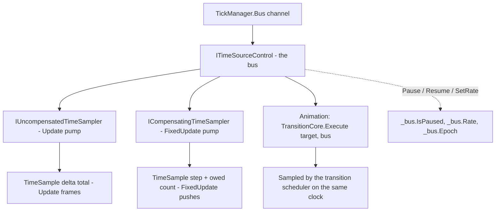

# Shared transport — one clock per channel

Each channel owns exactly one `ITimeSourceControl`, created when the channel is constructed and never replaced. Pause, resume, rate and epoch all live on that object rather than in channel fields, and `TickManager.Bus` publishes it. The effect is that a frame loop and an animation anchored to the same transport cannot disagree about what time it is.

| Element | Type | Source |
|---|---|---|
| The transport | `LoopChannel._bus` — `TimerCore.CreateTimeSource<ITimeSourceControl>()` | `TickManager.cs` 116 |
| Uncompensated sampler (Update) | `IUncompensatedTimeSampler _updateSampler` | `TickManager.cs` 119 |
| Compensating sampler (FixedUpdate) | `ICompensatingTimeSampler _fixedSampler` | `TickManager.cs` 122 |
| Public accessor | `TickManager.Bus(channel)` | `TickManager.cs` 1144-1145 |
| Consumer contract | `ITimeSourceControl` / `ITimeSource` | `Src/Core/VeloxDev.Core/Interfaces/Timing/` |



## Why the rate is not a channel field

`SetTimeScale` is a one-liner that forwards to the transport:

```csharp
// Src/Core/VeloxDev.Core/TimeLine/TickManager.cs (line 238)
public void SetTimeScale(float timeScale) => _bus.SetRate(timeScale);
```

The old shape had the rate as a channel field applied by the loop on the next config drain, with a clamp and a silent ignore outside the range. The current one inherits the transport's rule instead: no clamping, and a negative rate is rejected with `ArgumentOutOfRangeException` rather than dropped. `TickableBusTests.ANegativeTimeScaleIsRejectedRatherThanClamped` is the executable statement of that difference.

Two consequences follow from the rate living on the clock rather than in the channel:

- **It multiplies both consumers.** `TickableBusTests.TheChannelsRateScalesTheAnimationButNotTheFrameCadence` sets `4f` and asserts both that `TickManager.TimeScale(channel) == 4f` and that `bus.Rate == 4f` — one value, read from two places, because there is only one value.
- **It does not scale the frame cadence.** The target FPS constrains *sampling rhythm*, measured off the wall clock (`FrameRateControlSync` remarks, `TickManager.cs` line 838), so halving the rate does not halve the number of frames.

## Why both loops park instead of polling

Before this design a paused channel woke every 10 ms to re-read a pause flag. Now the pause is a property of the transport and the pumps wait on the transport's signal:

```csharp
// Src/Core/VeloxDev.Core/TimeLine/TickManager.cs (lines 520-524, inside UpdateLoop)
if (!_bus.IsAdvancing)
{
    _bus.WaitWhileStalledAsync(token).GetAwaiter().GetResult();
    continue;
}
```

The predicate is `IsAdvancing`, not `IsPaused`, and the distinction is deliberate. A rate of `0` freezes the clock *without* pausing it, so a loop testing `IsPaused` would keep spinning against a clock that never moves. `ITimeSource` documents `IsAdvancing` as an invariant rather than a formula: *true implies the position will move*.

This design has one cost, and the code pays it explicitly. "Has this thread been active recently" — the liveness heuristic — is necessarily false for a parked pump. `IsUpdateThreadAlive` therefore qualifies it:

```csharp
// Src/Core/VeloxDev.Core/TimeLine/TickManager.cs (lines 193-194)
public bool IsUpdateThreadAlive => _isRunning && _isUpdateThreadActive &&
    (!_bus.IsAdvancing || IsRecentActivity(Interlocked.Read(ref _updateThreadLastActivityTimestamp)));
```

`TickableBusTests.PausingAChannelStopsItsFramesAndResumingRestartsThem` asserts that both queries stay `true` across a pause, with the comment that a parked loop is alive, not dead.

## Resuming the transport, not the loop

`Start` and `StopAsync` both call `_bus.Resume()`:

```csharp
// Src/Core/VeloxDev.Core/TimeLine/TickManager.cs (line 293, inside Start)
// 启动要清掉上一个生命周期留下的暂停，与旧实现的 _isPaused = false 对齐。不清的话，
// 一个「暂停中被停掉」的渠道重启后会立刻 park，再也跑不起来。
_bus.Resume();
```

The transport is a long-lived object owned by the channel, so "a stop clears the pause" has to be done by hand where the old design got it for free by resetting an instance field on thread creation. `TickableBusTests.StartingAChannelClearsAPauseLeftOverFromTheLastLifecycle` covers exactly that regression.

The same call also re-anchors the samplers:

```csharp
// Src/Core/VeloxDev.Core/TimeLine/TickManager.cs (lines 288-289)
_updateSampler.Reset();
_fixedSampler.Reset();
```

which is why a frame delivered right after a restart carries one frame's `DeltaTime` rather than the whole downtime (`TickableBusTests.RestartingAChannelRePrimesItsClocks`).

Note what `Resume()` does **not** lift: a rate of `0`. After a frozen clock, `Resume` clears the paused flag and the channel stays parked, because `IsAdvancing` is still false. The bus's rule is deliberately not papered over in `LoopChannel.Resume` (lines 391-396).

## The consumer's side

`TickableBusTests.PausingAChannelStopsItsFramesAndTheAnimationAnchoredToIt` is the acceptance test for the whole design, and it is worth reading as a specification:

```csharp
var bus = TickManager.Bus(channel);
Assert.IsNotNull(bus, "a started channel must expose its transport");

var target = new Target();
TestTransition.Create()
    .Property(t => t.Value, 1d)
    .Effect(new TransitionEffectCore { Duration = TimeSpan.FromSeconds(30), FPS = 60 })
    .Execute(target, bus!); // 锚到渠道的同一条 transport
```

Then one `TickManager.Pause(channel)` and the assertion that neither the frame count nor the animation value moved. That is the executable definition of "the wiring connects the animation and the frame loop at once".

> Source: `Src/Core/VeloxDev.Core/TimeLine/TickManager.cs` lines 116, 119, 122, 187-197, 238, 288-293, 339, 384-402, 520-524, 1134-1145; `Src/Core/VeloxDev.Core/Interfaces/Timing/ITimeSource.cs`; `Src/Core/VeloxDev.Core.Test/TimeLine/TickableBusTests.cs` lines 112-243.
