# Facade, Registry and Publisher-Subscriber

`TickManager` plays three roles at once, and separating them is what keeps each one simple.

| Role | What it means here | Source |
|---|---|---|
| Façade | 34 public static members, all one-line forwards to a `LoopChannel` | `TickManager.cs` 1046-1156 |
| Registry | a static `ConcurrentDictionary<string, LoopChannel>` with a lazy factory | `TickManager.cs` 1017-1033 |
| Publisher | four static events, republished per channel | `TickManager.cs` 1024-1027 of the `GetOrAdd` factory, 1037-1042 |

```mermaid
flowchart LR
    U[User code] -->|static call, channel name| F[TickManager facade]
    F -->|GetOrCreateChannel| R["_channels ConcurrentDictionary string LoopChannel"]
    R -->|GetOrAdd factory, once per name| L[LoopChannel instance]
    L -->|Started / Paused / Resumed / Stopped| A[anonymous forwarder]
    A -->|new TickChannelEventArgs name| P["static OnChannel* events"]
    P --> S[Every subscriber, process-wide]
```



## Façade

Every public member is a one-line forward, which is why the reference documentation splits by member group rather than by type:

```csharp
// Src/Core/VeloxDev.Core/TimeLine/TickManager.cs (lines 1048-1064)
public static void Start(string channel = DEFAULT_CHANNEL)
    => GetOrCreateChannel(channel).Start();

public static Task StopAsync(string channel = DEFAULT_CHANNEL)
    => GetOrCreateChannel(channel).StopAsync();

public static void Pause(string channel = DEFAULT_CHANNEL)
    => GetOrCreateChannel(channel).Pause();
```

The façade owns no state of its own beyond the channel dictionary. Everything with a lifetime — samplers, pools, queues, threads — belongs to a `LoopChannel`, and `LoopChannel` is `private sealed`, so the façade is the *only* way to reach one. That is what lets the engine be reworked without touching a single public signature.

The status queries are the one place the façade is not a pure forward: they must answer for a channel that does not exist, so each one becomes a `TryGetValue` with an explicit fallback.

```csharp
// Src/Core/VeloxDev.Core/TimeLine/TickManager.cs (lines 1107-1108)
public static bool IsRunning(string channel = DEFAULT_CHANNEL)
    => _channels.TryGetValue(channel, out var c) && c.IsRunning;
```

Note the deliberate asymmetry with the mutators: `Start` **creates** the channel, `IsRunning` **does not**. `Bus` is written to the same rule and returns `null` rather than constructing — `TickableBusTests.BusIsNullForAChannelThatWasNeverStarted` asserts it, with the comment that a query must not create a channel as a side effect.

## Registry

```csharp
// Src/Core/VeloxDev.Core/TimeLine/TickManager.cs (lines 1017-1030)
private static readonly ConcurrentDictionary<string, LoopChannel> _channels = new();

private static LoopChannel GetOrCreateChannel(string name)
{
    return _channels.GetOrAdd(name, n =>
    {
        var ch = new LoopChannel(n);
        ch.Started += (s, e) => OnChannelStarted?.Invoke(s, new TickChannelEventArgs(n));
        ch.Paused += (s, e) => OnChannelPaused?.Invoke(s, new TickChannelEventArgs(n));
        ch.Resumed += (s, e) => OnChannelResumed?.Invoke(s, new TickChannelEventArgs(n));
        ch.Stopped += (s, e) => OnChannelStopped?.Invoke(s, new TickChannelEventArgs(n));
        return ch;
    });
}
```

Two things are load-bearing about that factory:

- **The forwarding is inside the factory**, so it is wired exactly once per name no matter how many threads race `GetOrCreateChannel`. No subscriber bookkeeping, no unsubscribe path, no double-raise.
- **Channels are never removed.** `ChannelNames` exposes the keys of a list that only grows. There is no `CloseChannel`; `StopAsync` stops the pumps and leaves the transport in place, which is what makes `RestartAsync` and the "restart reuses the same bus" behaviour possible.

The registry also gives the process-global semantics that the events inherit. Since `_channels` is `static` and the events are `static`, one subscription receives events from every channel — the channel name in the payload is the only discriminator, and the sender is the `LoopChannel` (a private type) rather than `TickManager`.

## Publisher-Subscriber

`LoopChannel` raises its own instance events; the façade re-raises them with a fresh payload. The chain is: pump or mutator → `LoopChannel` instance event → static forwarder lambda → `TickManager` static event → all subscribers.

| Transition | Raised by | Guard that suppresses it |
|---|---|---|
| Started | `LoopChannel.Start`, at the end | `if (_isRunning) return;` at the top — a redundant `Start` raises nothing |
| Paused | `LoopChannel.Pause` | `if (!_isRunning \|\| _bus.IsPaused) return;` |
| Resumed | `LoopChannel.Resume` | `if (!_isRunning \|\| !_bus.IsPaused) return;` |
| Stopped | `LoopChannel.StopAsync`, at the end | `if (!_isRunning) return;` at the top |

The pattern is *honest about transitions only*: every handler is placed after the guard, so an event means the state actually changed. `TogglePause` cannot raise both, because it calls `Pause` or `Resume` and those are the only two places that raise.

Two consequences a subscriber should design around:

- Handlers run on the caller's thread — the calling thread for `Start` / `Pause` / `Resume` / `TogglePause`, the awaiter's continuation context at the end of `StopAsync` / `RestartAsync`. The invocation is not guarded, so a throwing handler propagates to the caller; the loop is already running or already stopped at that point, so it is unaffected.
- The demo does **not** subscribe to these events. It polls instead (`MainWindow.xaml.cs` lines 31, 51, 164-176), and the reason is stated in the file: a hook that called `Dispatcher.Invoke` would be swallowed by the engine's per-hook catch, so the demo publishes immutable snapshots and lets the UI thread read them.

> Source: `Src/Core/VeloxDev.Core/TimeLine/TickManager.cs` lines 274-327 (Start), 329-374 (StopAsync), 384-402 (Pause/Resume), 1017-1042 (registry and events), 1105-1156 (queries); `Examples/Tickable/WPF/Demo/MainWindow.xaml.cs` lines 31, 51, 164-176; `Src/Core/VeloxDev.Core.Test/TimeLine/TickableBusTests.cs` lines 112-131.
