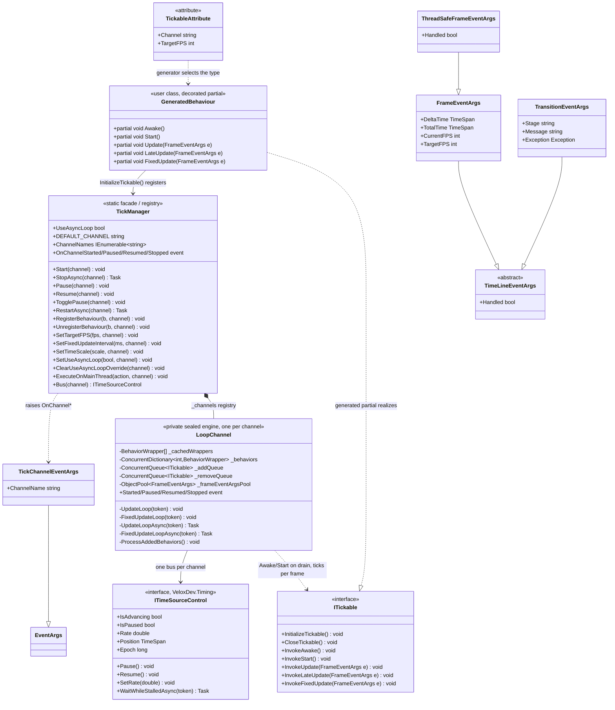

# Design Patterns — Tickable

`VeloxDev.TimeLine` runs a Unity-like, frame-driven lifecycle for classes decorated with `[Tickable]`. The static `TickManager` is a facade, a channel registry and an observable at once: it owns one named `LoopChannel` engine per channel and republishes that channel's state transitions process-wide. A Roslyn source generator turns the attribute into an `ITickable` implementation whose entry points forward to the user's `partial void` hooks — the engine fixes the loop skeleton, the user supplies the variable steps (Template Method). Both pumps park on a shared time source rather than polling a flag, which is what lets one `Pause()` stop a frame loop and an animation together (Adapter to a shared clock). The hot-path argument type is pooled.

This page is the overview: the class diagram and the pattern inventory. Each pattern has its own sub-page.

> Source: `Src/Core/VeloxDev.Core/TimeLine/TickManager.cs` (the `TickManager` region at 1046-1156, `LoopChannel` at 99-996), `Src/Core/VeloxDev.Core/Interfaces/Tickable/ITickable.cs`, `Src/Generators/VeloxDev.Core.Generator/Writers/TickWriter.cs`, `Src/Core/VeloxDev.Core/Interfaces/Timing/ITimeSourceControl.cs`, `Examples/Tickable/WPF/Demo/MainWindow.Hooks.cs`.

## Pattern inventory

| # | Pattern | Where | Sub-page |
|---|---|---|---|
| 1 | **Template Method** — the loop skeleton is fixed, the hooks are the variable steps | `LoopChannel.UpdateLoop` / `FixedUpdateLoop` + the generator's `Invoke*` bridges | [template method](00_template-method/index.md) |
| 2 | **Adapter / shared transport** — both pumps and any anchored animation drive off one `ITimeSourceControl` | `LoopChannel._bus`, `TickManager.Bus` | [shared clock](01_shared-clock/index.md) |
| 3 | **Publisher-Subscriber / Facade + Registry** — a static facade over a lazy channel dictionary, republishing per-channel events process-wide | `GetOrCreateChannel`, the four `OnChannel*` events | [publisher-subscriber](02_publisher-subscriber/index.md) |
| 4 | **Object Pool** — three fixed-capacity pools per channel, plus a copy-on-change sorted snapshot | `ObjectPool<T>`, `_frameEventArgsPool`, `_cachedWrappers` | [object pool](03_object-pool/index.md) |

Two supporting decisions sit underneath all four and are worth naming because they shape the code:

- **Deferred command queues.** Registration, unregistration and target-FPS changes are not applied by the caller; they are enqueued on the channel and applied by a pump inside `ProcessMainThreadOperations`. This is what makes every mutator thread-safe without a lock around the behaviour dictionary. It is the Command pattern applied to state mutation.
- **Copy-on-write dispatch array.** `_cachedWrappers` is a plain array, replaced wholesale under a `volatile` field, so the dispatch loop reads a stable snapshot with no locking and no allocation per frame.
