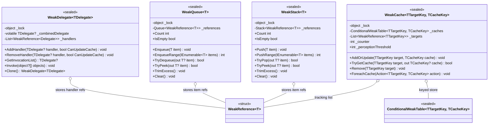

# Design Patterns — Weak Types

The four `VeloxDev.WeakTypes` types (`WeakDelegate<TDelegate>`, `WeakQueue<T>`, `WeakStack<T>`, `WeakCache<TTargetKey, TCacheKey>`) implement the **Weak Reference** family of idioms. Instead of storing a strong reference to the payload they store `WeakReference<T>` — or, for the cache, a `ConditionalWeakTable` — so the container never keeps a subscriber, a queued/stacked item, or a cache key alive on its own. Cleanup is **lazy** (dead references are pruned on access) rather than done by a background thread. All four are `sealed`, generic, and guarded by a per-instance monitor; `WeakDelegate` additionally exposes a lock-free read fast lane. Evidence: source `Src/Core/VeloxDev.Core/WeakTypes/*.cs` and the MSTest suite `Src/Core/VeloxDev.Core.Test/WeakTypes/*.cs`.



| Type | Pattern(s) |
|---|---|
| `WeakDelegate<TDelegate>` | Weak Reference (subscribers); **Weak Event** multicast used as a C# `event` backing store |
| `WeakQueue<T>` | Weak Reference (items); lazy eviction (sweep-on-access) |
| `WeakStack<T>` | Weak Reference (items); lazy eviction (sweep-on-access) |
| `WeakCache<TTargetKey, TCacheKey>` | **Ephemeron cache** (entry lifetime tied to the target key); periodic adaptive sweep |

## 1. Weak-Reference semantics

Each type stores weak references so the container never keeps its payload alive. Generic constraints: `WeakQueue<T>` / `WeakStack<T>` require `where T : class`, `WeakCache<...>` requires both keys and values to be `class`, and `WeakDelegate<TDelegate>` requires `where TDelegate : Delegate`.

```csharp
// Src/Core/VeloxDev.Core/WeakTypes/WeakQueue.cs (lines 34-42)
public void Enqueue(T item)
{
    if (item == null) throw new ArgumentNullException(nameof(item));
    lock (_lock)
    {
        _references.Enqueue(new WeakReference<T>(item));
    }
}
```

| Type | Storage | What becomes collectible | Role of the stored object |
|---|---|---|---|
| `WeakDelegate<TDelegate>` | `List<WeakReference<Delegate>>` | Subscriber delegates (kept weak only until the combined cache is rebuilt around them) | The multicast subscribers |
| `WeakQueue<T>` | `Queue<WeakReference<T>>` | Queued items | The item payloads, FIFO |
| `WeakStack<T>` | `Stack<WeakReference<T>>` | Stacked items | The item payloads, LIFO |
| `WeakCache<TTargetKey,TCacheKey>` | `ConditionalWeakTable` + `List<WeakReference<TTargetKey>>` | The target key; its value dies with it | `TTargetKey` = lifetime-governing key; `TCacheKey` = payload whose life is tied to the key |

`WeakCache` uses two structures with distinct roles. The `ConditionalWeakTable` is the **source of truth** for lookup: it holds the target key weakly (ephemeron) and the value strongly *only while the key is alive*, so `TryGetCache` reads the real table and a collected key simply misses. The `_targets` list of `WeakReference<TTargetKey>` exists only to **enumerate** the live entries (`ForeachCache`) and to keep the sweep list free of duplicates across `AddOrUpdate` / `Remove` — it never participates in lookup.

## 2. Sweep-on-Access — when entries are reclaimed

Dead references are pruned lazily when a member is touched, rather than by a dedicated thread.

| Type | When the wrapper entry is removed |
|---|---|
| `WeakQueue<T>` / `WeakStack<T>` | `TryDequeue` / `TryPop` / `TryPeek` drop dead refs as they scan the front/top; `Count`, `GetEnumerator`, `TrimExcess` call `Prune()` over the whole structure |
| `WeakDelegate<TDelegate>` | `CleanupCollectedHandlers()` (called by every `RebuildCache()` — i.e. `AddHandler`/`RemoveHandler` with cache update, `GetInvocationList` when the cache is null, and `Clone`) |
| `WeakCache<TTargetKey,TCacheKey>` | The CWT entry disappears automatically when the target key is collected; the tracking entry is a `WeakReference` swept by `AddOrUpdate` when the insert counter exceeds `_perceptionThreshold`, and by `ForeachCache` / `Remove` |

```csharp
// Src/Core/VeloxDev.Core/WeakTypes/WeakQueue.cs (lines 124-135)
private void Prune()
{
    var activeReferences = _references
        .Where(r => r.TryGetTarget(out _))
        .ToList();

    _references.Clear();
    foreach (var reference in activeReferences)
    {
        _references.Enqueue(reference);
    }
}
```

Two details worth noting. First, `WeakStack.Prune` additionally calls `activeReferences.Reverse()` before re-pushing (`Src/Core/VeloxDev.Core/WeakTypes/WeakStack.cs`, lines 124-136), so LIFO order survives compaction. Second, reclamation is *two-phase*: the GC clears a `WeakReference` target as soon as nothing else holds the object strongly, but the empty wrapper entry stays in the backing container until a sweep reaches it — the queue/stack therefore holds garbage slots between sweeps, bounded and cleaned on access.

## 3. Weak-Event usage and the one strong reference

`WeakDelegate` backs the lifecycle events of the transition engine: `TransitionEffectCore` declares each event as a `WeakDelegate<EventHandler<TransitionEventArgs>>` field and routes the C# `event` accessors through it.

```csharp
// Src/Core/VeloxDev.Core/TransitionSystem/TransitionEffect.cs (lines 51-55)
public virtual event EventHandler<TransitionEventArgs> Awaked
{
    add => _awaked.AddHandler(value);
    remove => _awaked.RemoveHandler(value);
}
```

Invocation goes through the combined delegate, which `TransitionEffectCore` invokes in a **typed** (reflection-free) way (`Src/Core/VeloxDev.Core/TransitionSystem/TransitionEffect.cs`, lines 87-90):

```csharp
public virtual void InvokeAwake(object sender, TransitionEventArgs e)
{
    _awaked.GetInvocationList()?.Invoke(sender, e);
}
```

The important caveat: `_combinedDelegate` is a **strong** reference. An `AddHandler` with the default `CanUpdateCache: true` rebuilds the cache immediately, so every currently-added handler is rooted by it until the next rebuild excludes it. A handler is only genuinely weak — collectible while still subscribed — when it was added with `CanUpdateCache: false` (stored in `_handlers` only, never entered into the strong cache). Dead wrapper entries are finally pruned from `_handlers` by `CleanupCollectedHandlers()` during the next rebuild (`Clone`, next `AddHandler`/`RemoveHandler`, or a cache-miss `GetInvocationList`). This trades a hot-path lock-free read against a delayed release of unsubscribed subscribers, and is the reason the docs describe the delegate cache as "strong but rebuilt-and-pruned on demand".

| Trade-off | Analysis |
|---|---|
| Lazy cleanup | Amortized O(1) per mutation; an occasional sweep is O(n) — acceptable because the sweep runs only when dead refs are actually encountered |
| `WeakDelegate` combined cache | A strong cache gives a lock-free read fast lane, but roots subscribed handlers until the next rebuild; `CanUpdateCache: false` opts out per handler for a genuinely weak subscription |
| `WeakCache` tracking list | `_targets` is only weak and never roots keys, so lookup stays ephemeron-correct while enumeration stays possible |

> Source references: `Src/Core/VeloxDev.Core/WeakTypes/{WeakDelegate,WeakQueue,WeakStack,WeakCache}.cs`; usage in `Src/Core/VeloxDev.Core/TransitionSystem/TransitionEffect.cs`; behavior verified by `Src/Core/VeloxDev.Core.Test/WeakTypes/*.cs`.
