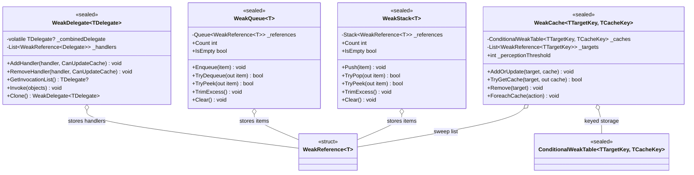

# Design Patterns — Weak Types

The four `VeloxDev.WeakTypes` collections all implement the **Weak Reference** idiom: they hold `WeakReference<T>` (or a `ConditionalWeakTable`) instead of strong references, so the GC can reclaim subscribers, queue items, stack items, and cache keys that become unreachable elsewhere. On top of that, they apply **Sweep-on-Access**: dead references are pruned lazily when a member is touched, so no background thread is needed for cleanup.



## 1. Weak Reference idiom

Each type stores weak references instead of strong ones, so the container never keeps its payload alive.

```csharp
// Src/Core/VeloxDev.Core/WeakTypes/WeakQueue.cs (lines 34-42)
public void Enqueue(T item)
{
    if (item == null) throw new ArgumentNullException(nameof(item));
    lock (_lock)
    {
        _references.Enqueue(new WeakReference<T>(item));
    }
}
```

| Type | Storage | What stays collectible |
|---|---|---|
| `WeakDelegate<TDelegate>` | `List<WeakReference<Delegate>>` | Subscriber delegates (plus a strong combined-delegate cache) |
| `WeakQueue<T>` | `Queue<WeakReference<T>>` | Queued items |
| `WeakStack<T>` | `Stack<WeakReference<T>>` | Stacked items |
| `WeakCache<TTargetKey,TCacheKey>` | `ConditionalWeakTable` + `List<WeakReference<TTargetKey>>` | Cache keys (values die with their key) |

## 2. Sweep-on-Access

Dead references are pruned lazily when a member is touched, rather than by a dedicated thread.

| Type | Sweep trigger |
|---|---|
| `WeakQueue<T>` / `WeakStack<T>` | `Count`, `GetEnumerator`, `TrimExcess` call `Prune()`; `TryDequeue`/`TryPop`/`TryPeek` skip dead refs in a loop |
| `WeakDelegate<TDelegate>` | `RebuildCache()` (called from `AddHandler`/`RemoveHandler` with cache update, `GetInvocationList` when the cache is null, and `Clone`) |
| `WeakCache<TTargetKey,TCacheKey>` | `AddOrUpdate` sweeps when the insert counter exceeds `_perceptionThreshold`; `ForeachCache` removes dead targets first |

```csharp
// Src/Core/VeloxDev.Core/WeakTypes/WeakQueue.cs (lines 124-135)
private void Prune()
{
    var activeReferences = _references
        .Where(r => r.TryGetTarget(out _))
        .ToList();

    _references.Clear();
    foreach (var reference in activeReferences)
    {
        _references.Enqueue(reference);
    }
}
```

| Trade-off | Analysis |
|---|---|
| Lazy cleanup | Amortized O(1) per mutation; the occasional sweep is O(n) — acceptable because the sweep runs only when a dead ref is actually encountered |
| Weak cache of `WeakDelegate` | The combined-delegate cache is a strong reference; collected handlers are pruned only when the cache is rebuilt (documented in the API page) |

> Source references: `Src/Core/VeloxDev.Core/WeakTypes/*.cs`, verified by `Src/Core/VeloxDev.Core.Test/WeakTypes/*.cs` and a standalone console probe run on 2026-08-17.
