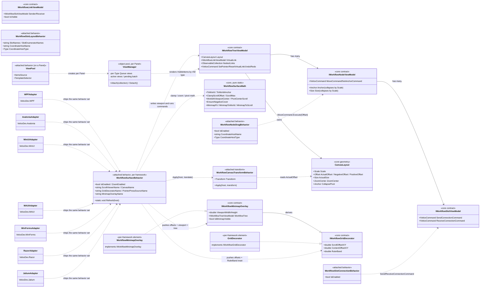

# 08 · Platform Adapters — Design Patterns

The platform-adapter layer turns the UI-agnostic workflow engine (`VeloxDev.Core`, namespace `VeloxDev.WorkflowSystem`) into an interactive editor. Seven adapter packages (`VeloxDev.WPF`, `VeloxDev.Avalonia`, `VeloxDev.WinUI`, `VeloxDev.MAUI`, `VeloxDev.WinForms`, `VeloxDev.Razor`, `VeloxDev.Jalium`) each ship the same attached-behavior surface, an object-pooled view container, a per-platform minimap/grid realization, and per-platform transition/theme wiring. Behavior classes live in the shared namespace `VeloxDev.WorkflowSystem.AttachedBehaviors` (source-verified in every adapter); the decorator/minimap contracts, geometry types and pure coordinate math were unified into Core so all seven adapters call one definition. Detail not exercised by a demo is `*inferred*` from source.

## Mermaid classDiagram

The shared edges above stand for one shared namespace `VeloxDev.WorkflowSystem.AttachedBehaviors` across the seven adapter assemblies — an application references exactly one adapter assembly, so the same behavior names resolve without collision.

## Pattern table

| Pattern | Where it appears | Role |
|---|---|---|
| **Adapter** | Seven packages (`VeloxDev.*`) wrap the UI-agnostic workflow engine | Each package converts the Core model into framework-native views and behaviors, and extends the shared Transition/Theme namespaces with framework-specific concrete types (`Interpolator` registering native samplers, `State`, `TransitionEffect`, `UIThreadInspector`, `ThemeValueConverters`). Application code stays nearly identical across WPF/Avalonia/WinUI/MAUI/WinForms/Razor/Jalium. |
| **Attached Behavior** | `WorkflowSurfaceBehavior`, `WorkflowCanvasTransformBehavior`, `WorkflowNodeDragBehavior`, `WorkflowSlotConnectionBehavior`, `WorkflowSlotLayoutBehavior`, `ViewPool` | UI concerns (pan/zoom, drag, connect, layout sync, virtualization) are packaged as attached properties (or their DP-free equivalent in WinForms/Blazor) so they are wired declaratively onto any host without inheritance. The public names are identical in every adapter, even though each is implemented against that framework's event model. |
| **Object Pool** | `ViewPool` → `ViewManager` (per `Panel`) | `ViewManager` keeps a per-concrete-type `Queue` of views plus a per-type `_templateMap`, and renders in batches of 3 per dispatcher `Background` tick. Removed views are collapsed, unbound and returned to the pool; the manager is registered in a `ConditionalWeakTable` keyed by the panel and cleaned up on `Unloaded`. |
| **Command** | Behaviors front the Core command layer | Attached behaviors only translate gestures into Core `IVeloxCommand`s — `MoveCommand` (drag), `SendConnectionCommand`/`ReceiveConnectionCommand` (connect), `ResetVirtualLinkCommand` (cancel), `SetPointerCommand` (pointer tracking). The undo/redo commands stay on the tree VM; the behavior never owns workflow logic. |
| **Strategy / Bridge** | `IWorkflowGridDecorator`, `IWorkflowMinimapOverlay`, `WorkflowSurfaceMath`, `CanvasLayout.Scale` | The surface pushes state through the two Core contracts, so the grid decorator and minimap can be swapped freely (template `GridDecorator`, demo `WorkflowGridDecorator`, custom implementations). Zoom is a *collapse factor* written into `CanvasLayout.Scale`; `WorkflowSurfaceMath` owns the canonical clamp/pivot/cover/minimap formulas shared by all seven adapters, so each framework keeps one copy of the algebra. |
| **Observer** | `WorkflowSurfaceBehavior` (`DataContextChanged`/`ScrollChanged`), `WorkflowMinimapOverlay` (node/link collections + `Anchor`/`Size`), `WorkflowNodeScaleTracker` (`Scale` changes), spatial manager (`NodeAdded`/`LinkAdded`) | The surface pushes scroll/offset/viewport changes to decorators and the minimap; the minimap subscribes to model events and marks itself dirty rather than polling; each node's scale tracker re-raises `Anchor`/`Size` when the zoom `Scale` changes; the spatial manager keeps its index fresh from tree add/remove events. |
| **Template Method / Lifecycle Hook** | `WorkflowSurfaceBehavior.Attach/Detach`, behavior event hooks, `ViewPool` panel `Unloaded` cleanup | A consistent attach/detach (or Loaded/Unloaded) pair subscribes/unsubscribes handlers and clears state, preventing leaks when the host unloads, a tab closes, or the feature is disabled. |

## Design notes

- **Core owns the model and the math; adapters only bind.** `IWorkflow*ViewModel`, `CanvasLayout` (with `Scale`/`ActualOffset`/`NegativeOffset`/`PositiveOffset`/`ActualSize`), the decorator/minimap contracts and `WorkflowSurfaceMath` all live in `VeloxDev.Core` under `VeloxDev.WorkflowSystem` (e.g. `Src/Core/VeloxDev.Core/Interfaces/WorkflowSystem/IWorkflowGridDecorator.cs`, `WorkflowSystem/GUI/Math/WorkflowSurfaceMath.cs`). Previously each adapter inlined the same grid/minimap/math copies; unification made one definition authoritative.
- **Same names, different bindings.** The attached behaviors have identical public names in every adapter (`namespace VeloxDev.WorkflowSystem.AttachedBehaviors`) but are implemented per framework: WPF/Jalium use the WPF-style `PreviewMouse*`/`AddHandler` model, Avalonia tunnels pointer events and strips the ScrollViewer's touch gesture recognizer, WinUI uses `Pointer*` + composition `Canvas.Translation`, MAUI uses gesture recognizers (pan/pinch, plus native Windows wheel), WinForms uses Win32 `IMessageFilter` + `MouseWheel`, Razor marshals JS interop. `ViewPool`'s template selector is likewise per-framework: WPF/WinUI/MAUI use `DataTemplateSelector`, Avalonia `IDataTemplate`, WinForms/Jalium `IWorkflowTemplateSelector`, Razor an `ItemTemplate` fragment. Detail not exercised in a demo is `*inferred*`.
- **The surface is a coordinator.** `WorkflowSurfaceBehavior` does not render; it resolves named parts (`PART_ScrollViewer`, `PART_Canvas`, `PART_SurfaceBorder`, decorator, minimap), owns the shared canvas translate (via `WorkflowCanvasTransformBehavior` — a notification carrier node/link views bind their `RenderTransform` to), and feeds the decorator/minimap/viewport/virtualize-inset through the strategy contracts.
- **Zoom is a model collapse, not a canvas transform.** Each adapter writes a smaller `Layout.Scale` (wheel-up divides by 1/1.1); the `NodeDefaultViewModel` `Anchor`/`Size` getters collapse toward the world origin by that scale and re-raise via `WorkflowNodeScaleTracker`. Per-framework details (WPF/Avalonia behavior-driven pivot scroll, WinUI composition offsets, MAUI pinch + `RecenterOnWorldPointAsync`, WinForms global message-filter zoom, Razor JS atomic `applyZoomSurface`, Jalium host-driven zoom on the demo surface) rest on the same `WorkflowSurfaceMath` pivot/cover math.
- **Virtualization is a Core/adapter split.** The spatial index (`WorkflowSpatialManager` + `SpatialGridHashMap`) computes `VisibleItems` in Core from `Helper.Viewport`; the adapter's `ViewPool`/`ViewManager` only materializes those views. The XAML demos bind the pool to `Helper.VisibleItems` (MAUI strips link VMs into a node-only wrapper; links render in one viewport-sized `WorkflowLinkOverlay`), while the WinForms and Blazor demos bind the full node collection and manage visible-region bookkeeping on the surface — so pooling of `VisibleItems` is WPF/Avalonia/WinUI/MAUI demo-verified and `*inferred*` elsewhere.
- **Minimap/grid element types differ per framework.** WPF `FrameworkElement`, Avalonia `Control`, WinUI `Canvas` (shape-pooled, 16 ms rebuild), MAUI `GraphicsView: IDrawable`, Jalium `FrameworkElement`, Razor SVG component; only Jalium and Razor ship a grid-decorator *control* in the adapter, and the WinUI link view follows an "offset-frame" contract (self-positioned at −ActualOffset, geometry baked +ActualOffset) so zoom never clips a link's negative half.
