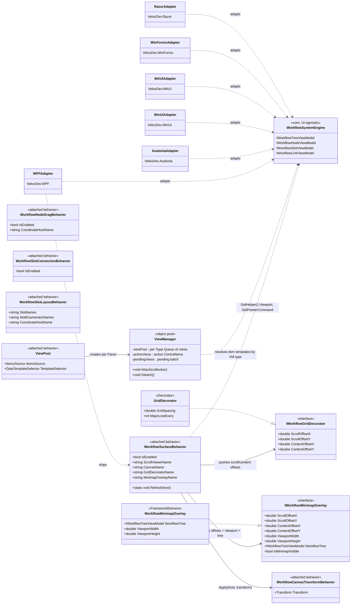

# 08 · Platform Adapters — Design Patterns

The platform-adapter layer is where the UI-framework-agnostic workflow engine becomes an interactive editor. Six adapter packages (`VeloxDev.WPF`, `VeloxDev.Avalonia`, `VeloxDev.WinUI`, `VeloxDev.MAUI`, `VeloxDev.WinForms`, `VeloxDev.Razor`) each ship the same attached-behavior surface, an object-pooled view container, and per-platform transition/theme wiring. The diagram shows the relationships that make this possible; details that are not demo-exercised are `*inferred*` from source.

## Mermaid classDiagram

## Pattern table

| Pattern | Where it appears | Role |
|---|---|---|
| **Adapter** | Six adapter packages wrap the same `VeloxDev.WorkflowSystem` engine | Each adapter converts the UI-agnostic workflow model into framework-native views/behaviors while keeping a single public surface (`VeloxDev.WorkflowSystem.AttachedBehaviors`), so application code stays nearly identical across WPF/Avalonia/WinUI/MAUI/WinForms/Razor. |
| **Attached Behavior** | `WorkflowSurfaceBehavior`, `WorkflowCanvasTransformBehavior`, `WorkflowNodeDragBehavior`, `WorkflowSlotConnectionBehavior`, `WorkflowSlotLayoutBehavior`, `ViewPool` | UI concerns (panning, dragging, connecting, layout sync, virtualization) are packaged as attached properties so they are wired declaratively in XAML and dropped onto any host without inheritance. |
| **Object Pool** | `ViewPool` → `ViewManager` | `ViewManager` keeps a per-type `Queue<FrameworkElement>` and reuses views instead of destroying/recreating them; removed views are collapsed and returned to the pool. Reduces allocation during pan/zoom. |
| **Strategy** | `IWorkflowGridDecorator`, `IWorkflowMinimapOverlay` | `WorkflowSurfaceBehavior` depends on interfaces, so the grid decorator and minimap can be swapped freely (template `GridDecorator`, demo `WorkflowGridDecorator`, custom implementations) without touching the behavior. |
| **Observer** | `WorkflowSurfaceBehavior` (DataContextChanged / ScrollChanged), `WorkflowMinimapOverlay` (`CollectionChanged` + `PropertyChanged` on nodes/links/slots) | The surface pushes scroll/offset/viewport changes to decorators and the minimap; the minimap subscribes to node/link change notifications and marks itself dirty rather than polling. |
| **Lifecycle Hook / Template Method** | `WorkflowSurfaceBehavior.Attach/Detach`, `WorkflowNodeDragBehavior.Attach/Detach` | A consistent attach/detach pair subscribes/unsubscribes event handlers and clears state, preventing leaks when the host unloads or the feature is disabled. |

## Design notes

- **Same names, different bindings.** The attached behaviors have identical public names in every adapter but are implemented against each framework's event model (WPF `PreviewMouse*`, Avalonia pointer events, WinUI `PointerPressed`, MAUI gesture recognizers, Razor JS interop — the latter `*inferred*`).
- **The surface is a coordinator.** `WorkflowSurfaceBehavior` does not render; it resolves named parts, owns the pan transform (via `WorkflowCanvasTransformBehavior`), and feeds the grid decorator / minimap through the strategy interfaces.
- **Pooling is per-type and batched.** `ViewManager` batches materialization (3 views per dispatcher `Background` tick, WPF-verified) so large graphs never create all views in one frame.
