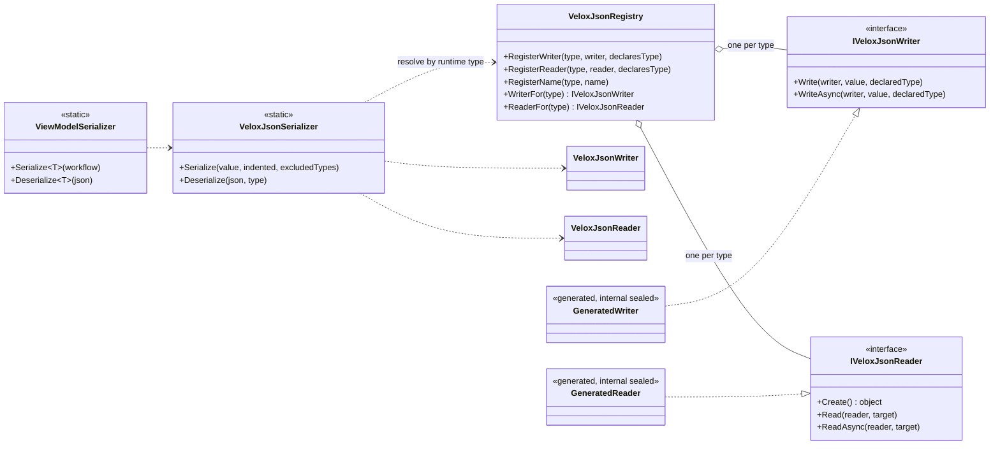

# Design Patterns — Serialization

The archive engine exists to make one property true: **a document can only contain types the compiler saw**. Everything else in the design follows from that.

It is built in two layers:

- **Compile time** — `VeloxDev.Core.Generator` walks the compilation, decides which types are *in* (the closed world), and emits one `internal sealed` writer and reader per type into a generated `_VeloxJson.g.cs`, together with a `[ModuleInitializer]` that registers them.
- **Run time** — `VeloxJsonSerializer` looks a type up in `VeloxJsonRegistry` and calls the writer or reader it finds. There is **no reflection** anywhere on the hot path, and no fallback: a type with no entry fails with `MissingWriter` / `MissingReader` rather than serializing an empty shell.

On top of those two layers the feature composes **Registry**, **Strategy** (the generated writer/reader pair behind two interfaces), **Marker Attribute** (`[Archivable]` opens a type the reachability walk would not have found), and **Immutable Snapshot** (every registration publishes a new copy, so reads never lock).

> Sources: `Src/Core/VeloxDev.Core/Serialization/` (engine), `Src/Generators/VeloxDev.Core.Generator/VeloxJson.cs` and `Writers/VeloxJsonCodeWriter.cs` (the generator).

## Class diagram

## The closed world

Four routes put a type in, and the generator decides from the source alone (`Base/VeloxJsonModel.cs:588-614`):

| Route | What the generator looks for |
|---|---|
| Component interface | `IWorkflowTreeViewModel` / `IWorkflowNodeViewModel` / `IWorkflowSlotViewModel` / `IWorkflowLinkViewModel` |
| Component attribute | `[WorkflowBuilder.*]` |
| Observable field | a `[VeloxProperty]` field — the MVVM generator promotes it |
| Marker | `[Archivable]`, optionally naming extra roots |

Reachability then closes over **member declaration types** — a property's type, a field's type, a method's return type, a generic argument — one hop at a time (`:377-399`). Since 2026-10-04 that closure widens along three more axes: derived classes, dictionary keys and values, and the constraints of an open generic used as a root (`:34-48`).

The consequence worth stating plainly: an abstract class or an interface **never** gets an entry — `ReaderFor` returns `null` for them, forever. Polymorphism works because the *concrete* type is written into the document as the discriminator, and the reader resolves that name back through the registry.

## Two entry points, one engine

| Entry | Constraint | Which route it serves |
|---|---|---|
| `ViewModelSerializer.Serialize<T>` / `.Deserialize<T>` | `where T : INotifyPropertyChanged` | the `[VeloxProperty]` route — view models |
| `VeloxJsonSerializer.Serialize(object, …)` / `.Deserialize<T>` | `where T : class` | the `[Archivable]` route — plain documents |

`ViewModelSerializer` holds no engine logic at all; it is a thin, view-model-shaped façade over `VeloxJsonSerializer` — which is why `CheckpointEx` can use the lower one for a type that is not a view model at all.

## Registry ownership — the one rule with a reason

Registration resolves an ambiguity that a single global table cannot: a **non-generic** type has exactly one declaring assembly, but a **closed generic** may be emitted by both the assembly that declared it and the assembly that closed it.

The rule: *the declaring assembly always wins; a consumer assembly may only fill a gap* (`VeloxJsonRegistry.cs:195,215`). It is enforced by a `declaresType` flag the **generator states** rather than the registry inferring (`Writers/VeloxJsonCodeWriter.cs:503-507`) — an inference would have to guess, and guessing wrong would silently swap one assembly's writer for another's.

`RegisterName` and `RegisterContainerFactory` deliberately carry **no** such guard.

## What is *not* a pattern here

There is no lazy type resolution, no convention-over-configuration, and no serializer settings object with a long tail of toggles. `SerializationOptions` has three members, and the only per-member control is `[Archive(...)]` plus the BCL `[JsonIgnore]`. That is a deliberate trade: the closed world already answers "what gets written", so a configuration API on top of it would only be a second, weaker way to say the same thing.
