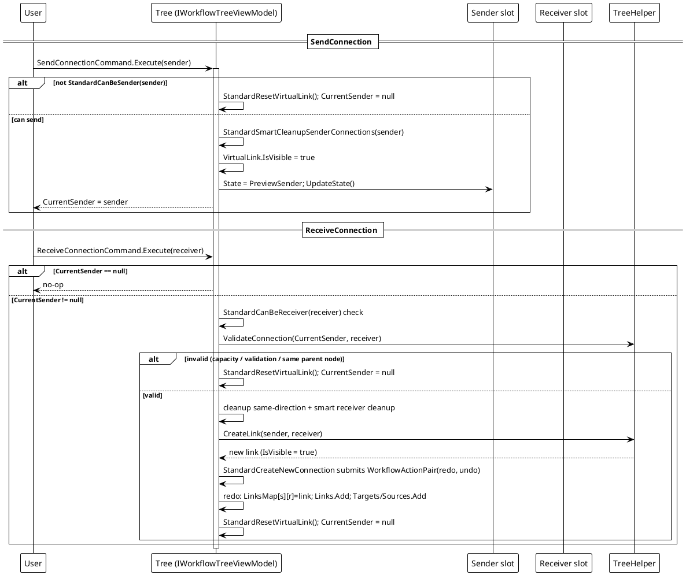

# Workflow System — Connect Flow

`SendConnection` → `ReceiveConnection` → `CreateLink`.

A connection is built in two phases. `SendConnection(sender)` validates sender capability, cleans up conflicting sender connections, shows the `VirtualLink` and sets `CurrentSender`. `ReceiveConnection(receiver)` validates capability + custom `ValidateConnection` + the same-node rule, cleans up same-direction conflicts, then `StandardCreateNewConnection` asks the tree helper for a new link and submits the whole connection as one undoable `WorkflowActionPair`.

The submitted pair is executed immediately (`redo`) and pushed onto the undo stack; `StandardUndo`/`StandardRedo` later run `undo`/`redo` and swap stacks (see the Command-pattern page in the design-patterns dimension). Any failed validation resets the virtual link and leaves no connection.

*Source: `Src/Core/VeloxDev.Core/WorkflowSystem/StandardEx/WorkflowTreeEx.cs`, `StandardSendConnection` lines 95-126, `StandardReceiveConnection` lines 128-169, `StandardCreateNewConnection` lines 373-426.*
