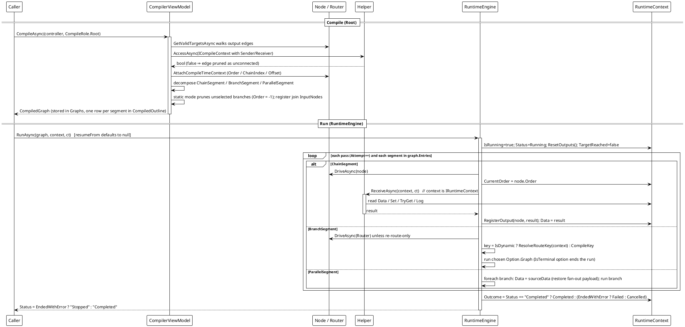

# Workflow System — Compile and Run (Root)

`CompileAsync(role: Root)` → `RuntimeEngine.RunAsync` → `ReceiveAsync`.

Two phases. **Compile** walks the sub-graph reachable from the controller and builds immutable segments: linear runs become `ChainSegment`, a node implementing `ICompileTimeRouter` becomes a `BranchSegment`, a multi-target fan-out becomes a `ParallelSegment`. Each node's output edge is statically validated by calling the sender's `AccessAsync` with an `ICompileContext` (a rejected edge is treated as unconnected and omitted); every reachable node receives a fixed compile identity (`Order`/`ChainIndex`/`Offset`) via `ICompileTimeAware`, and multi-input join points are registered with their input source nodes. **Run** drives those segments: the engine owns downstream dispatch, calls `Helper.ReceiveAsync` directly with an `IRuntimeContext`, writes the return value back as `context.Data`, and registers each node's output.

Cancellation path: `ct.ThrowIfCancellationRequested()` aborts the pass; `OperationCanceledException` from a node is rethrown immediately (cancellation is **not** a redirect) and `RunAsync` sets `Status = "Stopped"` and records `RunOutcome.Cancelled` — with **no** `[Error]` log line, because a host stopping its own run is not a failure.

*Sources: `Src/Core/VeloxDev.Core/WorkflowSystem/CompilerEx/Compile/CompilerViewModel.cs` (lines 26-57 entry, 59-249 decomposition, 414-447 `GetValidTargetsAsync`); `CompilerEx/Runtime/RuntimeEngine.cs` (`RunAsync` lines 52-128, `RunExecuteAsync` 166-247, `RunParallelAsync` 329-383, `DriveAsync` 412-506). Demo: `Examples/Workflow/Common/Lib/ViewModels/Workflow/ControllerViewModel.cs`. Test evidence: `CompilerEx/RuntimeEngineRunTests.cs`, `CompilerEx/EntrySemanticsTests.cs`.*
