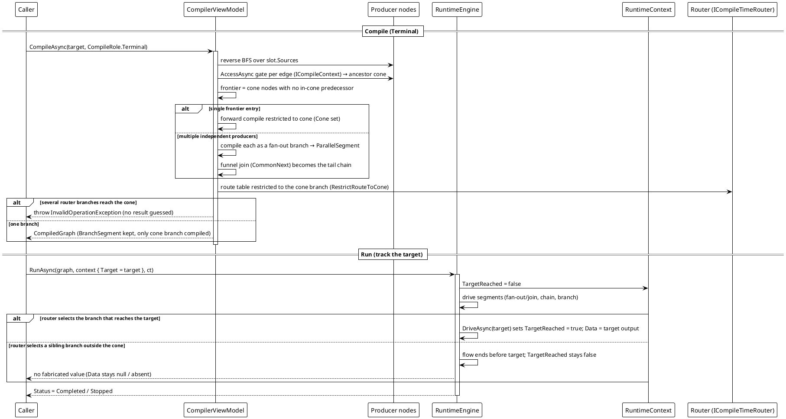

# Workflow System — Reverse / Terminal Cone Flow

`CompileAsync(role: Terminal)` → run with `Target`.

`CompileRole.Terminal` computes a sink node's result from its **ancestor cone**: reverse BFS over `Sources`, validating each edge with the sender's `AccessAsync` (rejected edges are not ancestors). The cone's own entry frontier (nodes with no in-cone input) is derived automatically — no controller/start node required. A router on the cone **keeps real `BranchSegment` semantics** but only the branch that leads into the cone is compiled (`RestrictRouteToCone`); several independent producers funnel into the target as a `ParallelSegment` then a common join chain. Reachability is reported by `RuntimeContext.Target`/`TargetReached`; no value is fabricated.



**Verified behavior** (reproduced against the shipped library, three-node chain `Ticker → Bias → Printer`, targeting the middle node):

```text
[3] result: Completed data=tick->bias reached=True
```

The run stopped after `Bias` — `data` is the target's own output, **not** `tick->bias->print` — and because the node was actually driven, `TargetReached` is `true`.

*Sources: `Src/Core/VeloxDev.Core/WorkflowSystem/CompilerEx/Compile/CompilerViewModel.Reverse.cs` (`BuildAncestorConeAsync` lines 33-74, `CompileConeAsync` 82-134); `CompilerViewModel.cs` `RestrictRouteToCone` lines 303-325. Test evidence: `CompilerEx/CompileToReverseTests.cs` (`RouterOnConePath_SelectedBranchMatchesTarget_ReachesAndReturnsResult`, `RouterOnConePath_SelectedSiblingBranch_TargetNotReached_FlowEndsWithoutValue`, `FanOutJoin_TargetAfterJoin_CompilesConeFunnel_GroupDataAtJoin`, `MultiLevelFanInAcrossIndependentEntries_ThrowsInformative`).*
