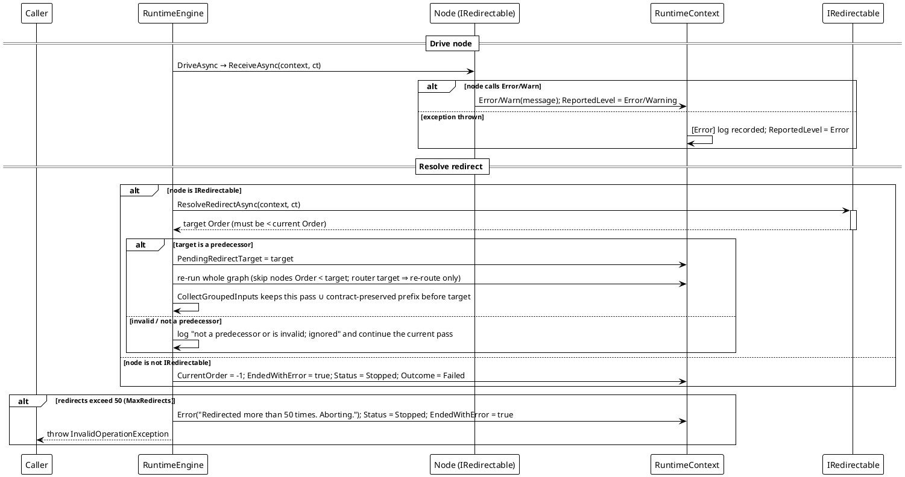

# Workflow System — Redirect Re-run

`RuntimeContext.Error()` → `IRedirectable` → whole-graph re-run.

An in-node `Error()`/`Warn()` call or a `ReceiveAsync` exception is a redirect request. With `IRedirectable` the node returns a predecessor `Order`; `RunAsync` re-runs the whole graph toward that state — nodes with `Order < target` are skipped, so a redirect may skip forward across chains and resume later. The output registry is *not* cleared between passes; stale outputs are filtered by pass stamp and `ActiveRedirectTarget` so a join never aggregates results the re-run superseded.



**Verified behavior** (reproduced against the shipped library; `boom` node always throws, no `IRedirectable`):

```text
[10] compensate: status=Stopped outcome=Failed currentOrder=-1 reversed=[BoomNode]
```

`Status = Stopped`, `Outcome = Failed`, the status code dropped to `-1`, and the run's already-succeeded nodes were handed to the compensator.

**Two levels, two outcomes.** `Warn` is a note — the line is written and the run carries on with whatever the node returned. `Error`, and an uncaught exception, are a stop: that drive counts as having produced `null`, and unless an `IRedirectable` places the run instead, the flow ends with status `-1`. A router or a redirect contract that *throws* ends it too, with `ExecutionFailurePhase.Router` / `.Redirect` — there is no answer left to give (`EngineHostContractFailureTests`).

*Sources: `Src/Core/VeloxDev.Core/WorkflowSystem/CompilerEx/Runtime/RuntimeEngine.cs` (`RunAsync` 52-128, `RunExecuteAsync` 166-247, redirect resolution 216-244); `CompilerEx/Runtime/Model/RuntimeContext.cs`; `CompilerEx/Runtime/Contracts/IRedirectable.cs`. Test evidence: `CompilerEx/RuntimeRedirectTests.cs` (`RedirectToPredecessor_SkipsPrefixOnRerun_CountsNodesPerPass`, `RedirectTargetNotAPredecessor_IsIgnored_FlowCompletesSinglePass`, `RedirectToRouter_ReroutesOnly_WithoutRecomputingRouter`, `RedirectIntoABranch_EntersIt_AndDrivesFromTheTargetInside`, `RedirectLoopsExceedingLimit_AbortWithException`).*
