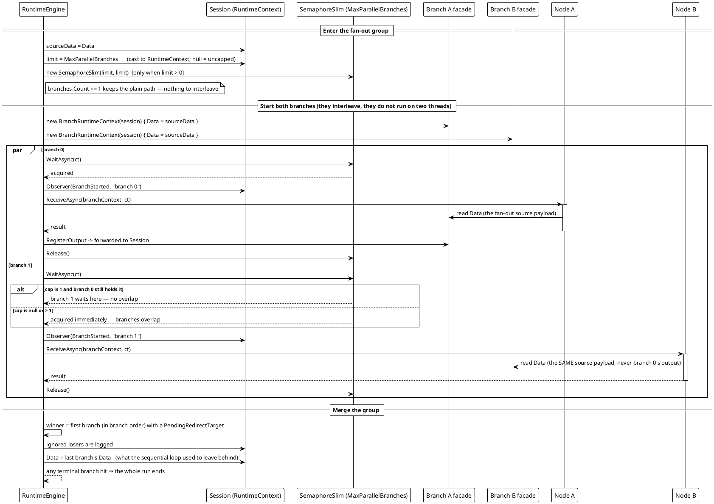

# Workflow System — Parallel Fan-Out and Its Concurrency Cap

A `ParallelSegment` runs its branches **concurrently**, as interleaved async operations rather than threads, with `MaxParallelBranches` bounding how many may be in flight at once.

Every branch gets its own `BranchRuntimeContext`, so payload, redirect request and log buffer are per branch while identity, progress, the output registry and the shared variables stay on the host's single session. Each branch starts from the **fan-out source's** payload and can never see a sibling's output. Logs are **forwarded**, not buffered, so the lines read in the order they actually happened.



**Determinism, in branch order.** When several branches ask to redirect, the **first in branch order** wins while the rest are logged and ignored — first by *order*, not by wall clock, so a run stays reproducible. The payload left in the session is the last branch's. A terminal branch hit inside any branch ends the whole run. One deliberate change from the earlier sequential engine: a branch that throws no longer aborts its siblings mid-flight — the exception surfaces once the group has finished.

**Verified behavior** (reproduced against the shipped library; two 120 ms branches):

```text
[11] segments: ChainSegment, ParallelSegment
[11] MaxParallelBranches=null: overlap=True
[11] MaxParallelBranches=1:    overlap=False
```

With no cap both branches were in flight at the same time (total wall time ≈ one branch, not two); with `MaxParallelBranches = 1` the second branch's start fell after the first branch's end.

No demo sets `MaxParallelBranches`; the contract is pinned by `ParallelExecutionTests` (`Branches_AreInFlightAtTheSameTime`, `MaxParallelBranches_SerialisesTheGroupWhenSetToOne`, `EachBranch_SeesOnlyTheFanOutSourcePayload`, `LogLines_KeepTheOrderTheyHappened`, `TwoBranchesAskingToRedirect_TheFirstInBranchOrderWins_AndTheOtherIsLogged`).

*Sources: `Src/Core/VeloxDev.Core/WorkflowSystem/CompilerEx/Runtime/RuntimeEngine.cs` — `RunParallelAsync` lines 329-383, `RunOneBranchAsync` 389-403; `CompilerEx/Runtime/Model/BranchRuntimeContext.cs`.*
