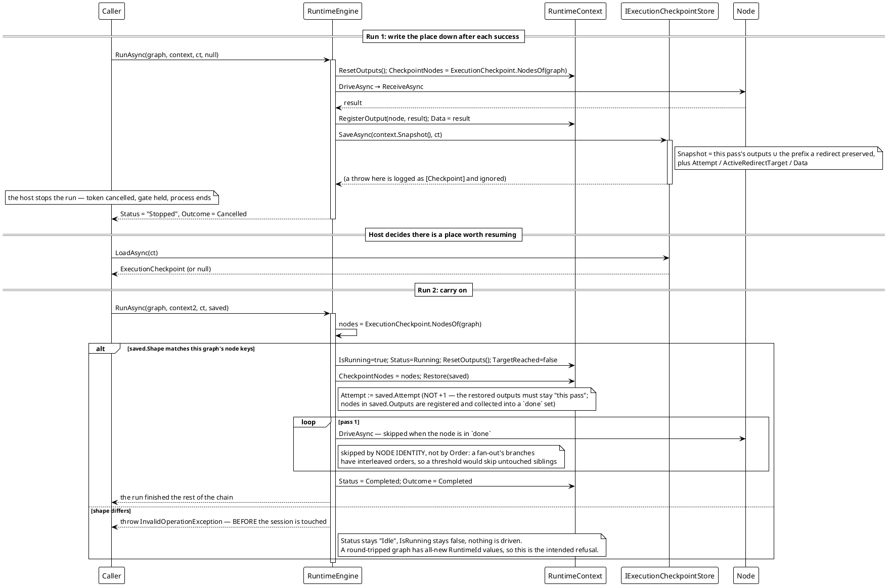

# Workflow System — Resume From a Checkpoint

The engine writes the run's *current* place down after each node succeeds, and `RunAsync` can be handed one back as its `resumeFrom` argument. The nodes it records as done are not driven again; a checkpoint taken over a different graph is refused before the session is touched.



**Verified behavior** (reproduced against the shipped library; three-node chain, run stopped after the first node):

```text
[7] checkpoint: attempt=1 outputs=1 shape=<three RuntimeId GUIDs>
[7] resume: status=Completed data=tick->bias->print outcome=Completed
[7] refused on a serialized copy: The checkpoint does not belong to this graph status=Idle
```

The resume finished the chain from where it stopped; the checkpoint taken over the round-tripped copy was refused, and `Status` still read `Idle` because nothing had been touched.

**Notes:**

- **One store, one run.** The engine writes the run's *current* state, not a history — a store holds a single latest checkpoint. A host keeping several runs' places keeps several stores, or keys its implementation by `IRuntimeContext.Uid`.
- **Saving is best effort.** A store that throws gets one `[Checkpoint]` line and the run carries on.
- **A `resumeFrom` pass keeps the checkpoint's `Attempt` unchanged**, not `+1`: the output registry is stamped with it, so incrementing would demote the restored outputs to stale ones and a join would immediately stop seeing them. Later redirect re-runs do increment, as usual.
- **A group payload is stored by node key, not by node reference.** `Snapshot()` rewrites an `IGroupData` into a plain `Dictionary<string, object?>` — a node reference cannot be written to a file, and serializing it would drag the whole tree in.
- **Numbers lose their type through a file.** A checkpoint is JSON, and JSON has one integer type: an `int` comes back as a `long`. The engine's own fields are exact, but a node that pattern-matches a payload on `int` will not match after a resume through `FileCheckpointStore`. `InMemoryCheckpointStore` has no such gap. `ExecutionCheckpoint.Rekey(checkpoint, target)` is the explicit opt-in when the host knows a differently-identified graph is the same structure.

*Sources: `Src/Core/VeloxDev.Core/WorkflowSystem/CompilerEx/Runtime/RuntimeEngine.cs` — `RunAsync` 52-128 (`RequireSameShape` 613-628, `Restore` 632-649, `SaveCheckpointAsync` 652-663); `CompilerEx/Runtime/Model/ExecutionCheckpoints.cs`; `CompilerEx/Runtime/Model/RuntimeContext.cs` (`Snapshot` 183-207, `ResetOutputs` 371-375). Test evidence: `CompilerEx/ExecutionCheckpointTests.cs`.*
