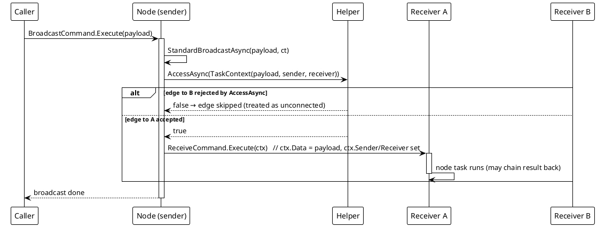

# Workflow System — Broadcast Dispatch (non-Compiler)

`StandardBroadcastAsync` — the stateless, edge-level path.

The model has three execution entries: ① a single-node task (`ReceiveCommand.Execute(ctx)` with an `ITaskContext`), ② edge-level broadcast, and ③ the chain-level compiled run. This diagram shows entry ②: `StandardBroadcastAsync` iterates the node's output-slot targets, builds a `TaskContext(parameter, sender, receiver)` per edge, applies the runtime `AccessAsync` gate — a rejected edge is treated as unconnected and skipped — and delivers each accepted edge via `ReceiveCommand.Execute(ctx)`. Entry ③ never uses this path: the compiled engine dispatches downstream itself and never triggers node commands.

Join aggregation (`IGroupData`), the redirect contract and serialization round-trips are Compiler-path concerns, analysed on the `01_compile-and-run` and `02_terminal-cone` pages. The non-Compiler path has no join, no redirect and no reachability model: a multi-input node simply runs once per incoming edge.

*Source: `Src/Core/VeloxDev.Core/WorkflowSystem/StandardEx/WorkflowNodeEx.cs`, `StandardBroadcastAsync` lines 109-139 (reverse: `StandardReverseBroadcastAsync` lines 141-171, walking `Sources`). Test evidence: `CompilerEx/EntrySemanticsTests.cs` (`StandardBroadcast_DeliversTaskContextPerValidEdge_SkipsAccessRejectedEdge`, `CompiledRun_DrivesOnlyThroughHelper_NeverExecutesNodeCommands`).*
